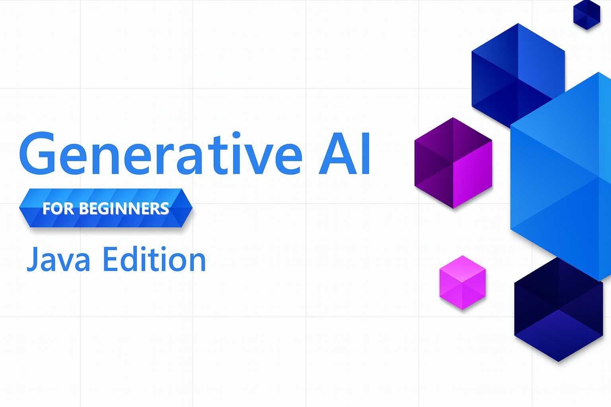

# Generative AI for Beginners - Java Edition

**Time Commitment**: The entire workshop can be completed online without local setup. If you want to run the samples, the environment setup takes 2 minutes, with exploring the samples requiring 1-3 hours depending on exploration depth.

> **Quick Start** 

1. Fork this repository to your GitHub account
2. Click **Code** → **Codespaces** tab → **...** → **New with options...**
3. Use the defaults – this will select the Development container created for this course
4. Click **Create codespace**
5. Wait ~2 minutes for the environment to be ready
6. Jump straight to [Creating your GitHub Models Token](./02-SetupDevEnvironment/README.md#step-2-create-a-github-personal-access-token)

## Multi-Language Support

### Supported via GitHub Action (Automated & Always Up-to-Date)

[French](./translations/fr/README.md) | [Spanish](./translations/es/README.md) | [German](./translations/de/README.md) | [Russian](./translations/ru/README.md) | [Arabic](./translations/ar/README.md) | [Persian (Farsi)](./translations/fa/README.md) | [Urdu](./translations/ur/README.md) | [Chinese (Simplified)](./translations/zh/README.md) | [Chinese (Traditional, Macau)](./translations/mo/README.md) | [Chinese (Traditional, Hong Kong)](./translations/hk/README.md) | [Chinese (Traditional, Taiwan)](./translations/tw/README.md) | [Japanese](./translations/ja/README.md) | [Korean](./translations/ko/README.md) | [Hindi](./translations/hi/README.md) | [Bengali](./translations/bn/README.md) | [Marathi](./translations/mr/README.md) | [Nepali](./translations/ne/README.md) | [Punjabi (Gurmukhi)](./translations/pa/README.md) | [Portuguese (Portugal)](./translations/pt/README.md) | [Portuguese (Brazil)](./translations/br/README.md) | [Italian](./translations/it/README.md) | [Polish](./translations/pl/README.md) | [Turkish](./translations/tr/README.md) | [Greek](./translations/el/README.md) | [Thai](./translations/th/README.md) | [Swedish](./translations/sv/README.md) | [Danish](./translations/da/README.md) | [Norwegian](./translations/no/README.md) | [Finnish](./translations/fi/README.md) | [Dutch](./translations/nl/README.md) | [Hebrew](./translations/he/README.md) | [Vietnamese](./translations/vi/README.md) | [Indonesian](./translations/id/README.md) | [Malay](./translations/ms/README.md) | [Tagalog (Filipino)](./translations/tl/README.md) | [Swahili](./translations/sw/README.md) | [Hungarian](./translations/hu/README.md) | [Czech](./translations/cs/README.md) | [Slovak](./translations/sk/README.md) | [Romanian](./translations/ro/README.md) | [Bulgarian](./translations/bg/README.md) | [Serbian (Cyrillic)](./translations/sr/README.md) | [Croatian](./translations/hr/README.md) | [Slovenian](./translations/sl/README.md) | [Ukrainian](./translations/uk/README.md) | [Burmese (Myanmar)](./translations/my/README.md)

## Course Structure & Learning Path

### **Chapter 1: Introduction to Generative AI**
- **Core Concepts**: Understanding Large Language Models, tokens, embeddings, and AI capabilities
- **Java AI Ecosystem**: Overview of Spring AI and OpenAI SDKs
- **Model Context Protocol**: Introduction to MCP and its role in AI agent communication
- **Practical Applications**: Real-world scenarios including chatbots and content generation
- **[→ Start Chapter 1](./01-IntroToGenAI/README.md)**

### **Chapter 2: Development Environment Setup**
- **Multi-Provider Configuration**: Set up GitHub Models, Azure OpenAI, and OpenAI Java SDK integrations
- **Spring Boot + Spring AI**: Best practices for enterprise AI application development
- **GitHub Models**: Free AI model access for prototyping and learning (no credit card required)
- **Development Tools**: Docker containers, VS Code, and GitHub Codespaces configuration
- **[→ Start Chapter 2](./02-SetupDevEnvironment/README.md)**

### **Chapter 3: Core Generative AI Techniques**
- **Prompt Engineering**: Techniques for optimal AI model responses
- **Embeddings & Vector Operations**: Implement semantic search and similarity matching
- **Retrieval-Augmented Generation (RAG)**: Combine AI with your own data sources
- **Function Calling**: Extend AI capabilities with custom tools and plugins
- **[→ Start Chapter 3](./03-CoreGenerativeAITechniques/README.md)**

### **Chapter 4: Practical Applications & Projects**
- **Pet Story Generator** (`petstory/`): Creative content generation with GitHub Models
- **Foundry Local Demo** (`foundrylocal/`): Local AI model integration with OpenAI Java SDK
- **MCP Calculator Service** (`mcp/calculator/`): Basic Model Context Protocol implementation with Spring AI
- **[→ Start Chapter 4](./04-PracticalSamples/README.md)**

### **Chapter 5: Responsible AI Development**
- **GitHub Models Safety**: Test built-in content filtering and safety mechanisms
- **Responsible AI Demo**: Hands-on example showing how AI safety filters work in practice
- **Best Practices**: Essential guidelines for ethical AI development and deployment
- **[→ Start Chapter 5](./05-ResponsibleGenAI/README.md)**

## Additional Resources 

- [AI Agents For Beginners](https://github.com/microsoft/ai-agents-for-beginners)
- [Generative AI for Beginners using .NET](https://github.com/microsoft/Generative-AI-for-beginners-dotnet)
- [Generative AI for Beginners using JavaScript](https://github.com/microsoft/generative-ai-with-javascript)
- [Generative AI for Beginners](https://github.com/microsoft/generative-ai-for-beginners)
- [ML for Beginners](https://aka.ms/ml-beginners)
- [Data Science for Beginners](https://aka.ms/datascience-beginners)
- [AI for Beginners](https://aka.ms/ai-beginners)
- [Cybersecurity for Beginners](https://github.com/microsoft/Security-101)
- [Web Dev for Beginners](https://aka.ms/webdev-beginners)
- [IoT for Beginners](https://aka.ms/iot-beginners)
- [XR Development for Beginners](https://github.com/microsoft/xr-development-for-beginners)
- [Mastering GitHub Copilot for AI Paired Programming](https://aka.ms/GitHubCopilotAI)
- [Mastering GitHub Copilot for C#/.NET Developers](https://github.com/microsoft/mastering-github-copilot-for-dotnet-csharp-developers)
- [Choose Your Own Copilot Adventure](https://github.com/microsoft/CopilotAdventures)
- [RAG Chat App with Azure AI Services](https://github.com/Azure-Samples/azure-search-openai-demo-java)
