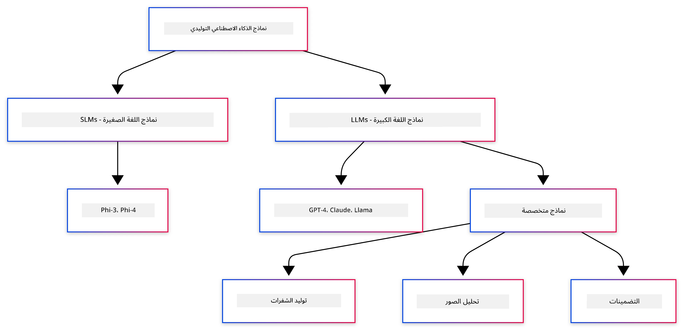
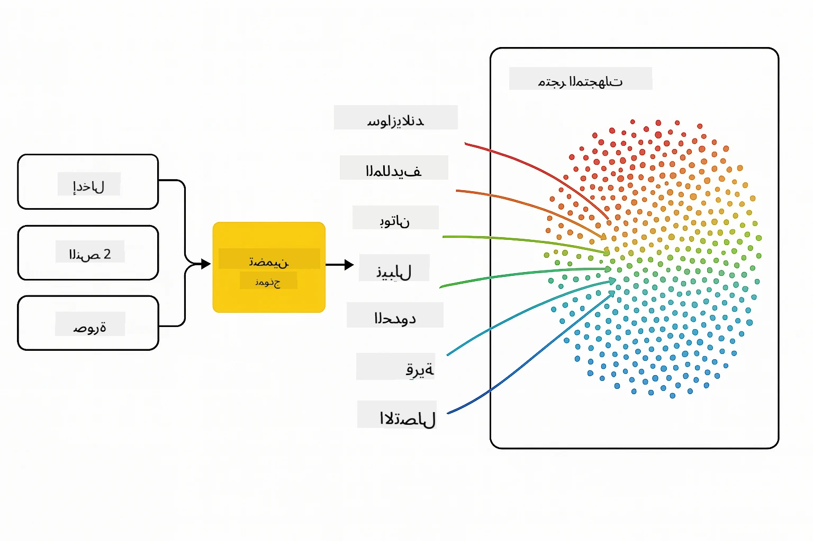
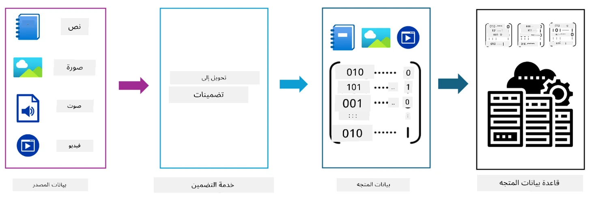
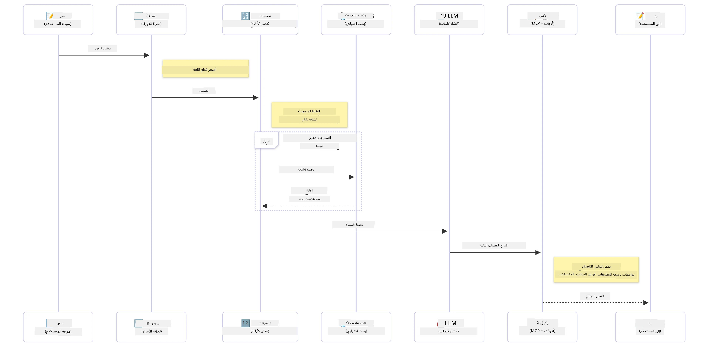

<!--
CO_OP_TRANSLATOR_METADATA:
{
  "original_hash": "75bfb080ca725e8a9aa9c80cae25fba1",
  "translation_date": "2025-07-29T08:08:18+00:00",
  "source_file": "01-IntroToGenAI/README.md",
  "language_code": "ar"
}
-->
# مقدمة في الذكاء الاصطناعي التوليدي - إصدار جافا

## ما ستتعلمه

- **أساسيات الذكاء الاصطناعي التوليدي** بما في ذلك النماذج اللغوية الكبيرة (LLMs)، هندسة التوجيه، الرموز، التضمينات، وقواعد البيانات المتجهية
- **مقارنة أدوات تطوير الذكاء الاصطناعي في جافا** بما في ذلك Azure OpenAI SDK، Spring AI، و OpenAI Java SDK
- **اكتشاف بروتوكول سياق النموذج** ودوره في تواصل وكلاء الذكاء الاصطناعي

## جدول المحتويات

- [المقدمة](../../../01-IntroToGenAI)
- [مراجعة سريعة لمفاهيم الذكاء الاصطناعي التوليدي](../../../01-IntroToGenAI)
- [مراجعة هندسة التوجيه](../../../01-IntroToGenAI)
- [الرموز، التضمينات، والوكلاء](../../../01-IntroToGenAI)
- [أدوات تطوير الذكاء الاصطناعي ومكتبات جافا](../../../01-IntroToGenAI)
  - [OpenAI Java SDK](../../../01-IntroToGenAI)
  - [Spring AI](../../../01-IntroToGenAI)
  - [Azure OpenAI Java SDK](../../../01-IntroToGenAI)
- [الملخص](../../../01-IntroToGenAI)
- [الخطوات التالية](../../../01-IntroToGenAI)

## المقدمة

مرحبًا بك في الفصل الأول من دورة الذكاء الاصطناعي التوليدي للمبتدئين - إصدار جافا! يقدم هذا الدرس الأساسي المفاهيم الرئيسية للذكاء الاصطناعي التوليدي وكيفية العمل معها باستخدام جافا. ستتعلم عن اللبنات الأساسية لتطبيقات الذكاء الاصطناعي، بما في ذلك النماذج اللغوية الكبيرة (LLMs)، الرموز، التضمينات، ووكلاء الذكاء الاصطناعي. سنستكشف أيضًا الأدوات الأساسية لجافا التي ستستخدمها طوال هذه الدورة.

### مراجعة سريعة لمفاهيم الذكاء الاصطناعي التوليدي

الذكاء الاصطناعي التوليدي هو نوع من الذكاء الاصطناعي الذي ينشئ محتوى جديدًا، مثل النصوص، الصور، أو الأكواد، بناءً على الأنماط والعلاقات التي تعلمها من البيانات. يمكن لنماذج الذكاء الاصطناعي التوليدي إنشاء ردود شبيهة بالبشر، فهم السياق، وأحيانًا حتى إنشاء محتوى يبدو وكأنه من صنع البشر.

عند تطوير تطبيقات الذكاء الاصطناعي باستخدام جافا، ستعمل مع **نماذج الذكاء الاصطناعي التوليدي** لإنشاء المحتوى. بعض قدرات هذه النماذج تشمل:

- **إنشاء النصوص**: صياغة نصوص شبيهة بالبشر لتطبيقات الدردشة، المحتوى، وإكمال النصوص.
- **إنشاء الصور وتحليلها**: إنتاج صور واقعية، تحسين الصور، واكتشاف الكائنات.
- **إنشاء الأكواد**: كتابة مقتطفات أكواد أو سكربتات.

هناك أنواع محددة من النماذج التي تم تحسينها لمهام مختلفة. على سبيل المثال، يمكن لكل من **النماذج اللغوية الصغيرة (SLMs)** و **النماذج اللغوية الكبيرة (LLMs)** التعامل مع إنشاء النصوص، مع تقديم LLMs أداءً أفضل عادةً للمهام المعقدة. بالنسبة للمهام المتعلقة بالصور، ستستخدم نماذج رؤية متخصصة أو نماذج متعددة الوسائط.

بالطبع، الردود من هذه النماذج ليست دائمًا مثالية. ربما سمعت عن "هلوسة" النماذج أو إنتاج معلومات غير صحيحة بطريقة تبدو موثوقة. ولكن يمكنك توجيه النموذج لتقديم ردود أفضل من خلال تقديم تعليمات واضحة وسياق. هنا يأتي دور **هندسة التوجيه**.

#### مراجعة هندسة التوجيه

هندسة التوجيه هي ممارسة تصميم مدخلات فعالة لتوجيه نماذج الذكاء الاصطناعي نحو المخرجات المطلوبة. تتضمن:

- **الوضوح**: جعل التعليمات واضحة وغير غامضة.
- **السياق**: تقديم المعلومات الخلفية الضرورية.
- **القيود**: تحديد أي قيود أو تنسيقات.

بعض أفضل الممارسات لهندسة التوجيه تشمل تصميم التوجيه، التعليمات الواضحة، تقسيم المهام، التعلم من لقطة واحدة أو قليلة، وضبط التوجيه. اختبار التوجيهات المختلفة ضروري لمعرفة ما يعمل بشكل أفضل لحالتك الخاصة.

عند تطوير التطبيقات، ستعمل مع أنواع مختلفة من التوجيهات:
- **توجيهات النظام**: تحديد القواعد الأساسية والسياق لسلوك النموذج
- **توجيهات المستخدم**: بيانات الإدخال من مستخدمي تطبيقك
- **توجيهات المساعد**: ردود النموذج بناءً على توجيهات النظام والمستخدم

> **تعرف أكثر**: تعرف أكثر على هندسة التوجيه في [فصل هندسة التوجيه من دورة الذكاء الاصطناعي التوليدي للمبتدئين](https://github.com/microsoft/generative-ai-for-beginners/tree/main/04-prompt-engineering-fundamentals)

#### الرموز، التضمينات، والوكلاء

عند العمل مع نماذج الذكاء الاصطناعي التوليدي، ستواجه مصطلحات مثل **الرموز**، **التضمينات**، **الوكلاء**، و **بروتوكول سياق النموذج (MCP)**. إليك نظرة تفصيلية على هذه المفاهيم:

- **الرموز**: الرموز هي أصغر وحدة نصية في النموذج. يمكن أن تكون كلمات، أحرف، أو أجزاء من الكلمات. تُستخدم الرموز لتمثيل بيانات النصوص بتنسيق يمكن للنموذج فهمه. على سبيل المثال، الجملة "الثعلب البني السريع قفز فوق الكلب الكسول" قد يتم تقسيمها إلى ["الثعلب"، " البني"، " السريع"، " قفز"، " فوق"، " الكلب"، " الكسول"] أو ["الثعلب"، " الب"، "ني"، " الس"، "ريع"، " قف"، "ز"، " فو"، "ق"، " الك"، "لب"، " الك", "سول"] حسب استراتيجية تقسيم الرموز.

عملية تقسيم النصوص إلى هذه الوحدات الصغيرة تُعرف بالتقسيم إلى رموز. هذه العملية ضرورية لأن النماذج تعمل على الرموز بدلاً من النصوص الخام. عدد الرموز في التوجيه يؤثر على طول وجودة استجابة النموذج، حيث أن النماذج لديها حدود للرموز في نافذة السياق الخاصة بها (مثل 128K رمز لإجمالي سياق GPT-4o، بما في ذلك الإدخال والإخراج).

في جافا، يمكنك استخدام مكتبات مثل OpenAI SDK للتعامل مع تقسيم الرموز تلقائيًا عند إرسال الطلبات إلى نماذج الذكاء الاصطناعي.

- **التضمينات**: التضمينات هي تمثيلات متجهية للرموز التي تلتقط المعنى الدلالي. إنها تمثيلات رقمية (عادةً مصفوفات من الأرقام العشرية) تسمح للنماذج بفهم العلاقات بين الكلمات وتقديم ردود ذات صلة بالسياق. الكلمات المتشابهة لها تضمينات متشابهة، مما يمكن النموذج من فهم مفاهيم مثل المرادفات والعلاقات الدلالية.

في جافا، يمكنك إنشاء التضمينات باستخدام OpenAI SDK أو مكتبات أخرى تدعم إنشاء التضمينات. هذه التضمينات ضرورية لمهام مثل البحث الدلالي، حيث تريد العثور على محتوى مشابه بناءً على المعنى بدلاً من التطابق النصي الدقيق.

- **قواعد البيانات المتجهية**: قواعد البيانات المتجهية هي أنظمة تخزين متخصصة محسّنة للتضمينات. تمكن البحث الفعّال عن التشابه وهي ضرورية لأنماط التوليد المعزز بالاسترجاع (RAG) حيث تحتاج إلى العثور على معلومات ذات صلة من مجموعات بيانات كبيرة بناءً على التشابه الدلالي بدلاً من التطابقات الدقيقة.

> **ملاحظة**: في هذه الدورة، لن نغطي قواعد البيانات المتجهية ولكن نعتقد أنها تستحق الذكر لأنها تُستخدم بشكل شائع في التطبيقات الواقعية.

- **الوكلاء و MCP**: مكونات الذكاء الاصطناعي التي تتفاعل بشكل مستقل مع النماذج، الأدوات، والأنظمة الخارجية. يوفر بروتوكول سياق النموذج (MCP) طريقة موحدة للوكلاء للوصول بأمان إلى مصادر البيانات الخارجية والأدوات. تعرف أكثر في [دورة MCP للمبتدئين](https://github.com/microsoft/mcp-for-beginners).

في تطبيقات الذكاء الاصطناعي بجافا، ستستخدم الرموز لمعالجة النصوص، التضمينات للبحث الدلالي و RAG، قواعد البيانات المتجهية لاسترجاع البيانات، والوكلاء مع MCP لبناء أنظمة ذكية تستخدم الأدوات.

### أدوات تطوير الذكاء الاصطناعي ومكتبات جافا

توفر جافا أدوات ممتازة لتطوير الذكاء الاصطناعي. هناك ثلاث مكتبات رئيسية سنستكشفها خلال هذه الدورة - OpenAI Java SDK، Azure OpenAI SDK، و Spring AI.

إليك جدول مرجعي سريع يوضح أي SDK يُستخدم في أمثلة كل فصل:

| الفصل | العينة | SDK |
|-------|--------|-----|
| 02-SetupDevEnvironment | github-models | OpenAI Java SDK |
| 02-SetupDevEnvironment | basic-chat-azure | Spring AI Azure OpenAI |
| 03-CoreGenerativeAITechniques | examples | Azure OpenAI SDK |
| 04-PracticalSamples | petstory | OpenAI Java SDK |
| 04-PracticalSamples | foundrylocal | OpenAI Java SDK |
| 04-PracticalSamples | calculator | Spring AI MCP SDK + LangChain4j |

**روابط توثيق SDK:**
- [Azure OpenAI Java SDK](https://github.com/Azure/azure-sdk-for-java/tree/azure-ai-openai_1.0.0-beta.16/sdk/openai/azure-ai-openai)
- [Spring AI](https://docs.spring.io/spring-ai/reference/)
- [OpenAI Java SDK](https://github.com/openai/openai-java)
- [LangChain4j](https://docs.langchain4j.dev/)

#### OpenAI Java SDK

OpenAI SDK هو مكتبة جافا الرسمية لواجهة برمجة التطبيقات الخاصة بـ OpenAI. يوفر واجهة بسيطة ومتسقة للتفاعل مع نماذج OpenAI، مما يجعل من السهل دمج قدرات الذكاء الاصطناعي في تطبيقات جافا. أمثلة الفصل الثاني "GitHub Models"، وتطبيق "Pet Story" في الفصل الرابع، ومثال "Foundry Local" توضح نهج OpenAI SDK.

#### Spring AI

Spring AI هو إطار عمل شامل يجلب قدرات الذكاء الاصطناعي إلى تطبيقات Spring، ويوفر طبقة تجريد متسقة عبر مختلف مزودي الذكاء الاصطناعي. يتكامل بسلاسة مع نظام Spring، مما يجعله الخيار المثالي لتطبيقات جافا المؤسسية التي تحتاج إلى قدرات الذكاء الاصطناعي.

قوة Spring AI تكمن في تكامله السلس مع نظام Spring، مما يجعل من السهل بناء تطبيقات الذكاء الاصطناعي الجاهزة للإنتاج باستخدام أنماط Spring المألوفة مثل حقن التبعيات، إدارة التكوين، وأطر الاختبار. ستستخدم Spring AI في الفصلين الثاني والرابع لبناء تطبيقات تستفيد من مكتبات OpenAI و Model Context Protocol (MCP) الخاصة بـ Spring AI.

##### بروتوكول سياق النموذج (MCP)

[بروتوكول سياق النموذج (MCP)](https://modelcontextprotocol.io/) هو معيار ناشئ يمكّن تطبيقات الذكاء الاصطناعي من التفاعل بأمان مع مصادر البيانات الخارجية والأدوات. يوفر MCP طريقة موحدة للنماذج للوصول إلى المعلومات السياقية وتنفيذ الإجراءات في تطبيقاتك.

في الفصل الرابع، ستبني خدمة آلة حاسبة بسيطة باستخدام MCP توضح أساسيات بروتوكول سياق النموذج مع Spring AI، وتوضح كيفية إنشاء تكاملات الأدوات الأساسية وهياكل الخدمات.

#### Azure OpenAI Java SDK

مكتبة عميل Azure OpenAI لجافا هي تعديل لواجهات برمجة التطبيقات REST الخاصة بـ OpenAI التي توفر واجهة متوافقة مع نظام Azure SDK. في الفصل الثالث، ستبني تطبيقات باستخدام Azure OpenAI SDK، بما في ذلك تطبيقات الدردشة، استدعاء الوظائف، وأنماط التوليد المعزز بالاسترجاع (RAG).

> ملاحظة: Azure OpenAI SDK يتأخر عن OpenAI Java SDK من حيث الميزات، لذا للمشاريع المستقبلية، يُفضل استخدام OpenAI Java SDK.

## الملخص

هذا ينهي الأساسيات! الآن تفهم:

- المفاهيم الأساسية وراء الذكاء الاصطناعي التوليدي - من النماذج اللغوية الكبيرة وهندسة التوجيه إلى الرموز، التضمينات، وقواعد البيانات المتجهية
- خيارات الأدوات الخاصة بك لتطوير الذكاء الاصطناعي بجافا: Azure OpenAI SDK، Spring AI، و OpenAI Java SDK
- ما هو بروتوكول سياق النموذج وكيف يمكّن وكلاء الذكاء الاصطناعي من العمل مع الأدوات الخارجية

## الخطوات التالية

[الفصل الثاني: إعداد بيئة التطوير](../02-SetupDevEnvironment/README.md)

**إخلاء المسؤولية**:  
تمت ترجمة هذا المستند باستخدام خدمة الترجمة الآلية [Co-op Translator](https://github.com/Azure/co-op-translator). بينما نسعى لتحقيق الدقة، يرجى العلم أن الترجمات الآلية قد تحتوي على أخطاء أو عدم دقة. يجب اعتبار المستند الأصلي بلغته الأصلية المصدر الموثوق. للحصول على معلومات حساسة أو هامة، يُوصى بالاستعانة بترجمة بشرية احترافية. نحن غير مسؤولين عن أي سوء فهم أو تفسيرات خاطئة تنشأ عن استخدام هذه الترجمة.