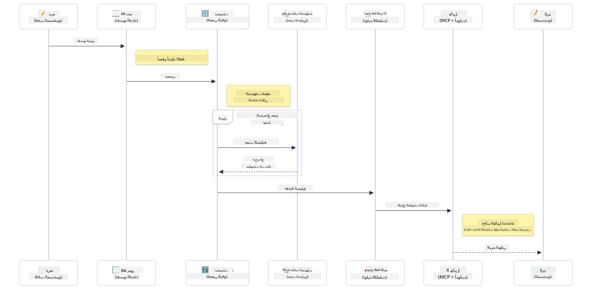

<!--
CO_OP_TRANSLATOR_METADATA:
{
  "original_hash": "6d8b4a0d774dc2a1e97c95859a6d6e4b",
  "translation_date": "2025-07-21T18:38:10+00:00",
  "source_file": "01-IntroToGenAI/README.md",
  "language_code": "ar"
}
-->
# مقدمة إلى الذكاء الاصطناعي التوليدي - إصدار Java

## ما ستتعلمه

- **أساسيات الذكاء الاصطناعي التوليدي** بما في ذلك النماذج اللغوية الكبيرة (LLMs)، هندسة التوجيه (Prompt Engineering)، الرموز (Tokens)، التضمينات (Embeddings)، وقواعد بيانات المتجهات (Vector Databases)
- **مقارنة أدوات تطوير الذكاء الاصطناعي في Java** بما في ذلك Azure OpenAI SDK، Spring AI، وOpenAI Java SDK
- **اكتشاف بروتوكول سياق النموذج (Model Context Protocol)** ودوره في تواصل وكلاء الذكاء الاصطناعي

## جدول المحتويات

- [المقدمة](../../../01-IntroToGenAI)
- [مراجعة سريعة لمفاهيم الذكاء الاصطناعي التوليدي](../../../01-IntroToGenAI)
- [مراجعة هندسة التوجيه](../../../01-IntroToGenAI)
- [الرموز، التضمينات، والوكلاء](../../../01-IntroToGenAI)
- [أدوات ومكتبات تطوير الذكاء الاصطناعي لـ Java](../../../01-IntroToGenAI)
  - [OpenAI Java SDK](../../../01-IntroToGenAI)
  - [Spring AI](../../../01-IntroToGenAI)
  - [Azure OpenAI Java SDK](../../../01-IntroToGenAI)
- [الملخص](../../../01-IntroToGenAI)
- [الخطوات التالية](../../../01-IntroToGenAI)

## المقدمة

مرحبًا بك في الفصل الأول من "الذكاء الاصطناعي التوليدي للمبتدئين - إصدار Java"! تقدم هذه الدرس التأسيسي المفاهيم الأساسية للذكاء الاصطناعي التوليدي وكيفية العمل بها باستخدام Java. ستتعلم عن اللبنات الأساسية لتطبيقات الذكاء الاصطناعي، بما في ذلك النماذج اللغوية الكبيرة (LLMs)، الرموز، التضمينات، ووكلاء الذكاء الاصطناعي. كما سنستكشف الأدوات الأساسية لـ Java التي ستستخدمها طوال هذه الدورة.

### مراجعة سريعة لمفاهيم الذكاء الاصطناعي التوليدي

الذكاء الاصطناعي التوليدي هو نوع من الذكاء الاصطناعي الذي ينشئ محتوى جديدًا، مثل النصوص أو الصور أو الأكواد، بناءً على الأنماط والعلاقات التي تعلمها من البيانات. يمكن لنماذج الذكاء الاصطناعي التوليدي إنشاء استجابات شبيهة بالبشر، فهم السياق، وأحيانًا إنشاء محتوى يبدو وكأنه من صنع الإنسان.

أثناء تطوير تطبيقات الذكاء الاصطناعي باستخدام Java، ستعمل مع **نماذج الذكاء الاصطناعي التوليدي** لإنشاء المحتوى. بعض قدرات هذه النماذج تشمل:

- **توليد النصوص**: كتابة نصوص شبيهة بالبشر للمحادثات، المحتوى، وإكمال النصوص.
- **توليد الصور وتحليلها**: إنتاج صور واقعية، تحسين الصور، واكتشاف الكائنات.
- **توليد الأكواد**: كتابة مقتطفات أو نصوص برمجية.

هناك أنواع محددة من النماذج مخصصة لمهام مختلفة. على سبيل المثال، يمكن لكل من **النماذج اللغوية الصغيرة (SLMs)** و**النماذج اللغوية الكبيرة (LLMs)** التعامل مع توليد النصوص، مع تقديم LLMs أداءً أفضل في المهام المعقدة. أما بالنسبة للمهام المتعلقة بالصور، فستستخدم نماذج رؤية متخصصة أو نماذج متعددة الوسائط.

بالطبع، الاستجابات من هذه النماذج ليست دائمًا مثالية. ربما سمعت عن "هلوسة" النماذج أو توليدها لمعلومات غير صحيحة بطريقة تبدو موثوقة. ولكن يمكنك توجيه النموذج لتوليد استجابات أفضل من خلال تقديم تعليمات واضحة وسياق مناسب. وهنا يأتي دور **هندسة التوجيه**.

#### مراجعة هندسة التوجيه

هندسة التوجيه هي ممارسة تصميم مدخلات فعالة لتوجيه نماذج الذكاء الاصطناعي نحو المخرجات المطلوبة. وتشمل:

- **الوضوح**: جعل التعليمات واضحة وغير غامضة.
- **السياق**: توفير المعلومات الخلفية الضرورية.
- **القيود**: تحديد أي حدود أو تنسيقات.

بعض أفضل الممارسات لهندسة التوجيه تشمل تصميم التوجيه، التعليمات الواضحة، تقسيم المهام، التعلم من لقطة واحدة أو قليلة، وضبط التوجيه. اختبار التوجيهات المختلفة أمر ضروري لمعرفة ما يناسب حالتك الخاصة.

عند تطوير التطبيقات، ستعمل مع أنواع مختلفة من التوجيهات:
- **توجيهات النظام**: تحدد القواعد الأساسية والسياق لسلوك النموذج.
- **توجيهات المستخدم**: بيانات الإدخال من مستخدمي تطبيقك.
- **توجيهات المساعد**: استجابات النموذج بناءً على توجيهات النظام والمستخدم.

> **تعرف أكثر**: تعرف على المزيد حول هندسة التوجيه في [فصل هندسة التوجيه من دورة GenAI للمبتدئين](https://github.com/microsoft/generative-ai-for-beginners/tree/main/04-prompt-engineering-fundamentals)

#### الرموز، التضمينات، والوكلاء

عند العمل مع نماذج الذكاء الاصطناعي التوليدي، ستواجه مصطلحات مثل **الرموز**، **التضمينات**، **الوكلاء**، و**بروتوكول سياق النموذج (MCP)**. إليك نظرة تفصيلية على هذه المفاهيم:

- **الرموز**: الرموز هي أصغر وحدة نصية في النموذج. يمكن أن تكون كلمات، أحرف، أو أجزاء من كلمات. تُستخدم الرموز لتمثيل البيانات النصية بتنسيق يمكن للنموذج فهمه. على سبيل المثال، الجملة "The quick brown fox jumped over the lazy dog" قد تُجزأ إلى ["The", " quick", " brown", " fox", " jumped", " over", " the", " lazy", " dog"] أو ["The", " qu", "ick", " br", "own", " fox", " jump", "ed", " over", " the", " la", "zy", " dog"] بناءً على استراتيجية التجزئة.

عملية التجزئة هي تقسيم النص إلى هذه الوحدات الصغيرة. هذا أمر ضروري لأن النماذج تعمل على الرموز بدلاً من النص الخام. عدد الرموز في التوجيه يؤثر على طول وجودة استجابة النموذج، حيث أن للنماذج حدودًا لعدد الرموز في نافذة السياق (مثل 128 ألف رمز كحد أقصى لنموذج GPT-4o).

  في Java، يمكنك استخدام مكتبات مثل OpenAI SDK للتعامل مع التجزئة تلقائيًا عند إرسال الطلبات إلى نماذج الذكاء الاصطناعي.

- **التضمينات**: التضمينات هي تمثيلات متجهية للرموز تلتقط المعاني الدلالية. إنها تمثيلات رقمية (عادةً مصفوفات من الأرقام العشرية) تسمح للنماذج بفهم العلاقات بين الكلمات وتوليد استجابات ذات صلة بالسياق. الكلمات المتشابهة لها تضمينات متشابهة، مما يمكّن النموذج من فهم مفاهيم مثل المرادفات والعلاقات الدلالية.

  في Java، يمكنك إنشاء التضمينات باستخدام OpenAI SDK أو مكتبات أخرى تدعم إنشاء التضمينات. هذه التضمينات ضرورية لمهام مثل البحث الدلالي، حيث تريد العثور على محتوى مشابه بناءً على المعنى بدلاً من التطابق النصي الدقيق.

- **قواعد بيانات المتجهات**: قواعد بيانات المتجهات هي أنظمة تخزين متخصصة محسّنة للتضمينات. تتيح عمليات البحث عن التشابه بكفاءة وهي ضرورية لأنماط التوليد المعزز بالاسترجاع (RAG) حيث تحتاج إلى العثور على معلومات ذات صلة من مجموعات بيانات كبيرة بناءً على التشابه الدلالي بدلاً من التطابقات الدقيقة.

> **ملاحظة**: في هذه الدورة، لن نغطي قواعد بيانات المتجهات ولكن نعتقد أنها تستحق الذكر لأنها تُستخدم بشكل شائع في التطبيقات الواقعية.

- **الوكلاء وMCP**: مكونات الذكاء الاصطناعي التي تتفاعل بشكل مستقل مع النماذج، الأدوات، والأنظمة الخارجية. يوفر بروتوكول سياق النموذج (MCP) طريقة موحدة للوكلاء للوصول بأمان إلى مصادر البيانات الخارجية والأدوات. تعرف أكثر في [دورة MCP للمبتدئين](https://github.com/microsoft/mcp-for-beginners).

في تطبيقات Java للذكاء الاصطناعي، ستستخدم الرموز لمعالجة النصوص، التضمينات للبحث الدلالي وRAG، قواعد بيانات المتجهات لاسترجاع البيانات، والوكلاء مع MCP لبناء أنظمة ذكية تستخدم الأدوات.

### أدوات ومكتبات تطوير الذكاء الاصطناعي لـ Java

تقدم Java أدوات ممتازة لتطوير الذكاء الاصطناعي. هناك ثلاث مكتبات رئيسية سنستكشفها خلال هذه الدورة - OpenAI Java SDK، Azure OpenAI SDK، وSpring AI.

إليك جدول مرجعي سريع يوضح أي SDK يُستخدم في أمثلة كل فصل:

| الفصل | المثال | SDK |
|-------|--------|-----|
| 02-SetupDevEnvironment | src/github-models/ | OpenAI Java SDK |
| 02-SetupDevEnvironment | src/basic-chat-azure/ | Spring AI Azure OpenAI |
| 03-CoreGenerativeAITechniques | examples/ | Azure OpenAI SDK |
| 04-PracticalSamples | petstory/ | OpenAI Java SDK |
| 04-PracticalSamples | foundrylocal/ | OpenAI Java SDK |
| 04-PracticalSamples | mcp/calculator/ | Spring AI MCP SDK + LangChain4j |

**روابط توثيق SDK:**
- [Azure OpenAI Java SDK](https://github.com/Azure/azure-sdk-for-java/tree/azure-ai-openai_1.0.0-beta.16/sdk/openai/azure-ai-openai)
- [Spring AI](https://docs.spring.io/spring-ai/reference/)
- [OpenAI Java SDK](https://github.com/openai/openai-java)
- [LangChain4j](https://docs.langchain4j.dev/)

#### OpenAI Java SDK

OpenAI SDK هو مكتبة Java الرسمية لواجهة برمجة التطبيقات الخاصة بـ OpenAI. يوفر واجهة بسيطة ومتسقة للتفاعل مع نماذج OpenAI، مما يجعل من السهل دمج قدرات الذكاء الاصطناعي في تطبيقات Java. يوضح مثال GitHub Models في الفصل 2، وتطبيق Pet Story ومثال Foundry Local في الفصل 4 نهج OpenAI SDK.

#### Spring AI

Spring AI هو إطار عمل شامل يجلب قدرات الذكاء الاصطناعي إلى تطبيقات Spring، ويوفر طبقة تجريد متسقة عبر مزودي الذكاء الاصطناعي المختلفين. يتكامل بسلاسة مع نظام Spring، مما يجعله الخيار المثالي لتطبيقات Java المؤسسية التي تحتاج إلى قدرات الذكاء الاصطناعي.

تتمثل قوة Spring AI في تكامله السلس مع نظام Spring، مما يجعل من السهل بناء تطبيقات ذكاء اصطناعي جاهزة للإنتاج باستخدام أنماط Spring المألوفة مثل حقن التبعيات، إدارة التكوين، وأطر الاختبار. ستستخدم Spring AI في الفصلين 2 و4 لبناء تطبيقات تستفيد من مكتبات OpenAI وMCP الخاصة بـ Spring AI.

##### بروتوكول سياق النموذج (MCP)

[بروتوكول سياق النموذج (MCP)](https://modelcontextprotocol.io/) هو معيار ناشئ يمكّن تطبيقات الذكاء الاصطناعي من التفاعل بأمان مع مصادر البيانات الخارجية والأدوات. يوفر MCP طريقة موحدة للنماذج للوصول إلى المعلومات السياقية وتنفيذ الإجراءات في تطبيقاتك.

في الفصل 4، ستبني خدمة حاسبة MCP بسيطة توضح أساسيات بروتوكول سياق النموذج باستخدام Spring AI، مما يوضح كيفية إنشاء تكاملات الأدوات الأساسية وهندسة الخدمات.

#### Azure OpenAI Java SDK

مكتبة Azure OpenAI للعميل لـ Java هي تكييف لواجهات برمجة التطبيقات REST الخاصة بـ OpenAI التي توفر واجهة متوافقة مع النظام البيئي لـ Azure SDK. في الفصل 3، ستبني تطبيقات باستخدام Azure OpenAI SDK، بما في ذلك تطبيقات الدردشة، استدعاء الوظائف، وأنماط RAG (التوليد المعزز بالاسترجاع).

> ملاحظة: Azure OpenAI SDK يتأخر عن OpenAI Java SDK من حيث الميزات، لذا للمشاريع المستقبلية، يُفضل استخدام OpenAI Java SDK.

## الملخص

**تهانينا!** لقد نجحت في:

- **تعلم أساسيات الذكاء الاصطناعي التوليدي** بما في ذلك LLMs، هندسة التوجيه، الرموز، التضمينات، وقواعد بيانات المتجهات
- **مقارنة أدوات تطوير الذكاء الاصطناعي لـ Java** بما في ذلك Azure OpenAI SDK، Spring AI، وOpenAI Java SDK
- **اكتشاف بروتوكول سياق النموذج** ودوره في تواصل وكلاء الذكاء الاصطناعي

## الخطوات التالية

[الفصل 2: إعداد بيئة التطوير](../02-SetupDevEnvironment/README.md)

**إخلاء المسؤولية**:  
تم ترجمة هذا المستند باستخدام خدمة الترجمة بالذكاء الاصطناعي [Co-op Translator](https://github.com/Azure/co-op-translator). بينما نسعى لتحقيق الدقة، يرجى العلم أن الترجمات الآلية قد تحتوي على أخطاء أو معلومات غير دقيقة. يجب اعتبار المستند الأصلي بلغته الأصلية المصدر الرسمي. للحصول على معلومات حاسمة، يُوصى بالاستعانة بترجمة بشرية احترافية. نحن غير مسؤولين عن أي سوء فهم أو تفسيرات خاطئة تنشأ عن استخدام هذه الترجمة.