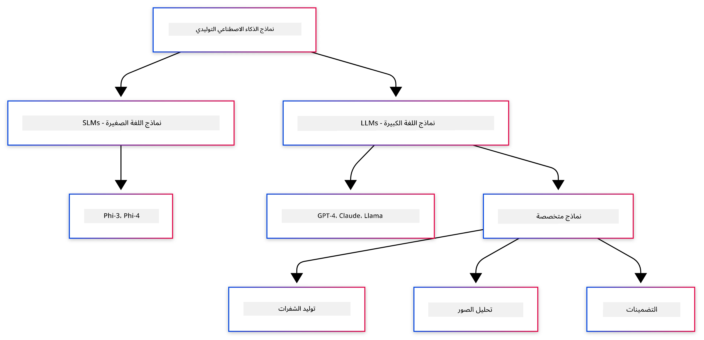
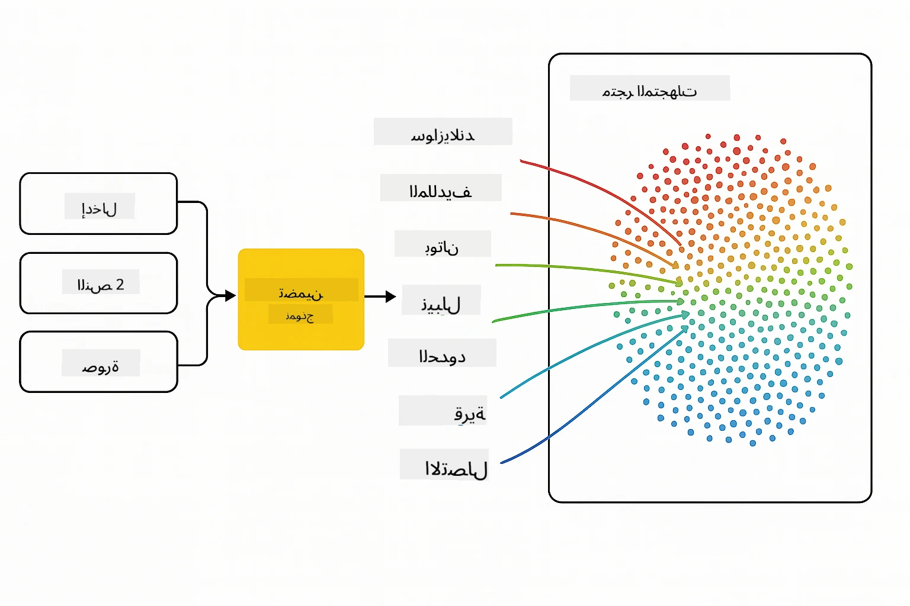
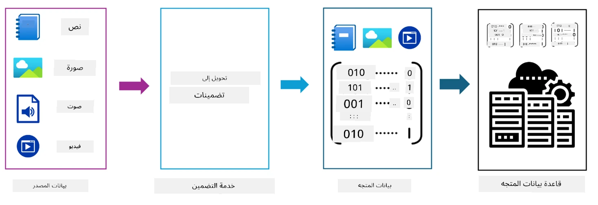
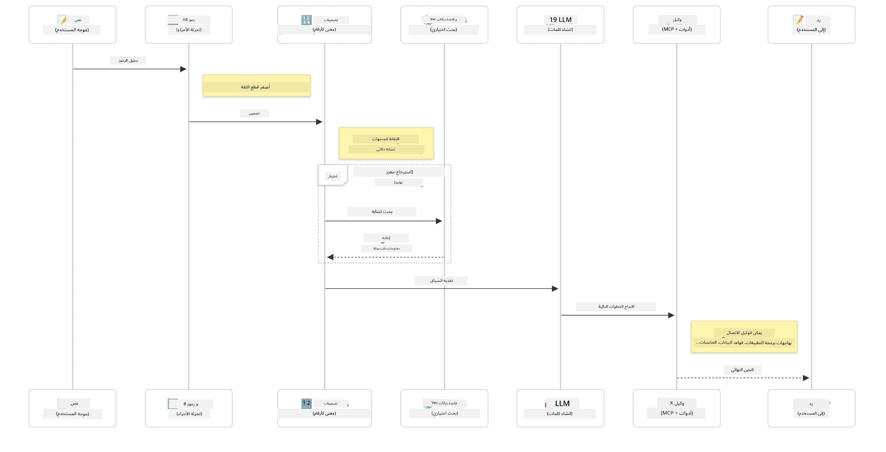

# مقدمة في الذكاء الاصطناعي التوليدي - إصدار جافا

> **فيديو**: [شاهد الفيديو التمهيدي لهذا الدرس على يوتيوب.](https://www.youtube.com/watch?v=XH46tGp_eSw) يمكنك أيضًا النقر على صورة المعاينة أعلاه.

## ما ستتعلمه

- **أساسيات الذكاء الاصطناعي التوليدي** بما في ذلك نماذج اللغة الكبيرة (LLMs)، هندسة المطالبات، الرموز، التضمينات، وقواعد البيانات المتجهية
- **مقارنة أدوات تطوير الذكاء الاصطناعي في جافا** بما في ذلك Azure OpenAI SDK، Spring AI، وOpenAI Java SDK
- **اكتشاف بروتوكول سياق النموذج** ودوره في اتصال وكلاء الذكاء الاصطناعي

## جدول المحتويات

- [مقدمة](#مقدمة)
- [مراجعة سريعة لمفاهيم الذكاء الاصطناعي التوليدي](#مراجعة-سريعة-لمفاهيم-الذكاء-الاصطناعي-التوليدي)
- [مراجعة هندسة المطالبات](#مراجعة-هندسة-المطالبات)
- [الرموز والتضمينات والوكلاء](#الرموز-والتضمينات-والوكلاء)
- [أدوات ومكتبات تطوير الذكاء الاصطناعي لجافا](#أدوات-ومكتبات-تطوير-الذكاء-الاصطناعي-لجافا)
  - [OpenAI Java SDK](#openai-java-sdk)
  - [Spring AI](#spring-ai)
  - [Azure OpenAI Java SDK](#azure-openai-java-sdk)
- [الملخص](#الملخص)
- [الخطوات التالية](#الخطوات-التالية)

## مقدمة

مرحبًا بك في الفصل الأول من الذكاء الاصطناعي التوليدي للمبتدئين - إصدار جافا! يقدم هذا الدرس التأسيسي المفاهيم الأساسية للذكاء الاصطناعي التوليدي وكيفية العمل معها باستخدام جافا. ستتعلم عن المكونات الأساسية لتطبيقات الذكاء الاصطناعي، بما في ذلك نماذج اللغة الكبيرة (LLMs)، الرموز، التضمينات، ووكلاء الذكاء الاصطناعي. سنستعرض أيضًا الأدوات الرئيسية لجافا التي ستستخدمها طوال هذا المساق.

### مراجعة سريعة لمفاهيم الذكاء الاصطناعي التوليدي

الذكاء الاصطناعي التوليدي هو نوع من الذكاء الاصطناعي الذي ينشئ محتوى جديدًا، مثل النصوص، الصور، أو الشيفرة البرمجية، بناءً على أنماط وعلاقات تم تعلمها من البيانات. يمكن لنماذج الذكاء الاصطناعي التوليدي إنشاء ردود تشبه الإنسان، وفهم السياق، وأحيانًا حتى إنشاء محتوى يبدو بشريًا.

أثناء تطوير تطبيقات الذكاء الاصطناعي بجافا، ستعمل مع **نماذج الذكاء الاصطناعي التوليدي** لإنشاء المحتوى. بعض قدرات نماذج الذكاء الاصطناعي التوليدي تشمل:

- **إنشاء النصوص**: صياغة نصوص بشرية الدقة للدردشات، المحتوى، وإكمال النصوص.
- **إنشاء وتحليل الصور**: إنتاج صور واقعية، تحسين الصور، واكتشاف الكائنات.
- **إنشاء الشيفرة البرمجية**: كتابة مقاطع برمجية أو سكربتات.

هناك أنواع محددة من النماذج محسنة لمهام مختلفة. على سبيل المثال، كل من **نماذج اللغة الصغيرة (SLMs)** و**نماذج اللغة الكبيرة (LLMs)** يمكنها التعامل مع إنشاء النصوص، حيث تقدم نماذج LLM عادة أداءً أفضل للمهام المعقدة. بالنسبة للمهام المتعلقة بالصور، ستستخدم نماذج رؤية متخصصة أو نماذج متعددة الوسائط.

بالطبع، ليست ردود هذه النماذج مثالية طوال الوقت. ربما سمعت عن نماذج "هلوسة" أو إنشاء معلومات غير صحيحة بطريقة حاسمة. لكن يمكنك توجيه النموذج لإنتاج ردود أفضل من خلال تزويده بتعليمات واضحة وسياق مناسب. هنا تأتي أهمية **هندسة المطالبات**.

#### مراجعة هندسة المطالبات

هندسة المطالبات هي ممارسة تصميم مدخلات فعالة لتوجيه نماذج الذكاء الاصطناعي نحو المخرجات المرغوبة. تتضمن:

- **الوضوح**: جعل التعليمات واضحة وغير غامضة.
- **السياق**: توفير المعلومات الخلفية اللازمة.
- **القيود**: تحديد أية حدود أو صيغ.

بعض أفضل الممارسات في هندسة المطالبات تشمل تصميم المطالبات، تعليمات واضحة، تقسيم المهام، التعلم بمثال واحد أو أمثلة قليلة، وضبط المطالبات. اختبار مطالبات مختلفة ضروري لإيجاد ما يناسب حالتك الخاصة.

عند تطوير التطبيقات، ستعمل مع أنواع مختلفة من المطالبات:
- **مطالبات النظام**: تحدد القواعد والسياق الأساسي لسلوك النموذج
- **مطالبات المستخدم**: بيانات الإدخال من مستخدمي التطبيق
- **مطالبات المساعد**: ردود النموذج بناءً على مطالبات النظام والمستخدم

> **تعلم المزيد**: تعرف على هندسة المطالبات في [فصل هندسة المطالبات من مساق الذكاء الاصطناعي التوليدي للمبتدئين](https://github.com/microsoft/generative-ai-for-beginners/tree/main/04-prompt-engineering-fundamentals)

#### الرموز والتضمينات والوكلاء

عند العمل مع نماذج الذكاء الاصطناعي التوليدي، ستصادف مصطلحات مثل **الرموز**، **التضمينات**، **الوكلاء**، و**بروتوكول سياق النموذج (MCP)**. إليك نظرة تفصيلية على هذه المفاهيم:

- **الرموز**: الرموز هي أصغر وحدة نصية في النموذج. يمكن أن تكون كلمات، أحرف، أو أجزاء من الكلمات. تُستخدم الرموز لتمثيل بيانات النص بصيغة يمكن للنموذج فهمها. على سبيل المثال، قد يُجزأ الجملة "The quick brown fox jumped over the lazy dog" إلى ["The", " quick", " brown", " fox", " jumped", " over", " the", " lazy", " dog"] أو ["The", " qu", "ick", " br", "own", " fox", " jump", "ed", " over", " the", " la", "zy", " dog"] حسب استراتيجية التجزئة.

التجزئة هي عملية تقسيم النص إلى هذه الوحدات الأصغر. هذا مهم لأن النماذج تعمل على الرموز بدلاً من النص الخام. يؤثر عدد الرموز في المطالبة على طول وجودة رد النموذج، حيث لدى النماذج حدود للرموز في نافذة السياق (مثل 128K رمز في سياق GPT-4o الكلي، بما في ذلك المدخلات والمخرجات).

  في جافا، يمكنك استخدام مكتبات مثل OpenAI SDK للتعامل مع التجزئة تلقائيًا عند إرسال الطلبات إلى نماذج الذكاء الاصطناعي.

- **التضمينات**: التضمينات هي تمثيلات متجهية للرموز تلتقط المعنى الدلالي. هي تمثيلات رقمية (عادةً مصفوفات من الأرقام العشرية) تسمح للنماذج بفهم العلاقات بين الكلمات وتوليد ردود ذات صلة سياقية. الكلمات المتشابهة لها تضمينات متشابهة، ما يمكّن النموذج من فهم مفاهيم مثل المرادفات والعلاقات الدلالية.

  في جافا، يمكنك توليد التضمينات باستخدام OpenAI SDK أو مكتبات أخرى تدعم إنشاء التضمينات. هذه التضمينات ضرورية لمهام مثل البحث الدلالي، حيث تريد إيجاد محتوى مشابه بناءً على المعنى بدلًا من التطابق النصي الحرفي.

- **قواعد البيانات المتجهية**: قواعد البيانات المتجهية هي أنظمة تخزين متخصصة محسنة للتضمينات. تمكّن من البحث الفعّال عن التشابه وهي ضرورية لأنماط الاسترجاع المعزز بالتوليد (RAG)، حيث تحتاج إلى إيجاد معلومات ذات صلة من مجموعات بيانات كبيرة بناءً على التشابه الدلالي بدلاً من التطابق الحرفي.

> **ملاحظة**: لن نغطي قواعد البيانات المتجهية في هذا المساق لكن نعتقد أنه من المهم ذكرها لأنها مستخدمة بشكل شائع في التطبيقات الحقيقية.

- **الوكلاء والبروتوكول MCP**: مكونات ذكاء اصطناعي تتفاعل بشكل مستقل مع النماذج والأدوات والأنظمة الخارجية. يوفر بروتوكول سياق النموذج (MCP) طريقة موحدة يمكن للوكلاء من خلالها الوصول بأمان إلى مصادر البيانات الخارجية والأدوات. تعرف أكثر في [مساق MCP للمبتدئين](https://github.com/microsoft/mcp-for-beginners).

في تطبيقات الذكاء الاصطناعي بجافا، ستستخدم الرموز لمعالجة النصوص، والتضمينات للبحث الدلالي وأنماط RAG، وقواعد البيانات المتجهية لاسترجاع البيانات، والوكلاء مع MCP لبناء أنظمة ذكية تستخدم الأدوات.

### أدوات ومكتبات تطوير الذكاء الاصطناعي لجافا

تقدم جافا أدوات ممتازة لتطوير الذكاء الاصطناعي. هناك ثلاث مكتبات رئيسية سنستعرضها طوال هذا المساق - OpenAI Java SDK، Azure OpenAI SDK، وSpring AI.

إليك جدول مرجعي سريع يوضح أي SDK يُستخدم في أمثلة كل فصل:

| الفصل | المثال | SDK |
|---------|--------|-----|
| 02-SetupDevEnvironment | github-models | OpenAI Java SDK |
| 02-SetupDevEnvironment | basic-chat-azure | Spring AI Azure OpenAI |
| 03-CoreGenerativeAITechniques | أمثلة | Azure OpenAI SDK |
| 04-PracticalSamples | petstory | OpenAI Java SDK |
| 04-PracticalSamples | foundrylocal | OpenAI Java SDK |
| 04-PracticalSamples | calculator | Spring AI MCP SDK + LangChain4j |

**روابط توثيق SDK:**
- [Azure OpenAI Java SDK](https://github.com/Azure/azure-sdk-for-java/tree/azure-ai-openai_1.0.0-beta.16/sdk/openai/azure-ai-openai)
- [Spring AI](https://docs.spring.io/spring-ai/reference/)
- [OpenAI Java SDK](https://github.com/openai/openai-java)
- [LangChain4j](https://docs.langchain4j.dev/)

#### OpenAI Java SDK

OpenAI SDK هي المكتبة الرسمية لجافا للتعامل مع واجهة برمجة التطبيقات OpenAI. توفر واجهة بسيطة ومتسقة للتفاعل مع نماذج OpenAI، مما يسهل دمج قدرات الذكاء الاصطناعي في تطبيقات جافا. يظهر مثال نماذج GitHub في الفصل 2، وتطبيق قصة الحيوانات الأليفة ومثال Foundry Local في الفصل 4 كيف يُستخدم OpenAI SDK.

#### Spring AI

Spring AI هو إطار عمل شامل يجلب قدرات الذكاء الاصطناعي إلى تطبيقات Spring، موفراً طبقة تجريد متسقة عبر مزودي الذكاء الاصطناعي المختلفين. يندمج بسلاسة مع نظام Spring، مما يجعله الخيار الأمثل لتطبيقات جافا المؤسسية التي تحتاج قدرات الذكاء الاصطناعي.

تتمثل قوة Spring AI في تكامله السلس مع نظام Spring، مما يجعل بناء تطبيقات ذكاء اصطناعي جاهزة للإنتاج أمرًا سهلاً باستخدام أنماط Spring المعروفة مثل حقن التبعيات، إدارة التهيئة، وأطر الاختبار. ستستخدم Spring AI في الفصلين 2 و4 لبناء تطبيقات تستفيد من كل من OpenAI وبروتوكول سياق النموذج (MCP) من خلال مكتبات Spring AI.

##### بروتوكول سياق النموذج (MCP)

[bروتوكول سياق النموذج (MCP)](https://modelcontextprotocol.io/) هو معيار ناشئ يمكّن تطبيقات الذكاء الاصطناعي من التفاعل بأمان مع مصادر البيانات والأدوات الخارجية. يوفر MCP طريقة موحدة لنماذج الذكاء الاصطناعي للوصول إلى المعلومات السياقية وتنفيذ الإجراءات في تطبيقاتك.

في الفصل 4، ستبني خدمة آلة حاسبة بسيطة تستخدم MCP توضح أساسيات بروتوكول سياق النموذج مع Spring AI، عارضًا كيفية إنشاء تكاملات أدوات أساسية وهياكل خدمية.

#### Azure OpenAI Java SDK

مكتبة عميل Azure OpenAI لجافا هي تكييف لواجهات REST الخاصة بـ OpenAI توفر واجهة نمطية وتكامل مع بقية نظام Azure SDK. في الفصل 3، ستبني تطبيقات باستخدام Azure OpenAI SDK، بما في ذلك تطبيقات الدردشة، استدعاء الدوال، وأنماط RAG (الاسترجاع المعزز بالتوليد).

> ملاحظة: مكتبة Azure OpenAI SDK متأخرة عن OpenAI Java SDK في الميزات، لذا للمشاريع المستقبلية، يُفضل استخدام OpenAI Java SDK.

## الملخص

بهذا نكون قد غطينا الأساسيات! أنت الآن تفهم:

- المفاهيم الأساسية وراء الذكاء الاصطناعي التوليدي - من نماذج اللغة الكبيرة وهندسة المطالبات إلى الرموز والتضمينات وقواعد البيانات المتجهية
- خيارات الأدوات لتطوير الذكاء الاصطناعي في جافا: Azure OpenAI SDK، Spring AI، وOpenAI Java SDK
- ما هو بروتوكول سياق النموذج وكيف يمكّن وكلاء الذكاء الاصطناعي من العمل مع الأدوات الخارجية

## الخطوات التالية

[الفصل 2: إعداد بيئة التطوير](../02-SetupDevEnvironment/README.md)

---

<!-- CO-OP TRANSLATOR DISCLAIMER START -->
**إخلاء المسؤولية**:  
تمت ترجمة هذا المستند باستخدام خدمة الترجمة الآلية [Co-op Translator](https://github.com/Azure/co-op-translator). بينما نسعى لتحقيق الدقة، يرجى العلم أن الترجمات الآلية قد تحتوي على أخطاء أو عدم دقة. يجب اعتبار المستند الأصلي بلغته الأصلية المصدر الموثوق. للمعلومات الحساسة أو الهامة، يُنصح بالاستعانة بترجمة بشرية محترفة. نحن غير مسؤولين عن أي سوء فهم أو تفسير خاطئ ناتج عن استخدام هذه الترجمة.
<!-- CO-OP TRANSLATOR DISCLAIMER END -->