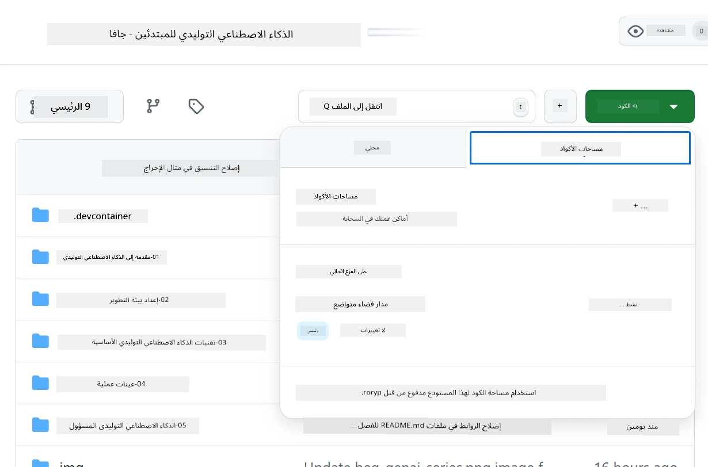
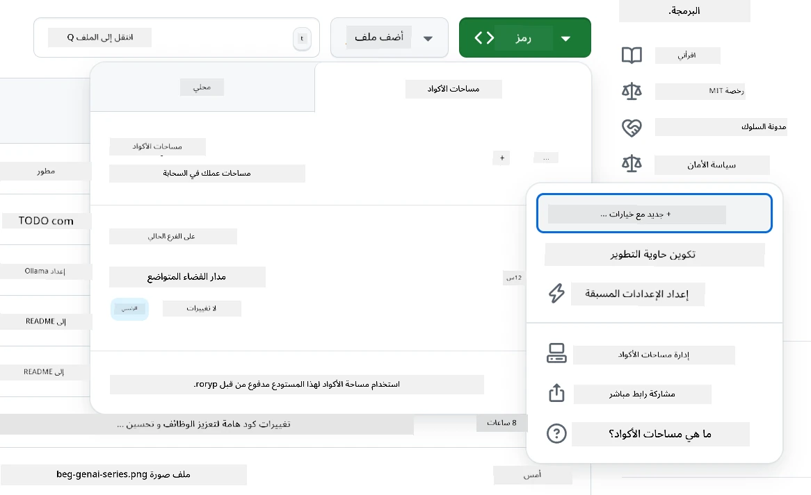
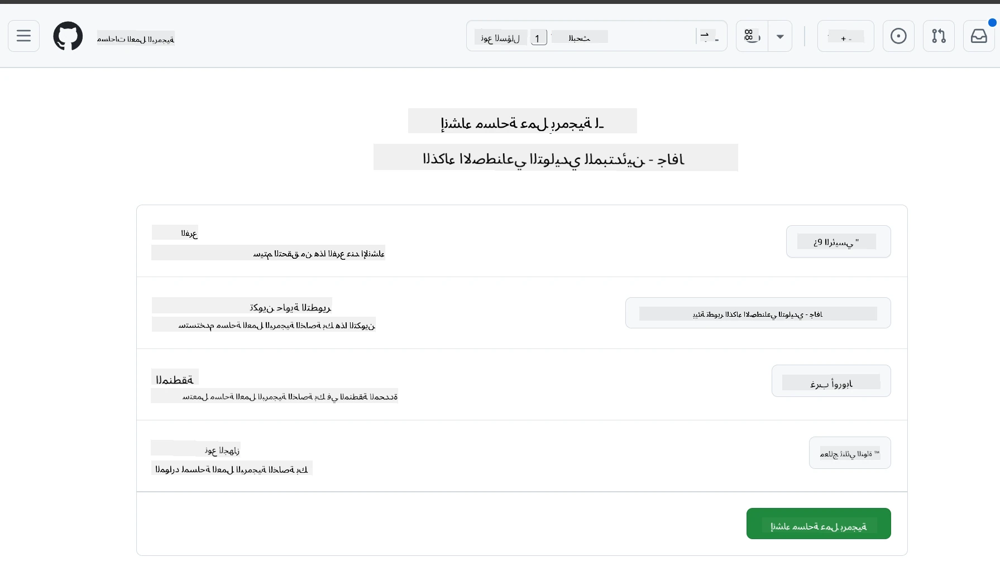
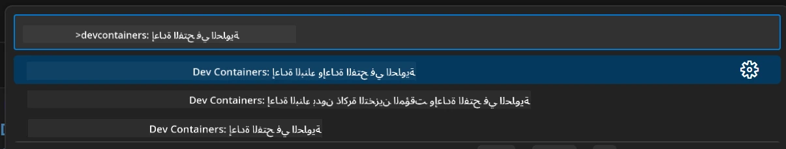
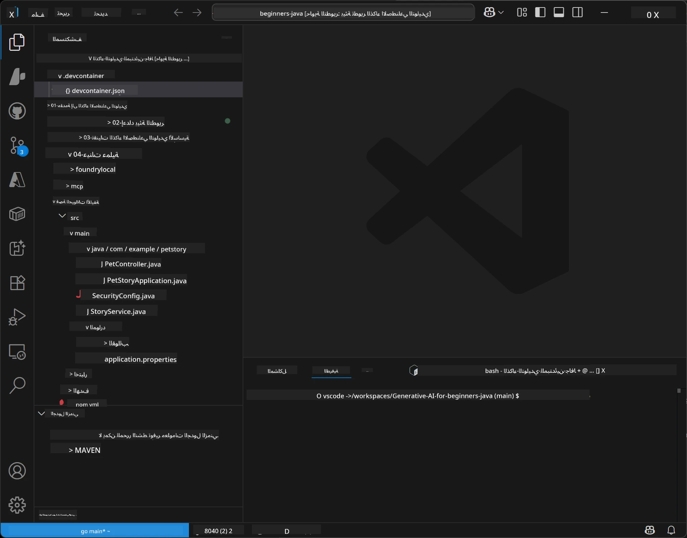
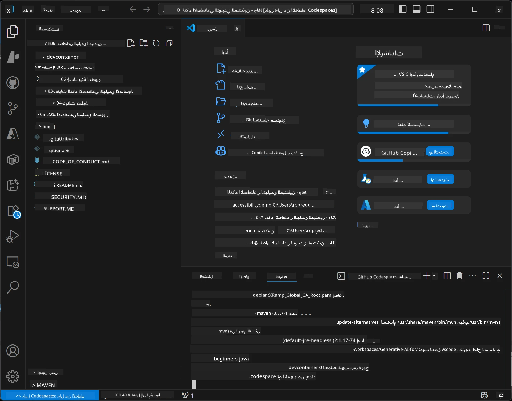

<!--
CO_OP_TRANSLATOR_METADATA:
{
  "original_hash": "96a30d42b9751a3d4e4b20e28d29d459",
  "translation_date": "2026-01-28T04:39:55+00:00",
  "source_file": "02-SetupDevEnvironment/README.md",
  "language_code": "ar"
}
-->
# إعداد بيئة التطوير للذكاء الاصطناعي التوليدي لجافا

> **البدء السريع**: البرمجة في السحابة خلال دقيقتين - انتقل إلى [إعداد GitHub Codespaces](../../../02-SetupDevEnvironment) - لا حاجة لتثبيت محلي ويستخدم نماذج github!

> **مهتم بـ Azure OpenAI؟**، راجع [دليل إعداد Azure OpenAI](getting-started-azure-openai.md) مع خطوات لإنشاء مورد جديد في Azure OpenAI.

## ما الذي ستتعلمه

- إعداد بيئة تطوير جافا لتطبيقات الذكاء الاصطناعي
- اختيار وتكوين بيئة التطوير المفضلة لديك (سحابة أولاً مع Codespaces، حاوية تطوير محلية، أو إعداد محلي كامل)
- اختبار إعدادك من خلال الاتصال بنماذج GitHub

## جدول المحتويات

- [ما الذي ستتعلمه](../../../02-SetupDevEnvironment)
- [مقدمة](../../../02-SetupDevEnvironment)
- [الخطوة 1: إعداد بيئة التطوير الخاصة بك](../../../02-SetupDevEnvironment)
  - [الخيار أ: GitHub Codespaces (موصى به)](../../../02-SetupDevEnvironment)
  - [الخيار ب: حاوية تطوير محلية](../../../02-SetupDevEnvironment)
  - [الخيار ج: استخدم تثبيتك المحلي الحالي](../../../02-SetupDevEnvironment)
- [الخطوة 2: إنشاء رمز وصول شخصي على GitHub](../../../02-SetupDevEnvironment)
- [الخطوة 3: اختبار إعدادك](../../../02-SetupDevEnvironment)
- [استكشاف الأخطاء وإصلاحها](../../../02-SetupDevEnvironment)
- [الملخص](../../../02-SetupDevEnvironment)
- [الخطوات التالية](../../../02-SetupDevEnvironment)

## مقدمة

سيرشدك هذا الفصل خلال إعداد بيئة تطوير. سنستخدم **نماذج GitHub** كمثال أساسي لأنها مجانية وسهلة الإعداد باستخدام حساب GitHub فقط، ولا تتطلب بطاقة ائتمان، وتوفر الوصول إلى نماذج متعددة للتجربة.

**لا حاجة لإعداد محلي!** يمكنك البدء بالبرمجة فورًا باستخدام GitHub Codespaces، التي توفر بيئة تطوير كاملة في متصفحك.


نوصي باستخدام [**نماذج GitHub**](https://github.com/marketplace?type=models) لهذه الدورة لأنها:
- **مجانية** للبدء
- **سهلة** الإعداد فقط بحساب GitHub
- **لا تحتاج إلى بطاقة ائتمان**
- **نماذج متعددة** متاحة للتجربة

> **ملاحظة**: حدود الاستخدام المجانية لنماذج GitHub المستخدمة في هذا التدريب هي:
> - 15 طلبًا في الدقيقة (150 في اليوم)
> - حوالي 8,000 كلمة دخل، 4,000 كلمة خرج لكل طلب
> - 5 طلبات متزامنة
> 
> للاستخدام في الإنتاج، قم بالترقية إلى نماذج Azure AI Foundry بحساب Azure الخاص بك. لا يلزم تعديل الكود الخاص بك. راجع [توثيق Azure AI Foundry](https://learn.microsoft.com/azure/ai-foundry/foundry-models/how-to/quickstart-github-models).

## الخطوة 1: إعداد بيئة التطوير الخاصة بك

<a name="quick-start-cloud"></a>

لقد أنشأنا حاوية تطوير مهيأة مسبقًا لتقليل زمن الإعداد وضمان توفر جميع الأدوات اللازمة لدورة الذكاء الاصطناعي التوليدي لجافا. اختر نهج التطوير المفضل لديك:

### خيارات إعداد البيئة:

#### الخيار أ: GitHub Codespaces (موصى به)

**ابدأ البرمجة خلال دقيقتين - لا حاجة لإعداد محلي!**

1. قم بفورك هذا المستودع إلى حساب GitHub الخاص بك
   > **ملاحظة**: إذا كنت تريد تعديل التكوين الأساسي، يرجى مراجعة [تكوين حاوية التطوير](../../../.devcontainer/devcontainer.json)
2. انقر على **Code** → تبويب **Codespaces** → **...** → **جديد مع خيارات...**
3. استخدم الإعدادات الافتراضية – هذا سيختار **تكوين حاوية التطوير**: **بيئة تطوير جافا للذكاء الاصطناعي التوليدي**، حاوية تطوير مخصصة أنشئت لهذه الدورة
4. انقر على **إنشاء codespace**
5. انتظر حوالي دقيقتين حتى تكون البيئة جاهزة
6. تابع إلى [الخطوة 2: إنشاء رمز وصول GitHub](../../../02-SetupDevEnvironment)








> **فوائد Codespaces**:
> - لا حاجة للتثبيت المحلي
> - يعمل على أي جهاز يحتوي على متصفح
> - مهيأ مسبقًا بجميع الأدوات والاعتمادات
> - مجاني لمدة 60 ساعة شهريًا للحسابات الشخصية
> - بيئة موحدة لجميع المتعلمين

#### الخيار ب: حاوية تطوير محلية

**للمطورين الذين يفضلون التطوير المحلي باستخدام Docker**

1. قم بفورك واستنساخ هذا المستودع إلى جهازك المحلي
   > **ملاحظة**: إذا كنت تريد تعديل التكوين الأساسي، يرجى مراجعة [تكوين حاوية التطوير](../../../.devcontainer/devcontainer.json)
2. قم بتثبيت [Docker Desktop](https://www.docker.com/products/docker-desktop/) و [VS Code](https://code.visualstudio.com/)
3. ثبت إضافة [Dev Containers extension](https://marketplace.visualstudio.com/items?itemName=ms-vscode-remote.remote-containers) في VS Code
4. افتح مجلد المستودع في VS Code
5. عند ظهور الطلب، انقر على **إعادة الفتح في الحاوية** (أو استخدم `Ctrl+Shift+P` → "Dev Containers: Reopen in Container")
6. انتظر حتى يتم بناء الحاوية وتشغيلها
7. تابع إلى [الخطوة 2: إنشاء رمز وصول GitHub](../../../02-SetupDevEnvironment)





#### الخيار ج: استخدم تثبيتك المحلي الحالي

**للمطورين الذين لديهم بيئات جافا موجودة**

المتطلبات المسبقة:
- [جافا 21+](https://www.oracle.com/java/technologies/javase/jdk21-archive-downloads.html) 
- [Maven 3.9+](https://maven.apache.org/download.cgi)
- [VS Code](https://code.visualstudio.com) أو بيئة التطوير المتكاملة المفضلة لديك

الخطوات:
1. استنسخ هذا المستودع إلى جهازك المحلي
2. افتح المشروع في بيئة التطوير المتكاملة الخاصة بك
3. تابع إلى [الخطوة 2: إنشاء رمز وصول GitHub](../../../02-SetupDevEnvironment)

> **نصيحة محترف**: إذا كان جهازك ذو مواصفات منخفضة ولكن تريد استخدام VS Code محليًا، استخدم GitHub Codespaces! يمكنك ربط VS Code المحلي الخاص بك بـ Codespace مستضاف على السحابة لأفضل تجربة.




## الخطوة 2: إنشاء رمز وصول شخصي على GitHub

1. انتقل إلى [إعدادات GitHub](https://github.com/settings/profile) واختر **Settings** من قائمة الملف الشخصي.
2. في الشريط الجانبي الأيسر، انقر على **Developer settings** (عادة في الأسفل).
3. تحت **Personal access tokens**، انقر على **Fine-grained tokens** (أو اتبع هذا [الرابط المباشر](https://github.com/settings/personal-access-tokens)).
4. انقر على **Generate new token**.
5. تحت "اسم الرمز"، قدم اسمًا وصفيًا (مثل `GenAI-Java-Course-Token`).
6. اضبط تاريخ انتهاء الصلاحية (موصى به: 7 أيام لأفضل ممارسات الأمان).
7. تحت "مالك المورد"، اختر حساب المستخدم الخاص بك.
8. تحت "وصول المستودعات"، اختر المستودعات التي تريد استخدامها مع نماذج GitHub (أو "كل المستودعات" إذا لزم الأمر).
9. تحت "أذونات الحساب"، ابحث عن **Models** واضبطها على **قراءة فقط**.
10. انقر على **Generate token**.
11. **انسخ الرمز واحفظه الآن** – لن تراه مرة أخرى!

> **نصيحة أمان**: استخدم الحد الأدنى من الأذونات المطلوبة وأقصر مدة صلاحية ممكنة لرموز الوصول الخاصة بك.

## الخطوة 3: اختبار إعدادك مع مثال نماذج GitHub

بمجرد أن تكون بيئة التطوير جاهزة، دعنا نختبر تكامل نماذج GitHub بالتطبيق النموذجي الخاص بنا في [`02-SetupDevEnvironment/examples/github-models`](../../../02-SetupDevEnvironment/examples/github-models).

1. افتح الطرفية في بيئة التطوير الخاصة بك.
2. انتقل إلى مثال نماذج GitHub:
   ```bash
   cd 02-SetupDevEnvironment/examples/github-models
   ```
3. قم بتعيين رمز GitHub الخاص بك كمتغير بيئة:
   ```bash
   # ماك أو إس / لينكس
   export GITHUB_TOKEN=your_token_here
   
   # ويندوز (موجه الأوامر)
   set GITHUB_TOKEN=your_token_here
   
   # ويندوز (باورشيل)
   $env:GITHUB_TOKEN="your_token_here"
   ```

4. شغّل التطبيق:
   ```bash
   mvn compile exec:java -Dexec.mainClass="com.example.githubmodels.App"
   ```

ينبغي أن ترى مخرجات مشابهة لـ:
```text
Using model: gpt-4.1-nano
Sending request to GitHub Models...
Response: Hello World!
```

### فهم كود المثال

أولاً، دعنا نفهم ما قمنا بتشغيله. المثال تحت `examples/github-models` يستخدم OpenAI Java SDK للاتصال بنماذج GitHub:

**ما يقوم به هذا الكود:**
- **الاتصال** بنماذج GitHub باستخدام رمز الوصول الشخصي الخاص بك
- **إرسال** رسالة بسيطة "قل مرحباً بالعالم!" إلى نموذج الذكاء الاصطناعي
- **استقبال** وعرض الرد من الذكاء الاصطناعي
- **التحقق** من أن إعدادك يعمل بشكل صحيح

**اعتماد رئيسي** (في `pom.xml`):
```xml
<dependency>
    <groupId>com.openai</groupId>
    <artifactId>openai-java</artifactId>
    <version>2.12.0</version>
</dependency>
```

**الكود الرئيسي** (`App.java`):
```java
// الاتصال بنماذج GitHub باستخدام OpenAI Java SDK
OpenAIClient client = OpenAIOkHttpClient.builder()
    .apiKey(pat)
    .baseUrl("https://models.inference.ai.azure.com")
    .build();

// إنشاء طلب إكمال المحادثة
ChatCompletionCreateParams params = ChatCompletionCreateParams.builder()
    .model(modelId)
    .addSystemMessage("You are a concise assistant.")
    .addUserMessage("Say Hello World!")
    .build();

// الحصول على استجابة الذكاء الاصطناعي
ChatCompletion response = client.chat().completions().create(params);
System.out.println("Response: " + response.choices().get(0).message().content().orElse("No response content"));
```

## الملخص

رائع! لديك الآن كل شيء معد:

- أنشأت رمز وصول شخصي على GitHub مع الأذونات المناسبة للوصول لنماذج الذكاء الاصطناعي
- شغلت بيئة تطوير جافا الخاصة بك (سواء كانت Codespaces، حاويات التطوير، أو محليًا)
- اتصلت بنماذج GitHub باستخدام OpenAI Java SDK لتطوير الذكاء الاصطناعي مجاني
- اختبرت كل شيء مع مثال بسيط يتواصل مع نماذج الذكاء الاصطناعي

## الخطوات التالية

[الفصل 3: تقنيات الذكاء الاصطناعي التوليدي الأساسية](../03-CoreGenerativeAITechniques/README.md)

## استكشاف الأخطاء وإصلاحها

هل تواجه مشاكل؟ إليك المشاكل الشائعة والحلول:

- **الرمز لا يعمل؟** 
  - تأكد من نسخ الرمز بالكامل بدون فراغات إضافية
  - تحقق من تعيين الرمز بشكل صحيح كمتغير بيئة
  - تأكد من أن الرمز لديه الأذونات الصحيحة (Models: قراءة فقط)

- **Maven غير موجود؟** 
  - إذا كنت تستخدم حاويات التطوير أو Codespaces، يجب أن يكون Maven مثبتًا مسبقًا
  - للإعداد المحلي، تأكد من تثبيت جافا 21+ وMaven 3.9+
  - جرب الأمر `mvn --version` للتحقق من التثبيت

- **مشاكل في الاتصال؟** 
  - تحقق من اتصال الإنترنت لديك
  - تحقق من إمكانية الوصول إلى GitHub من شبكتك
  - تأكد أنك لست خلف جدار حماية يمنع الوصول إلى نقطة نهاية نماذج GitHub

- **حاوية التطوير لا تبدأ؟** 
  - تأكد من تشغيل Docker Desktop (للتطوير المحلي)
  - جرب إعادة بناء الحاوية: `Ctrl+Shift+P` → "Dev Containers: Rebuild Container"

- **أخطاء تجميع التطبيق؟**
  - تحقق من أنك في الدليل الصحيح: `02-SetupDevEnvironment/examples/github-models`
  - جرب التنظيف وإعادة البناء: `mvn clean compile`

> **هل تحتاج مساعدة؟**: لا تزال تواجه مشاكل؟ افتح مشكلة في المستودع وسنساعدك.

---

<!-- CO-OP TRANSLATOR DISCLAIMER START -->
**تنويه**:
تمت ترجمة هذا المستند باستخدام خدمة الترجمة الآلية [Co-op Translator](https://github.com/Azure/co-op-translator). بينما نسعى لتحقيق الدقة، يرجى العلم أن الترجمات الآلية قد تحتوي على أخطاء أو عدم دقة. يجب اعتبار المستند الأصلي بلغته الأصلية المصدر المعتمد. للحصول على معلومات حرجة، يُنصح بالاعتماد على الترجمة البشرية المهنية. نحن غير مسؤولين عن أي سوء فهم أو تفسير خاطئ ناتج عن استخدام هذه الترجمة.
<!-- CO-OP TRANSLATOR DISCLAIMER END -->