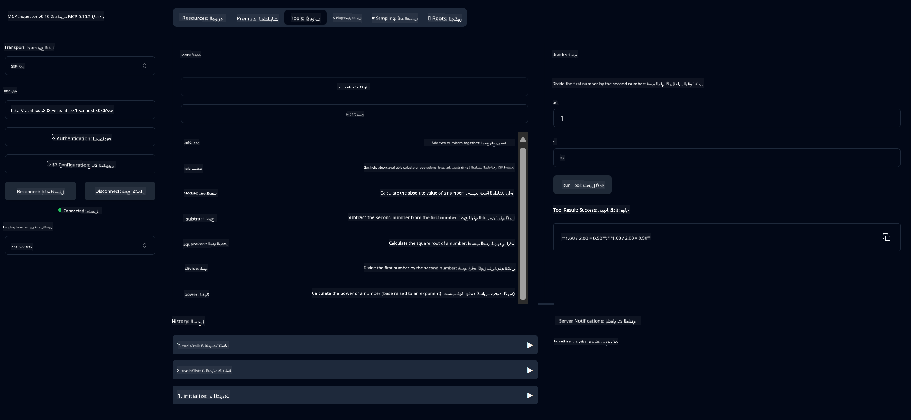

<!--
CO_OP_TRANSLATOR_METADATA:
{
  "original_hash": "7bf9a4a832911269a8bd0decb97ff36c",
  "translation_date": "2025-07-21T18:21:53+00:00",
  "source_file": "04-PracticalSamples/mcp/calculator/README.md",
  "language_code": "ar"
}
-->
# خدمة الحاسبة الأساسية باستخدام MCP

>**ملاحظة**: يتضمن هذا الفصل [**دليلًا تعليميًا**](./TUTORIAL.md) يرشدك خطوة بخطوة لتشغيل النماذج النهائية.

مرحبًا بك في أول تجربة عملية مع **بروتوكول سياق النماذج (MCP)**! في الفصول السابقة، تعلمت أساسيات الذكاء الاصطناعي التوليدي وقمت بإعداد بيئة التطوير الخاصة بك. الآن حان الوقت لبناء شيء عملي.

توضح هذه الخدمة كيفية تفاعل النماذج الذكية بأمان مع الأدوات الخارجية باستخدام MCP. بدلاً من الاعتماد على قدرات النماذج الرياضية التي قد تكون غير دقيقة أحيانًا، سنوضح كيفية بناء نظام قوي حيث يمكن للنموذج الذكي استدعاء خدمات متخصصة لإجراء حسابات دقيقة.

## جدول المحتويات

- [ما الذي ستتعلمه](../../../../../04-PracticalSamples/mcp/calculator)
- [المتطلبات الأساسية](../../../../../04-PracticalSamples/mcp/calculator)
- [المفاهيم الرئيسية](../../../../../04-PracticalSamples/mcp/calculator)
- [البدء السريع](../../../../../04-PracticalSamples/mcp/calculator)
- [العمليات المتاحة في الحاسبة](../../../../../04-PracticalSamples/mcp/calculator)
- [عملاء الاختبار](../../../../../04-PracticalSamples/mcp/calculator)
  - [1. عميل MCP المباشر (SDKClient)](../../../../../04-PracticalSamples/mcp/calculator)
  - [2. عميل مدعوم بالذكاء الاصطناعي (LangChain4jClient)](../../../../../04-PracticalSamples/mcp/calculator)
- [MCP Inspector (واجهة ويب)](../../../../../04-PracticalSamples/mcp/calculator)
  - [تعليمات خطوة بخطوة](../../../../../04-PracticalSamples/mcp/calculator)

## ما الذي ستتعلمه

من خلال العمل على هذا المثال، ستتعرف على:
- كيفية إنشاء خدمات متوافقة مع MCP باستخدام Spring Boot
- الفرق بين الاتصال المباشر بالبروتوكول والتفاعل المدعوم بالذكاء الاصطناعي
- كيفية اتخاذ النماذج الذكية قرارات بشأن متى وكيفية استخدام الأدوات الخارجية
- أفضل الممارسات لبناء تطبيقات ذكاء اصطناعي مدعومة بالأدوات

هذا المثال مثالي للمبتدئين الذين يتعلمون مفاهيم MCP ومستعدون لبناء أول تكامل لأدوات الذكاء الاصطناعي!

## المتطلبات الأساسية

- Java 21+
- Maven 3.6+
- **رمز GitHub**: مطلوب للعميل المدعوم بالذكاء الاصطناعي. إذا لم تقم بإعداده بعد، راجع [الفصل 2: إعداد بيئة التطوير](../../../02-SetupDevEnvironment/README.md) للحصول على التعليمات.

## المفاهيم الرئيسية

**بروتوكول سياق النماذج (MCP)** هو طريقة موحدة لتمكين تطبيقات الذكاء الاصطناعي من الاتصال الآمن بالأدوات الخارجية. فكر فيه كـ "جسر" يسمح للنماذج الذكية باستخدام خدمات خارجية مثل الحاسبة الخاصة بنا. بدلاً من محاولة النموذج إجراء العمليات الحسابية بنفسه (والتي قد تكون غير دقيقة)، يمكنه استدعاء خدمة الحاسبة للحصول على نتائج دقيقة. يضمن MCP أن يتم هذا الاتصال بأمان وبشكل متسق.

**الأحداث المرسلة من الخادم (SSE)** تتيح الاتصال في الوقت الفعلي بين الخادم والعملاء. على عكس طلبات HTTP التقليدية حيث تطلب وتنتظر الرد، تسمح SSE للخادم بإرسال تحديثات مستمرة إلى العميل. هذا مثالي لتطبيقات الذكاء الاصطناعي حيث قد يتم بث الردود أو تستغرق وقتًا للمعالجة.

**الأدوات الذكية واستدعاء الوظائف** تتيح للنماذج الذكية اختيار واستخدام الوظائف الخارجية تلقائيًا (مثل عمليات الحاسبة) بناءً على طلبات المستخدم. عندما تسأل "ما هو 15 + 27؟"، يفهم النموذج أنك تريد عملية جمع، ويستدعي أداة `add` بالمعاملات الصحيحة (15، 27)، ويعيد النتيجة بلغة طبيعية. يعمل النموذج كمنسق ذكي يعرف متى وكيفية استخدام كل أداة.

## البدء السريع

### 1. انتقل إلى دليل تطبيق الحاسبة
```bash
cd Generative-AI-for-beginners-java/04-PracticalSamples/mcp/calculator
```

### 2. البناء والتشغيل
```bash
mvn clean install -DskipTests
java -jar target/calculator-server-0.0.1-SNAPSHOT.jar
```

### 3. الاختبار باستخدام العملاء
- **SDKClient**: تفاعل مباشر مع بروتوكول MCP
- **LangChain4jClient**: تفاعل بلغة طبيعية مدعوم بالذكاء الاصطناعي (يتطلب رمز GitHub)

## العمليات المتاحة في الحاسبة

- `add(a, b)`, `subtract(a, b)`, `multiply(a, b)`, `divide(a, b)`
- `power(base, exponent)`, `squareRoot(number)`, `absolute(number)`
- `modulus(a, b)`, `help()`

## عملاء الاختبار

### 1. عميل MCP المباشر (SDKClient)
يختبر الاتصال الخام ببروتوكول MCP. قم بتشغيله باستخدام:
```bash
mvn test-compile exec:java -Dexec.mainClass="com.microsoft.mcp.sample.client.SDKClient" -Dexec.classpathScope=test
```

### 2. عميل مدعوم بالذكاء الاصطناعي (LangChain4jClient)
يوضح التفاعل بلغة طبيعية مع نماذج GitHub. يتطلب رمز GitHub (راجع [المتطلبات الأساسية](../../../../../04-PracticalSamples/mcp/calculator)).

**تشغيل:**
```bash
mvn test-compile exec:java -Dexec.mainClass="com.microsoft.mcp.sample.client.LangChain4jClient" -Dexec.classpathScope=test
```

## MCP Inspector (واجهة ويب)

يوفر MCP Inspector واجهة ويب مرئية لاختبار خدمة MCP الخاصة بك دون الحاجة إلى كتابة كود. مثالي للمبتدئين لفهم كيفية عمل MCP!

### تعليمات خطوة بخطوة:

1. **ابدأ خادم الحاسبة** (إذا لم يكن قيد التشغيل بالفعل):
   ```bash
   java -jar target/calculator-server-0.0.1-SNAPSHOT.jar
   ```

2. **قم بتثبيت وتشغيل MCP Inspector** في نافذة طرفية جديدة:
   ```bash
   npx @modelcontextprotocol/inspector
   ```

3. **افتح الواجهة على الويب**:
   - ابحث عن رسالة مثل "Inspector running at http://localhost:6274"
   - افتح هذا الرابط في متصفح الويب الخاص بك

4. **اتصل بخدمة الحاسبة الخاصة بك**:
   - في واجهة الويب، قم بتعيين نوع النقل إلى "SSE"
   - قم بتعيين الرابط إلى: `http://localhost:8080/sse`
   - اضغط على زر "Connect"

5. **استكشف الأدوات المتاحة**:
   - اضغط على "List Tools" لرؤية جميع عمليات الحاسبة
   - ستظهر وظائف مثل `add`، `subtract`، `multiply`، إلخ.

6. **اختبر عملية حاسبة**:
   - اختر أداة (مثل "add")
   - أدخل المعاملات (مثل `a: 15`، `b: 27`)
   - اضغط على "Run Tool"
   - شاهد النتيجة التي تعيدها خدمة MCP الخاصة بك!

هذا النهج المرئي يساعدك على فهم كيفية عمل اتصال MCP قبل بناء عملائك الخاصين.



---
**مرجع:** [وثائق MCP Server Boot Starter](https://docs.spring.io/spring-ai/reference/api/mcp/mcp-server-boot-starter-docs.html)

**إخلاء المسؤولية**:  
تم ترجمة هذا المستند باستخدام خدمة الترجمة بالذكاء الاصطناعي [Co-op Translator](https://github.com/Azure/co-op-translator). بينما نسعى لتحقيق الدقة، يرجى العلم أن الترجمات الآلية قد تحتوي على أخطاء أو معلومات غير دقيقة. يجب اعتبار المستند الأصلي بلغته الأصلية هو المصدر الموثوق. للحصول على معلومات حاسمة، يُوصى بالاستعانة بترجمة بشرية احترافية. نحن غير مسؤولين عن أي سوء فهم أو تفسيرات خاطئة ناتجة عن استخدام هذه الترجمة.