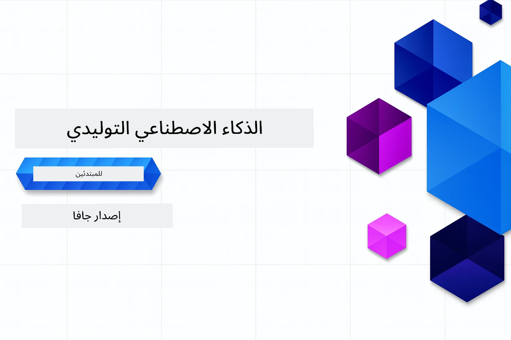

# الذكاء الاصطناعي التوليدي للمبتدئين - إصدار جافا
[](https://discord.gg/nTYy5BXMWG)



**مدة الالتزام بالوقت**: يمكن إتمام الورشة بالكامل عبر الإنترنت دون الحاجة إلى إعداد محلي. تستغرق عملية إعداد البيئة دقيقتين، مع استكشاف العينات التي قد تحتاج من 1 إلى 3 ساعات حسب عمق الاستكشاف.

> **البداية السريعة** 

1. قم بعمل فورك لهذا المستودع إلى حسابك على GitHub
2. انقر على **Code** → علامة التبويب **Codespaces** → **...** → **New with options...**
3. استخدم الإعدادات الافتراضية – سيختار هذا الحاوية التطويرية التي تم إنشاؤها لهذا المساق
4. انقر على **Create codespace**
5. انتظر حوالي دقيقتين حتى تكون البيئة جاهزة
6. انتقل مباشرةً إلى [المثال الأول](./02-SetupDevEnvironment/README.md#step-2-create-a-github-personal-access-token)

> **تفضل الاستنساخ محليًا؟**
>
> يحتوي هذا المستودع على أكثر من 50 ترجمة للغات مختلفة مما يزيد بشكل كبير من حجم التنزيل. لاستنساخ المستودع بدون الترجمات، استخدم السحب الجزئي (sparse checkout):
> ```bash
> git clone --filter=blob:none --sparse https://github.com/microsoft/Generative-AI-for-beginners-java.git
> cd Generative-AI-for-beginners-java
> git sparse-checkout set --no-cone '/*' '!translations' '!translated_images'
> ```
> هذا يمنحك كل ما تحتاجه لإكمال الدورة مع تنزيل أسرع بكثير.


## دعم متعدد اللغات

### مدعوم عبر GitHub Action (تلقائي ودائم التحديث)

<!-- CO-OP TRANSLATOR LANGUAGES TABLE START -->
[العربية](./README.md) | [البنغالية](../bn/README.md) | [البلغارية](../bg/README.md) | [البرمية (ميانمار)](../my/README.md) | [الصينية (المبسطة)](../zh-CN/README.md) | [الصينية (التقليدية، هونغ كونغ)](../zh-HK/README.md) | [الصينية (التقليدية، ماكاو)](../zh-MO/README.md) | [الصينية (التقليدية، تايوان)](../zh-TW/README.md) | [الكرواتية](../hr/README.md) | [التشيكية](../cs/README.md) | [الدنماركية](../da/README.md) | [الهولندية](../nl/README.md) | [الإستونية](../et/README.md) | [الفنلندية](../fi/README.md) | [الفرنسية](../fr/README.md) | [الألمانية](../de/README.md) | [اليونانية](../el/README.md) | [العبرية](../he/README.md) | [الهندية](../hi/README.md) | [المجرية](../hu/README.md) | [الإندونيسية](../id/README.md) | [الإيطالية](../it/README.md) | [اليابانية](../ja/README.md) | [الكانادا](../kn/README.md) | [الكورية](../ko/README.md) | [الليتوانية](../lt/README.md) | [الماليزية](../ms/README.md) | [المالايالامية](../ml/README.md) | [الماراثية](../mr/README.md) | [النيبالية](../ne/README.md) | [النيجيرية بريدجين](../pcm/README.md) | [النرويجية](../no/README.md) | [الفارسية (اللغة الفارسية)](../fa/README.md) | [البولندية](../pl/README.md) | [البرتغالية (البرازيل)](../pt-BR/README.md) | [البرتغالية (البرتغال)](../pt-PT/README.md) | [البنجابية (الجرموخية)](../pa/README.md) | [الرومانية](../ro/README.md) | [الروسية](../ru/README.md) | [الصربية (السيريلية)](../sr/README.md) | [السلوفاكية](../sk/README.md) | [السلوفينية](../sl/README.md) | [الإسبانية](../es/README.md) | [السواحلية](../sw/README.md) | [السويدية](../sv/README.md) | [التاغالوغ (الفلبينية)](../tl/README.md) | [التاميل](../ta/README.md) | [التيلجو](../te/README.md) | [التايلاندية](../th/README.md) | [التركية](../tr/README.md) | [الأوكرانية](../uk/README.md) | [الأردية](../ur/README.md) | [الفيتنامية](../vi/README.md)

## هيكل الدورة ومسار التعلم

### **الفصل 1: مقدمة في الذكاء الاصطناعي التوليدي**
- **المفاهيم الأساسية**: فهم نماذج اللغة الكبيرة، التوكنات، التضمينات، وقدرات الذكاء الاصطناعي
- **نظام الذكاء الاصطناعي في جافا**: لمحة عامة عن Spring AI وOpenAI SDKs
- **بروتوكول سياق النموذج**: مقدمة عن MCP ودوره في تواصل الوكلاء الذكاء الاصطناعي
- **التطبيقات العملية**: سيناريوهات العالم الحقيقي تشمل روبوتات الدردشة وتوليد المحتوى
- **[→ ابدأ الفصل 1](./01-IntroToGenAI/README.md)**

### **الفصل 2: إعداد بيئة التطوير**
- **إعداد متعدد المزودين**: إعداد نماذج GitHub، وAzure OpenAI، وOpenAI Java SDK
- **Spring Boot + Spring AI**: أفضل الممارسات لتطوير تطبيقات الذكاء الاصطناعي للمؤسسات
- **نماذج GitHub**: الوصول المجاني إلى نماذج الذكاء الاصطناعي للنماذج الأولية والتعلم (بدون الحاجة لبطاقة ائتمان)
- **أدوات التطوير**: حاويات Docker، VS Code، وتكوين GitHub Codespaces
- **[→ ابدأ الفصل 2](./02-SetupDevEnvironment/README.md)**

### **الفصل 3: تقنيات الذكاء الاصطناعي التوليدي الأساسية**
- **هندسة المطالبات**: تقنيات للحصول على أفضل استجابات من نماذج الذكاء الاصطناعي
- **التضمينات والعمليات المتجهة**: تنفيذ البحث الدلالي ومطابقة التشابه
- **التوليد المعزز بالاستخراج (RAG)**: دمج الذكاء الاصطناعي مع مصادر البيانات الخاصة بك
- **استدعاء الوظائف**: توسيع قدرات الذكاء الاصطناعي باستخدام أدوات وإضافات مخصصة
- **[→ ابدأ الفصل 3](./03-CoreGenerativeAITechniques/README.md)**

### **الفصل 4: التطبيقات العملية والمشاريع**
- **مولد قصص الحيوانات الأليفة** (`petstory/`): توليد المحتوى الإبداعي باستخدام نماذج GitHub
- **عرض Foundry المحلي** (`foundrylocal/`): دمج نموذج الذكاء الاصطناعي محليًا مع OpenAI Java SDK
- **خدمة حاسبة MCP** (`calculator/`): تنفيذ أساسي لبروتوكول سياق النموذج باستخدام Spring AI
- **[→ ابدأ الفصل 4](./04-PracticalSamples/README.md)**

### **الفصل 5: تطوير الذكاء الاصطناعي بمسؤولية**
- **سلامة نماذج GitHub**: اختبار آليات تصفية المحتوى والميزات الأمنية المدمجة (حجب صارم ورفض لطيف)
- **عرض الذكاء الاصطناعي المسؤول**: مثال عملي يوضح كيفية عمل أنظمة السلامة الحديثة للذكاء الاصطناعي في الممارسة
- **أفضل الممارسات**: إرشادات أساسية لتطوير الذكاء الاصطناعي ونشره بشكل أخلاقي
- **[→ ابدأ الفصل 5](./05-ResponsibleGenAI/README.md)**

## موارد إضافية

<!-- CO-OP TRANSLATOR OTHER COURSES START -->
### LangChain
[](https://aka.ms/langchain4j-for-beginners)
[](https://aka.ms/langchainjs-for-beginners?WT.mc_id=m365-94501-dwahlin)

---

### Azure / Edge / MCP / Agents
[](https://github.com/microsoft/AZD-for-beginners?WT.mc_id=academic-105485-koreyst)
[](https://github.com/microsoft/edgeai-for-beginners?WT.mc_id=academic-105485-koreyst)
[](https://github.com/microsoft/mcp-for-beginners?WT.mc_id=academic-105485-koreyst)
[](https://github.com/microsoft/ai-agents-for-beginners?WT.mc_id=academic-105485-koreyst)

---
 
### سلسلة الذكاء الاصطناعي التوليدي
[](https://github.com/microsoft/generative-ai-for-beginners?WT.mc_id=academic-105485-koreyst)
[-9333EA?style=for-the-badge&labelColor=E5E7EB&color=9333EA)](https://github.com/microsoft/Generative-AI-for-beginners-dotnet?WT.mc_id=academic-105485-koreyst)
[-C084FC?style=for-the-badge&labelColor=E5E7EB&color=C084FC)](https://github.com/microsoft/generative-ai-for-beginners-java?WT.mc_id=academic-105485-koreyst)
[-E879F9?style=for-the-badge&labelColor=E5E7EB&color=E879F9)](https://github.com/microsoft/generative-ai-with-javascript?WT.mc_id=academic-105485-koreyst)

---
 
### التعلم الأساسي
[](https://aka.ms/ml-beginners?WT.mc_id=academic-105485-koreyst)
[](https://aka.ms/datascience-beginners?WT.mc_id=academic-105485-koreyst)
[](https://aka.ms/ai-beginners?WT.mc_id=academic-105485-koreyst)
[](https://github.com/microsoft/Security-101?WT.mc_id=academic-96948-sayoung)
[](https://aka.ms/webdev-beginners?WT.mc_id=academic-105485-koreyst)
[](https://aka.ms/iot-beginners?WT.mc_id=academic-105485-koreyst)
[](https://github.com/microsoft/xr-development-for-beginners?WT.mc_id=academic-105485-koreyst)

---
 
### سلسلة كوبايلوت
[](https://aka.ms/GitHubCopilotAI?WT.mc_id=academic-105485-koreyst)
[](https://github.com/microsoft/mastering-github-copilot-for-dotnet-csharp-developers?WT.mc_id=academic-105485-koreyst)
[](https://github.com/microsoft/CopilotAdventures?WT.mc_id=academic-105485-koreyst)
<!-- CO-OP TRANSLATOR OTHER COURSES END -->

## الحصول على المساعدة

إذا واجهت مشكلة أو كان لديك أي أسئلة حول بناء تطبيقات الذكاء الاصطناعي. انضم إلى المتعلمين والمطورين ذوي الخبرة في مناقشات MCP. إنها مجتمع داعم حيث الأسئلة مرحب بها والمعرفة تُشارك بحرية.

[](https://discord.gg/nTYy5BXMWG)

إذا كان لديك ملاحظات على المنتج أو أخطاء أثناء البناء، قم بزيارة:

[](https://aka.ms/foundry/forum)

---

<!-- CO-OP TRANSLATOR DISCLAIMER START -->
**إخلاء المسؤولية**:  
تمت ترجمة هذا المستند باستخدام خدمة الترجمة الآلية [Co-op Translator](https://github.com/Azure/co-op-translator). بينما نسعى جاهدين لتحقيق الدقة، يرجى العلم أن الترجمات الآلية قد تحتوي على أخطاء أو معلومات غير دقيقة. يجب اعتبار المستند الأصلي بلغته الأصلية المصدر الرسمي والمعتمد. بالنسبة للمعلومات الحرجة، يُنصح بالاستعانة بترجمة بشرية محترفة. نحن غير مسؤولين عن أي سوء فهم أو تفسير خاطئ ناتج عن استخدام هذه الترجمة.
<!-- CO-OP TRANSLATOR DISCLAIMER END -->