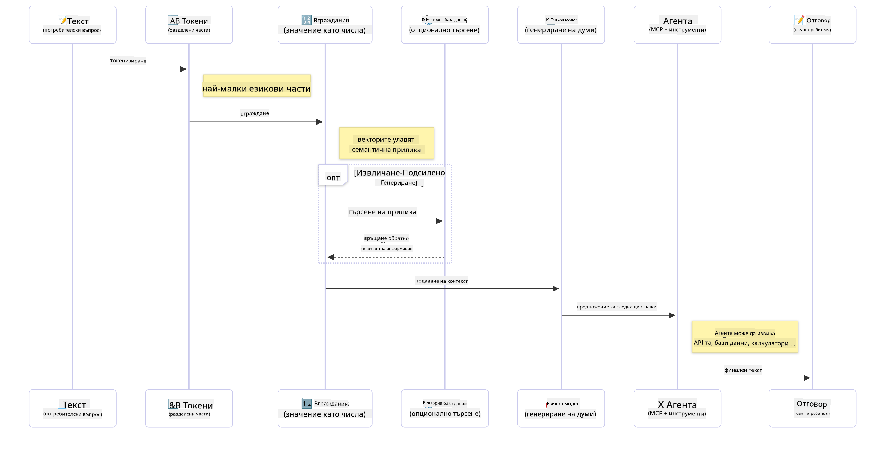

<!--
CO_OP_TRANSLATOR_METADATA:
{
  "original_hash": "75bfb080ca725e8a9aa9c80cae25fba1",
  "translation_date": "2025-07-29T10:13:19+00:00",
  "source_file": "01-IntroToGenAI/README.md",
  "language_code": "bg"
}
-->
# Въведение в Генеративния AI - Java издание

## Какво ще научите

- **Основи на Генеративния AI**, включително LLMs, инженеринг на подсказки, токени, вграждания и векторни бази данни
- **Сравнение на инструменти за разработка на AI с Java**, включително Azure OpenAI SDK, Spring AI и OpenAI Java SDK
- **Открийте Протокола за Контекст на Модела** и неговата роля в комуникацията на AI агентите

## Съдържание

- [Въведение](../../../01-IntroToGenAI)
- [Бърз преглед на концепциите за Генеративен AI](../../../01-IntroToGenAI)
- [Преглед на инженеринг на подсказки](../../../01-IntroToGenAI)
- [Токени, вграждания и агенти](../../../01-IntroToGenAI)
- [Инструменти и библиотеки за разработка на AI с Java](../../../01-IntroToGenAI)
  - [OpenAI Java SDK](../../../01-IntroToGenAI)
  - [Spring AI](../../../01-IntroToGenAI)
  - [Azure OpenAI Java SDK](../../../01-IntroToGenAI)
- [Резюме](../../../01-IntroToGenAI)
- [Следващи стъпки](../../../01-IntroToGenAI)

## Въведение

Добре дошли в първата глава на Генеративен AI за начинаещи - Java издание! Този основен урок ще ви запознае с ключовите концепции на генеративния AI и как да работите с тях, използвайки Java. Ще научите за основните градивни елементи на AI приложенията, включително Големи Езикови Модели (LLMs), токени, вграждания и AI агенти. Ще разгледаме и основните инструменти за Java, които ще използвате през целия курс.

### Бърз преглед на концепциите за Генеративен AI

Генеративният AI е вид изкуствен интелект, който създава ново съдържание, като текст, изображения или код, въз основа на модели и връзки, научени от данни. Моделите на генеративния AI могат да генерират отговори, подобни на човешките, да разбират контекст и понякога дори да създават съдържание, което изглежда като създадено от човек.

Докато разработвате вашите Java AI приложения, ще работите с **модели на генеративен AI**, за да създавате съдържание. Някои от способностите на тези модели включват:

- **Генериране на текст**: Създаване на текст, подобен на човешки, за чатботове, съдържание и завършване на текст.
- **Генериране и анализ на изображения**: Създаване на реалистични изображения, подобряване на снимки и откриване на обекти.
- **Генериране на код**: Писане на кодови фрагменти или скриптове.

Съществуват специфични типове модели, оптимизирани за различни задачи. Например, както **Малки Езикови Модели (SLMs)**, така и **Големи Езикови Модели (LLMs)** могат да обработват генериране на текст, като LLMs обикновено предлагат по-добра производителност за сложни задачи. За задачи, свързани с изображения, бихте използвали специализирани модели за визия или мултимодални модели.

Разбира се, отговорите от тези модели не винаги са перфектни. Вероятно сте чували за модели, които "халюцинират" или генерират грешна информация по авторитетен начин. Но можете да помогнете на модела да генерира по-добри отговори, като му предоставите ясни инструкции и контекст. Тук идва ролята на **инженеринга на подсказки**.

#### Преглед на инженеринг на подсказки

Инженерингът на подсказки е практиката за проектиране на ефективни входни данни, които да насочват AI моделите към желаните изходи. Той включва:

- **Яснота**: Създаване на инструкции, които са ясни и недвусмислени.
- **Контекст**: Осигуряване на необходимата фонова информация.
- **Ограничения**: Посочване на всякакви ограничения или формати.

Някои добри практики за инженеринг на подсказки включват проектиране на подсказки, ясни инструкции, разбиване на задачи, обучение с един или няколко примера и настройка на подсказки. Тестването на различни подсказки е от съществено значение, за да се намери най-доброто решение за вашия конкретен случай.

При разработването на приложения ще работите с различни типове подсказки:
- **Системни подсказки**: Задават основните правила и контекст за поведението на модела.
- **Потребителски подсказки**: Входните данни от потребителите на вашето приложение.
- **Асистентски подсказки**: Отговорите на модела, базирани на системни и потребителски подсказки.

> **Научете повече**: Научете повече за инженеринг на подсказки в [главата за инженеринг на подсказки от курса GenAI за начинаещи](https://github.com/microsoft/generative-ai-for-beginners/tree/main/04-prompt-engineering-fundamentals)

#### Токени, вграждания и агенти

Когато работите с модели на генеративен AI, ще срещнете термини като **токени**, **вграждания**, **агенти** и **Протокол за Контекст на Модела (MCP)**. Ето подробен преглед на тези концепции:

- **Токени**: Токените са най-малката единица текст в модела. Те могат да бъдат думи, символи или поддуми. Токените се използват за представяне на текстови данни във формат, който моделът може да разбере. Например, изречението "The quick brown fox jumped over the lazy dog" може да бъде токенизирано като ["The", " quick", " brown", " fox", " jumped", " over", " the", " lazy", " dog"] или ["The", " qu", "ick", " br", "own", " fox", " jump", "ed", " over", " the", " la", "zy", " dog"] в зависимост от стратегията за токенизация.

Токенизацията е процесът на разбиване на текста на тези по-малки единици. Това е от съществено значение, защото моделите работят с токени, а не с суров текст. Броят на токените в подсказката влияе върху дължината и качеството на отговора на модела, тъй като моделите имат ограничения за броя токени в контекстния прозорец (например, 128K токени за общия контекст на GPT-4o, включително вход и изход).

  В Java можете да използвате библиотеки като OpenAI SDK, за да обработвате токенизацията автоматично при изпращане на заявки към AI модели.

- **Вграждания**: Вгражданията са векторни представяния на токени, които улавят семантичното значение. Те са числови представяния (обикновено масиви от числа с плаваща запетая), които позволяват на моделите да разбират връзките между думите и да генерират контекстуално релевантни отговори. Подобни думи имат подобни вграждания, което позволява на модела да разбира концепции като синоними и семантични връзки.

  В Java можете да генерирате вграждания, използвайки OpenAI SDK или други библиотеки, които поддържат генериране на вграждания. Тези вграждания са от съществено значение за задачи като семантично търсене, където искате да намерите подобно съдържание въз основа на значението, а не на точни текстови съвпадения.

- **Векторни бази данни**: Векторните бази данни са специализирани системи за съхранение, оптимизирани за вграждания. Те позволяват ефективно търсене по сходство и са от решаващо значение за модели на Генерация с Подобрено Извличане (RAG), където трябва да намерите релевантна информация от големи набори от данни въз основа на семантична сходство, а не на точни съвпадения.

> **Забележка**: В този курс няма да разглеждаме векторни бази данни, но смятаме, че си струва да ги споменем, тъй като те често се използват в реални приложения.

- **Агенти и MCP**: AI компоненти, които автономно взаимодействат с модели, инструменти и външни системи. Протоколът за Контекст на Модела (MCP) предоставя стандартизиран начин за агентите да осигуряват сигурен достъп до външни източници на данни и инструменти. Научете повече в нашия [курс MCP за начинаещи](https://github.com/microsoft/mcp-for-beginners).

В Java AI приложенията ще използвате токени за обработка на текст, вграждания за семантично търсене и RAG, векторни бази данни за извличане на данни и агенти с MCP за изграждане на интелигентни системи, използващи инструменти.

### Инструменти и библиотеки за разработка на AI с Java

Java предлага отлични инструменти за разработка на AI. Има три основни библиотеки, които ще разгледаме през курса - OpenAI Java SDK, Azure OpenAI SDK и Spring AI.

Ето бърза справка, показваща кой SDK се използва в примерите на всяка глава:

| Глава | Пример | SDK |
|-------|--------|-----|
| 02-SetupDevEnvironment | github-models | OpenAI Java SDK |
| 02-SetupDevEnvironment | basic-chat-azure | Spring AI Azure OpenAI |
| 03-CoreGenerativeAITechniques | examples | Azure OpenAI SDK |
| 04-PracticalSamples | petstory | OpenAI Java SDK |
| 04-PracticalSamples | foundrylocal | OpenAI Java SDK |
| 04-PracticalSamples | calculator | Spring AI MCP SDK + LangChain4j |

**Връзки към документация на SDK:**
- [Azure OpenAI Java SDK](https://github.com/Azure/azure-sdk-for-java/tree/azure-ai-openai_1.0.0-beta.16/sdk/openai/azure-ai-openai)
- [Spring AI](https://docs.spring.io/spring-ai/reference/)
- [OpenAI Java SDK](https://github.com/openai/openai-java)
- [LangChain4j](https://docs.langchain4j.dev/)

#### OpenAI Java SDK

OpenAI SDK е официалната Java библиотека за OpenAI API. Тя предоставя прост и последователен интерфейс за взаимодействие с моделите на OpenAI, което улеснява интегрирането на AI възможности в Java приложения. Примерите за GitHub Models от глава 2, приложението Pet Story от глава 4 и примерът Foundry Local демонстрират подхода на OpenAI SDK.

#### Spring AI

Spring AI е цялостна рамка, която предоставя AI възможности на Spring приложения, осигурявайки последователен слой за абстракция между различни AI доставчици. Тя се интегрира безпроблемно с екосистемата на Spring, което я прави идеален избор за корпоративни Java приложения, които се нуждаят от AI възможности.

Силата на Spring AI се крие в безпроблемната интеграция с екосистемата на Spring, което улеснява създаването на готови за производство AI приложения с познати Spring модели като инжектиране на зависимости, управление на конфигурации и тестови рамки. Ще използвате Spring AI в глава 2 и 4, за да изградите приложения, които използват както OpenAI, така и библиотеките на Spring AI за Протокола за Контекст на Модела (MCP).

##### Протокол за Контекст на Модела (MCP)

[Протоколът за Контекст на Модела (MCP)](https://modelcontextprotocol.io/) е нов стандарт, който позволява на AI приложенията да взаимодействат сигурно с външни източници на данни и инструменти. MCP предоставя стандартизиран начин за AI моделите да получават контекстуална информация и да изпълняват действия във вашите приложения.

В глава 4 ще изградите проста MCP услуга за калкулатор, която демонстрира основите на Протокола за Контекст на Модела със Spring AI, показвайки как да създавате основни интеграции на инструменти и архитектури на услуги.

#### Azure OpenAI Java SDK

Клиентската библиотека Azure OpenAI за Java е адаптация на REST API на OpenAI, която предоставя идиоматичен интерфейс и интеграция с останалата част от екосистемата на Azure SDK. В глава 3 ще изградите приложения, използвайки Azure OpenAI SDK, включително чат приложения, извикване на функции и модели на Генерация с Подобрено Извличане (RAG).

> Забележка: Azure OpenAI SDK изостава от OpenAI Java SDK по отношение на функциите, така че за бъдещи проекти обмислете използването на OpenAI Java SDK.

## Резюме

Това обобщава основите! Сега разбирате:

- Основните концепции зад генеративния AI - от LLMs и инженеринг на подсказки до токени, вграждания и векторни бази данни
- Вашите опции за инструменти за разработка на AI с Java: Azure OpenAI SDK, Spring AI и OpenAI Java SDK
- Какво представлява Протоколът за Контекст на Модела и как той позволява на AI агентите да работят с външни инструменти

## Следващи стъпки

[Глава 2: Настройка на средата за разработка](../02-SetupDevEnvironment/README.md)

**Отказ от отговорност**:  
Този документ е преведен с помощта на AI услуга за превод [Co-op Translator](https://github.com/Azure/co-op-translator). Въпреки че се стремим към точност, моля, имайте предвид, че автоматизираните преводи може да съдържат грешки или неточности. Оригиналният документ на неговия изходен език трябва да се счита за авторитетен източник. За критична информация се препоръчва професионален човешки превод. Не носим отговорност за каквито и да е недоразумения или погрешни интерпретации, произтичащи от използването на този превод.