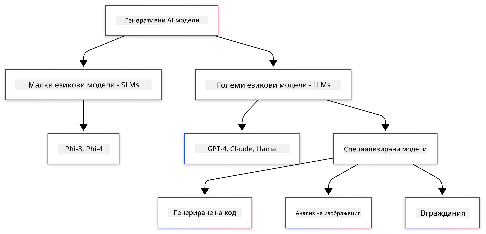
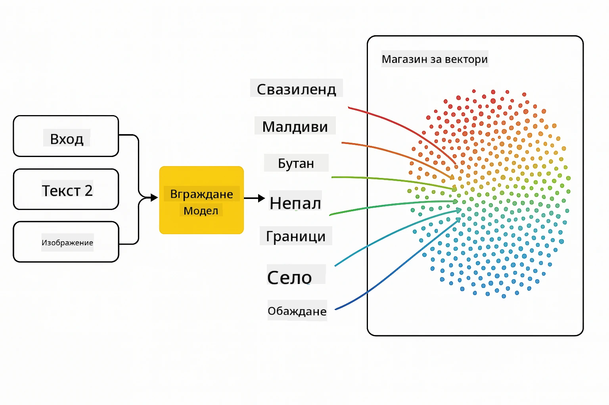
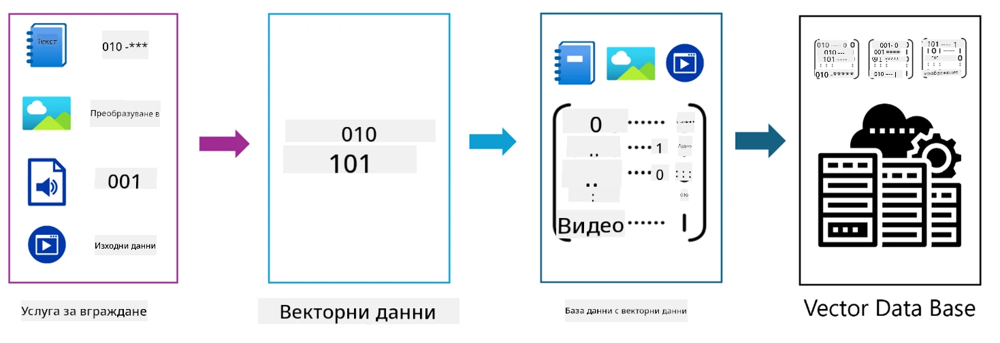
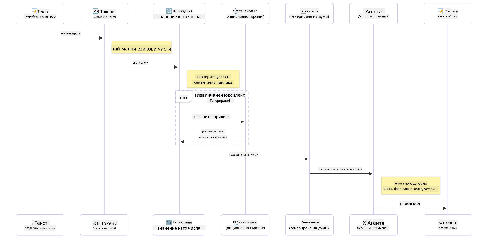

# Въведение в Генеративния ИИ - Java издание

> **Видео**: [Гледайте видео прегледа на този урок в YouTube.](https://www.youtube.com/watch?v=XH46tGp_eSw) Можете също да кликнете върху миниатюрното изображение по-горе.

## Какво ще научите

- **Основи на генеративния ИИ** включително LLM, инженерство на подканите, токени, ембеддинги и векторни бази данни
- **Сравнение на инструменти за AI разработка в Java** включително Azure OpenAI SDK, Spring AI и OpenAI Java SDK
- **Открийте Model Context Protocol** и неговата роля в комуникацията между AI агенти

## Съдържание

- [Въведение](#въведение)
- [Бърз преглед на концепциите за Генеративен ИИ](#бърз-преглед-на-концепциите-за-генеративен-ии)
- [Преглед на инженерството на подканите](#преглед-на-инженерството-на-подканите)
- [Токени, ембеддинги и агенти](#токени-ембеддинги-и-агенти)
- [Инструменти и библиотеки за AI разработка за Java](#инструменти-и-библиотеки-за-ai-разработка-за-java)
  - [OpenAI Java SDK](#openai-java-sdk)
  - [Spring AI](#spring-ai)
  - [Azure OpenAI Java SDK](#azure-openai-java-sdk)
- [Обобщение](#обобщение)
- [Следващи стъпки](#следващи-стъпки)

## Въведение

Добре дошли в първата глава на Генеративен ИИ за Начинаещи - Java издание! Този основен урок ви запознава с основните концепции на генеративния ИИ и как да работите с тях, използвайки Java. Ще научите за съществените градивни елементи на AI приложенията, включително Големи езикови модели (LLM), токени, ембеддинги и AI агенти. Ще разгледаме и основните инструменти за Java, които ще използвате през целия курс.

### Бърз преглед на концепциите за Генеративен ИИ

Генеративният ИИ е вид изкуствен интелект, който създава ново съдържание като текст, изображения или код, базирано на модели и връзки, изучени от данни. Генеративните AI модели могат да генерират отговори, наподобяващи човешки, да разбират контекста и понякога дори да създават съдържание, което изглежда човешко.

Докато разработвате вашите Java AI приложения, ще работите с **генеративни AI модели** за създаване на съдържание. Някои възможности на генеративните AI модели включват:

- **Генериране на текст**: Създаване на текст, подобен на човешкия, за чатботове, съдържание и допълване на текст.
- **Генериране и анализ на изображения**: Създаване на реалистични изображения, подобряване на снимки и откриване на обекти.
- **Генериране на код**: Писане на кодови изрезки или скриптове.

Има специфични видове модели, оптимизирани за различни задачи. Например, както **Малки езикови модели (SLM)**, така и **Големи езикови модели (LLM)** могат да обработват генериране на текст, като LLM обикновено предлагат по-добри резултати за сложни задачи. За задачи, свързани с изображения, ще използвате специализирани визуални модели или мултимодални модели.

Разбира се, отговорите на тези модели не са перфектни през цялото време. Вероятно сте чували за модели, които "халуцинират" или генерират неправилна информация по авторитетен начин. Но можете да помогнете на модела да генерира по-добри отговори, като му предоставите ясни инструкции и контекст. Тук влиза в сила **инженерството на подканите**.

#### Преглед на инженерството на подканите

Инженерството на подканите е практиката за проектиране на ефективни входове, които да насочват AI моделите към желаните изходи. Това включва:

- **Яснота**: Правене на инструкциите ясни и недвусмислени.
- **Контекст**: Предоставяне на необходимата фоновата информация.
- **Ограничения**: Определяне на всякакви ограничения или формати.

Някои добри практики за инженерство на подканите включват проектиране на подканите, ясни инструкции, разбиване на задачата, ученето с един или малко примера и настройване на подканите. Тестът с различни подканящи структури е важен, за да откриете кой най-добре работи за вашия конкретен казус.

При разработване на приложения ще работите с различни типове подканящи:
- **Системни подканящи**: Задават основните правила и контекста за поведението на модела
- **Потребителски подканящи**: Входните данни от потребителите на вашето приложение
- **Помощни подканящи**: Отговорите на модела, базирани на системните и потребителските подканящи

> **Научете повече**: Научете повече за инженерството на подканите в [глава Инженерство на подканите от курса GenAI за начинаещи](https://github.com/microsoft/generative-ai-for-beginners/tree/main/04-prompt-engineering-fundamentals)

#### Токени, ембеддинги и агенти

Когато работите с генеративни AI модели, ще срещнете термини като **токени**, **ембеддинги**, **агенти** и **Model Context Protocol (MCP)**. Ето подробен преглед на тези концепции:

- **Токени**: Токените са най-малката единица текст във модел. Те могат да бъдат думи, знаци или поддуми. Токените се използват, за да представят текстови данни във формат, който моделът може да разбере. Например изречението "Бързата кафява лисица прескочи мързеливото куче" може да бъде токенизирано като ["Бърза", " та", " кафява", " лисица", " прескочи", " мързеливото", " куче"] или ["Бър", " за", " та", " ка", " фяв", " а", " ли", " сиц", " а", " прес", " кочи", " мърз", " еливо", " то", " куче"] в зависимост от стратегията на токенизация.

Токенизацията е процесът на разбиване на текста на тези по-малки единици. Това е важно, защото моделите работят с токени, а не с необработен текст. Броят на токените в една подканваща заявка влияе върху дължината и качеството на отговора на модела, тъй като моделите имат лимити на токени за своя контекстен прозорец (например 128K токени за общия контекст на GPT-4o, включително както входящите, така и изходящите данни).

  В Java можете да използвате библиотеки като OpenAI SDK за автоматична токенизация при изпращане на заявки към AI модели.

- **Ембеддинги**: Ембеддингите са векторни представяния на токени, които улавят семантичното значение. Те са числени представяния (обикновено масиви от числа с плаваща запетая), които позволяват на моделите да разбират връзките между думи и да генерират контекстуално релевантни отговори. Подобни думи имат подобни ембеддинги, което дава възможност на модела да разбира концепции като синоними и семантични отношения.

  В Java можете да генерирате ембеддинги, използвайки OpenAI SDK или други библиотеки, които поддържат генериране на ембеддинги. Тези ембеддинги са съществени за задачи като семантично търсене, когато искате да намерите подобно съдържание въз основа на значение, а не точно съвпадение на текста.

- **Векторни бази данни**: Векторните бази данни са специализирани системи за съхранение, оптимизирани за ембеддинги. Те позволяват ефективно търсене по сходство и са ключови за модели с генериране, подпомогнато от възстановяване (Retrieval-Augmented Generation, RAG), когато трябва да намерите релевантна информация от големи набори от данни въз основа на семантично сходство, а не точно съвпадение.

> **Бележка**: В този курс няма да покриваме векторните бази данни, но смятаме, че е важно да ги споменем, тъй като се използват широко в реални приложения.

- **Агенти и MCP**: AI компоненти, които автономно взаимодействат с модели, инструменти и външни системи. Model Context Protocol (MCP) осигурява стандартизиран начин за агенти да имат сигурен достъп до външни източници на данни и инструменти. Научете повече в нашия курс [MCP за начинаещи](https://github.com/microsoft/mcp-for-beginners).

В Java AI приложенията ще използвате токени за обработка на текст, ембеддинги за семантично търсене и RAG, векторни бази данни за извличане на данни и агенти с MCP за изграждане на интелигентни системи, използващи инструменти.

### Инструменти и библиотеки за AI разработка за Java

Java предлага отлични инструменти за разработка на AI. Има три основни библиотеки, които ще разгледаме по време на курса - OpenAI Java SDK, Azure OpenAI SDK и Spring AI.

Ето бърза справка в таблица, показваща кой SDK се използва в примерите на всяка глава:

| Глава | Пример | SDK |
|---------|--------|-----|
| 02-SetupDevEnvironment | github-models | OpenAI Java SDK |
| 02-SetupDevEnvironment | basic-chat-azure | Spring AI Azure OpenAI |
| 03-CoreGenerativeAITechniques | examples | Azure OpenAI SDK |
| 04-PracticalSamples | petstory | OpenAI Java SDK |
| 04-PracticalSamples | foundrylocal | OpenAI Java SDK |
| 04-PracticalSamples | calculator | Spring AI MCP SDK + LangChain4j |

**Връзки към документацията на SDK:**
- [Azure OpenAI Java SDK](https://github.com/Azure/azure-sdk-for-java/tree/azure-ai-openai_1.0.0-beta.16/sdk/openai/azure-ai-openai)
- [Spring AI](https://docs.spring.io/spring-ai/reference/)
- [OpenAI Java SDK](https://github.com/openai/openai-java)
- [LangChain4j](https://docs.langchain4j.dev/)

#### OpenAI Java SDK

OpenAI SDK е официалната Java библиотека за OpenAI API. Тя осигурява прост и последователен интерфейс за работа с моделите на OpenAI, което улеснява интегрирането на AI възможности в Java приложения. Примерите с GitHub модели от Глава 2, приложението Pet Story и примерът Foundry Local от Глава 4 демонстрират подхода с OpenAI SDK.

#### Spring AI

Spring AI е цялостна рамка, която предоставя AI възможности за Spring приложения, осигурявайки последователен абстракционен слой през различни AI доставчици. Тя се интегрира безпроблемно със Spring екосистемата, което я прави идеален избор за бизнес Java приложения, които се нуждаят от AI функционалности.

Силата на Spring AI се крие в безпроблемната му интеграция със Spring екосистемата, като улеснява създаването на продукционно готови AI приложения с познати Spring модели като инжекции на зависимости, управление на конфигурации и тестови рамки. Ще използвате Spring AI в Глави 2 и 4 за изграждане на приложения, които използват както OpenAI, така и Model Context Protocol (MCP) Spring AI библиотеки.

##### Model Context Protocol (MCP)

[Model Context Protocol (MCP)](https://modelcontextprotocol.io/) е възникващ стандарт, който позволява на AI приложения да взаимодействат сигурно с външни източници на данни и инструменти. MCP осигурява стандартизиран начин за AI модели да достъпват контекстуална информация и да изпълняват действия във вашите приложения.

В Глава 4 ще изградите прост MCP калкулатор, който демонстрира основите на Model Context Protocol с Spring AI, показвайки как да създавате базови интеграции на инструменти и архитектури на услуги.

#### Azure OpenAI Java SDK

Клиентската библиотека Azure OpenAI за Java е адаптация на OpenAI REST API, която осигурява идиоматичен интерфейс и интеграция с останалата част от Azure SDK екосистемата. В Глава 3 ще изградите приложения, използващи Azure OpenAI SDK, включително чат приложения, извикване на функции и RAG (Retrieval-Augmented Generation) модели.

> Забележка: Azure OpenAI SDK изостава в характеристиките спрямо OpenAI Java SDK, затова за бъдещи проекти обмислете използването на OpenAI Java SDK.

## Обобщение

Това обхваща основите! Вече разбирате:

- Основните концепции зад генеративния ИИ - от LLM и инженерство на подканите до токени, ембеддинги и векторни бази данни
- Вашите инструменти за Java AI разработка: Azure OpenAI SDK, Spring AI и OpenAI Java SDK
- Какво е Model Context Protocol и как той позволява на AI агентите да работят с външни инструменти

## Следващи стъпки

[Глава 2: Настройка на средата за разработка](../02-SetupDevEnvironment/README.md)

---

<!-- CO-OP TRANSLATOR DISCLAIMER START -->
**Отказ от отговорност**:  
Този документ е преведен с помощта на AI преводаческа услуга [Co-op Translator](https://github.com/Azure/co-op-translator). Въпреки че се стремим към точност, моля, имайте предвид, че автоматичните преводи могат да съдържат грешки или неточности. Оригиналният документ на неговия роден език трябва да се счита за авторитетен източник. За критична информация се препоръчва професионален човешки превод. Ние не носим отговорност за каквито и да е неразбирателства или погрешни тълкувания, произтичащи от използването на този превод.
<!-- CO-OP TRANSLATOR DISCLAIMER END -->