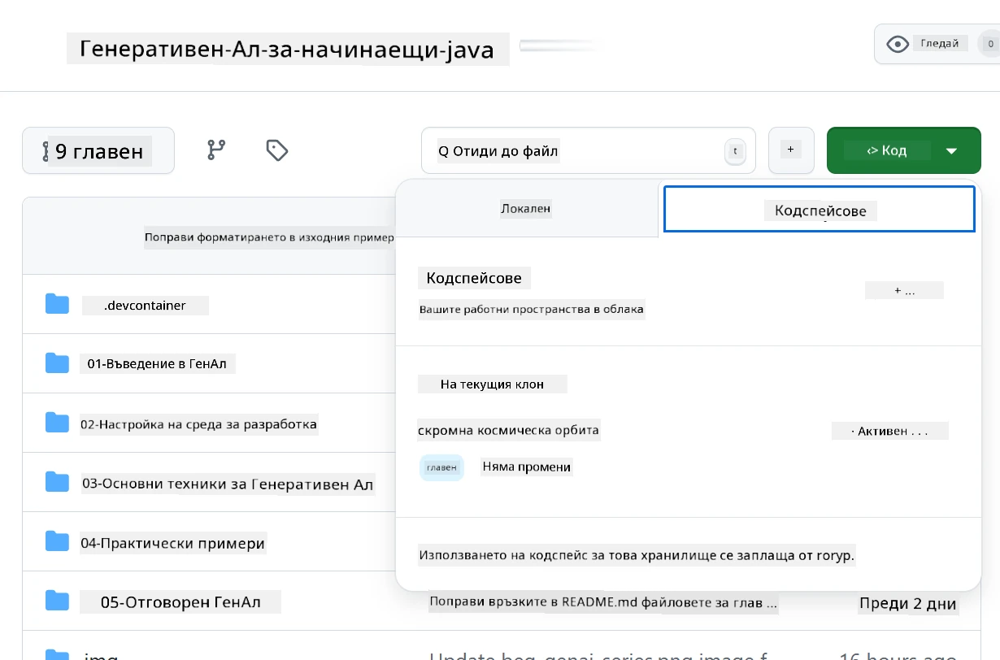
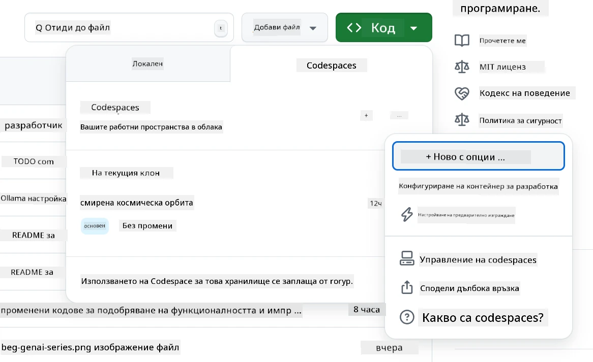
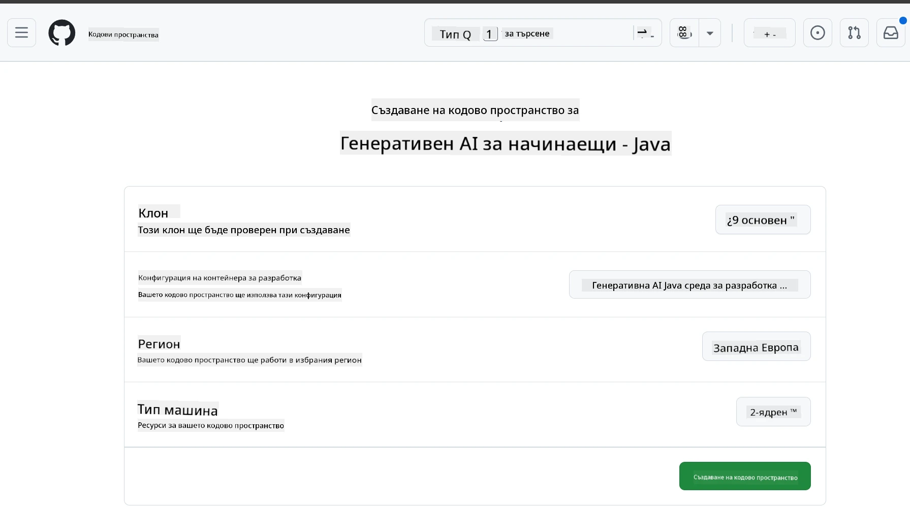
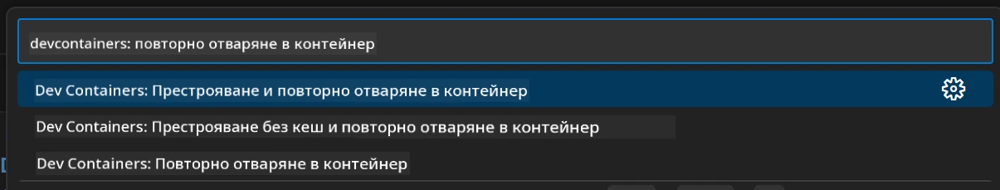
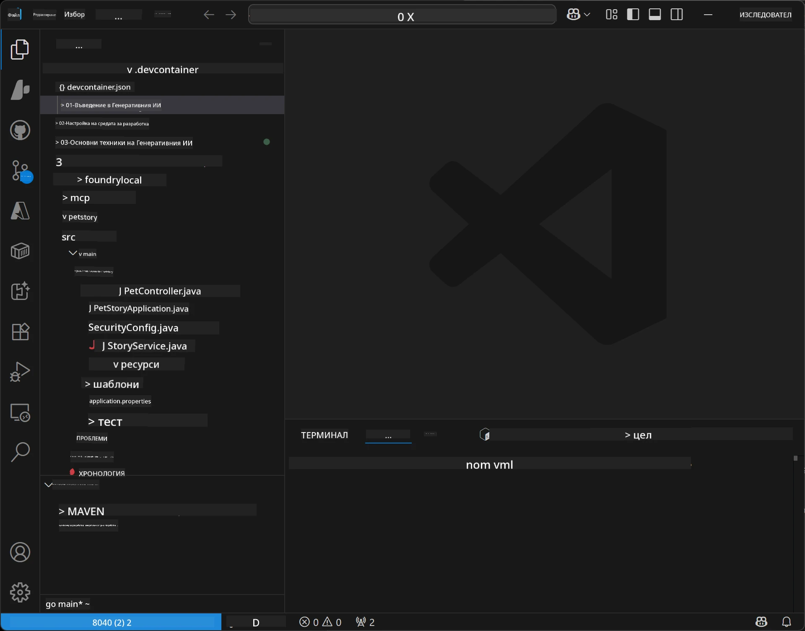
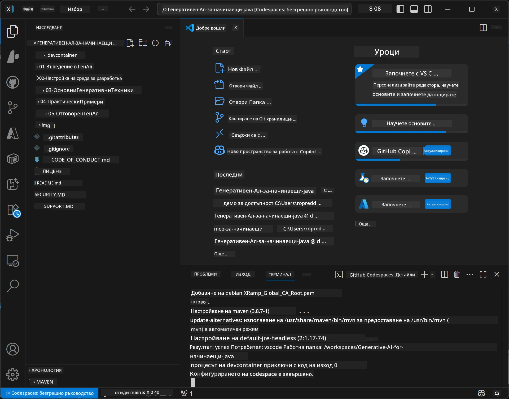

# Настройване на средата за разработка за Generative AI за Java

> **Бърз старт**: Програмирайте в облака за 2 минути - Отидете директно на [GitHub Codespaces Настройка](../../../02-SetupDevEnvironment) - не е необходима локална инсталация и използва модели на GitHub!

> **Интересувате се от Azure OpenAI?**, вижте нашето [Ръководство за настройка на Azure OpenAI](getting-started-azure-openai.md) със стъпки за създаване на нов ресурс Azure OpenAI.

## Какво ще научите

- Настройване на среда за разработка на Java за AI приложения
- Избор и конфигуриране на предпочитаната среда за разработка (облачно първо с Codespaces, локален dev контейнер или пълна локална настройка)
- Тествайте вашата настройка чрез свързване с GitHub модели

## Съдържание

- [Какво ще научите](../../../02-SetupDevEnvironment)
- [Въведение](../../../02-SetupDevEnvironment)
- [Стъпка 1: Настройване на средата за разработка](../../../02-SetupDevEnvironment)
  - [Опция A: GitHub Codespaces (Препоръчително)](../../../02-SetupDevEnvironment)
  - [Опция B: Локален Dev Container](../../../02-SetupDevEnvironment)
  - [Опция C: Използвайте съществуващата си локална инсталация](../../../02-SetupDevEnvironment)
- [Стъпка 2: Създаване на персонален токен за достъп до GitHub](../../../02-SetupDevEnvironment)
- [Стъпка 3: Тествайте настройката си](../../../02-SetupDevEnvironment)
- [Отстраняване на неизправности](../../../02-SetupDevEnvironment)
- [Обобщение](../../../02-SetupDevEnvironment)
- [Следващи стъпки](../../../02-SetupDevEnvironment)

## Въведение

Тази глава ще ви преведе през настройването на среда за разработка. Ще използваме **GitHub модели** като основен пример, защото са безплатни, лесни за настройка с просто GitHub акаунт, не изискват кредитна карта и предоставят достъп до множество модели за експериментиране.

**Не е необходимо локално настройване!** Можете да започнете да кодирате веднага, използвайки GitHub Codespaces, които предоставят пълна среда за разработка в браузъра ви.


Препоръчваме да използвате [**GitHub модели**](https://github.com/marketplace?type=models) за този курс, защото те са:
- **Безплатни** за начало
- **Лесни** за настройка само с GitHub акаунт
- **Без кредитна карта** необходима
- **Налични множество модели** за експериментиране

> **Забележка**: GitHub моделите, използвани в това обучение, имат следните безплатни ограничения:
> - 15 заявки в минута (150 на ден)
> - ~8,000 думи вход, ~4,000 думи изход на заявка
> - 5 паралелни заявки
> 
> За продуктивна употреба, надградете до Azure AI Foundry модели с вашия Azure акаунт. Вашият код не трябва да се променя. Вижте документацията на [Azure AI Foundry](https://learn.microsoft.com/azure/ai-foundry/foundry-models/how-to/quickstart-github-models).


## Стъпка 1: Настройване на средата за разработка

<a name="quick-start-cloud"></a>

Създадохме предварително конфигуриран контейнер за разработка, за да минимизираме времето за настройка и да сме сигурни, че имате всички необходими инструменти за този курс Generative AI за Java. Изберете предпочитаната среда за разработка:

### Опции за настройка на средата:

#### Опция A: GitHub Codespaces (Препоръчително)

**Започнете програмирането за 2 минути - не е нужна локална инсталация!**

1. Форкнете това хранилище в своя GitHub акаунт
   > **Забележка**: Ако желаете да редактирате базовата конфигурация, разгледайте [Dev Container Configuration](../../../.devcontainer/devcontainer.json)
2. Кликнете **Code** → раздела **Codespaces** → **...** → **New with options...**
3. Използвайте настройките по подразбиране – това ще избере **Dev container конфигурация**: **Generative AI Java Development Environment** персонализиран devcontainer, създаден за този курс
4. Кликнете **Create codespace**
5. Изчакайте около 2 минути за зареждане на средата
6. Продължете към [Стъпка 2: Създаване на GitHub токен](../../../02-SetupDevEnvironment)








> **Предимства на Codespaces**:
> - Не е необходима локална инсталация
> - Работи на всяко устройство с браузър
> - Предварително конфигурирана с всички необходими инструменти и зависимости
> - Безплатно 60 часа месечно за лични акаунти
> - Консистентна среда за всички участници

#### Опция B: Локален Dev Container

**За разработчици, които предпочитат локална разработка с Docker**

1. Форкнете и клонирайте това хранилище на своя локален компютър
   > **Забележка**: Ако желаете да редактирате базовата конфигурация, разгледайте [Dev Container Configuration](../../../.devcontainer/devcontainer.json)
2. Инсталирайте [Docker Desktop](https://www.docker.com/products/docker-desktop/) и [VS Code](https://code.visualstudio.com/)
3. Инсталирайте [разширението Dev Containers](https://marketplace.visualstudio.com/items?itemName=ms-vscode-remote.remote-containers) в VS Code
4. Отворете папката с репозитория в VS Code
5. При подканване кликнете **Reopen in Container** (или използвайте `Ctrl+Shift+P` → "Dev Containers: Reopen in Container")
6. Изчакайте контейнерът да се изгради и стартира
7. Продължете към [Стъпка 2: Създаване на GitHub токен](../../../02-SetupDevEnvironment)





#### Опция C: Използвайте съществуващата си локална инсталация

**За разработчици със съществуващи Java среди**

Предпоставки:
- [Java 21+](https://www.oracle.com/java/technologies/javase/jdk21-archive-downloads.html) 
- [Maven 3.9+](https://maven.apache.org/download.cgi)
- [VS Code](https://code.visualstudio.com) или предпочитаната IDE

Стъпки:
1. Клонирайте това хранилище на локалния си компютър
2. Отворете проекта в IDE-то си
3. Продължете към [Стъпка 2: Създаване на GitHub токен](../../../02-SetupDevEnvironment)

> **Професионален съвет**: Ако имате слаба машина, но искате локално VS Code, използвайте GitHub Codespaces! Можете да свържете локалния си VS Code с хостнат в облака Codespace за най-доброто от двата свята.




## Стъпка 2: Създаване на персонален токен за достъп до GitHub

1. Отидете на [GitHub Settings](https://github.com/settings/profile) и изберете **Settings** от менюто в профила си.
2. В лявата странична лента кликнете **Developer settings** (обикновено в дъното).
3. Под **Personal access tokens** кликнете **Fine-grained tokens** (или следвайте този директен [линк](https://github.com/settings/personal-access-tokens)).
4. Кликнете **Generate new token**.
5. Под "Token name" въведете описателно име (например `GenAI-Java-Course-Token`).
6. Задайте дата на изтичане (препоръчително: 7 дни за най-добра практика по сигурност).
7. Под "Resource owner" изберете своя потребителски акаунт.
8. Под "Repository access" изберете репозиториите, с които искате да използвате GitHub модели (или "All repositories" ако е необходимо).
9. Под "Account permissions" намерете **Models** и задайте **Read-only**.
10. Кликнете **Generate token**.
11. **Копирайте и запазете токена веднага** – няма да го видите отново!

> **Съвет за сигурност**: Използвайте минималния необходим обхват и най-краткия практически период на валидност за вашите токени.

## Стъпка 3: Тествайте настройката си с примера на GitHub модели

След като средата за разработка е готова, нека тестваем интеграцията с GitHub модели с нашето примерното приложение в [`02-SetupDevEnvironment/examples/github-models`](../../../02-SetupDevEnvironment/examples/github-models).

1. Отворете терминала в средата си за разработка.
2. Отидете в примерната папка за GitHub модели:
   ```bash
   cd 02-SetupDevEnvironment/examples/github-models
   ```
3. Задайте своя GitHub токен като променлива на средата:
   ```bash
   # macOS/Linux
   export GITHUB_TOKEN=your_token_here
   
   # Windows (Команден ред)
   set GITHUB_TOKEN=your_token_here
   
   # Windows (PowerShell)
   $env:GITHUB_TOKEN="your_token_here"
   ```

4. Стартирайте приложението:
   ```bash
   mvn compile exec:java -Dexec.mainClass="com.example.githubmodels.App"
   ```

Трябва да видите изход, подобен на:
```text
Using model: gpt-4.1-nano
Sending request to GitHub Models...
Response: Hello World!
```

### Разбиране на примерния код

Първо, нека разберем какво тъкмо стартирахме. Примерът в `examples/github-models` използва OpenAI Java SDK за връзка с GitHub модели:

**Какво прави този код:**
- **Свързва се** с GitHub модели, използвайки вашия персонален токен за достъп
- **Изпраща** просто съобщение "Say Hello World!" до AI модела
- **Получава** и показва отговора от AI
- **Проверява** дали вашата настройка работи правилно

**Ключова зависимост** (в `pom.xml`):
```xml
<dependency>
    <groupId>com.openai</groupId>
    <artifactId>openai-java</artifactId>
    <version>2.12.0</version>
</dependency>
```

**Основен код** (`App.java`):
```java
// Свържете се с GitHub модели, използвайки OpenAI Java SDK
OpenAIClient client = OpenAIOkHttpClient.builder()
    .apiKey(pat)
    .baseUrl("https://models.inference.ai.azure.com")
    .build();

// Създайте заявка за допълване на чат
ChatCompletionCreateParams params = ChatCompletionCreateParams.builder()
    .model(modelId)
    .addSystemMessage("You are a concise assistant.")
    .addUserMessage("Say Hello World!")
    .build();

// Получете AI отговор
ChatCompletion response = client.chat().completions().create(params);
System.out.println("Response: " + response.choices().get(0).message().content().orElse("No response content"));
```

## Обобщение

Страхотно! Вече имате всичко настроено:

- Създаден GitHub персонален токен с правилните разрешения за достъп до AI моделите
- Вашата Java среда за разработка работи (било то Codespaces, dev контейнер или локална)
- Свързахте се с GitHub модели с помощта на OpenAI Java SDK за безплатна AI разработка
- Тествали сте всичко с прост пример, който комуникира с AI модели

## Следващи стъпки

[Глава 3: Основни техники в Generative AI](../03-CoreGenerativeAITechniques/README.md)

## Отстраняване на неизправности

Имаме проблеми? Ето често срещани проблеми и решения:

- **Токенът не работи?** 
  - Уверете се, че сте копирали целия токен без допълнителни интервали
  - Проверете дали токенът е правилно зададен като променлива на средата
  - Уверете се, че токенът има правилните разрешения (Models: Read-only)

- **Maven не е намерен?** 
  - Ако използвате dev контейнери/Codespaces, Maven трябва да е предварително инсталиран
  - За локална настройка, уверете се, че имате инсталирани Java 21+ и Maven 3.9+
  - Изпълнете `mvn --version` за проверка на инсталацията

- **Проблеми с връзката?** 
  - Проверете интернет връзката си
  - Убедете се, че GitHub е достъпен от вашата мрежа
  - Уверете се, че не сте зад защитна стена, блокираща крайни точки на GitHub модели

- **Dev контейнерът не се стартира?** 
  - Уверете се, че Docker Desktop работи (за локална разработка)
  - Опитайте да пресъздадете контейнера: `Ctrl+Shift+P` → "Dev Containers: Rebuild Container"

- **Грешки при компилация на приложението?**
  - Убедете се, че сте в правилната директория: `02-SetupDevEnvironment/examples/github-models`
  - Опитайте да почистите и компилирате отново: `mvn clean compile`

> **Нуждаете се от помощ?**: Още имате проблеми? Отворете issue в хранилището и ние ще ви помогнем.

---

<!-- CO-OP TRANSLATOR DISCLAIMER START -->
**Отказ от отговорност**:  
Този документ е преведен с помощта на AI преводаческа услуга [Co-op Translator](https://github.com/Azure/co-op-translator). Въпреки че се стремим към точност, моля имайте предвид, че автоматизираните преводи могат да съдържат грешки или неточности. Оригиналният документ на неговия изходен език трябва да се счита за авторитетен източник. За критична информация се препоръчва професионален човешки превод. Ние не носим отговорност за никакви недоразумения или погрешни тълкувания, възникнали в резултат на използването на този превод.
<!-- CO-OP TRANSLATOR DISCLAIMER END -->