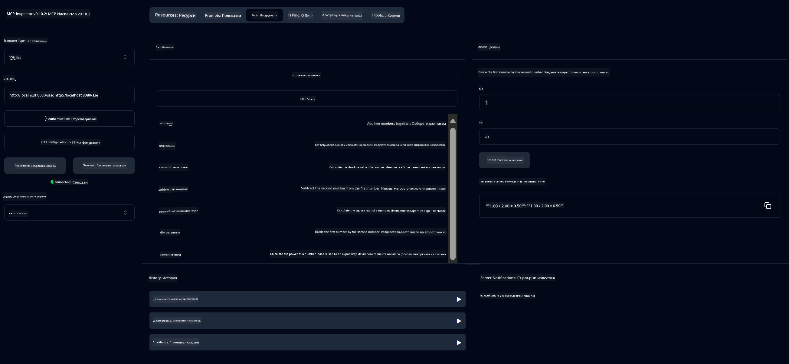

<!--
CO_OP_TRANSLATOR_METADATA:
{
  "original_hash": "7bf9a4a832911269a8bd0decb97ff36c",
  "translation_date": "2025-07-21T21:28:30+00:00",
  "source_file": "04-PracticalSamples/mcp/calculator/README.md",
  "language_code": "bg"
}
-->
# Основна услуга за калкулатор MCP

>**Забележка**: Тази глава включва [**Ръководство**](./TUTORIAL.md), което ще ви преведе през изпълнението на готовите примери.

Добре дошли в първото ви практическо запознаване с **Model Context Protocol (MCP)**! В предишните глави научихте основите на генеративния изкуствен интелект и настроихте вашата среда за разработка. Сега е време да създадете нещо практично.

Тази услуга за калкулатор демонстрира как AI моделите могат сигурно да взаимодействат с външни инструменти, използвайки MCP. Вместо да разчитаме на понякога ненадеждните математически способности на AI модела, ще ви покажем как да изградите стабилна система, в която AI може да извиква специализирани услуги за точни изчисления.

## Съдържание

- [Какво ще научите](../../../../../04-PracticalSamples/mcp/calculator)
- [Предварителни изисквания](../../../../../04-PracticalSamples/mcp/calculator)
- [Ключови концепции](../../../../../04-PracticalSamples/mcp/calculator)
- [Бърз старт](../../../../../04-PracticalSamples/mcp/calculator)
- [Налични операции на калкулатора](../../../../../04-PracticalSamples/mcp/calculator)
- [Клиенти за тестване](../../../../../04-PracticalSamples/mcp/calculator)
  - [1. Директен MCP клиент (SDKClient)](../../../../../04-PracticalSamples/mcp/calculator)
  - [2. Клиент с изкуствен интелект (LangChain4jClient)](../../../../../04-PracticalSamples/mcp/calculator)
- [MCP инспектор (уеб интерфейс)](../../../../../04-PracticalSamples/mcp/calculator)
  - [Стъпка по стъпка инструкции](../../../../../04-PracticalSamples/mcp/calculator)

## Какво ще научите

Работейки с този пример, ще разберете:
- Как да създавате услуги, съвместими с MCP, използвайки Spring Boot
- Разликата между директна комуникация по протокола и взаимодействие с изкуствен интелект
- Как AI моделите решават кога и как да използват външни инструменти
- Най-добри практики за изграждане на приложения с инструменти, поддържани от AI

Идеално за начинаещи, които искат да научат концепциите на MCP и са готови да изградят първата си интеграция с AI инструменти!

## Предварителни изисквания

- Java 21+
- Maven 3.6+
- **GitHub Token**: Необходим за клиента с изкуствен интелект. Ако все още не сте го настроили, вижте [Глава 2: Настройка на средата за разработка](../../../02-SetupDevEnvironment/README.md) за инструкции.

## Ключови концепции

**Model Context Protocol (MCP)** е стандартизиран начин за сигурно свързване на AI приложения с външни инструменти. Представете си го като "мост", който позволява на AI моделите да използват външни услуги като нашия калкулатор. Вместо AI моделът да се опитва сам да извършва изчисления (което може да е ненадеждно), той може да извика нашата услуга за калкулатор, за да получи точни резултати. MCP гарантира, че тази комуникация се осъществява безопасно и последователно.

**Server-Sent Events (SSE)** позволява комуникация в реално време между сървъра и клиентите. За разлика от традиционните HTTP заявки, при които изпращате заявка и чакате отговор, SSE позволява на сървъра непрекъснато да изпраща актуализации към клиента. Това е идеално за AI приложения, където отговорите могат да бъдат стриймвани или да отнемат време за обработка.

**AI инструменти и извикване на функции** позволяват на AI моделите автоматично да избират и използват външни функции (като операции на калкулатора) въз основа на потребителските заявки. Когато попитате "Колко е 15 + 27?", AI моделът разбира, че искате събиране, автоматично извиква нашия инструмент `add` с правилните параметри (15, 27) и връща резултата на естествен език. AI действа като интелигентен координатор, който знае кога и как да използва всеки инструмент.

## Бърз старт

### 1. Навигирайте до директорията на приложението за калкулатор
```bash
cd Generative-AI-for-beginners-java/04-PracticalSamples/mcp/calculator
```

### 2. Създайте и стартирайте
```bash
mvn clean install -DskipTests
java -jar target/calculator-server-0.0.1-SNAPSHOT.jar
```

### 3. Тествайте с клиенти
- **SDKClient**: Директно взаимодействие с MCP протокола
- **LangChain4jClient**: Взаимодействие на естествен език с изкуствен интелект (изисква GitHub токен)

## Налични операции на калкулатора

- `add(a, b)`, `subtract(a, b)`, `multiply(a, b)`, `divide(a, b)`
- `power(base, exponent)`, `squareRoot(number)`, `absolute(number)`
- `modulus(a, b)`, `help()`

## Клиенти за тестване

### 1. Директен MCP клиент (SDKClient)
Тества директна комуникация по MCP протокола. Стартирайте с:
```bash
mvn test-compile exec:java -Dexec.mainClass="com.microsoft.mcp.sample.client.SDKClient" -Dexec.classpathScope=test
```

### 2. Клиент с изкуствен интелект (LangChain4jClient)
Демонстрира взаимодействие на естествен език с GitHub модели. Изисква GitHub токен (вижте [Предварителни изисквания](../../../../../04-PracticalSamples/mcp/calculator)).

**Стартирайте:**
```bash
mvn test-compile exec:java -Dexec.mainClass="com.microsoft.mcp.sample.client.LangChain4jClient" -Dexec.classpathScope=test
```

## MCP инспектор (уеб интерфейс)

MCP инспектор предоставя визуален уеб интерфейс за тестване на вашата MCP услуга без писане на код. Идеално за начинаещи, които искат да разберат как работи MCP!

### Стъпка по стъпка инструкции:

1. **Стартирайте сървъра на калкулатора** (ако вече не е стартиран):
   ```bash
   java -jar target/calculator-server-0.0.1-SNAPSHOT.jar
   ```

2. **Инсталирайте и стартирайте MCP инспектора** в нов терминал:
   ```bash
   npx @modelcontextprotocol/inspector
   ```

3. **Отворете уеб интерфейса**:
   - Потърсете съобщение като "Inspector running at http://localhost:6274"
   - Отворете този URL в уеб браузъра си

4. **Свържете се с вашата услуга за калкулатор**:
   - В уеб интерфейса задайте типа транспорт на "SSE"
   - Задайте URL на: `http://localhost:8080/sse`
   - Натиснете бутона "Connect"

5. **Разгледайте наличните инструменти**:
   - Натиснете "List Tools", за да видите всички операции на калкулатора
   - Ще видите функции като `add`, `subtract`, `multiply` и други

6. **Тествайте операция на калкулатора**:
   - Изберете инструмент (например "add")
   - Въведете параметри (например `a: 15`, `b: 27`)
   - Натиснете "Run Tool"
   - Вижте резултата, върнат от вашата MCP услуга!

Този визуален подход ви помага да разберете точно как работи MCP комуникацията, преди да изградите свои собствени клиенти.



---
**Референция:** [MCP Server Boot Starter Docs](https://docs.spring.io/spring-ai/reference/api/mcp/mcp-server-boot-starter-docs.html)

**Отказ от отговорност**:  
Този документ е преведен с помощта на AI услуга за превод [Co-op Translator](https://github.com/Azure/co-op-translator). Въпреки че се стремим към точност, моля, имайте предвид, че автоматизираните преводи може да съдържат грешки или неточности. Оригиналният документ на неговия роден език трябва да се счита за авторитетен източник. За критична информация се препоръчва професионален човешки превод. Не носим отговорност за недоразумения или погрешни интерпретации, произтичащи от използването на този превод.