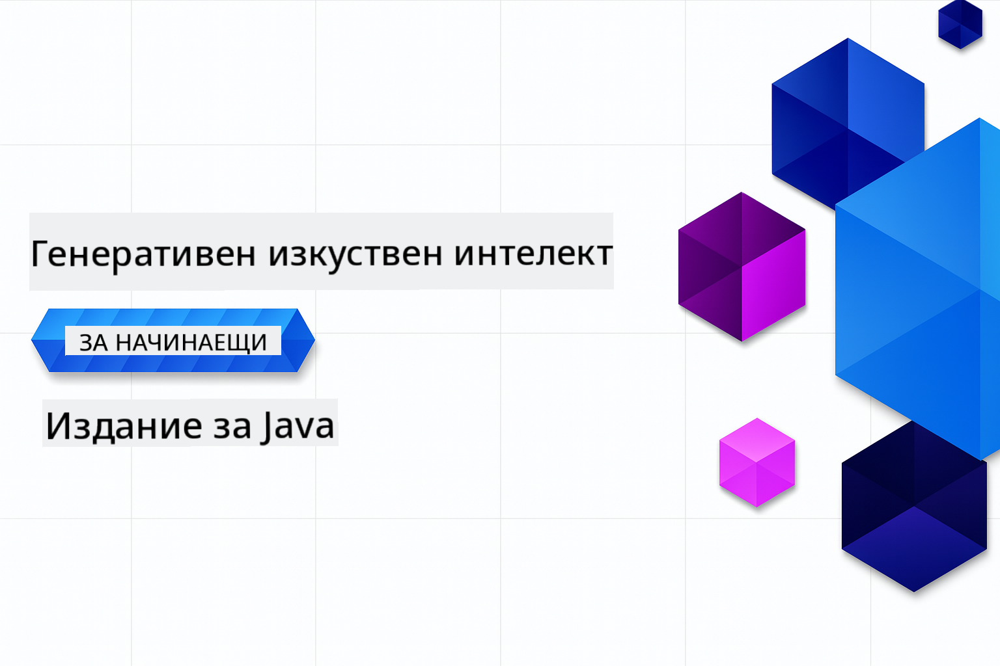

<!--
CO_OP_TRANSLATOR_METADATA:
{
  "original_hash": "2ee0f50497c11d1941347ac61fb017a9",
  "translation_date": "2025-07-21T20:31:46+00:00",
  "source_file": "README.md",
  "language_code": "bg"
}
-->
# Генеративен AI за начинаещи - Java издание

> **NOTE: Бърз старт**: Целият курс може да се изпълни онлайн - не е необходима локална настройка!
1. Направете fork на това хранилище във вашия GitHub акаунт
2. Кликнете **Code** → **Codespaces** таб → **...** → **New with options...**
3. Използвайте настройките по подразбиране – това ще избере контейнера за разработка, създаден за този курс
4. Кликнете **Create codespace**
5. Изчакайте около 2 минути, докато средата бъде готова
6. Продължете директно към [Създаване на вашия GitHub Models Token](./02-SetupDevEnvironment/README.md#step-2-create-a-github-personal-access-token)

## Поддръжка на много езици

### Поддържано чрез GitHub Action (Автоматизирано и винаги актуално)

[French](../fr/README.md) | [Spanish](../es/README.md) | [German](../de/README.md) | [Russian](../ru/README.md) | [Arabic](../ar/README.md) | [Persian (Farsi)](../fa/README.md) | [Urdu](../ur/README.md) | [Chinese (Simplified)](../zh/README.md) | [Chinese (Traditional, Macau)](../mo/README.md) | [Chinese (Traditional, Hong Kong)](../hk/README.md) | [Chinese (Traditional, Taiwan)](../tw/README.md) | [Japanese](../ja/README.md) | [Korean](../ko/README.md) | [Hindi](../hi/README.md) | [Bengali](../bn/README.md) | [Marathi](../mr/README.md) | [Nepali](../ne/README.md) | [Punjabi (Gurmukhi)](../pa/README.md) | [Portuguese (Portugal)](../pt/README.md) | [Portuguese (Brazil)](../br/README.md) | [Italian](../it/README.md) | [Polish](../pl/README.md) | [Turkish](../tr/README.md) | [Greek](../el/README.md) | [Thai](../th/README.md) | [Swedish](../sv/README.md) | [Danish](../da/README.md) | [Norwegian](../no/README.md) | [Finnish](../fi/README.md) | [Dutch](../nl/README.md) | [Hebrew](../he/README.md) | [Vietnamese](../vi/README.md) | [Indonesian](../id/README.md) | [Malay](../ms/README.md) | [Tagalog (Filipino)](../tl/README.md) | [Swahili](../sw/README.md) | [Hungarian](../hu/README.md) | [Czech](../cs/README.md) | [Slovak](../sk/README.md) | [Romanian](../ro/README.md) | [Bulgarian](./README.md) | [Serbian (Cyrillic)](../sr/README.md) | [Croatian](../hr/README.md) | [Slovenian](../sl/README.md) | [Ukrainian](../uk/README.md) | [Burmese (Myanmar)](../my/README.md)

## Структура на курса и учебен път

**Време за ангажираност**: Настройката на средата отнема 2 минути, а практическите уроци изискват 1-3 часа всеки, в зависимост от дълбочината на изследване.

### **Глава 1: Въведение в Генеративния AI**
- **Основни концепции**: Разбиране на големите езикови модели, токени, вграждания и AI възможности
- **Java AI екосистема**: Преглед на Spring AI и OpenAI SDKs
- **Протокол за контекст на модела**: Въведение в MCP и неговата роля в комуникацията на AI агентите
- **Практически приложения**: Реални сценарии, включително чатботове и генериране на съдържание
- **[→ Започнете Глава 1](./01-IntroToGenAI/README.md)**

### **Глава 2: Настройка на среда за разработка**
- **Конфигурация за множество доставчици**: Настройка на GitHub Models, Azure OpenAI и OpenAI Java SDK интеграции
- **Spring Boot + Spring AI**: Най-добри практики за разработка на корпоративни AI приложения
- **GitHub Models**: Безплатен достъп до AI модели за прототипиране и обучение (без необходимост от кредитна карта)
- **Инструменти за разработка**: Конфигурация на Docker контейнери, VS Code и GitHub Codespaces
- **[→ Започнете Глава 2](./02-SetupDevEnvironment/README.md)**

### **Глава 3: Основни техники за Генеративен AI**
- **Инженеринг на подканите**: Техники за оптимални отговори от AI моделите
- **Вграждания и векторни операции**: Имплементация на семантично търсене и съвпадение по сходство
- **Генериране с допълнено извличане (RAG)**: Комбиниране на AI с ваши собствени източници на данни
- **Извикване на функции**: Разширяване на AI възможностите с персонализирани инструменти и плъгини
- **[→ Започнете Глава 3](./03-CoreGenerativeAITechniques/README.md)**

### **Глава 4: Практически приложения и проекти**
- **Генератор на истории за домашни любимци** (`petstory/`): Генериране на креативно съдържание с GitHub Models
- **Foundry Local Demo** (`foundrylocal/`): Локална интеграция на AI модел с OpenAI Java SDK
- **MCP Калкулатор услуга** (`mcp/calculator/`): Основна имплементация на Протокол за контекст на модела със Spring AI
- **[→ Започнете Глава 4](./04-PracticalSamples/README.md)**

### **Глава 5: Отговорна разработка на AI**
- **Безопасност на GitHub Models**: Тестване на вградени филтри за съдържание и механизми за безопасност
- **Демонстрация на отговорен AI**: Практически пример, показващ как работят AI филтрите за безопасност
- **Най-добри практики**: Основни насоки за етично разработване и внедряване на AI
- **[→ Започнете Глава 5](./05-ResponsibleGenAI/README.md)**

## Допълнителни ресурси

- [AI Agents For Beginners](https://github.com/microsoft/ai-agents-for-beginners)
- [Generative AI for Beginners using .NET](https://github.com/microsoft/Generative-AI-for-beginners-dotnet)
- [Generative AI for Beginners using JavaScript](https://github.com/microsoft/generative-ai-with-javascript)
- [Generative AI for Beginners](https://github.com/microsoft/generative-ai-for-beginners)
- [ML for Beginners](https://aka.ms/ml-beginners)
- [Data Science for Beginners](https://aka.ms/datascience-beginners)
- [AI for Beginners](https://aka.ms/ai-beginners)
- [Cybersecurity for Beginners](https://github.com/microsoft/Security-101)
- [Web Dev for Beginners](https://aka.ms/webdev-beginners)
- [IoT for Beginners](https://aka.ms/iot-beginners)
- [XR Development for Beginners](https://github.com/microsoft/xr-development-for-beginners)
- [Mastering GitHub Copilot for AI Paired Programming](https://aka.ms/GitHubCopilotAI)
- [Mastering GitHub Copilot for C#/.NET Developers](https://github.com/microsoft/mastering-github-copilot-for-dotnet-csharp-developers)
- [Choose Your Own Copilot Adventure](https://github.com/microsoft/CopilotAdventures)
- [RAG Chat App with Azure AI Services](https://github.com/Azure-Samples/azure-search-openai-demo-java)

**Отказ от отговорност**:  
Този документ е преведен с помощта на AI услуга за превод [Co-op Translator](https://github.com/Azure/co-op-translator). Въпреки че се стремим към точност, моля, имайте предвид, че автоматизираните преводи може да съдържат грешки или неточности. Оригиналният документ на неговия роден език трябва да се счита за авторитетен източник. За критична информация се препоръчва професионален човешки превод. Ние не носим отговорност за недоразумения или погрешни интерпретации, произтичащи от използването на този превод.