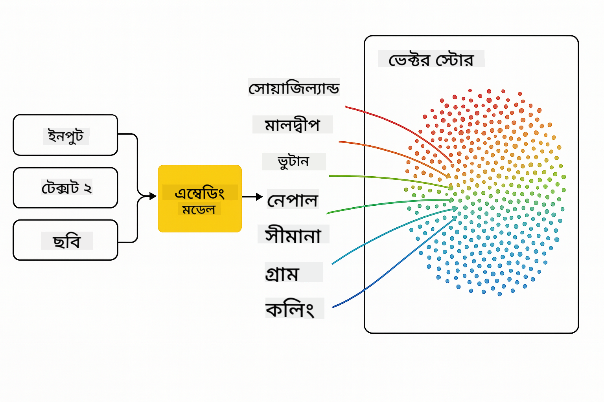
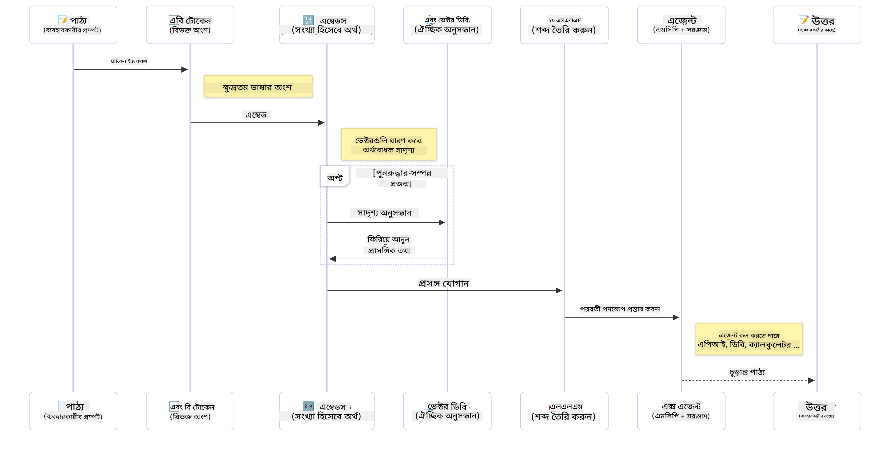

<!--
CO_OP_TRANSLATOR_METADATA:
{
  "original_hash": "75bfb080ca725e8a9aa9c80cae25fba1",
  "translation_date": "2025-07-29T08:42:52+00:00",
  "source_file": "01-IntroToGenAI/README.md",
  "language_code": "bn"
}
-->
# জেনারেটিভ এআই - জাভা সংস্করণে পরিচিতি

## আপনি কী শিখবেন

- **জেনারেটিভ এআই এর মৌলিক ধারণা** যেমন LLMs, প্রম্পট ইঞ্জিনিয়ারিং, টোকেন, এমবেডিং এবং ভেক্টর ডেটাবেস
- **জাভা এআই ডেভেলপমেন্ট টুলস তুলনা** যেমন Azure OpenAI SDK, Spring AI, এবং OpenAI Java SDK
- **মডেল কনটেক্সট প্রোটোকল** এবং এআই এজেন্ট যোগাযোগে এর ভূমিকা আবিষ্কার করুন

## বিষয়সূচি

- [পরিচিতি](../../../01-IntroToGenAI)
- [জেনারেটিভ এআই ধারণাগুলোর দ্রুত পুনরালোচনা](../../../01-IntroToGenAI)
- [প্রম্পট ইঞ্জিনিয়ারিং পর্যালোচনা](../../../01-IntroToGenAI)
- [টোকেন, এমবেডিং এবং এজেন্ট](../../../01-IntroToGenAI)
- [জাভার জন্য এআই ডেভেলপমেন্ট টুলস এবং লাইব্রেরি](../../../01-IntroToGenAI)
  - [OpenAI Java SDK](../../../01-IntroToGenAI)
  - [Spring AI](../../../01-IntroToGenAI)
  - [Azure OpenAI Java SDK](../../../01-IntroToGenAI)
- [সারাংশ](../../../01-IntroToGenAI)
- [পরবর্তী পদক্ষেপ](../../../01-IntroToGenAI)

## পরিচিতি

জেনারেটিভ এআই ফর বিগিনার্স - জাভা সংস্করণের প্রথম অধ্যায়ে আপনাকে স্বাগতম! এই মৌলিক পাঠে জেনারেটিভ এআই এর মূল ধারণাগুলো এবং জাভা ব্যবহার করে কীভাবে এগুলোর সাথে কাজ করবেন তা পরিচিত করা হয়েছে। আপনি এআই অ্যাপ্লিকেশনের গুরুত্বপূর্ণ উপাদানগুলো সম্পর্কে শিখবেন, যেমন লার্জ ল্যাঙ্গুয়েজ মডেল (LLMs), টোকেন, এমবেডিং এবং এআই এজেন্ট। এছাড়াও, আমরা এই কোর্সে ব্যবহৃত প্রধান জাভা টুলিংগুলো অন্বেষণ করব।

### জেনারেটিভ এআই ধারণাগুলোর দ্রুত পুনরালোচনা

জেনারেটিভ এআই এমন এক ধরনের কৃত্রিম বুদ্ধিমত্তা যা ডেটা থেকে শেখা প্যাটার্ন এবং সম্পর্কের ভিত্তিতে নতুন কন্টেন্ট তৈরি করে, যেমন টেক্সট, ছবি বা কোড। জেনারেটিভ এআই মডেলগুলো মানবসদৃশ প্রতিক্রিয়া তৈরি করতে পারে, প্রসঙ্গ বুঝতে পারে এবং কখনও কখনও এমন কন্টেন্ট তৈরি করতে পারে যা মানবসদৃশ মনে হয়।

আপনার জাভা এআই অ্যাপ্লিকেশন তৈরি করার সময়, আপনি **জেনারেটিভ এআই মডেল** ব্যবহার করবেন কন্টেন্ট তৈরি করতে। জেনারেটিভ এআই মডেলের কিছু ক্ষমতা অন্তর্ভুক্ত:

- **টেক্সট জেনারেশন**: চ্যাটবট, কন্টেন্ট এবং টেক্সট সম্পূর্ণ করার জন্য মানবসদৃশ টেক্সট তৈরি করা।
- **ইমেজ জেনারেশন এবং বিশ্লেষণ**: বাস্তবসম্মত ছবি তৈরি করা, ফটো উন্নত করা এবং অবজেক্ট সনাক্ত করা।
- **কোড জেনারেশন**: কোড স্নিপেট বা স্ক্রিপ্ট লেখা।

বিভিন্ন কাজের জন্য অপ্টিমাইজড নির্দিষ্ট ধরনের মডেল রয়েছে। উদাহরণস্বরূপ, **ছোট ল্যাঙ্গুয়েজ মডেল (SLMs)** এবং **লার্জ ল্যাঙ্গুয়েজ মডেল (LLMs)** উভয়ই টেক্সট জেনারেশন পরিচালনা করতে পারে, যেখানে LLMs সাধারণত জটিল কাজের জন্য ভালো পারফরম্যান্স প্রদান করে। ইমেজ-সম্পর্কিত কাজের জন্য, আপনি বিশেষ ভিশন মডেল বা মাল্টি-মডাল মডেল ব্যবহার করবেন।

অবশ্যই, এই মডেলগুলোর প্রতিক্রিয়া সব সময় নিখুঁত হয় না। আপনি হয়তো শুনেছেন যে মডেলগুলো "হ্যালুসিনেট" করে বা ভুল তথ্য তৈরি করে যা আত্মবিশ্বাসের সাথে উপস্থাপন করা হয়। তবে আপনি মডেলকে স্পষ্ট নির্দেশনা এবং প্রসঙ্গ প্রদান করে ভালো প্রতিক্রিয়া তৈরি করতে সাহায্য করতে পারেন। এখানেই **প্রম্পট ইঞ্জিনিয়ারিং** গুরুত্বপূর্ণ হয়ে ওঠে।

#### প্রম্পট ইঞ্জিনিয়ারিং পর্যালোচনা

প্রম্পট ইঞ্জিনিয়ারিং হল কার্যকর ইনপুট ডিজাইন করার অনুশীলন যা এআই মডেলকে কাঙ্ক্ষিত আউটপুটের দিকে পরিচালিত করে। এটি অন্তর্ভুক্ত:

- **স্পষ্টতা**: নির্দেশনাগুলো স্পষ্ট এবং দ্ব্যর্থহীন করা।
- **প্রসঙ্গ**: প্রয়োজনীয় পটভূমি তথ্য প্রদান করা।
- **সীমাবদ্ধতা**: কোনো সীমাবদ্ধতা বা ফরম্যাট নির্দিষ্ট করা।

প্রম্পট ইঞ্জিনিয়ারিংয়ের কিছু সেরা অনুশীলন অন্তর্ভুক্ত প্রম্পট ডিজাইন, স্পষ্ট নির্দেশনা, কাজের বিশ্লেষণ, ওয়ান-শট এবং ফিউ-শট লার্নিং, এবং প্রম্পট টিউনিং। আপনার নির্দিষ্ট ব্যবহার ক্ষেত্রে কী কাজ করে তা খুঁজে বের করার জন্য বিভিন্ন প্রম্পট পরীক্ষা করা অপরিহার্য।

অ্যাপ্লিকেশন তৈরি করার সময়, আপনি বিভিন্ন প্রম্পট টাইপ নিয়ে কাজ করবেন:
- **সিস্টেম প্রম্পট**: মডেলের আচরণের জন্য বেস নিয়ম এবং প্রসঙ্গ সেট করে
- **ইউজার প্রম্পট**: আপনার অ্যাপ্লিকেশন ব্যবহারকারীদের ইনপুট ডেটা
- **অ্যাসিস্ট্যান্ট প্রম্পট**: সিস্টেম এবং ইউজার প্রম্পটের ভিত্তিতে মডেলের প্রতিক্রিয়া

> **আরও জানুন**: [জেনারেটিভ এআই ফর বিগিনার্স কোর্সের প্রম্পট ইঞ্জিনিয়ারিং অধ্যায়ে](https://github.com/microsoft/generative-ai-for-beginners/tree/main/04-prompt-engineering-fundamentals) প্রম্পট ইঞ্জিনিয়ারিং সম্পর্কে আরও জানুন।

#### টোকেন, এমবেডিং এবং এজেন্ট

জেনারেটিভ এআই মডেলের সাথে কাজ করার সময়, আপনি **টোকেন**, **এমবেডিং**, **এজেন্ট**, এবং **মডেল কনটেক্সট প্রোটোকল (MCP)** এর মতো শব্দগুলোর মুখোমুখি হবেন। এখানে এই ধারণাগুলোর বিস্তারিত বিবরণ:

- **টোকেন**: টোকেন হল মডেলের মধ্যে টেক্সটের ক্ষুদ্রতম একক। এগুলো শব্দ, অক্ষর বা সাবওয়ার্ড হতে পারে। টোকেন টেক্সট ডেটাকে এমন ফরম্যাটে উপস্থাপন করতে ব্যবহৃত হয় যা মডেল বুঝতে পারে। উদাহরণস্বরূপ, "The quick brown fox jumped over the lazy dog" বাক্যটি ["The", " quick", " brown", " fox", " jumped", " over", " the", " lazy", " dog"] বা ["The", " qu", "ick", " br", "own", " fox", " jump", "ed", " over", " the", " la", "zy", " dog"] হিসাবে টোকেনাইজড হতে পারে টোকেনাইজেশন কৌশলের উপর ভিত্তি করে।

টোকেনাইজেশন হল টেক্সটকে এই ক্ষুদ্র এককে বিভক্ত করার প্রক্রিয়া। এটি গুরুত্বপূর্ণ কারণ মডেলগুলো টোকেনের উপর কাজ করে, কাঁচা টেক্সটের উপর নয়। প্রম্পটে টোকেনের সংখ্যা মডেলের প্রতিক্রিয়ার দৈর্ঘ্য এবং গুণমানকে প্রভাবিত করে, কারণ মডেলের প্রসঙ্গ উইন্ডোর জন্য টোকেন সীমা থাকে (যেমন GPT-4o এর মোট প্রসঙ্গের জন্য 128K টোকেন, ইনপুট এবং আউটপুট উভয়ই অন্তর্ভুক্ত)।

  জাভাতে, আপনি OpenAI SDK এর মতো লাইব্রেরি ব্যবহার করে টোকেনাইজেশন স্বয়ংক্রিয়ভাবে পরিচালনা করতে পারেন যখন এআই মডেলে অনুরোধ পাঠানো হয়।

- **এমবেডিং**: এমবেডিং হল টোকেনের ভেক্টর উপস্থাপন যা অর্থবোধক সম্পর্ক ধারণ করে। এগুলো সংখ্যাসূচক উপস্থাপন (সাধারণত ফ্লোটিং-পয়েন্ট সংখ্যার অ্যারে) যা মডেলকে শব্দগুলোর মধ্যে সম্পর্ক বুঝতে এবং প্রসঙ্গগতভাবে প্রাসঙ্গিক প্রতিক্রিয়া তৈরি করতে সক্ষম করে। অনুরূপ শব্দগুলোর অনুরূপ এমবেডিং থাকে, যা মডেলকে সমার্থক শব্দ এবং অর্থবোধক সম্পর্ক বুঝতে সাহায্য করে।

  জাভাতে, আপনি OpenAI SDK বা এমবেডিং জেনারেশনের সমর্থনকারী অন্যান্য লাইব্রেরি ব্যবহার করে এমবেডিং তৈরি করতে পারেন। এই এমবেডিংগুলো সেমান্টিক সার্চের মতো কাজের জন্য অপরিহার্য, যেখানে আপনি অর্থের ভিত্তিতে অনুরূপ কন্টেন্ট খুঁজতে চান, সঠিক টেক্সট ম্যাচের পরিবর্তে।

- **ভেক্টর ডেটাবেস**: ভেক্টর ডেটাবেস হল এমবেডিংয়ের জন্য অপ্টিমাইজড বিশেষ স্টোরেজ সিস্টেম। এগুলো দক্ষ সাদৃশ্য অনুসন্ধান সক্ষম করে এবং রিট্রিভাল-অগমেন্টেড জেনারেশন (RAG) প্যাটার্নের জন্য গুরুত্বপূর্ণ যেখানে আপনি সেমান্টিক সাদৃশ্যের ভিত্তিতে বড় ডেটাসেট থেকে প্রাসঙ্গিক তথ্য খুঁজে পেতে চান।

> **নোট**: এই কোর্সে আমরা ভেক্টর ডেটাবেস কভার করব না, তবে এগুলো উল্লেখযোগ্য কারণ এগুলো বাস্তব জীবনের অ্যাপ্লিকেশনে সাধারণত ব্যবহৃত হয়।

- **এজেন্ট এবং MCP**: এআই উপাদানগুলো যা মডেল, টুল এবং বাহ্যিক সিস্টেমের সাথে স্বয়ংক্রিয়ভাবে যোগাযোগ করে। মডেল কনটেক্সট প্রোটোকল (MCP) এজেন্টদের বাহ্যিক ডেটা সোর্স এবং টুলগুলিতে নিরাপদে অ্যাক্সেস করার জন্য একটি মানক উপায় প্রদান করে। আমাদের [MCP ফর বিগিনার্স](https://github.com/microsoft/mcp-for-beginners) কোর্সে আরও জানুন।

জাভা এআই অ্যাপ্লিকেশনে, আপনি টোকেন ব্যবহার করবেন টেক্সট প্রসেসিংয়ের জন্য, এমবেডিং ব্যবহার করবেন সেমান্টিক সার্চ এবং RAG এর জন্য, ভেক্টর ডেটাবেস ব্যবহার করবেন ডেটা পুনরুদ্ধারের জন্য, এবং MCP সহ এজেন্ট ব্যবহার করবেন বুদ্ধিমান, টুল-ব্যবহারকারী সিস্টেম তৈরি করতে।

### জাভার জন্য এআই ডেভেলপমেন্ট টুলস এবং লাইব্রেরি

জাভা এআই ডেভেলপমেন্টের জন্য চমৎকার টুলিং অফার করে। এই কোর্সে আমরা তিনটি প্রধান লাইব্রেরি অন্বেষণ করব - OpenAI Java SDK, Azure OpenAI SDK, এবং Spring AI।

এখানে একটি দ্রুত রেফারেন্স টেবিল রয়েছে যা দেখায় কোন SDK কোন অধ্যায়ের উদাহরণে ব্যবহৃত হয়েছে:

| অধ্যায় | নমুনা | SDK |
|---------|--------|-----|
| 02-SetupDevEnvironment | github-models | OpenAI Java SDK |
| 02-SetupDevEnvironment | basic-chat-azure | Spring AI Azure OpenAI |
| 03-CoreGenerativeAITechniques | examples | Azure OpenAI SDK |
| 04-PracticalSamples | petstory | OpenAI Java SDK |
| 04-PracticalSamples | foundrylocal | OpenAI Java SDK |
| 04-PracticalSamples | calculator | Spring AI MCP SDK + LangChain4j |

**SDK ডকুমেন্টেশন লিঙ্ক:**
- [Azure OpenAI Java SDK](https://github.com/Azure/azure-sdk-for-java/tree/azure-ai-openai_1.0.0-beta.16/sdk/openai/azure-ai-openai)
- [Spring AI](https://docs.spring.io/spring-ai/reference/)
- [OpenAI Java SDK](https://github.com/openai/openai-java)
- [LangChain4j](https://docs.langchain4j.dev/)

#### OpenAI Java SDK

OpenAI SDK হল OpenAI API এর জন্য অফিসিয়াল জাভা লাইব্রেরি। এটি OpenAI এর মডেলের সাথে যোগাযোগের জন্য একটি সহজ এবং সামঞ্জস্যপূর্ণ ইন্টারফেস প্রদান করে, যা জাভা অ্যাপ্লিকেশনে এআই ক্ষমতা সংহত করা সহজ করে তোলে। অধ্যায় ২ এর GitHub Models উদাহরণ, অধ্যায় ৪ এর Pet Story অ্যাপ্লিকেশন এবং Foundry Local উদাহরণ OpenAI SDK পদ্ধতি প্রদর্শন করে।

#### Spring AI

Spring AI হল একটি ব্যাপক ফ্রেমওয়ার্ক যা Spring অ্যাপ্লিকেশনে এআই ক্ষমতা নিয়ে আসে, বিভিন্ন এআই প্রদানকারীর মধ্যে একটি সামঞ্জস্যপূর্ণ অ্যাবস্ট্রাকশন লেয়ার প্রদান করে। এটি Spring ইকোসিস্টেমের সাথে নির্বিঘ্নে সংহত হয়, যা এআই ক্ষমতা প্রয়োজন এমন এন্টারপ্রাইজ জাভা অ্যাপ্লিকেশনের জন্য আদর্শ পছন্দ।

Spring AI এর শক্তি এর Spring ইকোসিস্টেমের সাথে নির্বিঘ্ন সংহতিতে নিহিত, যা পরিচিত Spring প্যাটার্ন যেমন ডিপেনডেন্সি ইনজেকশন, কনফিগারেশন ম্যানেজমেন্ট এবং টেস্টিং ফ্রেমওয়ার্ক ব্যবহার করে প্রোডাকশন-রেডি এআই অ্যাপ্লিকেশন তৈরি করা সহজ করে তোলে। আপনি অধ্যায় ২ এবং ৪ এ Spring AI ব্যবহার করবেন OpenAI এবং Model Context Protocol (MCP) Spring AI লাইব্রেরি উভয়ই ব্যবহার করে অ্যাপ্লিকেশন তৈরি করতে।

##### মডেল কনটেক্সট প্রোটোকল (MCP)

[মডেল কনটেক্সট প্রোটোকল (MCP)](https://modelcontextprotocol.io/) একটি উদীয়মান মান যা এআই অ্যাপ্লিকেশনকে বাহ্যিক ডেটা সোর্স এবং টুলগুলির সাথে নিরাপদে যোগাযোগ করতে সক্ষম করে। MCP এআই মডেলকে প্রসঙ্গগত তথ্য অ্যাক্সেস এবং আপনার অ্যাপ্লিকেশনে অ্যাকশন সম্পাদন করার জন্য একটি মানক উপায় প্রদান করে।

অধ্যায় ৪ এ, আপনি একটি সহজ MCP ক্যালকুলেটর সার্ভিস তৈরি করবেন যা Spring AI এর সাথে মডেল কনটেক্সট প্রোটোকলের মৌলিক বিষয়গুলো প্রদর্শন করে, দেখাবে কীভাবে মৌলিক টুল ইন্টিগ্রেশন এবং সার্ভিস আর্কিটেকচার তৈরি করতে হয়।

#### Azure OpenAI Java SDK

Azure OpenAI ক্লায়েন্ট লাইব্রেরি জাভার জন্য OpenAI এর REST API এর একটি অভিযোজন যা একটি পরিচিত ইন্টারফেস এবং Azure SDK ইকোসিস্টেমের সাথে সংহতকরণ প্রদান করে। অধ্যায় ৩ এ, আপনি Azure OpenAI SDK ব্যবহার করে অ্যাপ্লিকেশন তৈরি করবেন, যার মধ্যে রয়েছে চ্যাট অ্যাপ্লিকেশন, ফাংশন কলিং এবং RAG (Retrieval-Augmented Generation) প্যাটার্ন।

> নোট: Azure OpenAI SDK OpenAI Java SDK এর তুলনায় বৈশিষ্ট্যের ক্ষেত্রে পিছিয়ে রয়েছে, তাই ভবিষ্যতের প্রকল্পের জন্য OpenAI Java SDK ব্যবহার করার কথা বিবেচনা করুন।

## সারাংশ

এটি ছিল ভিত্তি! আপনি এখন বুঝতে পেরেছেন:

- জেনারেটিভ এআই এর মূল ধারণাগুলো - LLMs এবং প্রম্পট ইঞ্জিনিয়ারিং থেকে টোকেন, এমবেডিং এবং ভেক্টর ডেটাবেস পর্যন্ত
- জাভা এআই ডেভেলপমেন্টের জন্য আপনার টুলকিট অপশন: Azure OpenAI SDK, Spring AI, এবং OpenAI Java SDK
- মডেল কনটেক্সট প্রোটোকল কী এবং এটি কীভাবে এআই এজেন্টদের বাহ্যিক টুলের সাথে কাজ করতে সক্ষম করে

## পরবর্তী পদক্ষেপ

[অধ্যায় ২: ডেভেলপমেন্ট এনভায়রনমেন্ট সেটআপ](../02-SetupDevEnvironment/README.md)

**অস্বীকৃতি**:  
এই নথিটি AI অনুবাদ পরিষেবা [Co-op Translator](https://github.com/Azure/co-op-translator) ব্যবহার করে অনুবাদ করা হয়েছে। আমরা যথাসম্ভব সঠিক অনুবাদের চেষ্টা করি, তবে অনুগ্রহ করে মনে রাখবেন যে স্বয়ংক্রিয় অনুবাদে ত্রুটি বা অসঙ্গতি থাকতে পারে। নথিটির মূল ভাষায় থাকা সংস্করণটিকেই প্রামাণিক উৎস হিসেবে বিবেচনা করা উচিত। গুরুত্বপূর্ণ তথ্যের জন্য, পেশাদার মানব অনুবাদ ব্যবহার করার পরামর্শ দেওয়া হচ্ছে। এই অনুবাদ ব্যবহারের ফলে সৃষ্ট কোনো ভুল বোঝাবুঝি বা ভুল ব্যাখ্যার জন্য আমরা দায়ী নই।