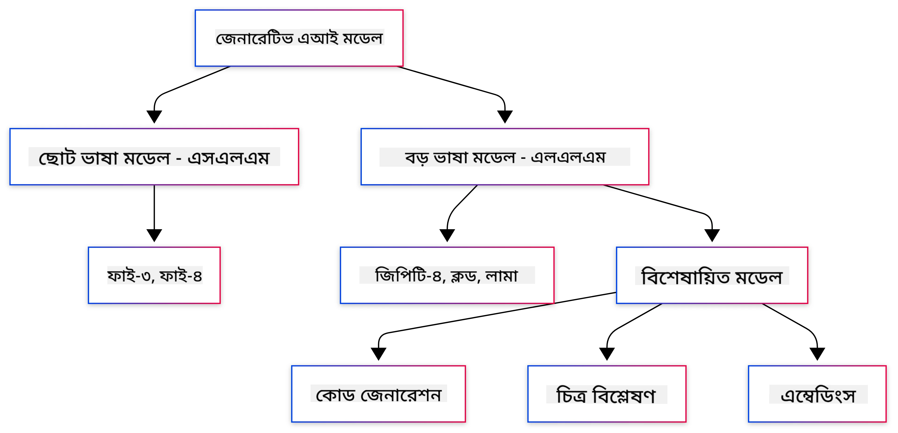
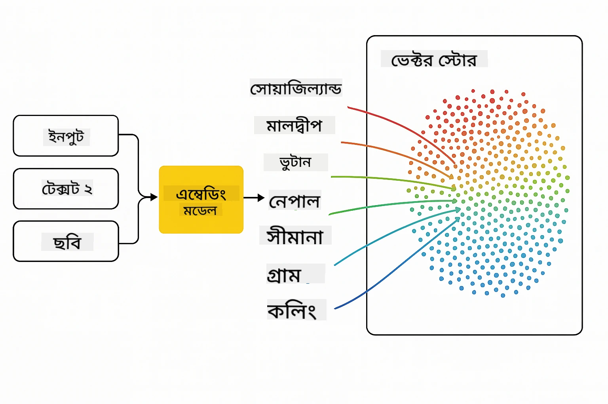
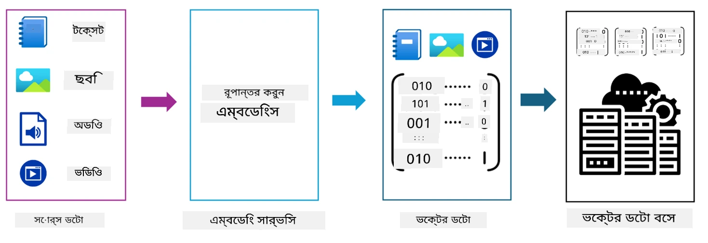
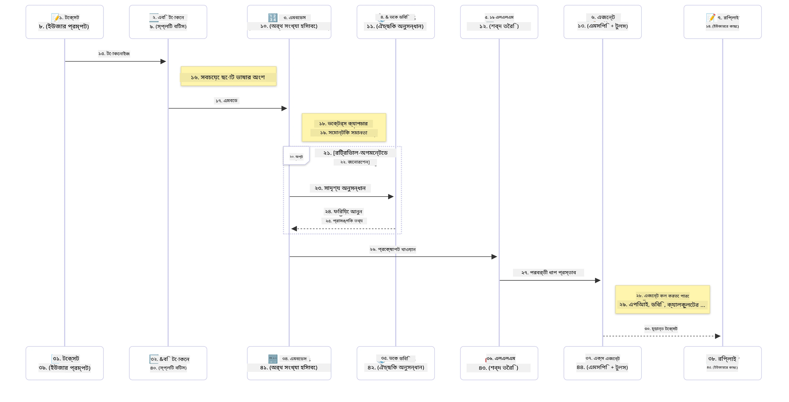

# Introduction to Generative AI - Java Edition

> **Video**: [এই পাঠের জন্য YouTube-এ ভিডিও ওভারভিউ দেখুন।](https://www.youtube.com/watch?v=XH46tGp_eSw) আপনি উপরের থাম্বনেইল ইমেজেও ক্লিক করতে পারেন।

## What You'll Learn

- **Generative AI এর মূল বিষয়াদি** যেমন LLMs, প্রম্পট ইঞ্জিনিয়ারিং, টোকেন, এমবেডিংস, এবং ভেক্টর ডেটাবেস
- **Java AI ডেভেলপমেন্ট টুলসের তুলনা** যেমন Azure OpenAI SDK, Spring AI, এবং OpenAI Java SDK
- **Model Context Protocol-এ খোঁজ** এবং AI এজেন্ট যোগাযোগে এর ভূমিকা

## Table of Contents

- [Introduction](#introduction)
- [A quick refresh on Generative AI concepts](#a-quick-refresh-on-generative-ai-concepts)
- [Prompt engineering review](#prompt-engineering-review)
- [Tokens, embeddings, and agents](#tokens-embeddings-and-agents)
- [AI Development Tools and Libraries for Java](#ai-development-tools-and-libraries-for-java)
  - [OpenAI Java SDK](#openai-java-sdk)
  - [Spring AI](#spring-ai)
  - [Azure OpenAI Java SDK](#azure-openai-java-sdk)
- [Summary](#summary)
- [Next Steps](#next-steps)

## Introduction

Generative AI for Beginners - Java Edition-এর প্রথম অধ্যায়ে আপনাকে স্বাগতম! এই মূল পাঠে আপনাকে generative AI-এর কেন্দ্রীয় ধারণাগুলো এবং সেগুলো কীভাবে Java ব্যবহার করে কাজ করতে হয় তা পরিচয় করিয়ে দেওয়া হবে। আপনি AI অ্যাপ্লিকেশনের মৌলিক বিল্ডিং ব্লক যেমন, Large Language Models (LLMs), টোকেন, এমবেডিংস, এবং AI এজেন্ট সম্পর্কে শিখবেন। এছাড়াও আমরা মূল Java টুলিংগুলো অন্বেষণ করব যা এই কোর্সে আপনি ব্যবহার করবেন।

### A quick refresh on Generative AI concepts

Generative AI হলো একটি ধরনের কৃত্রিম বুদ্ধিমত্তা যা নতুন কনটেন্ট তৈরি করে, যেমন টেক্সট, ছবি, বা কোড, ডেটা থেকে শেখা প্যাটার্ন এবং সম্পর্কের ভিত্তিতে। Generative AI মডেলগুলো মানুষের মত সাড়া দিতে পারে, প্রসঙ্গ বুঝতে পারে, এবং কখনও কখনও এমন কনটেন্ট তৈরি করে যা মানবদৃষ্টিতে বাস্তবসম্মত মনে হয়।

Java AI অ্যাপ্লিকেশন তৈরি করার সময়, আপনি **generative AI মডেল** ব্যবহার করে কনটেন্ট তৈরি করবেন। generative AI মডেলের কিছু ক্ষমতা হলো:

- **টেক্সট জেনারেশন**: চ্যাটবট, কনটেন্ট, এবং টেক্সট সম্পূর্ণ করার জন্য মানুষের মত টেক্সট তৈরি করা।
- **ইমেজ জেনারেশন এবং বিশ্লেষণ**: বাস্তবসম্মত ছবি তৈরি, ছবি উন্নত করা, এবং বস্তুর সনাক্তকরণ।
- **কোড জেনারেশন**: কোড স্নিপেট বা স্ক্রিপ্ট লেখা।

বিভিন্ন কাজের জন্য আলাদা ধরনের মডেল অপটিমাইজড। উদাহরণস্বরূপ, **Small Language Models (SLMs)** এবং **Large Language Models (LLMs)** উভয়ে টেক্সট জেনারেশনের কাজ চালাতে পারে, যেখানে LLM গুলো জটিল কাজের জন্য সাধারণত ভালো পারফরম্যান্স দেয়। ছবি সম্পর্কিত কাজের জন্য আপনি বিশেষায়িত ভিশন মডেল বা মাল্টি-মোডাল মডেল ব্যবহার করবেন।

অবশ্য, এই মডেলগুলোর প্রতিক্রিয়া সবসময় নিখুঁত হয় না। সম্ভবত আপনি শুনেছেন মডেলগুলো কখনও "হ্যালুসিনেট" করে বা ভুল তথ্য কর্তৃত্বপূর্ণভাবে তৈরী করে। তবে আপনি মডেলকে ভালো উত্তর দেওয়ার জন্য স্পষ্ট নির্দেশনা এবং প্রসঙ্গ প্রদান করে সাহায্য করতে পারেন। এই মুহূর্তে **prompt engineering** কাজ করে।

#### Prompt engineering review

Prompt engineering হলো AI মডেলগুলোকে কাঙ্খিত আউটপুটের দিকে পরিচালিত করার জন্য কার্যকর ইনপুট ডিজাইন করার প্রক্রিয়া। এতে থাকে:

- **স্পষ্টতা**: নির্দেশনাগুলো পরিষ্কার এবং দ্ব্যর্থহীন করা।
- **প্রসঙ্গ**: প্রয়োজনীয় পটভূমি তথ্য দেওয়া।
- **সীমাবদ্ধতা**: যেকোনো সীমাবদ্ধতা বা ফরম্যাট সুনির্দিষ্ট করা।

কিছু সেরা প্র্যাকটিস হলো প্রম্পট ডিজাইন, স্পষ্ট নির্দেশনা, কাজ ভাঙ্গা, ওয়ান-শট এবং ফিউ-শট লার্নিং, এবং প্রম্পট টিউনিং। আলাদা-আলাদা প্রম্পট পরীক্ষা করে দেখা জরুরি কোনটা আপনার ব্যবহারের সেরা।

অ্যাপ্লিকেশন তৈরি করার সময় আপনি বিভিন্ন প্রকার প্রম্পট ব্যবহার করবেন:
- **System prompts**: মডেলের আচরণের জন্য বেস নিয়ম এবং প্রসঙ্গ নির্ধারণ করে
- **User prompts**: আপনার অ্যাপ্লিকেশন ব্যবহারকারীদের ইনপুট ডেটা
- **Assistant prompts**: সিস্টেম এবং ইউজার প্রম্পটের ভিত্তিতে মডেলের প্রতিক্রিয়া

> **Learn more**: [GenAI for Beginners কোর্সের Prompt Engineering অধ্যায়ে প্রম্পট ইঞ্জিনিয়ারিং সম্পর্কে আরও জানুন](https://github.com/microsoft/generative-ai-for-beginners/tree/main/04-prompt-engineering-fundamentals)

#### Tokens, embeddings, and agents

Generative AI মডেল নিয়ে কাজ করার সময় আপনি **টোকেন**, **এম্বেডিংস**, **এজেন্টস**, এবং **Model Context Protocol (MCP)** এর মতো শর্তাবলী পাবেন। নিচে এদের বিস্তারিত আলোচনা:

- **Tokens**: টোকেন হলো মডেলের সর্বনিম্ন টেক্সট ইউনিট। এগুলো হতে পারে শব্দ, অক্ষর, বা সাবওয়ার্ড। টোকেনগুলো ব্যবহৃত হয় টেক্সট ডেটাকে এমন ফরম্যাটে প্রকাশ করতে যা মডেল বুঝতে পারে। উদাহরণস্বরূপ, বাক্যটি "The quick brown fox jumped over the lazy dog" টোকেনাইজেশন পন্থার ওপর নির্ভর করে হতে পারে ["The", " quick", " brown", " fox", " jumped", " over", " the", " lazy", " dog"] অথবা ["The", " qu", "ick", " br", "own", " fox", " jump", "ed", " over", " the", " la", "zy", " dog"]।

টোকেনাইজেশন হলো টেক্সটকে এই ছোটো ইউনিটগুলোতে বিভক্ত করার প্রক্রিয়া। কারণ মডেলগুলো কাঁচা টেক্সটের বদলে টোকেন নিয়ে কাজ করে। প্রম্পটে টোকেনের সংখ্যা মডেলের উত্তর দেয়ার দৈর্ঘ্য ও গুণগত মানে প্রভাব ফেলে, কারণ মডেলগুলোর প্রসঙ্গ উইন্ডোর জন্য (যেমন GPT-4o এর মোট প্রসঙ্গের জন্য 128K টোকেন) সীমা থাকে।

  Java-তে, OpenAI SDK-এর মতো লাইব্রেরি ব্যবহার করে এই টোকেনাইজেশন স্বয়ংক্রিয়ভাবে হ্যান্ডেল করতে পারেন যখন AI মডেলে রিকোয়েস্ট পাঠান।

- **Embeddings**: এমবেডিং হলো টোকেনের ভেক্টর রূপ যা তাদের অর্থগত মানে ধারণ করে। এগুলো হল সংখ্যাগত উপস্থাপনা (সাধারণত ফ্লোটিং-পয়েন্ট সংখ্যার অ্যারে) যা মডেলকে শব্দগুলোর মধ্যে সম্পর্ক বুঝতে সাহায্য করে এবং প্রসঙ্গ সংগত উত্তর দিতে সক্ষম করে। একই ধরনের শব্দের এমবেডিংসও একইরকম হয়, যেটা মডেলকে প্রতিশব্দ এবং অর্থগত সম্পর্ক বুঝতে সাহায্য করে।

  Java-তে OpenAI SDK বা অন্য কোন লাইব্রেরি ব্যবহার করে এমবেডিং তৈরি করতে পারেন। এটি বিশেষত semantic search-এর জন্য প্রয়োজন, যেখানে আপনি কনটেন্টের অর্থগত মিল নির্ভর করে মিল খুঁজতে চান, একই মর্মের শব্দ বা বাক্যবিন্যাস নয়।

- **Vector databases**: ভেক্টর ডেটাবেস হলো এমবেডিংস সংরক্ষণের জন্য বিশেষায়িত স্টোরেজ সিস্টেম। এগুলো দক্ষতার সাথে মিলের জন্য অনুসন্ধান সম্ভব করে এবং Retrieval-Augmented Generation (RAG) প্যাটার্নে গুরুত্বপূর্ণ, যেখানে সিমান্তিক মিলের ভিত্তিতে বড় ডেটাসেট থেকে প্রাসঙ্গিক তথ্য খোজা হয়।

> **Note**: এই কোর্সে আমরা Vector databases আলোচনা করব না, তবে বাস্তব প্রকল্পে তারা ব্যাপকভাবে ব্যবহৃত হয়ে থাকে, সেজন্য উল্লেখযোগ্য।

- **Agents & MCP**: AI এর উপাদান যা স্বয়ংক্রিয়ভাবে মডেল, টুল এবং বাহ্যিক সিস্টেমের সাথে ইন্টারঅ্যাক্ট করে। Model Context Protocol (MCP) এজেন্টকে বাহ্যিক ডেটা উৎস এবং টুল নিরাপদে অ্যাক্সেস করার জন্য মানসম্মত রীতি প্রদান করে। আরও জানুন আমাদের [MCP for Beginners](https://github.com/microsoft/mcp-for-beginners) কোর্সে।

Java AI অ্যাপ্লিকেশনে, আপনি টেক্সট প্রক্রিয়াকরণের জন্য টোকেন, সিমান্তিক অনুসন্ধান এবং RAG-এর জন্য এমবেডিংস, ডেটা রিট্রিভালের জন্য ভেক্টর ডেটাবেস, এবং বুদ্ধিমান, টুল ব্যবহারকারী সিস্টেম গঠনের জন্য এজেন্ট ও MCP ব্যবহার করবেন।

### AI Development Tools and Libraries for Java

Java AI ডেভেলপমেন্টের জন্য চমৎকার টুল প্রদান করে। এই কোর্সে আমরা তিনটি প্রধান লাইব্রেরি অনুসন্ধান করব - OpenAI Java SDK, Azure OpenAI SDK, এবং Spring AI।

নিচে প্রতিটি অধ্যায়ের উদাহরণে কোন SDK ব্যবহার হয়েছে তার সারাংশ চার্ট দেওয়া হলো:

| Chapter | Sample | SDK |
|---------|--------|-----|
| 02-SetupDevEnvironment | github-models | OpenAI Java SDK |
| 02-SetupDevEnvironment | basic-chat-azure | Spring AI Azure OpenAI |
| 03-CoreGenerativeAITechniques | examples | Azure OpenAI SDK |
| 04-PracticalSamples | petstory | OpenAI Java SDK |
| 04-PracticalSamples | foundrylocal | OpenAI Java SDK |
| 04-PracticalSamples | calculator | Spring AI MCP SDK + LangChain4j |

**SDK ডকুমেন্টেশন লিঙ্ক:**
- [Azure OpenAI Java SDK](https://github.com/Azure/azure-sdk-for-java/tree/azure-ai-openai_1.0.0-beta.16/sdk/openai/azure-ai-openai)
- [Spring AI](https://docs.spring.io/spring-ai/reference/)
- [OpenAI Java SDK](https://github.com/openai/openai-java)
- [LangChain4j](https://docs.langchain4j.dev/)

#### OpenAI Java SDK

OpenAI SDK হলো OpenAI API-এর অফিসিয়াল Java লাইব্রেরি। এটি OpenAI-এর মডেলের সাথে ইন্টার‌্যাক্ট করার জন্য সহজ ও সঙ্গতিশীল ইন্টারফেস প্রদান করে, Java অ্যাপ্লিকেশনে AI ক্ষমতা একীভূত করা সহজ করে। অধ্যায় ২ এর GitHub Models উদাহরণ, অধ্যায় ৪ এর Pet Story অ্যাপ এবং Foundry Local উদাহরণ OpenAI SDK পদ্ধতি প্রদর্শন করে।

#### Spring AI

Spring AI একটি ব্যাপক ফ্রেমওয়ার্ক যা Spring অ্যাপ্লিকেশনগুলোতে AI ক্ষমতা নিয়ে আসে, বিভিন্ন AI প্রদানকারীর জন্য ধারাবাহিক বিমূর্ত স্তর প্রদান করে। এটি Spring ইকোসিস্টেমের সাথে সুন্দরভাবে সংহত হয়, যা ব্যবসায়িক Java অ্যাপ্লিকেশনে AI ক্ষমতার জন্য আদর্শ।

Spring AI-এর শক্তি হচ্ছে এটি Spring ইকোসিস্টেমের সঙ্গে নির্বিঘ্ন একীভূত হয়, যা dependency injection, configuration management, এবং testing frameworks এর মতো পরিচিত Spring প্যাটার্নে প্রোডাকশন-রেডি AI অ্যাপ তৈরি করা সহজ করে। আপনি অধ্যায় ২ ও ৪-এ Spring AI ব্যবহার করবেন যেখা OpenAI এবং Model Context Protocol (MCP) Spring AI লাইব্রেরি ব্যবহার করে অ্যাপ তৈরি করা হয়।

##### Model Context Protocol (MCP)

[Model Context Protocol (MCP)](https://modelcontextprotocol.io/) একটি উদীয়মান স্ট্যান্ডার্ড যা AI অ্যাপ্লিকেশনগুলোকে বাহ্যিক তথ্যসূত্র ও টুলের সঙ্গে নিরাপদে ইন্টারঅ্যাক্ট করার অনুমতি দেয়। MCP AI মডেলগুলোকে প্রসঙ্গগত তথ্য অ্যাক্সেস এবং অ্যাপ্লিকেশনে কাজ সম্পাদনের জন্য মানসম্মত উপায় প্রদান করে।

অধ্যায় ৪-এ, আপনি একটি সরল MCP ক্যালকুলেটর সার্ভিস তৈরি করবেন যা Spring AI-এর সাথে Model Context Protocol এর মৌলিক বিষয়গুলি উপস্থাপন করে, যেটা বেসিক টুল ইন্টিগ্রেশন এবং সার্ভিস আর্কিটেকচারের উদাহরণ।

#### Azure OpenAI Java SDK

Azure OpenAI ক্লায়েন্ট লাইব্রেরি Java-এর জন্য OpenAI-এর REST API-এর অভিযোজন, যা আদর্শ ইন্টারফেস এবং Azure SDK পারিপার্শ্বিকতার সঙ্গে সংহত করে। অধ্যায় ৩-এ, আপনি Azure OpenAI SDK ব্যবহার করে অ্যাপ্লিকেশন তৈরি করবেন, যার মধ্যে চ্যাট অ্যাপ, ফাংশন কলিং, এবং RAG (Retrieval-Augmented Generation) প্যাটার্ন থাকবে।

> নোট: Azure OpenAI SDK OpenAI Java SDK-এর তুলনায় বৈশিষ্ট্যে পিছিয়ে, তাই ভবিষ্যৎ প্রকল্পের জন্য OpenAI Java SDK ব্যবহার বিবেচনা করুন।

## Summary

এখন আপনার ভিত্তি তৈরি হয়ে গেছে! আপনি বুঝতে পেরেছেন:

- generative AI-এর মূল ধারণাগুলো - LLMs এবং প্রম্পট ইঞ্জিনিয়ারিং থেকে টোকেন, এমবেডিংস, এবং ভেক্টর ডেটাবেস পর্যন্ত
- Java AI ডেভেলপমেন্টের জন্য টুলকিট বিকল্পগুলো: Azure OpenAI SDK, Spring AI, এবং OpenAI Java SDK
- Model Context Protocol কী এবং কীভাবে এটি AI এজেন্টদের বাহ্যিক টুলের সঙ্গে কাজ করতে সাহায্য করে

## Next Steps

[Chapter 2: Setting Up the Development Environment](../02-SetupDevEnvironment/README.md)

---

<!-- CO-OP TRANSLATOR DISCLAIMER START -->
**অস্বীকৃতি**:  
এই নথি [Co-op Translator](https://github.com/Azure/co-op-translator) নামক AI অনুবাদ সেবার মাধ্যমে অনূদিত হয়েছে। আমরা যথাসাধ্য সঠিকতার জন্য চেষ্টা করি, তবে স্বয়ংক্রিয় অনুবাদে ত্রুটি বা অসঙ্গতি থাকতে পারে বলে অনুগ্রহ করে সতর্ক থাকুন। মূল নথির নিজ ভাষায় সংস্করণই কর্তৃপক্ষের উৎস হিসেবে বিবেচিত হবে। গুরুত্বপূর্ণ তথ্যের জন্য পেশাদার মানব অনুবাদকরীর সাহায্য নেওয়া উচিৎ। এই অনুবাদের ব্যবহারে সৃষ্ট যেকোনো ভুল বোঝাবুঝি বা ভুল ব্যাখ্যার জন্য আমরা উত্তরদায়ী নই।
<!-- CO-OP TRANSLATOR DISCLAIMER END -->