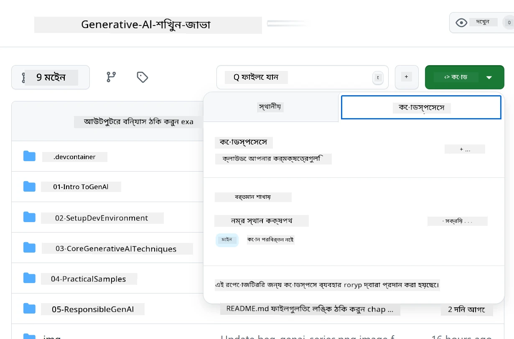
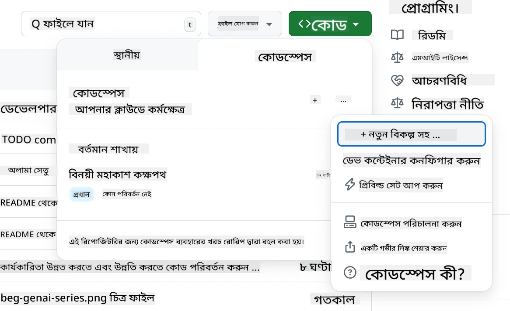
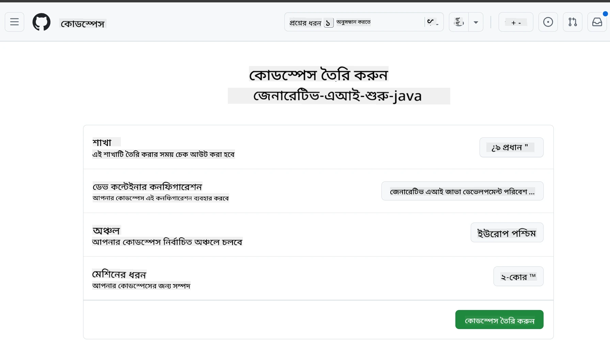
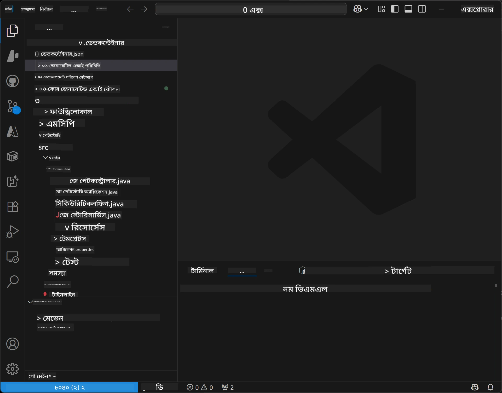
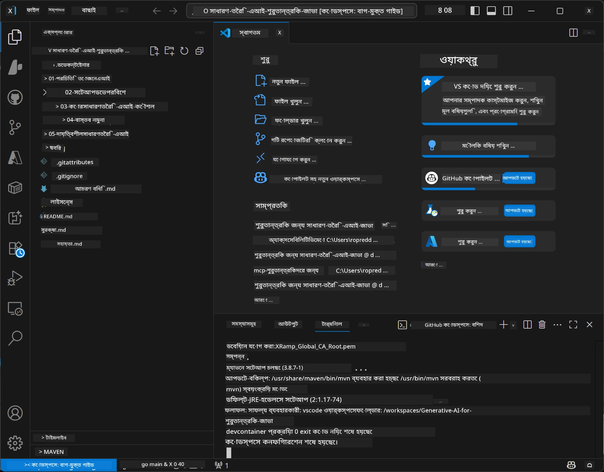

<!--
CO_OP_TRANSLATOR_METADATA:
{
  "original_hash": "96a30d42b9751a3d4e4b20e28d29d459",
  "translation_date": "2026-01-28T04:49:51+00:00",
  "source_file": "02-SetupDevEnvironment/README.md",
  "language_code": "bn"
}
-->
# Java এর জন্য Generative AI এর ডেভেলপমেন্ট এনভায়রনমেন্ট সেট আপ করা

> **দ্রুত শুরু করুন**: ২ মিনিটে ক্লাউডে কোড করুন - যান [GitHub Codespaces Setup](../../../02-SetupDevEnvironment) এ - কোনও লোকাল ইনস্টলেশনের প্রয়োজন নেই এবং GitHub মডেল ব্যবহার করে!

> **Azure OpenAI তে আগ্রহী?**, আমাদের [Azure OpenAI Setup Guide](getting-started-azure-openai.md) দেখুন যেখানে নতুন Azure OpenAI রিসোর্স তৈরি করার ধাপ উল্লেখ করা হয়েছে।

## আপনি যা শিখবেন

- AI অ্যাপ্লিকেশনের জন্য একটি Java ডেভেলপমেন্ট এনভায়রনমেন্ট সেট আপ করা
- আপনার পছন্দের ডেভেলপমেন্ট এনভায়রনমেন্ট নির্বাচন এবং কনফিগার করা (Codespaces সহ ক্লাউড ফার্স্ট, লোকাল ডেভ কনটেইনার, বা সম্পূর্ণ লোকাল সেটআপ)
- GitHub মডেলগুলোর সাথে সংযোগ করে আপনার সেটআপ পরীক্ষা করা

## বিষয় তালিকা

- [আপনি যা শিখবেন](../../../02-SetupDevEnvironment)
- [পরিচিতি](../../../02-SetupDevEnvironment)
- [ধাপ ১: আপনার ডেভেলপমেন্ট এনভায়রনমেন্ট সেট আপ করুন](../../../02-SetupDevEnvironment)
  - [বিকল্প A: GitHub Codespaces (প্রস্তাবিত)](../../../02-SetupDevEnvironment)
  - [বিকল্প B: লোকাল ডেভ কন্টেইনার](../../../02-SetupDevEnvironment)
  - [বিকল্প C: আপনার বিদ্যমান লোকাল ইনস্টলেশন ব্যবহার করুন](../../../02-SetupDevEnvironment)
- [ধাপ ২: GitHub Personal Access Token তৈরি করুন](../../../02-SetupDevEnvironment)
- [ধাপ ৩: আপনার সেটআপ পরীক্ষা করুন](../../../02-SetupDevEnvironment)
- [সমস্যা সমাধান](../../../02-SetupDevEnvironment)
- [সারাংশ](../../../02-SetupDevEnvironment)
- [পরবর্তী ধাপ](../../../02-SetupDevEnvironment)

## পরিচিতি

এই অধ্যায়ে আমরা ডেভেলপমেন্ট এনভায়রনমেন্ট সেট আপ করার নির্দেশনা দেব। আমরা **GitHub Models** ব্যবহার করব কারণ এটি বিনামূল্যে, কেবলমাত্র একটি GitHub একাউন্ট দিয়ে সহজে সেট আপ করা যায়, কোনও ক্রেডিট কার্ডের দরকার নেই, এবং পরীক্ষা-নিরীক্ষার জন্য একাধিক মডেল অ্যাক্সেস দেয়।

**কোনও লোকাল সেটআপের প্রয়োজন নেই!** আপনি ব্রাউজারে একটি সম্পূর্ণ ডেভেলপমেন্ট এনভায়রনমেন্ট প্রদান করে GitHub Codespaces ব্যবহার করে অবিলম্বে কোডিং শুরু করতে পারেন।


আমরা এই কোর্সের জন্য [**GitHub Models**](https://github.com/marketplace?type=models) ব্যবহারের পরামর্শ দিই কারণ এটা:
- শুরু করার জন্য **বিনামূল্যে**
- শুধু একটি GitHub একাউন্ট দিয়ে **সহজ** সেটআপ
- **কোনও ক্রেডিট কার্ডের দরকার নেই**
- পরীক্ষা-নিরীক্ষার জন্য **বিভিন্ন মডেল** উপলব্ধ

> **নোট**: এই প্রশিক্ষণে ব্যবহৃত GitHub Models এর ফ্রি সীমা রয়েছে:
> - প্রতি মিনিটে ১৫টি অনুরোধ (প্রতিদিন ১৫০)
> - প্রতি অনুরোধে প্রায় ৮,০০০ শব্দ ইনপুট, প্রায় ৪,০০০ শব্দ আউটপুট
> - ৫টি একসঙ্গে চলমান অনুরোধ
> 
> উৎপাদন ব্যবহারের জন্য, আপনার Azure একাউন্ট দিয়ে Azure AI Foundry মডেলে আপগ্রেড করুন। আপনার কোড পরিবর্তন করার প্রয়োজন নেই। দেখুন [Azure AI Foundry ডকুমেন্টেশন](https://learn.microsoft.com/azure/ai-foundry/foundry-models/how-to/quickstart-github-models)।

## ধাপ ১: আপনার ডেভেলপমেন্ট এনভায়রনমেন্ট সেট আপ করুন

<a name="quick-start-cloud"></a>

আমরা একটি পূর্ব-কনফিগারড ডেভেলপমেন্ট কনটেইনার তৈরি করেছি যাতে সেটআপের সময় কম লাগে এবং আপনার কাছে এই Generative AI for Java কোর্সের জন্য প্রয়োজনীয় সব সরঞ্জাম থাকে। আপনার পছন্দসই ডেভেলপমেন্ট পদ্ধতি নির্বাচন করুন:

### এনভায়রনমেন্ট সেটআপ বিকল্পসমূহ:

#### বিকল্প A: GitHub Codespaces (প্রস্তাবিত)

**২ মিনিটে কোডিং শুরু করুন - কোনও লোকাল সেটআপের প্রয়োজন নেই!**

১. এই রেপোজিটরিটি আপনার GitHub একাউন্টে ফোর্ক করুন
   > **নোট**: যদি আপনি মূল কনফিগারেশন সম্পাদনা করতে চান তবে [Dev Container Configuration](../../../.devcontainer/devcontainer.json) দেখুন
২. ক্লিক করুন **Code** → **Codespaces** ট্যাব → **...** → **New with options...**
৩. ডিফল্ট ব্যবহার করুন – এটি নির্বাচন করবে **Dev container configuration**: **Generative AI Java Development Environment**, এই কোর্সের জন্য তৈরি কাস্টম ডেভকন্টেইনার
৪. ক্লিক করুন **Create codespace**
৫. প্রায় ২ মিনিট অপেক্ষা করুন এনভায়রনমেন্ট প্রস্তুত হওয়ার জন্য
৬. এগিয়ে যান [ধাপ ২: GitHub Token তৈরি করুন](../../../02-SetupDevEnvironment)








> **Codespaces এর সুবিধা**:
> - কোনও লোকাল ইনস্টলেশনের দরকার নেই
> - যেকোনো ব্রাউজারযুক্ত ডিভাইসে কাজ করে
> - সমস্ত টুল এবং নির্ভরতাসমূহ পূর্ব-কনফিগারড
> - ব্যক্তিগত অ্যাকাউন্টের জন্য প্রতি মাসে ৬০ ঘণ্টা বিনামূল্যে
> - সকল শিক্ষার্থীর জন্য একটি সঙ্গতিপূর্ণ পরিবেশ

#### বিকল্প B: লোকাল ডেভ কনটেইনার

**ডকার ব্যবহার করে লোকাল ডেভেলপমেন্ট পছন্দকারীদের জন্য**

১. এই রেপোজিটরিটি ফোর্ক এবং ক্লোন করুন আপনার লোকাল মেশিনে
   > **নোট**: যদি আপনি মূল কনফিগারেশন সম্পাদনা করতে চান তবে [Dev Container Configuration](../../../.devcontainer/devcontainer.json) দেখুন
২. [Docker Desktop](https://www.docker.com/products/docker-desktop/) এবং [VS Code](https://code.visualstudio.com/) ইনস্টল করুন
৩. VS Code-এ [Dev Containers এক্সটেনশন](https://marketplace.visualstudio.com/items?itemName=ms-vscode-remote.remote-containers) ইনস্টল করুন
৪. রেপোজিটরি ফোল্ডার VS Code-এ খুলুন
৫. প্রম্পট পেলে ক্লিক করুন **Reopen in Container** (অথবা `Ctrl+Shift+P` → "Dev Containers: Reopen in Container" ব্যবহার করুন)
৬. কনটেইনার তৈরি এবং শুরু হওয়ার জন্য অপেক্ষা করুন
৭. এগিয়ে যান [ধাপ ২: GitHub Token তৈরি করুন](../../../02-SetupDevEnvironment)




#### বিকল্প C: আপনার বিদ্যমান লোকাল ইনস্টলেশন ব্যবহার করুন

**বিদ্যমান Java এনভায়রনমেন্ট সহ ডেভেলপারদের জন্য**

প্রাকশর্ত:
- [Java 21+](https://www.oracle.com/java/technologies/javase/jdk21-archive-downloads.html) 
- [Maven 3.9+](https://maven.apache.org/download.cgi)
- [VS Code](https://code.visualstudio.com) অথবা আপনার পছন্দের আইডিই

ধাপসমূহ:
১. এই রেপোজিটরিটি আপনার লোকাল মেশিনে ক্লোন করুন
২. প্রকল্পটি আপনার আইডিই-তে খুলুন
৩. এগিয়ে যান [ধাপ ২: GitHub Token তৈরি করুন](../../../02-SetupDevEnvironment)

> **প্রো টিপ**: আপনার মেশিনের স্পেস কম হলেও যদি VS Code লোকাল ব্যবহার করতে চান, GitHub Codespaces ব্যবহার করুন! আপনি আপনার লোকাল VS Code কে ক্লাউড-হোস্টেড Codespace এর সাথে সংযুক্ত করতে পারেন যাতে উভয়ের সুবিধা মিলে।



## ধাপ ২: একটি GitHub Personal Access Token তৈরি করুন

১. [GitHub Settings](https://github.com/settings/profile) এ যান এবং আপনার প্রোফাইল মেনু থেকে **Settings** নির্বাচন করুন।
২. বাম সাইডবারে **Developer settings** (সাধারণত নিচে থাকে) ক্লিক করুন।
৩. **Personal access tokens** এর অধীনে **Fine-grained tokens** ক্লিক করুন (অথবা সরাসরি [লিংক](https://github.com/settings/personal-access-tokens) অনুসরণ করুন)।
৪. **Generate new token** ক্লিক করুন।
৫. "Token name" এ একটি বর্ণনামূলক নাম দিন (যেমন, `GenAI-Java-Course-Token`)।
৬. মেয়াদ শেষের তারিখ সেট করুন (নিরাপত্তার জন্য ৭ দিন সুপারিশকৃত)।
৭. "Resource owner" এ আপনার ইউজার একাউন্ট নির্বাচন করুন।
৮. "Repository access" এ যেসব রেপোজিটরি GitHub Models এর জন্য ব্যবহার করতে চান সেগুলো নির্বাচন করুন (অথবা প্রয়োজনে "All repositories")।
৯. "Account permissions" এ **Models** নির্বাচন করুন এবং সেট করুন **Read-only**।
১০. **Generate token** ক্লিক করুন।
১১. **আপনার টোকেনটি এখন কপি এবং সংরক্ষণ করুন** – এটি আর দেখানো হবে না!

> **নিরাপত্তা টিপ**: আপনার Token এর জন্য সর্বনিম্ন প্রয়োজনীয় স্কোপ ব্যবহার করুন এবং কেবল প্রয়োজনীয়তম মেয়াদ দিন।

## ধাপ ৩: GitHub Models উদাহরণ দিয়ে আপনার সেটআপ পরীক্ষা করুন

আপনার ডেভেলপমেন্ট এনভায়রনমেন্ট প্রস্তুত হলে, চলুন GitHub Models এর ইন্টিগ্রেশন পরীক্ষা করি আমাদের উদাহরণ অ্যাপ্লিকেশন [`02-SetupDevEnvironment/examples/github-models`](../../../02-SetupDevEnvironment/examples/github-models) এ।

১. আপনার ডেভেলপমেন্ট এনভায়রনমেন্টে টার্মিনাল খুলুন।
২. GitHub Models উদাহরণ ফোল্ডারে যান:
   ```bash
   cd 02-SetupDevEnvironment/examples/github-models
   ```
3. আপনার GitHub টোকেন একটি এনভায়রনমেন্ট ভেরিয়েবল হিসেবে সেট করুন:
   ```bash
   # ম্যাকওএস/লিনাক্স
   export GITHUB_TOKEN=your_token_here
   
   # উইন্ডোজ (কমান্ড প্রম্পট)
   set GITHUB_TOKEN=your_token_here
   
   # উইন্ডোজ (পাওয়ারশেল)
   $env:GITHUB_TOKEN="your_token_here"
   ```

৪. অ্যাপ্লিকেশন চালান:
   ```bash
   mvn compile exec:java -Dexec.mainClass="com.example.githubmodels.App"
   ```

আপনি এই রকম আউটপুট দেখতে পাবেন:
```text
Using model: gpt-4.1-nano
Sending request to GitHub Models...
Response: Hello World!
```

### উদাহরণ কোড বোঝা

প্রথমে, আমরা যা চালিয়েছি তা বুঝি। `examples/github-models` এর নিচের উদাহরণটি OpenAI Java SDK ব্যবহার করে GitHub Models এর সাথে সংযোগ স্থাপন করে:

**এই কোড কি করে:**
- আপনার ব্যক্তিগত অ্যাক্সেস টোকেন দিয়ে GitHub Models এর সাথে **সংযোগ** করে
- AI মডেলকে একটি সহজ "Say Hello World!" মেসেজ **পাঠায়**
- AI এর প্রতিক্রিয়া **প্রাপ্ত** ও প্রদর্শন করে
- নিশ্চিত করে আপনার সেটআপ সঠিকভাবে কাজ করছে

**মুখ্য নির্ভরতা** (`pom.xml` এ):
```xml
<dependency>
    <groupId>com.openai</groupId>
    <artifactId>openai-java</artifactId>
    <version>2.12.0</version>
</dependency>
```

**মূল কোড** (`App.java`):
```java
// OpenAI Java SDK ব্যবহার করে GitHub মডেলের সাথে সংযুক্ত করুন
OpenAIClient client = OpenAIOkHttpClient.builder()
    .apiKey(pat)
    .baseUrl("https://models.inference.ai.azure.com")
    .build();

// চ্যাট সম্পূর্ণতার অনুরোধ তৈরি করুন
ChatCompletionCreateParams params = ChatCompletionCreateParams.builder()
    .model(modelId)
    .addSystemMessage("You are a concise assistant.")
    .addUserMessage("Say Hello World!")
    .build();

// AI প্রতিক্রিয়া নিন
ChatCompletion response = client.chat().completions().create(params);
System.out.println("Response: " + response.choices().get(0).message().content().orElse("No response content"));
```

## সারাংশ

দারুণ! এখন আপনার সবকিছু সেট আপ সম্পন্ন:

- AI মডেল অ্যাক্সেসের জন্য সঠিক অনুমোদনসহ একটি GitHub Personal Access Token তৈরি করেছেন
- আপনার Java ডেভেলপমেন্ট এনভায়রনমেন্ট চালু করেছেন (Codespaces, ডেভ কনটেইনার বা লোকাল যাই হোক)
- OpenAI Java SDK ব্যবহার করে GitHub Models এর সাথে সংযোগ করেছেন বিনামূল্যে AI ডেভেলপমেন্টের জন্য
- একটি সহজ উদাহরণ দিয়ে পরীক্ষা করেছেন যা AI মডেলগুলোর সাথে কথা বলে

## পরবর্তী ধাপ

[অধ্যায় ৩: কোর Generative AI প্রযুক্তি](../03-CoreGenerativeAITechniques/README.md)

## সমস্যা সমাধান

সমস্যা হচ্ছে? এখানে সাধারণ সমস্যা এবং সমাধান দেওয়া হলো:

- **টোকেন কাজ করছে না?** 
  - নিশ্চিত করুন আপনি সম্পূর্ণ টোকেন ঠিক ভাবে কপি করেছেন, অতিরিক্ত স্পেস নেই
  - টোকেন সঠিকভাবে এনভায়রনমেন্ট ভেরিয়েবল হিসেবে সেট হয়েছে কি না যাচাই করুন
  - টোকেনে সঠিক অনুমতি আছে কিনা দেখুন (Models: Read-only)

- **Maven পাওয়া যাচ্ছে না?** 
  - যদি dev container/Codespaces ব্যবহার করেন, Maven পূর্বেই ইনস্টল করা থাকে
  - লোকাল সেটআপে Java 21+ এবং Maven 3.9+ ইনস্টল আছে কিনা নিশ্চিত করুন
  - `mvn --version` চালিয়ে যাচাই করুন

- **সংযোগ সমস্যা?** 
  - আপনার ইন্টারনেট সংযোগ ঠিক আছে কিনা পরীক্ষা করুন
  - আপনার নেটওয়ার্ক থেকে GitHub অ্যাক্সেসযোগ্য কিনা নিশ্চিত করুন
  - Firewall দ্বারা GitHub Models endpoint ব্লক হচ্ছে কিনা দেখুন

- **Dev container শুরু হয় না?** 
  - নিশ্চিত করুন Docker Desktop চলছে (লোকাল ডেভের জন্য)
  - কনটেইনার পুনর্নির্মাণ করুন: `Ctrl+Shift+P` → "Dev Containers: Rebuild Container"

- **অ্যাপ্লিকেশন কম্পাইলেশন এরর হচ্ছে?**
  - সঠিক ডিরেক্টরিতে আছেন কিনা দেখুন: `02-SetupDevEnvironment/examples/github-models`
  - ক্লিন ও বিল্ড করার চেষ্টা করুন: `mvn clean compile`

> **সাহায্য প্রয়োজন?**: এখনও সমস্যা থাকলে রেপোজিটরিতে একটি ইস্যু খুলুন, আমরা সাহায্য করব।

---

<!-- CO-OP TRANSLATOR DISCLAIMER START -->
**বিজ্ঞপ্তি**:  
এই নথিটি AI অনুবাদ সেবা [Co-op Translator](https://github.com/Azure/co-op-translator) ব্যবহার করে অনূদিত হয়েছে। আমরা সঠিকতার জন্য চেষ্টা করি, তবে অনুগ্রহ করে জান্তু automated অনুবাদে ভুল বা অসঙ্গতি থাকতে পারে। মূল নথিটি তার নিজ ভাষায় বিশ্বস্ত উৎস হিসেবে বিবেচিত হওয়া উচিত। গুরুত্বপূর্ণ তথ্যের জন্য পেশাদার মানব অনুবাদ পরামর্শযোগ্য। এই অনুবাদের ব্যবহারে কোনো ভুল বোঝাবুঝি বা ভুল ব্যাখ্যার জন্য আমরা দায়ী নই।
<!-- CO-OP TRANSLATOR DISCLAIMER END -->