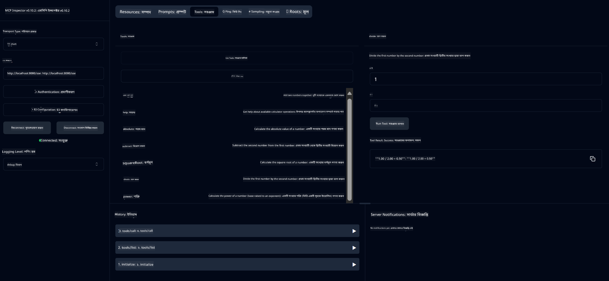

<!--
CO_OP_TRANSLATOR_METADATA:
{
  "original_hash": "7bf9a4a832911269a8bd0decb97ff36c",
  "translation_date": "2025-07-21T18:22:59+00:00",
  "source_file": "04-PracticalSamples/mcp/calculator/README.md",
  "language_code": "bn"
}
-->
# বেসিক ক্যালকুলেটর MCP সার্ভিস

>**Note**: এই অধ্যায়ে একটি [**টিউটোরিয়াল**](./TUTORIAL.md) রয়েছে যা আপনাকে সম্পূর্ণ নমুনাগুলি চালানোর মাধ্যমে গাইড করবে।

**মডেল কনটেক্সট প্রোটোকল (MCP)** নিয়ে আপনার প্রথম হাতে-কলম অভিজ্ঞতায় স্বাগতম! পূর্ববর্তী অধ্যায়গুলোতে আপনি জেনারেটিভ AI-এর মৌলিক বিষয়গুলো শিখেছেন এবং আপনার ডেভেলপমেন্ট এনভায়রনমেন্ট সেটআপ করেছেন। এখন সময় এসেছে কিছু বাস্তবিক তৈরি করার।

এই ক্যালকুলেটর সার্ভিসটি দেখায় কীভাবে AI মডেলগুলি MCP ব্যবহার করে নিরাপদে বাইরের টুলগুলোর সাথে ইন্টারঅ্যাক্ট করতে পারে। AI মডেলের মাঝে মাঝে অস্থির গণিত ক্ষমতার উপর নির্ভর না করে, আমরা দেখাব কীভাবে একটি শক্তিশালী সিস্টেম তৈরি করা যায় যেখানে AI সঠিক গণনার জন্য বিশেষায়িত সার্ভিসগুলো কল করতে পারে।

## সূচিপত্র

- [আপনি কী শিখবেন](../../../../../04-PracticalSamples/mcp/calculator)
- [প্রয়োজনীয় প্রস্তুতি](../../../../../04-PracticalSamples/mcp/calculator)
- [মূল ধারণা](../../../../../04-PracticalSamples/mcp/calculator)
- [দ্রুত শুরু](../../../../../04-PracticalSamples/mcp/calculator)
- [ক্যালকুলেটর অপারেশনসমূহ](../../../../../04-PracticalSamples/mcp/calculator)
- [টেস্ট ক্লায়েন্ট](../../../../../04-PracticalSamples/mcp/calculator)
  - [১. সরাসরি MCP ক্লায়েন্ট (SDKClient)](../../../../../04-PracticalSamples/mcp/calculator)
  - [২. AI-চালিত ক্লায়েন্ট (LangChain4jClient)](../../../../../04-PracticalSamples/mcp/calculator)
- [MCP ইন্সপেক্টর (ওয়েব UI)](../../../../../04-PracticalSamples/mcp/calculator)
  - [ধাপে ধাপে নির্দেশনা](../../../../../04-PracticalSamples/mcp/calculator)

## আপনি কী শিখবেন

এই উদাহরণটি কাজ করার মাধ্যমে আপনি বুঝতে পারবেন:
- কীভাবে Spring Boot ব্যবহার করে MCP-সামঞ্জস্যপূর্ণ সার্ভিস তৈরি করবেন
- সরাসরি প্রোটোকল যোগাযোগ এবং AI-চালিত ইন্টারঅ্যাকশনের মধ্যে পার্থক্য
- কীভাবে AI মডেল সিদ্ধান্ত নেয় কখন এবং কীভাবে বাইরের টুল ব্যবহার করতে হবে
- টুল-সক্ষম AI অ্যাপ্লিকেশন তৈরির সেরা পদ্ধতি

MCP ধারণা শেখার জন্য এবং প্রথম AI টুল ইন্টিগ্রেশন তৈরির জন্য এটি নতুনদের জন্য উপযুক্ত!

## প্রয়োজনীয় প্রস্তুতি

- Java 21+
- Maven 3.6+
- **GitHub Token**: AI-চালিত ক্লায়েন্টের জন্য প্রয়োজন। যদি আপনি এটি এখনও সেটআপ না করে থাকেন, [অধ্যায় ২: আপনার ডেভেলপমেন্ট এনভায়রনমেন্ট সেটআপ করা](../../../02-SetupDevEnvironment/README.md) দেখুন।

## মূল ধারণা

**মডেল কনটেক্সট প্রোটোকল (MCP)** হলো AI অ্যাপ্লিকেশনগুলোর বাইরের টুলগুলোর সাথে নিরাপদে সংযোগ স্থাপনের একটি মানসম্মত উপায়। এটি একটি "সেতু" হিসেবে কাজ করে যা AI মডেলকে বাইরের সার্ভিস যেমন আমাদের ক্যালকুলেটর ব্যবহার করতে দেয়। AI মডেল নিজে গণিত করার চেষ্টা না করে (যা কখনও কখনও অস্থির হতে পারে), এটি আমাদের ক্যালকুলেটর সার্ভিস কল করে সঠিক ফলাফল পেতে পারে। MCP নিশ্চিত করে যে এই যোগাযোগ নিরাপদ এবং ধারাবাহিকভাবে ঘটে।

**সার্ভার-সেন্ট ইভেন্টস (SSE)** সার্ভার এবং ক্লায়েন্টের মধ্যে রিয়েল-টাইম যোগাযোগ সক্ষম করে। প্রচলিত HTTP অনুরোধের মতো যেখানে আপনি জিজ্ঞাসা করেন এবং উত্তর পাওয়ার জন্য অপেক্ষা করেন, SSE সার্ভারকে ক্লায়েন্টে ক্রমাগত আপডেট পাঠানোর অনুমতি দেয়। এটি AI অ্যাপ্লিকেশনের জন্য উপযুক্ত যেখানে উত্তরগুলো স্ট্রিম করা হতে পারে বা প্রক্রিয়া করতে সময় লাগতে পারে।

**AI টুলস এবং ফাংশন কলিং** AI মডেলকে স্বয়ংক্রিয়ভাবে বাইরের ফাংশন (যেমন ক্যালকুলেটর অপারেশন) নির্বাচন এবং ব্যবহার করতে দেয় ব্যবহারকারীর অনুরোধের ভিত্তিতে। যখন আপনি জিজ্ঞাসা করেন "১৫ + ২৭ কত?", AI মডেল বুঝতে পারে আপনি যোগফল চান, স্বয়ংক্রিয়ভাবে আমাদের `add` টুল কল করে সঠিক প্যারামিটার (১৫, ২৭) দিয়ে এবং প্রাকৃতিক ভাষায় ফলাফল প্রদান করে। AI একটি বুদ্ধিমান সমন্বয়কারী হিসেবে কাজ করে যা জানে কখন এবং কীভাবে প্রতিটি টুল ব্যবহার করতে হবে।

## দ্রুত শুরু

### ১. ক্যালকুলেটর অ্যাপ্লিকেশন ডিরেক্টরিতে যান
```bash
cd Generative-AI-for-beginners-java/04-PracticalSamples/mcp/calculator
```

### ২. বিল্ড এবং রান করুন
```bash
mvn clean install -DskipTests
java -jar target/calculator-server-0.0.1-SNAPSHOT.jar
```

### ৩. ক্লায়েন্ট দিয়ে টেস্ট করুন
- **SDKClient**: সরাসরি MCP প্রোটোকল ইন্টারঅ্যাকশন
- **LangChain4jClient**: AI-চালিত প্রাকৃতিক ভাষার ইন্টারঅ্যাকশন (GitHub টোকেন প্রয়োজন)

## ক্যালকুলেটর অপারেশনসমূহ

- `add(a, b)`, `subtract(a, b)`, `multiply(a, b)`, `divide(a, b)`
- `power(base, exponent)`, `squareRoot(number)`, `absolute(number)`
- `modulus(a, b)`, `help()`

## টেস্ট ক্লায়েন্ট

### ১. সরাসরি MCP ক্লায়েন্ট (SDKClient)
কাঁচা MCP প্রোটোকল যোগাযোগ পরীক্ষা করে। চালান:
```bash
mvn test-compile exec:java -Dexec.mainClass="com.microsoft.mcp.sample.client.SDKClient" -Dexec.classpathScope=test
```

### ২. AI-চালিত ক্লায়েন্ট (LangChain4jClient)
GitHub মডেল দিয়ে প্রাকৃতিক ভাষার ইন্টারঅ্যাকশন প্রদর্শন করে। GitHub টোকেন প্রয়োজন (দেখুন [প্রয়োজনীয় প্রস্তুতি](../../../../../04-PracticalSamples/mcp/calculator))।

**চালান:**
```bash
mvn test-compile exec:java -Dexec.mainClass="com.microsoft.mcp.sample.client.LangChain4jClient" -Dexec.classpathScope=test
```

## MCP ইন্সপেক্টর (ওয়েব UI)

MCP ইন্সপেক্টর একটি ভিজ্যুয়াল ওয়েব ইন্টারফেস প্রদান করে যা আপনাকে কোড না লিখেই MCP সার্ভিস পরীক্ষা করতে দেয়। MCP কীভাবে কাজ করে তা বুঝতে নতুনদের জন্য এটি আদর্শ!

### ধাপে ধাপে নির্দেশনা:

১. **ক্যালকুলেটর সার্ভার চালু করুন** (যদি এখনও চালু না থাকে):
   ```bash
   java -jar target/calculator-server-0.0.1-SNAPSHOT.jar
   ```

২. **MCP ইন্সপেক্টর ইনস্টল এবং চালু করুন** নতুন টার্মিনালে:
   ```bash
   npx @modelcontextprotocol/inspector
   ```

৩. **ওয়েব ইন্টারফেস খুলুন**:
   - "Inspector running at http://localhost:6274" এর মতো একটি বার্তা দেখুন
   - আপনার ওয়েব ব্রাউজারে সেই URL খুলুন

৪. **আপনার ক্যালকুলেটর সার্ভিসে সংযোগ করুন**:
   - ওয়েব ইন্টারফেসে, ট্রান্সপোর্ট টাইপ "SSE" সেট করুন
   - URL সেট করুন: `http://localhost:8080/sse`
   - "Connect" বোতামে ক্লিক করুন

৫. **উপলব্ধ টুলগুলো অন্বেষণ করুন**:
   - "List Tools" ক্লিক করে সব ক্যালকুলেটর অপারেশন দেখুন
   - আপনি `add`, `subtract`, `multiply` ইত্যাদি ফাংশন দেখতে পাবেন

৬. **ক্যালকুলেটর অপারেশন পরীক্ষা করুন**:
   - একটি টুল নির্বাচন করুন (যেমন "add")
   - প্যারামিটার প্রবেশ করান (যেমন `a: 15`, `b: 27`)
   - "Run Tool" ক্লিক করুন
   - আপনার MCP সার্ভিস থেকে ফেরত আসা ফলাফল দেখুন!

এই ভিজ্যুয়াল পদ্ধতি আপনাকে MCP যোগাযোগ কীভাবে কাজ করে তা বুঝতে সাহায্য করে, নিজস্ব ক্লায়েন্ট তৈরি করার আগে।



---
**রেফারেন্স:** [MCP সার্ভার বুট স্টার্টার ডকস](https://docs.spring.io/spring-ai/reference/api/mcp/mcp-server-boot-starter-docs.html)

**অস্বীকৃতি**:  
এই নথিটি AI অনুবাদ পরিষেবা [Co-op Translator](https://github.com/Azure/co-op-translator) ব্যবহার করে অনুবাদ করা হয়েছে। আমরা যথাসম্ভব সঠিকতার জন্য চেষ্টা করি, তবে অনুগ্রহ করে মনে রাখবেন যে স্বয়ংক্রিয় অনুবাদে ত্রুটি বা অসঙ্গতি থাকতে পারে। মূল ভাষায় থাকা নথিটিকে প্রামাণিক উৎস হিসেবে বিবেচনা করা উচিত। গুরুত্বপূর্ণ তথ্যের জন্য, পেশাদার মানব অনুবাদ সুপারিশ করা হয়। এই অনুবাদ ব্যবহারের ফলে কোনো ভুল বোঝাবুঝি বা ভুল ব্যাখ্যা হলে আমরা তার জন্য দায়ী থাকব না।