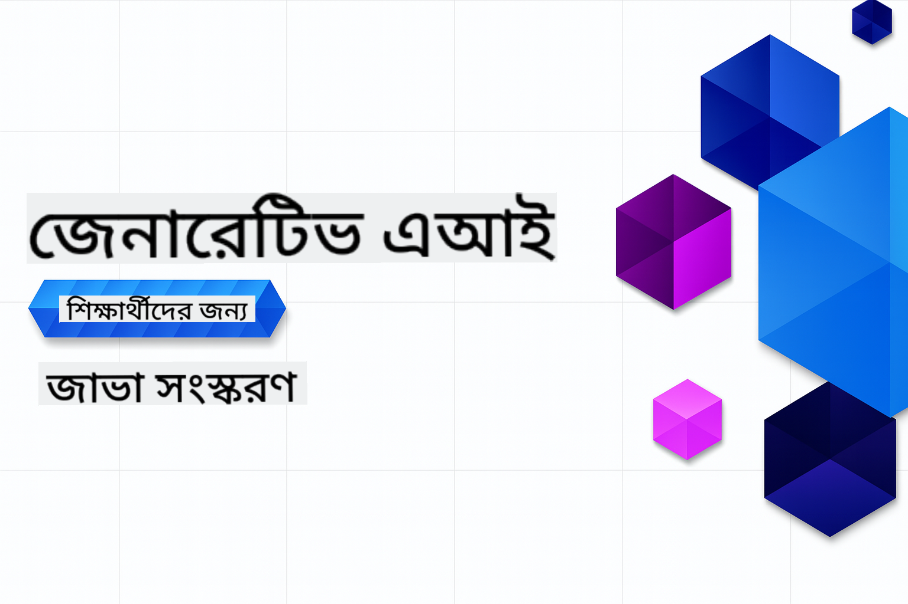

<!--
CO_OP_TRANSLATOR_METADATA:
{
  "original_hash": "2ee0f50497c11d1941347ac61fb017a9",
  "translation_date": "2025-07-21T17:30:34+00:00",
  "source_file": "README.md",
  "language_code": "bn"
}
-->
# জেনারেটিভ এআই শিখুন - জাভা সংস্করণ

> **NOTE: দ্রুত শুরু**: পুরো কোর্সটি অনলাইনে সম্পন্ন করা সম্ভব - কোনো লোকাল সেটআপের প্রয়োজন নেই!
1. এই রিপোজিটরিটি আপনার GitHub অ্যাকাউন্টে ফর্ক করুন
2. **Code** → **Codespaces** ট্যাব → **...** → **New with options...** এ ক্লিক করুন
3. ডিফল্ট সেটিংস ব্যবহার করুন – এটি এই কোর্সের জন্য তৈরি ডেভেলপমেন্ট কন্টেইনারটি নির্বাচন করবে
4. **Create codespace** এ ক্লিক করুন
5. পরিবেশ প্রস্তুত হতে ~২ মিনিট অপেক্ষা করুন
6. সরাসরি [আপনার GitHub মডেল টোকেন তৈরি করা](./02-SetupDevEnvironment/README.md#step-2-create-a-github-personal-access-token) অংশে যান

## বহু-ভাষা সমর্থন

### GitHub Action এর মাধ্যমে সমর্থিত (স্বয়ংক্রিয় এবং সর্বদা আপডেটেড)

[ফরাসি](../fr/README.md) | [স্প্যানিশ](../es/README.md) | [জার্মান](../de/README.md) | [রাশিয়ান](../ru/README.md) | [আরবি](../ar/README.md) | [ফার্সি (পার্সিয়ান)](../fa/README.md) | [উর্দু](../ur/README.md) | [চীনা (সরলীকৃত)](../zh/README.md) | [চীনা (প্রথাগত, ম্যাকাও)](../mo/README.md) | [চীনা (প্রথাগত, হংকং)](../hk/README.md) | [চীনা (প্রথাগত, তাইওয়ান)](../tw/README.md) | [জাপানি](../ja/README.md) | [কোরিয়ান](../ko/README.md) | [হিন্দি](../hi/README.md) | [বাংলা](./README.md) | [মারাঠি](../mr/README.md) | [নেপালি](../ne/README.md) | [পাঞ্জাবি (গুরুমুখী)](../pa/README.md) | [পর্তুগিজ (পর্তুগাল)](../pt/README.md) | [পর্তুগিজ (ব্রাজিল)](../br/README.md) | [ইতালিয়ান](../it/README.md) | [পোলিশ](../pl/README.md) | [তুর্কি](../tr/README.md) | [গ্রিক](../el/README.md) | [থাই](../th/README.md) | [সুইডিশ](../sv/README.md) | [ড্যানিশ](../da/README.md) | [নরওয়েজিয়ান](../no/README.md) | [ফিনিশ](../fi/README.md) | [ডাচ](../nl/README.md) | [হিব্রু](../he/README.md) | [ভিয়েতনামিজ](../vi/README.md) | [ইন্দোনেশিয়ান](../id/README.md) | [মালয়](../ms/README.md) | [তাগালগ (ফিলিপিনো)](../tl/README.md) | [সোয়াহিলি](../sw/README.md) | [হাঙ্গেরিয়ান](../hu/README.md) | [চেক](../cs/README.md) | [স্লোভাক](../sk/README.md) | [রোমানিয়ান](../ro/README.md) | [বুলগেরিয়ান](../bg/README.md) | [সার্বিয়ান (সিরিলিক)](../sr/README.md) | [ক্রোয়েশিয়ান](../hr/README.md) | [স্লোভেনিয়ান](../sl/README.md) | [ইউক্রেনিয়ান](../uk/README.md) | [বর্মি (মায়ানমার)](../my/README.md)

## কোর্স কাঠামো এবং শেখার পথ

**সময় প্রয়োজন**: পরিবেশ সেটআপ করতে ২ মিনিট, এবং হাতে-কলমে টিউটোরিয়াল সম্পন্ন করতে ১-৩ ঘণ্টা (অন্বেষণের গভীরতার উপর নির্ভর করে)।

### **অধ্যায় ১: জেনারেটিভ এআই এর পরিচিতি**
- **মূল ধারণা**: লার্জ ল্যাঙ্গুয়েজ মডেল, টোকেন, এমবেডিং এবং এআই এর ক্ষমতা বোঝা
- **জাভা এআই ইকোসিস্টেম**: Spring AI এবং OpenAI SDKs এর ওভারভিউ
- **মডেল কন্টেক্সট প্রোটোকল**: MCP এবং এআই এজেন্ট যোগাযোগে এর ভূমিকা
- **ব্যবহারিক প্রয়োগ**: বাস্তব জীবনের উদাহরণ যেমন চ্যাটবট এবং কন্টেন্ট জেনারেশন
- **[→ অধ্যায় ১ শুরু করুন](./01-IntroToGenAI/README.md)**

### **অধ্যায় ২: ডেভেলপমেন্ট পরিবেশ সেটআপ**
- **মাল্টি-প্রোভাইডার কনফিগারেশন**: GitHub Models, Azure OpenAI, এবং OpenAI Java SDK ইন্টিগ্রেশন সেটআপ
- **Spring Boot + Spring AI**: এন্টারপ্রাইজ এআই অ্যাপ্লিকেশন ডেভেলপমেন্টের সেরা পদ্ধতি
- **GitHub Models**: প্রোটোটাইপিং এবং শেখার জন্য ফ্রি এআই মডেল অ্যাক্সেস (ক্রেডিট কার্ডের প্রয়োজন নেই)
- **ডেভেলপমেন্ট টুলস**: Docker কন্টেইনার, VS Code, এবং GitHub Codespaces কনফিগারেশন
- **[→ অধ্যায় ২ শুরু করুন](./02-SetupDevEnvironment/README.md)**

### **অধ্যায় ৩: জেনারেটিভ এআই এর মূল কৌশল**
- **প্রম্পট ইঞ্জিনিয়ারিং**: এআই মডেলের সেরা প্রতিক্রিয়া পাওয়ার কৌশল
- **এমবেডিং এবং ভেক্টর অপারেশন**: সেমান্টিক সার্চ এবং সাদৃশ্য মিলন বাস্তবায়ন
- **Retrieval-Augmented Generation (RAG)**: আপনার নিজস্ব ডেটা সোর্সের সাথে এআই সংযুক্ত করা
- **ফাংশন কলিং**: কাস্টম টুল এবং প্লাগইন দিয়ে এআই এর ক্ষমতা বাড়ানো
- **[→ অধ্যায় ৩ শুরু করুন](./03-CoreGenerativeAITechniques/README.md)**

### **অধ্যায় ৪: ব্যবহারিক প্রয়োগ এবং প্রকল্প**
- **পোষা প্রাণীর গল্প জেনারেটর** (`petstory/`): GitHub Models দিয়ে সৃজনশীল কন্টেন্ট জেনারেশন
- **Foundry Local Demo** (`foundrylocal/`): OpenAI Java SDK এর সাথে লোকাল এআই মডেল ইন্টিগ্রেশন
- **MCP ক্যালকুলেটর সার্ভিস** (`mcp/calculator/`): Spring AI এর সাথে মডেল কন্টেক্সট প্রোটোকল এর মৌলিক বাস্তবায়ন
- **[→ অধ্যায় ৪ শুরু করুন](./04-PracticalSamples/README.md)**

### **অধ্যায় ৫: দায়িত্বশীল এআই ডেভেলপমেন্ট**
- **GitHub Models নিরাপত্তা**: বিল্ট-ইন কন্টেন্ট ফিল্টারিং এবং নিরাপত্তা প্রক্রিয়া পরীক্ষা করা
- **দায়িত্বশীল এআই ডেমো**: হাতে-কলমে উদাহরণ যা এআই নিরাপত্তা ফিল্টার কিভাবে কাজ করে তা দেখায়
- **সেরা পদ্ধতি**: নৈতিক এআই ডেভেলপমেন্ট এবং ডিপ্লয়মেন্টের জন্য প্রয়োজনীয় নির্দেশিকা
- **[→ অধ্যায় ৫ শুরু করুন](./05-ResponsibleGenAI/README.md)**

## অতিরিক্ত সম্পদসমূহ

- [শুরুদের জন্য এআই এজেন্ট](https://github.com/microsoft/ai-agents-for-beginners)
- [জেনারেটিভ এআই শিখুন .NET ব্যবহার করে](https://github.com/microsoft/Generative-AI-for-beginners-dotnet)
- [জেনারেটিভ এআই শিখুন জাভাস্ক্রিপ্ট ব্যবহার করে](https://github.com/microsoft/generative-ai-with-javascript)
- [জেনারেটিভ এআই শিখুন](https://github.com/microsoft/generative-ai-for-beginners)
- [শুরুদের জন্য মেশিন লার্নিং](https://aka.ms/ml-beginners)
- [শুরুদের জন্য ডেটা সায়েন্স](https://aka.ms/datascience-beginners)
- [শুরুদের জন্য এআই](https://aka.ms/ai-beginners)
- [শুরুদের জন্য সাইবারসিকিউরিটি](https://github.com/microsoft/Security-101)
- [শুরুদের জন্য ওয়েব ডেভেলপমেন্ট](https://aka.ms/webdev-beginners)
- [শুরুদের জন্য IoT](https://aka.ms/iot-beginners)
- [শুরুদের জন্য XR ডেভেলপমেন্ট](https://github.com/microsoft/xr-development-for-beginners)
- [AI পেয়ারড প্রোগ্রামিং এর জন্য GitHub Copilot আয়ত্ত করা](https://aka.ms/GitHubCopilotAI)
- [C#/.NET ডেভেলপারদের জন্য GitHub Copilot আয়ত্ত করা](https://github.com/microsoft/mastering-github-copilot-for-dotnet-csharp-developers)
- [আপনার নিজস্ব Copilot অ্যাডভেঞ্চার বেছে নিন](https://github.com/microsoft/CopilotAdventures)
- [Azure AI Services এর সাথে RAG চ্যাট অ্যাপ](https://github.com/Azure-Samples/azure-search-openai-demo-java)

**অস্বীকৃতি**:  
এই নথিটি AI অনুবাদ পরিষেবা [Co-op Translator](https://github.com/Azure/co-op-translator) ব্যবহার করে অনুবাদ করা হয়েছে। আমরা যথাসাধ্য সঠিকতার জন্য চেষ্টা করি, তবে অনুগ্রহ করে মনে রাখবেন যে স্বয়ংক্রিয় অনুবাদে ত্রুটি বা অসঙ্গতি থাকতে পারে। এর মূল ভাষায় থাকা নথিটিকে প্রামাণিক উৎস হিসেবে বিবেচনা করা উচিত। গুরুত্বপূর্ণ তথ্যের জন্য, পেশাদার মানব অনুবাদ সুপারিশ করা হয়। এই অনুবাদ ব্যবহারের ফলে কোনো ভুল বোঝাবুঝি বা ভুল ব্যাখ্যা হলে আমরা দায়বদ্ধ থাকব না।