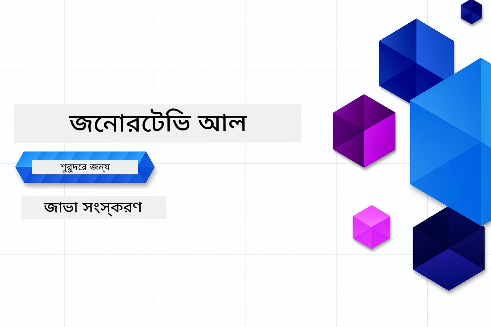

# নবাগতদের জন্য জেনারেটিভ AI - জাভা সংস্করণ
[](https://discord.gg/nTYy5BXMWG)



**সময় ব্যয়**: পুরো কর্মশালা অনলাইনে সম্পন্ন করা যেতে পারে স্থানীয় সেটআপ ছাড়াই। পরিবেশ সেটআপ করতে লাগে ২ মিনিট, নমুনা অনুসন্ধানে ১-৩ ঘন্টা সময় লাগতে পারে অনুসন্ধানের গভীরতার উপর নির্ভর করে।

> **দ্রুত আরম্ভ**

1. এই রিপোজিটরিটি আপনার GitHub অ্যাকাউন্টে ফর্ক করুন
2. ক্লিক করুন **Code** → **Codespaces** ট্যাব → **...** → **New with options...**
3. ডিফল্ট নির্বাচন করুন – এটি কোর্সের জন্য তৈরি ডেভেলপমেন্ট কন্টেইনারটি নির্বাচন করবে
4. ক্লিক করুন **Create codespace**
5. পরিবেশ প্রস্তুত হওয়া পর্যন্ত প্রায় ২ মিনিট অপেক্ষা করুন
6. সরাসরি যান [প্রথম উদাহরণে](./02-SetupDevEnvironment/README.md#step-2-create-a-github-personal-access-token)

> **লোকালি ক্লোন করতে চান?**
>
> এই রিপোজিটরিতে ৫০+ ভাষার অনুবাদ অন্তর্ভুক্ত যা ডাউনলোডের আকার অনেক বৃদ্ধি করে। অনুবাদ ছাড়া ক্লোন করতে স্পার্স চেকআউট ব্যবহার করুন:
> ```bash
> git clone --filter=blob:none --sparse https://github.com/microsoft/Generative-AI-for-beginners-java.git
> cd Generative-AI-for-beginners-java
> git sparse-checkout set --no-cone '/*' '!translations' '!translated_images'
> ```
> এটি আপনাকে খুব দ্রুত ডাউনলোডের মাধ্যমে কোর্স সম্পন্ন করার জন্য প্রয়োজনীয় সবকিছু দিবে।


## বহু-ভাষা সমর্থন

### GitHub Action দ্বারা সমর্থিত (স্বয়ংক্রিয় ও সর্বদা আপ টু ডেট)

<!-- CO-OP TRANSLATOR LANGUAGES TABLE START -->
[আরবী](../ar/README.md) | [বাংলা](./README.md) | [বুলগেরিয়ান](../bg/README.md) | [বর্মী (মায়ানমার)](../my/README.md) | [চীনা (সরলীকৃত)](../zh-CN/README.md) | [চীনা (প্রচলিত, হংকং)](../zh-HK/README.md) | [চীনা (প্রচলিত, ম্যাকাও)](../zh-MO/README.md) | [চীনা (প্রচলিত, তাইওয়ান)](../zh-TW/README.md) | [ক্রোয়েশীয়](../hr/README.md) | [চেক](../cs/README.md) | [ড্যানিশ](../da/README.md) | [ডাচ](../nl/README.md) | [এস্তোনিয়ান](../et/README.md) | [ফিনিশ](../fi/README.md) | [ফরাসি](../fr/README.md) | [জার্মান](../de/README.md) | [গ্রীক](../el/README.md) | [হিব্রু](../he/README.md) | [হিন্দি](../hi/README.md) | [হাঙ্গেরিয়ান](../hu/README.md) | [ইন্দোনেশীয়](../id/README.md) | [ইতালিয়ান](../it/README.md) | [জাপানি](../ja/README.md) | [কন্নড়](../kn/README.md) | [কোরিয়ান](../ko/README.md) | [লিথুয়ানিয়ান](../lt/README.md) | [মালয়](../ms/README.md) | [মালায়ালাম](../ml/README.md) | [মরাঠি](../mr/README.md) | [নেপালি](../ne/README.md) | [নাইজেরিয়ান পিজিন](../pcm/README.md) | [নরওয়েজীয়](../no/README.md) | [পারস্য (ফার্সি)](../fa/README.md) | [পোলিশ](../pl/README.md) | [পর্তুগিজ (ব্রাজিল)](../pt-BR/README.md) | [পর্তুগিজ (পর্তুগাল)](../pt-PT/README.md) | [পাঞ্জাবী (গুরুমুখি)](../pa/README.md) | [রোমানিয়ান](../ro/README.md) | [রাশিয়ান](../ru/README.md) | [সার্বিয়ান (সিরিলিক)](../sr/README.md) | [সলভাক](../sk/README.md) | [স্লোভেনিয়ান](../sl/README.md) | [স্প্যানিশ](../es/README.md) | [সোয়াহিলি](../sw/README.md) | [সুইডিশ](../sv/README.md) | [ট্যাগালগ (ফিলিপিনো)](../tl/README.md) | [তামিল](../ta/README.md) | [তেলুগু](../te/README.md) | [থাই](../th/README.md) | [তুর্কী](../tr/README.md) | [ইউক্রেনীয়](../uk/README.md) | [উর্দু](../ur/README.md) | [ভিয়েতনামী](../vi/README.md)

## কোর্স কাঠামো ও শেখার পথ

### **অধ্যায় ১: জেনারেটিভ AI পরিচিতি**
- **মূল ধারণা**: লার্জ ল্যাঙ্গুয়েজ মডেল, টোকেন, এম্বেডিং এবং AI ক্ষমতা বোঝা
- **জাভা AI ইকোসিস্টেম**: Spring AI এবং OpenAI SDK এর ওভারভিউ
- **মডেল কনটেক্সট প্রোটোকল**: MCP পরিচিতি এবং AI এজেন্ট যোগাযোগে এর ভূমিকা
- **প্রয়োগিক ব্যবহার**: বাস্তবজীবনের পরিস্থিতি যেমন চ্যাটবোট ও কন্টেন্ট জেনারেশন
- **[→ অধ্যায় ১ শুরু করুন](./01-IntroToGenAI/README.md)**

### **অধ্যায় ২: ডেভেলপমেন্ট পরিবেশ সেটআপ**
- **বহু-প্রোভাইডার কনফিগারেশন**: GitHub মডেল, Azure OpenAI, ও OpenAI Java SDK ইন্টিগ্রেশন সেটআপ
- **Spring Boot + Spring AI**: এন্টারপ্রাইজ AI অ্যাপ্লিকেশন ডেভেলপমেন্টের সেরা অনুশীলন
- **GitHub মডেল**: প্রোটোটাইপিং ও শেখার জন্য ফ্রি AI মডেল অ্যাক্সেস (ক্রেডিট কার্ড প্রয়োজন নেই)
- **ডেভেলপমেন্ট টুলস**: ডকার কন্টেইনার, VS কোড, ও GitHub Codespaces এর কনফিগারেশন
- **[→ অধ্যায় ২ শুরু করুন](./02-SetupDevEnvironment/README.md)**

### **অধ্যায় ৩: মূল জেনারেটিভ AI প্রযুক্তি**
- **প্রম্পট ইঞ্জিনিয়ারিং**: AI মডেলের সর্বোত্তম প্রতিক্রিয়া পাওয়ার কৌশল
- **এম্বেডিং ও ভেক্টর অপারেশন**: সেমান্টিক সার্চ এবং সাদৃশ্য ম্যাচিং প্রয়োগ
- **রিট্রিভাল-অগমেন্টেড জেনারেশন (RAG)**: আপনার নিজস্ব ডেটা সোর্সের সাথে AI সংমিশ্রণ
- **ফাংশন কলিং**: কাস্টম টুলস ও প্লাগইনের মাধ্যমে AI ক্ষমতা বাড়ানো
- **[→ অধ্যায় ৩ শুরু করুন](./03-CoreGenerativeAITechniques/README.md)**

### **অধ্যায় ৪: প্রয়োগিক ব্যবহার ও প্রকল্পসমূহ**
- **পেট স্টোরি জেনারেটর** (`petstory/`): GitHub মডেল দিয়ে সৃজনশীল কন্টেন্ট জেনারেশন
- **Foundry লোকাল ডেমো** (`foundrylocal/`): OpenAI Java SDK এর সাথে লোকাল AI মডেল ইন্টিগ্রেশন
- **MCP ক্যালকুলেটর সার্ভিস** (`calculator/`): Spring AI এর মাধ্যমে মৌলিক Model Context Protocol প্রয়োগ
- **[→ অধ্যায় ৪ শুরু করুন](./04-PracticalSamples/README.md)**

### **অধ্যায় ৫: দায়িত্বশীল AI উন্নয়ন**
- **GitHub মডেল নিরাপত্তা**: বিল্ট-ইন কন্টেন্ট ফিল্টারিং ও সুরক্ষা ব্যবস্থার পরীক্ষা (হার্ড ব্লক এবং সফট প্রত্যাখ্যান)
- **দায়িত্বশীল AI ডেমো**: আধুনিক AI সুরক্ষা সিস্টেমের ব্যবহারিক উদাহরণ
- **সেরা অনুশীলন**: নৈতিক AI উন্নয়ন ও মোতায়েনের জন্য অপরিহার্য নির্দেশিকা
- **[→ অধ্যায় ৫ শুরু করুন](./05-ResponsibleGenAI/README.md)**

## অতিরিক্ত সম্পদ

<!-- CO-OP TRANSLATOR OTHER COURSES START -->
### LangChain
[](https://aka.ms/langchain4j-for-beginners)
[](https://aka.ms/langchainjs-for-beginners?WT.mc_id=m365-94501-dwahlin)
[](https://github.com/microsoft/langchain-for-beginners?WT.mc_id=m365-94501-dwahlin)
---

### Azure / Edge / MCP / Agents
[](https://github.com/microsoft/AZD-for-beginners?WT.mc_id=academic-105485-koreyst)
[](https://github.com/microsoft/edgeai-for-beginners?WT.mc_id=academic-105485-koreyst)
[](https://github.com/microsoft/mcp-for-beginners?WT.mc_id=academic-105485-koreyst)
[](https://github.com/microsoft/ai-agents-for-beginners?WT.mc_id=academic-105485-koreyst)

---
 
### জেনারেটিভ AI সিরিজ
[](https://github.com/microsoft/generative-ai-for-beginners?WT.mc_id=academic-105485-koreyst)
[-9333EA?style=for-the-badge&labelColor=E5E7EB&color=9333EA)](https://github.com/microsoft/Generative-AI-for-beginners-dotnet?WT.mc_id=academic-105485-koreyst)
[-C084FC?style=for-the-badge&labelColor=E5E7EB&color=C084FC)](https://github.com/microsoft/generative-ai-for-beginners-java?WT.mc_id=academic-105485-koreyst)
[-E879F9?style=for-the-badge&labelColor=E5E7EB&color=E879F9)](https://github.com/microsoft/generative-ai-with-javascript?WT.mc_id=academic-105485-koreyst)

---
 
### মূল শেখা
[](https://aka.ms/ml-beginners?WT.mc_id=academic-105485-koreyst)
[](https://aka.ms/datascience-beginners?WT.mc_id=academic-105485-koreyst)
[](https://aka.ms/ai-beginners?WT.mc_id=academic-105485-koreyst)
[](https://github.com/microsoft/Security-101?WT.mc_id=academic-96948-sayoung)
[](https://aka.ms/webdev-beginners?WT.mc_id=academic-105485-koreyst)
[](https://aka.ms/iot-beginners?WT.mc_id=academic-105485-koreyst)
[](https://github.com/microsoft/xr-development-for-beginners?WT.mc_id=academic-105485-koreyst)

---
 
### কপাইলট সিরিজ
[](https://aka.ms/GitHubCopilotAI?WT.mc_id=academic-105485-koreyst)
[](https://github.com/microsoft/mastering-github-copilot-for-dotnet-csharp-developers?WT.mc_id=academic-105485-koreyst)
[](https://github.com/microsoft/CopilotAdventures?WT.mc_id=academic-105485-koreyst)
<!-- CO-OP TRANSLATOR OTHER COURSES END -->

## সাহায্য প্রাপ্তি

যদি আপনি আটকে যান বা AI অ্যাপ তৈরি সম্পর্কে কোনো প্রশ্ন থাকে। MCP নিয়ে আলোচনা করতে অনুরূপ শিক্ষার্থী ও অভিজ্ঞ ডেভেলপারদের সাথে যোগ দিন। এটি একটি সহায়ক সম্প্রদায় যেখানে প্রশ্ন করার জন্য উৎসাহিত করা হয় এবং জ্ঞান মুক্তভাবে শেয়ার করা হয়।

[](https://discord.gg/nTYy5BXMWG)

আপনার যদি পণ্য সম্পর্কিত প্রতিক্রিয়া বা ত্রুটি থাকে, তবে নির্মাণের সময় পরিদর্শন করুন:

[](https://aka.ms/foundry/forum)

---

<!-- CO-OP TRANSLATOR DISCLAIMER START -->
**অস্বীকারোক্তি**:  
এই নথিটি AI অনুবাদ সেবার [Co-op Translator](https://github.com/Azure/co-op-translator) ব্যবহার করে অনূদিত হয়েছে। আমরা যথাযথতার জন্য চেষ্টা চালাই, তবে স্বয়ংক্রিয় অনুবাদে ত্রুটি বা অসঙ্গতি থাকতে পারে তা লক্ষ্য রাখতে অনুরোধ কর𝗂। মূল নথিটি তার মাতৃভাষায় কর্তৃত্বপূর্ণ উৎস হিসেবে বিবেচিত হওয়া উচিত। গুরুত্বপূর্ণ তথ্যের জন্য পেশাদার মানব অনুবাদ সুপারিশ করা হয়। এই অনুবাদের ব্যবহারের ফলে সৃষ্ট কোনও ভুল বোঝাবুঝি বা ব্যাখ্যার জন্য আমরা দায়ী নই।
<!-- CO-OP TRANSLATOR DISCLAIMER END -->