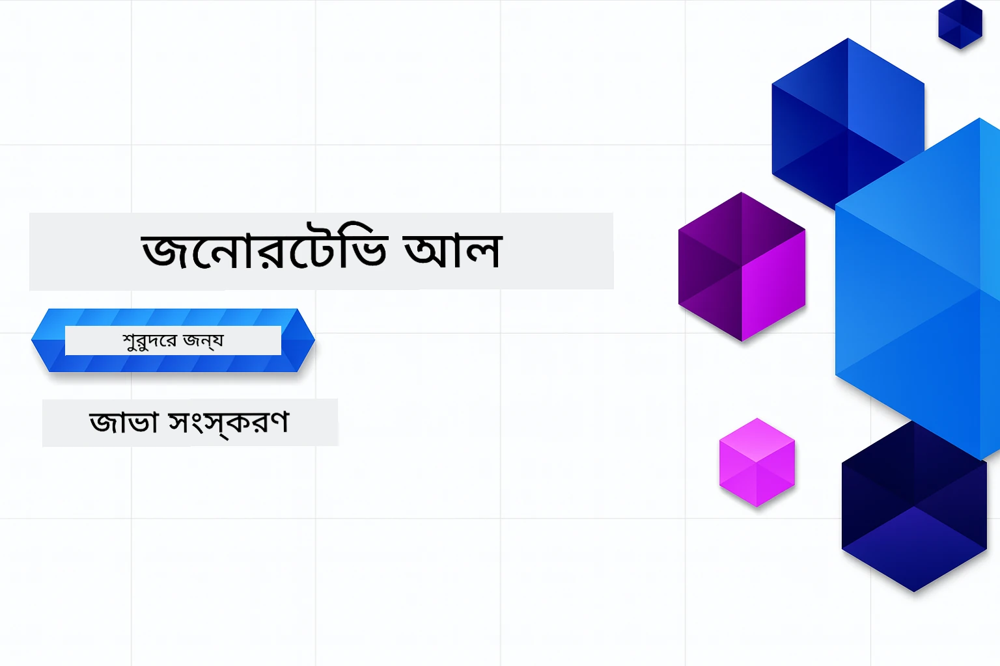

# নবীনদের জন্য জেনারেটিভ এআই - জাভা সংস্করণ
[](https://discord.gg/nTYy5BXMWG)



**সময় বিনিয়োগ**: পুরো কর্মশালাটি অনলাইনে সম্পন্ন করা যায় কোনো স্থানীয় সেটআপ ছাড়াই। পরিবেশ সেটআপ করতে ২ মিনিট লাগে, নমুনাগুলি অন্বেষণ করতে ১-৩ ঘণ্টা সময় লাগতে পারে, অন্বেষণের গভীরতার উপর নির্ভর করে।

> **দ্রুত শুরু**

1. এই রেপোজিটোরিটি আপনার গিটহাব অ্যাকাউন্টে ফর্ক করুন
2. ক্লিক করুন **Code** → **Codespaces** ট্যাব → **...** → **New with options...**
3. ডিফল্ট সেটিংস ব্যবহার করুন – এটি এই কোর্সের জন্য তৈরি ডেভেলপমেন্ট কন্টেইনার নির্বাচন করবে
4. ক্লিক করুন **Create codespace**
5. পরিবেশ প্রস্তুত হতে আনুমানিক ২ মিনিট অপেক্ষা করুন
6. সরাসরি [প্রথম উদাহরণে যান](./02-SetupDevEnvironment/README.md#step-2-create-a-github-personal-access-token)

## বহু-ভাষা সমর্থন

### GitHub অ্যাকশন (স্বয়ংক্রিয় এবং সর্বদা হালনাগাদ) এর মাধ্যমে সমর্থিত

<!-- CO-OP TRANSLATOR LANGUAGES TABLE START -->
[আরবি](../ar/README.md) | [বাংলা](./README.md) | [বুলগেরিয়ান](../bg/README.md) | [বর্মিজ (মায়ানমার)](../my/README.md) | [চীনা (সহজীকৃত)](../zh-CN/README.md) | [চীনা (পরম্পরাগত, হংকং)](../zh-HK/README.md) | [চীনা (পরম্পরাগত, ম্যাকাও)](../zh-MO/README.md) | [চীনা (পরম্পরাগত, তাইওয়ান)](../zh-TW/README.md) | [ক্রোয়েশীয়](../hr/README.md) | [চেক](../cs/README.md) | [ড্যানিশ](../da/README.md) | [ডাচ](../nl/README.md) | [এস্তোনিয়ান](../et/README.md) | [ফিনিশ](../fi/README.md) | [ফরাসি](../fr/README.md) | [জার্মান](../de/README.md) | [গ্রিক](../el/README.md) | [হিব্রু](../he/README.md) | [হিন্দি](../hi/README.md) | [হাঙ্গেরিয়ান](../hu/README.md) | [ইন্দোনেশিয়ান](../id/README.md) | [ইতালিয়ান](../it/README.md) | [জাপানি](../ja/README.md) | [কন্নড়](../kn/README.md) | [খমের](../km/README.md) | [কোরিয়ান](../ko/README.md) | [লিথুয়ানিয়ান](../lt/README.md) | [মালয়](../ms/README.md) | [মালয়ালাম](../ml/README.md) | [মারাঠি](../mr/README.md) | [নেপালি](../ne/README.md) | [নাইজেরিয়ান পিজিন](../pcm/README.md) | [নরওয়েজিয়ান](../no/README.md) | [ফার্সি (পারস্য)](../fa/README.md) | [পোলিশ](../pl/README.md) | [পর্তুগিজ (ব্রাজিল)](../pt-BR/README.md) | [পর্তুগিজ (পর্তুগাল)](../pt-PT/README.md) | [পাঞ্জাবি (গুরুমুখি)](../pa/README.md) | [রোমানিয়ান](../ro/README.md) | [রুশিয়ান](../ru/README.md) | [সার্বিয়ান (সিরিলিক)](../sr/README.md) | [স্লোভাক](../sk/README.md) | [স্লোভেনিয়ান](../sl/README.md) | [স্প্যানিশ](../es/README.md) | [সোয়াহিলি](../sw/README.md) | [সুইডিশ](../sv/README.md) | [টাগালগ (ফিলিপিনো)](../tl/README.md) | [তামিল](../ta/README.md) | [তেলুগু](../te/README.md) | [থাই](../th/README.md) | [তুর্কি](../tr/README.md) | [ইউক্রেনীয়](../uk/README.md) | [উর্দু](../ur/README.md) | [ভিয়েতনামী](../vi/README.md)

> **স্থানীয়ভাবে ক্লোন করতে চান?**
>
> এই রেপোজিটোরিতে ৫০+ ভাষার অনুবাদ অন্তর্ভুক্ত রয়েছে যা ডাউনলোড আকার উল্লেখযোগ্যভাবে বৃদ্ধি করে। অনুবাদ ছাড়াই ক্লোন করতে স্পার্স চেকআউট ব্যবহার করুন:
>
> **Bash / macOS / Linux:**  
> ```bash
> git clone --filter=blob:none --sparse https://github.com/microsoft/Generative-AI-for-beginners-java.git
> cd Generative-AI-for-beginners-java
> git sparse-checkout set --no-cone '/*' '!translations' '!translated_images'
> ```
>
> **CMD (Windows):**  
> ```cmd
> git clone --filter=blob:none --sparse https://github.com/microsoft/Generative-AI-for-beginners-java.git
> cd Generative-AI-for-beginners-java
> git sparse-checkout set --no-cone "/*" "!translations" "!translated_images"
> ```
>
> এটি আপনাকে দ্রুত ডাউনলোডের মাধ্যমে কোর্স সম্পন্ন করার জন্য প্রয়োজনীয় সবকিছু প্রদান করবে।
<!-- CO-OP TRANSLATOR LANGUAGES TABLE END -->

## কোর্স কাঠামো এবং শেখার পথ

### **অধ্যায় ১: জেনারেটিভ এআই এর পরিচিতি**
- **কোর ধারণাসমূহ**: বড় ভাষার মডেল, টোকেন, এম্বেডিংস এবং এআই দক্ষতাগুলো বোঝা
- **জাভা এআই ইকোসিস্টেম**: Spring AI এবং OpenAI SDK এর সংক্ষিপ্ত বিবরণ
- **মডেল কনটেক্সট প্রোটোকল**: MCP পরিচিতি এবং এআই এজেন্ট যোগাযোগে এর ভূমিকা
- **প্রায়োগিক ব্যবহার**: চ্যাটবট ও কন্টেন্ট জেনারেশন সহ বাস্তব জীবনের পরিস্থিতি
- **[→ অধ্যায় ১ শুরু করুন](./01-IntroToGenAI/README.md)**

### **অধ্যায় ২: ডেভেলপমেন্ট পরিবেশ সেটআপ**
- **মাল্টি-প্রোভাইডার কনফিগারেশন**: GitHub মডেল, Azure OpenAI এবং OpenAI জাভা SDK একীভূত করা
- **Spring Boot + Spring AI**: এন্টারপ্রাইজ AI অ্যাপ্লিকেশন ডেভেলপমেন্টের সর্বোত্তম প্র্যাকটিস
- **GitHub মডেলস**: প্রোটোটাইপ এবং শেখার জন্য নির্দিষ্ট কৃত্রিম বুদ্ধিমত্তা মডেল (ক্রেডিট কার্ডের প্রয়োজন নেই)
- **ডেভেলপমেন্ট টুলস**: ডকার কন্টেইনার, VS কোড এবং GitHub Codespaces কনফিগারেশন
- **[→ অধ্যায় ২ শুরু করুন](./02-SetupDevEnvironment/README.md)**

### **অধ্যায় ৩: কোর জেনারেটিভ এআই প্রযুক্তি**
- **প্রম্পট ইঞ্জিনিয়ারিং**: সর্বোত্তম AI মডেল প্রতিক্রিয়ার কৌশল
- **এম্বেডিংস ও ভেক্টর অপারেশন**: সেমেন্টিক সার্চ এবং সাদৃশ্য মিল প্রয়োগ
- **রিট্রিভাল-অগমেন্টেড জেনারেশন (RAG)**: AI কে আপনার নিজস্ব ডেটা সোর্সের সঙ্গে সংযুক্ত করা
- **ফাংশন কলিং**: কাস্টম টুল এবং প্লাগইন দিয়ে AI ক্ষমতা বাড়ানো
- **[→ অধ্যায় ৩ শুরু করুন](./03-CoreGenerativeAITechniques/README.md)**

### **অধ্যায় ৪: ব্যবহারিক প্রয়োগ এবং প্রকল্পসমূহ**
- **পেট স্টোরি জেনারেটর** (`petstory/`): GitHub মডেল সহ সৃজনশীল কনটেন্ট জেনারেশন
- **Foundry Local Demo** (`foundrylocal/`): OpenAI জাভা SDK সহ স্থানীয় AI মডেল একীকরণ
- **MCP ক্যালকুলেটর সার্ভিস** (`calculator/`): Spring AI দিয়ে মৌলিক মডেল কনটেক্সট প্রোটোকল বাস্তবায়ন
- **[→ অধ্যায় ৪ শুরু করুন](./04-PracticalSamples/README.md)**

### **অধ্যায় ৫: দায়িত্বশীল এআই ডেভেলপমেন্ট**
- **GitHub মডেলস সুরক্ষা**: বিল্ট-ইন কন্টেন্ট ফিল্টারিং ও সুরক্ষা ব্যবস্থা (হার্ড ব্লক এবং সফট প্রত্যাখ্যান) পরীক্ষা করুন
- **দায়িত্বশীল AI ডেমো**: আধুনিক AI নিরাপত্তা সিস্টেমগুলি কীভাবে কাজ করে হাতেকলমে উদাহরণ
- **সেরা প্র্যাকটিস**: নৈতিক AI ডেভেলপমেন্ট ও মোতায়েনের জন্য অপরিহার্য নির্দেশিকা
- **[→ অধ্যায় ৫ শুরু করুন](./05-ResponsibleGenAI/README.md)**

## অতিরিক্ত সম্পদ

<!-- CO-OP TRANSLATOR OTHER COURSES START -->
### LangChain
[](https://aka.ms/langchain4j-for-beginners)
[](https://aka.ms/langchainjs-for-beginners?WT.mc_id=m365-94501-dwahlin)
[](https://github.com/microsoft/langchain-for-beginners?WT.mc_id=m365-94501-dwahlin)
---

### Azure / Edge / MCP / Agents
[](https://github.com/microsoft/AZD-for-beginners?WT.mc_id=academic-105485-koreyst)
[](https://github.com/microsoft/edgeai-for-beginners?WT.mc_id=academic-105485-koreyst)
[](https://github.com/microsoft/mcp-for-beginners?WT.mc_id=academic-105485-koreyst)
[](https://github.com/microsoft/ai-agents-for-beginners?WT.mc_id=academic-105485-koreyst)

---

### জেনারেটিভ এআই সিরিজ
[](https://github.com/microsoft/generative-ai-for-beginners?WT.mc_id=academic-105485-koreyst)
[-9333EA?style=for-the-badge&labelColor=E5E7EB&color=9333EA)](https://github.com/microsoft/Generative-AI-for-beginners-dotnet?WT.mc_id=academic-105485-koreyst)
[-C084FC?style=for-the-badge&labelColor=E5E7EB&color=C084FC)](https://github.com/microsoft/generative-ai-for-beginners-java?WT.mc_id=academic-105485-koreyst)
[-E879F9?style=for-the-badge&labelColor=E5E7EB&color=E879F9)](https://github.com/microsoft/generative-ai-with-javascript?WT.mc_id=academic-105485-koreyst)

---

### কোর শেখা
[](https://aka.ms/ml-beginners?WT.mc_id=academic-105485-koreyst)
[](https://aka.ms/datascience-beginners?WT.mc_id=academic-105485-koreyst)
[](https://aka.ms/ai-beginners?WT.mc_id=academic-105485-koreyst)
[](https://github.com/microsoft/Security-101?WT.mc_id=academic-96948-sayoung)
[](https://aka.ms/webdev-beginners?WT.mc_id=academic-105485-koreyst)
[](https://aka.ms/iot-beginners?WT.mc_id=academic-105485-koreyst)
[](https://github.com/microsoft/xr-development-for-beginners?WT.mc_id=academic-105485-koreyst)

---
 
### কোপাইলট সিরিজ
[](https://aka.ms/GitHubCopilotAI?WT.mc_id=academic-105485-koreyst)
[](https://github.com/microsoft/mastering-github-copilot-for-dotnet-csharp-developers?WT.mc_id=academic-105485-koreyst)
[](https://github.com/microsoft/CopilotAdventures?WT.mc_id=academic-105485-koreyst)
<!-- CO-OP TRANSLATOR OTHER COURSES END -->

## সাহায্য নেওয়া

যদি আপনি আটকে যান বা AI অ্যাপ তৈরি সম্পর্কে কোনো প্রশ্ন থাকে। MCP নিয়ে আলোচনা করতে সহকর্মী শিক্ষার্থী এবং অভিজ্ঞ ডেভেলপারদের সাথে যোগ দিন। এটি একটি সহায়ক কমিউনিটি যেখানে প্রশ্ন স্বাগত এবং জ্ঞান বিনামূল্যে ভাগ করা হয়।

[](https://discord.gg/nTYy5BXMWG)

আপনার যদি পণ্য প্রতিক্রিয়া বা নির্মাণের সময় কোনো ত্রুটি থাকে তবে এখানে যান:

[](https://aka.ms/foundry/forum)

---

<!-- CO-OP TRANSLATOR DISCLAIMER START -->
**অস্বীকারোক্তি**:  
এই ডকুমেন্টটি AI অনুবাদ সেবা [Co-op Translator](https://github.com/Azure/co-op-translator) ব্যবহার করে অনূদিত হয়েছে। আমরা যথাসম্ভব সঠিকতার চেষ্টা করি, তবুও দয়া করে মনে রাখবেন যে স্বয়ংক্রিয় অনুবাদে ভুল বা ত্রুটি থাকতে পারে। মূল ভাষায় থাকা ডকুমেন্টটিকে প্রধান উৎস হিসাবে বিবেচনা করা উচিত। গুরুত্বপূর্ণ তথ্যের জন্য পেশাদার মানব অনুবাদ গ্রহণ করতে বলা হচ্ছে। এই অনুবাদের ব্যবহারের কারণে সৃষ্ট কোনো ভুল বোঝাবুঝি বা ভুল ব্যাখ্যার জন্য আমরা দায়ী নই।
<!-- CO-OP TRANSLATOR DISCLAIMER END -->