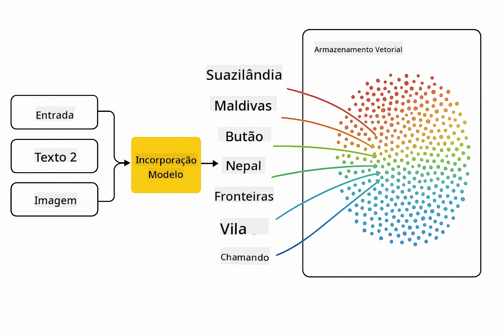
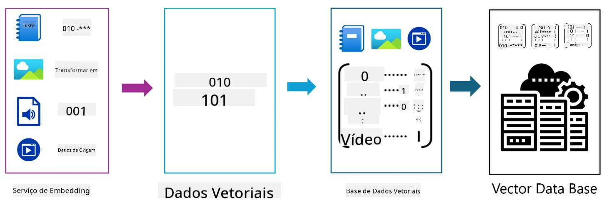
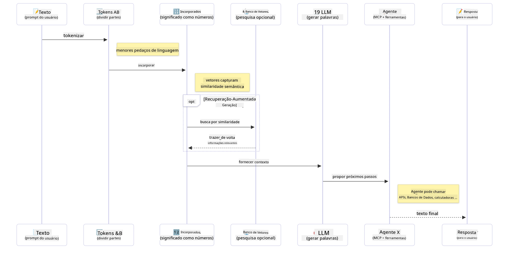

<!--
CO_OP_TRANSLATOR_METADATA:
{
  "original_hash": "75bfb080ca725e8a9aa9c80cae25fba1",
  "translation_date": "2025-07-29T09:01:58+00:00",
  "source_file": "01-IntroToGenAI/README.md",
  "language_code": "br"
}
-->
# Introdução à IA Generativa - Edição Java

## O que você vai aprender

- **Fundamentos de IA Generativa**, incluindo LLMs, engenharia de prompts, tokens, embeddings e bancos de dados vetoriais
- **Comparar ferramentas de desenvolvimento de IA em Java**, como Azure OpenAI SDK, Spring AI e OpenAI Java SDK
- **Descobrir o Protocolo de Contexto de Modelo** e seu papel na comunicação de agentes de IA

## Índice

- [Introdução](../../../01-IntroToGenAI)
- [Uma rápida revisão sobre conceitos de IA Generativa](../../../01-IntroToGenAI)
- [Revisão de engenharia de prompts](../../../01-IntroToGenAI)
- [Tokens, embeddings e agentes](../../../01-IntroToGenAI)
- [Ferramentas e bibliotecas de desenvolvimento de IA para Java](../../../01-IntroToGenAI)
  - [OpenAI Java SDK](../../../01-IntroToGenAI)
  - [Spring AI](../../../01-IntroToGenAI)
  - [Azure OpenAI Java SDK](../../../01-IntroToGenAI)
- [Resumo](../../../01-IntroToGenAI)
- [Próximos passos](../../../01-IntroToGenAI)

## Introdução

Bem-vindo ao primeiro capítulo de IA Generativa para Iniciantes - Edição Java! Esta lição introdutória apresenta os conceitos fundamentais de IA generativa e como trabalhar com eles usando Java. Você aprenderá sobre os blocos de construção essenciais para aplicações de IA, incluindo Modelos de Linguagem de Grande Escala (LLMs), tokens, embeddings e agentes de IA. Também exploraremos as principais ferramentas Java que você usará ao longo deste curso.

### Uma rápida revisão sobre conceitos de IA Generativa

IA Generativa é um tipo de inteligência artificial que cria novos conteúdos, como texto, imagens ou código, com base em padrões e relações aprendidos a partir de dados. Modelos de IA generativa podem gerar respostas semelhantes às humanas, entender contextos e, às vezes, até criar conteúdos que parecem humanos.

Ao desenvolver suas aplicações de IA em Java, você trabalhará com **modelos de IA generativa** para criar conteúdo. Algumas capacidades dos modelos de IA generativa incluem:

- **Geração de Texto**: Produção de texto semelhante ao humano para chatbots, conteúdo e conclusão de texto.
- **Geração e Análise de Imagens**: Criação de imagens realistas, aprimoramento de fotos e detecção de objetos.
- **Geração de Código**: Escrita de trechos de código ou scripts.

Existem tipos específicos de modelos otimizados para diferentes tarefas. Por exemplo, tanto **Modelos de Linguagem Pequenos (SLMs)** quanto **Modelos de Linguagem de Grande Escala (LLMs)** podem lidar com geração de texto, sendo que os LLMs geralmente oferecem melhor desempenho para tarefas complexas. Para tarefas relacionadas a imagens, você usaria modelos de visão especializados ou modelos multimodais.

É claro que as respostas desses modelos nem sempre são perfeitas. Você provavelmente já ouviu falar sobre modelos "alucinando" ou gerando informações incorretas de maneira autoritária. Mas você pode ajudar a orientar o modelo para gerar melhores respostas fornecendo instruções claras e contexto. É aqui que entra a **engenharia de prompts**.

#### Revisão de engenharia de prompts

Engenharia de prompts é a prática de projetar entradas eficazes para orientar os modelos de IA em direção aos resultados desejados. Isso envolve:

- **Clareza**: Tornar as instruções claras e sem ambiguidades.
- **Contexto**: Fornecer informações de fundo necessárias.
- **Restrições**: Especificar quaisquer limitações ou formatos.

Algumas práticas recomendadas para engenharia de prompts incluem design de prompts, instruções claras, divisão de tarefas, aprendizado de um único exemplo e de poucos exemplos, e ajuste de prompts. Testar diferentes prompts é essencial para encontrar o que funciona melhor para seu caso de uso específico.

Ao desenvolver aplicações, você trabalhará com diferentes tipos de prompts:
- **Prompts de sistema**: Definem as regras base e o contexto para o comportamento do modelo
- **Prompts de usuário**: Os dados de entrada dos usuários da sua aplicação
- **Prompts de assistente**: As respostas do modelo com base nos prompts de sistema e de usuário

> **Saiba mais**: Saiba mais sobre engenharia de prompts no [capítulo de Engenharia de Prompts do curso GenAI para Iniciantes](https://github.com/microsoft/generative-ai-for-beginners/tree/main/04-prompt-engineering-fundamentals)

#### Tokens, embeddings e agentes

Ao trabalhar com modelos de IA generativa, você encontrará termos como **tokens**, **embeddings**, **agentes** e **Protocolo de Contexto de Modelo (MCP)**. Aqui está uma visão detalhada desses conceitos:

- **Tokens**: Tokens são a menor unidade de texto em um modelo. Eles podem ser palavras, caracteres ou subpalavras. Tokens são usados para representar dados de texto em um formato que o modelo pode entender. Por exemplo, a frase "O rápido cachorro marrom pulou sobre o cachorro preguiçoso" pode ser tokenizada como ["O", " rápido", " cachorro", " marrom", " pulou", " sobre", " o", " cachorro", " preguiçoso"] ou ["O", " rá", "pido", " ca", "chorro", " ma", "rrom", " pu", "lou", " so", "bre", " o", " ca", "chorro", " pre", "gui", "çoso"] dependendo da estratégia de tokenização.

Tokenização é o processo de dividir o texto em essas unidades menores. Isso é crucial porque os modelos operam com tokens em vez de texto bruto. O número de tokens em um prompt afeta o comprimento e a qualidade da resposta do modelo, já que os modelos têm limites de tokens para sua janela de contexto (por exemplo, 128K tokens para o contexto total do GPT-4o, incluindo entrada e saída).

  Em Java, você pode usar bibliotecas como o OpenAI SDK para lidar com a tokenização automaticamente ao enviar solicitações para modelos de IA.

- **Embeddings**: Embeddings são representações vetoriais de tokens que capturam o significado semântico. São representações numéricas (normalmente arrays de números de ponto flutuante) que permitem aos modelos entender relações entre palavras e gerar respostas contextualmente relevantes. Palavras semelhantes têm embeddings semelhantes, permitindo que o modelo entenda conceitos como sinônimos e relações semânticas.

  Em Java, você pode gerar embeddings usando o OpenAI SDK ou outras bibliotecas que suportam geração de embeddings. Esses embeddings são essenciais para tarefas como busca semântica, onde você deseja encontrar conteúdo semelhante com base no significado, em vez de correspondências exatas de texto.

- **Bancos de dados vetoriais**: Bancos de dados vetoriais são sistemas de armazenamento especializados otimizados para embeddings. Eles permitem buscas eficientes por similaridade e são cruciais para padrões de Geração Aumentada por Recuperação (RAG), onde você precisa encontrar informações relevantes em grandes conjuntos de dados com base na similaridade semântica, em vez de correspondências exatas.

> **Nota**: Neste curso, não abordaremos bancos de dados vetoriais, mas achamos que vale a pena mencioná-los, pois são comumente usados em aplicações do mundo real.

- **Agentes & MCP**: Componentes de IA que interagem autonomamente com modelos, ferramentas e sistemas externos. O Protocolo de Contexto de Modelo (MCP) fornece uma maneira padronizada para agentes acessarem com segurança fontes de dados externas e ferramentas. Saiba mais em nosso curso [MCP para Iniciantes](https://github.com/microsoft/mcp-for-beginners).

Em aplicações de IA em Java, você usará tokens para processamento de texto, embeddings para busca semântica e RAG, bancos de dados vetoriais para recuperação de dados e agentes com MCP para construir sistemas inteligentes que utilizam ferramentas.

### Ferramentas e bibliotecas de desenvolvimento de IA para Java

Java oferece excelentes ferramentas para desenvolvimento de IA. Há três principais bibliotecas que exploraremos ao longo deste curso - OpenAI Java SDK, Azure OpenAI SDK e Spring AI.

Aqui está uma tabela de referência rápida mostrando qual SDK é usado nos exemplos de cada capítulo:

| Capítulo | Exemplo | SDK |
|----------|---------|-----|
| 02-SetupDevEnvironment | github-models | OpenAI Java SDK |
| 02-SetupDevEnvironment | basic-chat-azure | Spring AI Azure OpenAI |
| 03-CoreGenerativeAITechniques | exemplos | Azure OpenAI SDK |
| 04-PracticalSamples | petstory | OpenAI Java SDK |
| 04-PracticalSamples | foundrylocal | OpenAI Java SDK |
| 04-PracticalSamples | calculator | Spring AI MCP SDK + LangChain4j |

**Links de Documentação dos SDKs:**
- [Azure OpenAI Java SDK](https://github.com/Azure/azure-sdk-for-java/tree/azure-ai-openai_1.0.0-beta.16/sdk/openai/azure-ai-openai)
- [Spring AI](https://docs.spring.io/spring-ai/reference/)
- [OpenAI Java SDK](https://github.com/openai/openai-java)
- [LangChain4j](https://docs.langchain4j.dev/)

#### OpenAI Java SDK

O OpenAI SDK é a biblioteca oficial de Java para a API OpenAI. Ele fornece uma interface simples e consistente para interagir com os modelos da OpenAI, facilitando a integração de capacidades de IA em aplicações Java. O exemplo GitHub Models do Capítulo 2, a aplicação Pet Story do Capítulo 4 e o exemplo Foundry Local demonstram a abordagem do OpenAI SDK.

#### Spring AI

Spring AI é um framework abrangente que traz capacidades de IA para aplicações Spring, fornecendo uma camada de abstração consistente entre diferentes provedores de IA. Ele se integra perfeitamente ao ecossistema Spring, tornando-se a escolha ideal para aplicações empresariais Java que precisam de capacidades de IA.

A força do Spring AI está em sua integração perfeita com o ecossistema Spring, facilitando a construção de aplicações de IA prontas para produção com padrões Spring familiares, como injeção de dependência, gerenciamento de configuração e frameworks de teste. Você usará Spring AI nos Capítulos 2 e 4 para construir aplicações que aproveitam tanto OpenAI quanto as bibliotecas Spring AI do Protocolo de Contexto de Modelo (MCP).

##### Protocolo de Contexto de Modelo (MCP)

O [Protocolo de Contexto de Modelo (MCP)](https://modelcontextprotocol.io/) é um padrão emergente que permite que aplicações de IA interajam com segurança com fontes de dados externas e ferramentas. MCP fornece uma maneira padronizada para modelos de IA acessarem informações contextuais e executarem ações em suas aplicações.

No Capítulo 4, você construirá um serviço de calculadora MCP simples que demonstra os fundamentos do Protocolo de Contexto de Modelo com Spring AI, mostrando como criar integrações básicas de ferramentas e arquiteturas de serviço.

#### Azure OpenAI Java SDK

A biblioteca cliente Azure OpenAI para Java é uma adaptação das APIs REST da OpenAI que fornece uma interface idiomática e integração com o restante do ecossistema Azure SDK. No Capítulo 3, você construirá aplicações usando o Azure OpenAI SDK, incluindo aplicações de chat, chamadas de função e padrões de Geração Aumentada por Recuperação (RAG).

> Nota: O Azure OpenAI SDK está atrás do OpenAI Java SDK em termos de recursos, então para projetos futuros, considere usar o OpenAI Java SDK.

## Resumo

Isso conclui os fundamentos! Agora você entende:

- Os conceitos principais por trás da IA generativa - desde LLMs e engenharia de prompts até tokens, embeddings e bancos de dados vetoriais
- Suas opções de ferramentas para desenvolvimento de IA em Java: Azure OpenAI SDK, Spring AI e OpenAI Java SDK
- O que é o Protocolo de Contexto de Modelo e como ele permite que agentes de IA trabalhem com ferramentas externas

## Próximos passos

[Capítulo 2: Configurando o Ambiente de Desenvolvimento](../02-SetupDevEnvironment/README.md)

**Aviso Legal**:  
Este documento foi traduzido utilizando o serviço de tradução por IA [Co-op Translator](https://github.com/Azure/co-op-translator). Embora nos esforcemos para garantir a precisão, esteja ciente de que traduções automáticas podem conter erros ou imprecisões. O documento original em seu idioma nativo deve ser considerado a fonte oficial. Para informações críticas, recomenda-se a tradução profissional feita por humanos. Não nos responsabilizamos por quaisquer mal-entendidos ou interpretações equivocadas decorrentes do uso desta tradução.