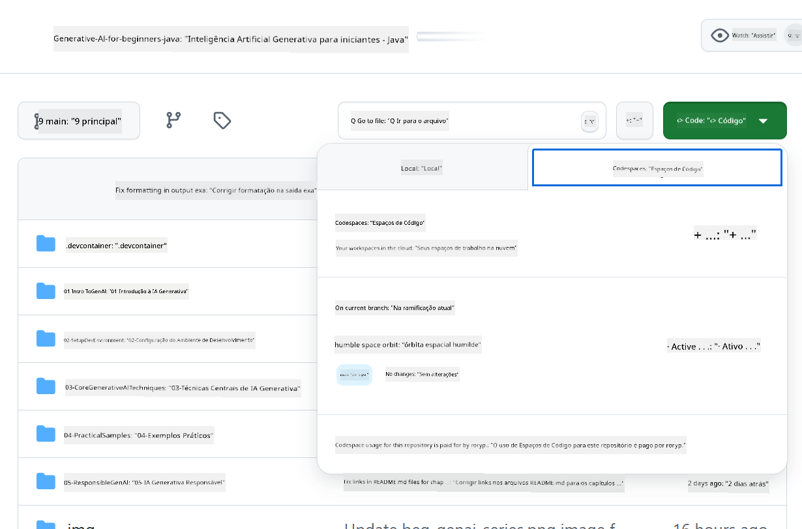

<!--
CO_OP_TRANSLATOR_METADATA:
{
  "original_hash": "e00bbea0f95c611aa3bec676d23e8b43",
  "translation_date": "2025-07-21T18:03:18+00:00",
  "source_file": "02-SetupDevEnvironment/getting-started-azure-openai.md",
  "language_code": "br"
}
-->
# Configurando o Ambiente de Desenvolvimento para Azure OpenAI

> **Início Rápido**: Este guia é para configuração do Azure OpenAI. Para começar imediatamente com modelos gratuitos, use [Modelos do GitHub com Codespaces](./README.md#quick-start-cloud).

Este guia ajudará você a configurar os modelos do Azure AI Foundry para seus aplicativos Java de IA neste curso.

## Índice

- [Visão Geral da Configuração Rápida](../../../02-SetupDevEnvironment)
- [Passo 1: Criar Recursos do Azure AI Foundry](../../../02-SetupDevEnvironment)
  - [Criar um Hub e Projeto](../../../02-SetupDevEnvironment)
  - [Implantar o Modelo GPT-4o-mini](../../../02-SetupDevEnvironment)
- [Passo 2: Criar seu Codespace](../../../02-SetupDevEnvironment)
- [Passo 3: Configurar seu Ambiente](../../../02-SetupDevEnvironment)
- [Passo 4: Testar sua Configuração](../../../02-SetupDevEnvironment)
- [O que vem a seguir?](../../../02-SetupDevEnvironment)
- [Recursos](../../../02-SetupDevEnvironment)
- [Recursos Adicionais](../../../02-SetupDevEnvironment)

## Visão Geral da Configuração Rápida

1. Crie recursos do Azure AI Foundry (Hub, Projeto, Modelo)
2. Crie um Codespace com um contêiner de desenvolvimento Java
3. Configure seu arquivo .env com credenciais do Azure OpenAI
4. Teste sua configuração com o projeto de exemplo

## Passo 1: Criar Recursos do Azure AI Foundry

### Criar um Hub e Projeto

1. Acesse o [Portal do Azure AI Foundry](https://ai.azure.com/) e faça login
2. Clique em **+ Criar** → **Novo hub** (ou navegue até **Gerenciamento** → **Todos os hubs** → **+ Novo hub**)
3. Configure seu hub:
   - **Nome do hub**: por exemplo, "MeuHubAI"
   - **Assinatura**: Selecione sua assinatura do Azure
   - **Grupo de recursos**: Crie um novo ou selecione um existente
   - **Localização**: Escolha a mais próxima de você
   - **Conta de armazenamento**: Use a padrão ou configure uma personalizada
   - **Key vault**: Use o padrão ou configure um personalizado
   - Clique em **Próximo** → **Revisar + criar** → **Criar**
4. Após a criação, clique em **+ Novo projeto** (ou **Criar projeto** na visão geral do hub)
   - **Nome do projeto**: por exemplo, "GenAIJava"
   - Clique em **Criar**

### Implantar o Modelo GPT-4o-mini

1. No seu projeto, vá para **Catálogo de modelos** e procure por **gpt-4o-mini**
   - *Alternativa: Vá para **Implantações** → **+ Criar implantação***
2. Clique em **Implantar** no cartão do modelo gpt-4o-mini
3. Configure a implantação:
   - **Nome da implantação**: "gpt-4o-mini"
   - **Versão do modelo**: Use a mais recente
   - **Tipo de implantação**: Padrão
4. Clique em **Implantar**
5. Após a implantação, vá para a aba **Implantações** e copie os seguintes valores:
   - **Nome da implantação** (por exemplo, "gpt-4o-mini")
   - **URI de destino** (por exemplo, `https://seu-nome-do-hub.openai.azure.com/`) 
      > **Importante**: Copie apenas a URL base (por exemplo, `https://meuhub.openai.azure.com/`) e não o caminho completo do endpoint.
   - **Chave** (na seção de Chaves e Endpoint)

> **Ainda com problemas?** Visite a [Documentação Oficial do Azure AI Foundry](https://learn.microsoft.com/azure/ai-foundry/how-to/create-projects?tabs=ai-foundry&pivots=hub-project)

## Passo 2: Criar seu Codespace

1. Faça um fork deste repositório para sua conta do GitHub
   > **Nota**: Se você quiser editar a configuração básica, veja a [Configuração do Contêiner de Desenvolvimento](../../../.devcontainer/devcontainer.json)
2. No repositório que você fez fork, clique em **Code** → aba **Codespaces**
3. Clique em **...** → **Novo com opções...**

4. Selecione **Configuração do contêiner de desenvolvimento**: 
   - **Ambiente de Desenvolvimento Java para IA Generativa**
5. Clique em **Criar codespace**

## Passo 3: Configurar seu Ambiente

Quando seu Codespace estiver pronto, configure suas credenciais do Azure OpenAI:

1. **Navegue até o projeto de exemplo a partir da raiz do repositório:**
   ```bash
   cd 02-SetupDevEnvironment/src/basic-chat-azure
   ```

2. **Crie seu arquivo .env:**
   ```bash
   cp .env.example .env
   ```

3. **Edite o arquivo .env com suas credenciais do Azure OpenAI:**
   ```bash
   # Your Azure OpenAI API key (from Azure AI Foundry portal)
   AZURE_AI_KEY=your-actual-api-key-here
   
   # Your Azure OpenAI endpoint URL (e.g., https://myhub.openai.azure.com/)
   AZURE_AI_ENDPOINT=https://your-hub-name.openai.azure.com/
   ```

   > **Nota de Segurança**: 
   > - Nunca faça commit do seu arquivo `.env` no controle de versão
   > - O arquivo `.env` já está incluído no `.gitignore`
   > - Mantenha suas chaves de API seguras e as rotacione regularmente

## Passo 4: Testar sua Configuração

Execute o aplicativo de exemplo para testar sua conexão com o Azure OpenAI:

```bash
mvn clean spring-boot:run
```

Você deverá ver uma resposta do modelo GPT-4o-mini!

> **Usuários do VS Code**: Você também pode pressionar `F5` no VS Code para executar o aplicativo. A configuração de inicialização já está preparada para carregar automaticamente seu arquivo `.env`.

> **Exemplo completo**: Veja o [Exemplo Completo do Azure OpenAI](./src/basic-chat-azure/README.md) para instruções detalhadas e solução de problemas.

## O que vem a seguir?

**Configuração Concluída!** Agora você tem:
- Azure OpenAI com gpt-4o-mini implantado
- Configuração local do arquivo .env
- Ambiente de desenvolvimento Java pronto

**Continue para** [Capítulo 3: Técnicas Fundamentais de IA Generativa](../03-CoreGenerativeAITechniques/README.md) para começar a construir aplicativos de IA!

## Recursos

- [Documentação do Azure AI Foundry](https://learn.microsoft.com/azure/ai-services/)
- [Documentação do Spring AI Azure OpenAI](https://docs.spring.io/spring-ai/reference/api/clients/azure-openai-chat.html)
- [SDK Java do Azure OpenAI](https://learn.microsoft.com/java/api/overview/azure/ai-openai-readme)

## Recursos Adicionais

- [Baixar VS Code](https://code.visualstudio.com/Download)
- [Obter Docker Desktop](https://www.docker.com/products/docker-desktop)
- [Configuração do Contêiner de Desenvolvimento](../../../.devcontainer/devcontainer.json)

**Aviso Legal**:  
Este documento foi traduzido utilizando o serviço de tradução por IA [Co-op Translator](https://github.com/Azure/co-op-translator). Embora nos esforcemos para garantir a precisão, esteja ciente de que traduções automatizadas podem conter erros ou imprecisões. O documento original em seu idioma nativo deve ser considerado a fonte autoritativa. Para informações críticas, recomenda-se a tradução profissional realizada por humanos. Não nos responsabilizamos por quaisquer mal-entendidos ou interpretações equivocadas decorrentes do uso desta tradução.