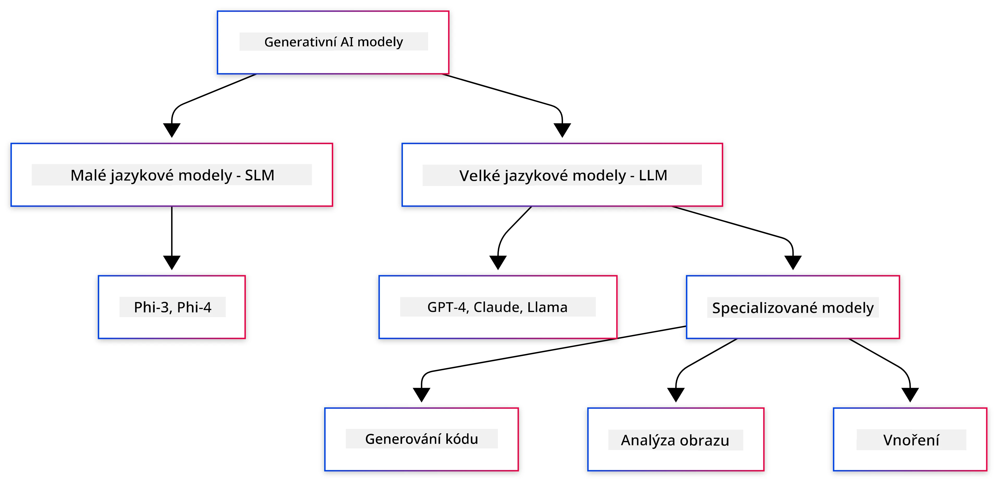
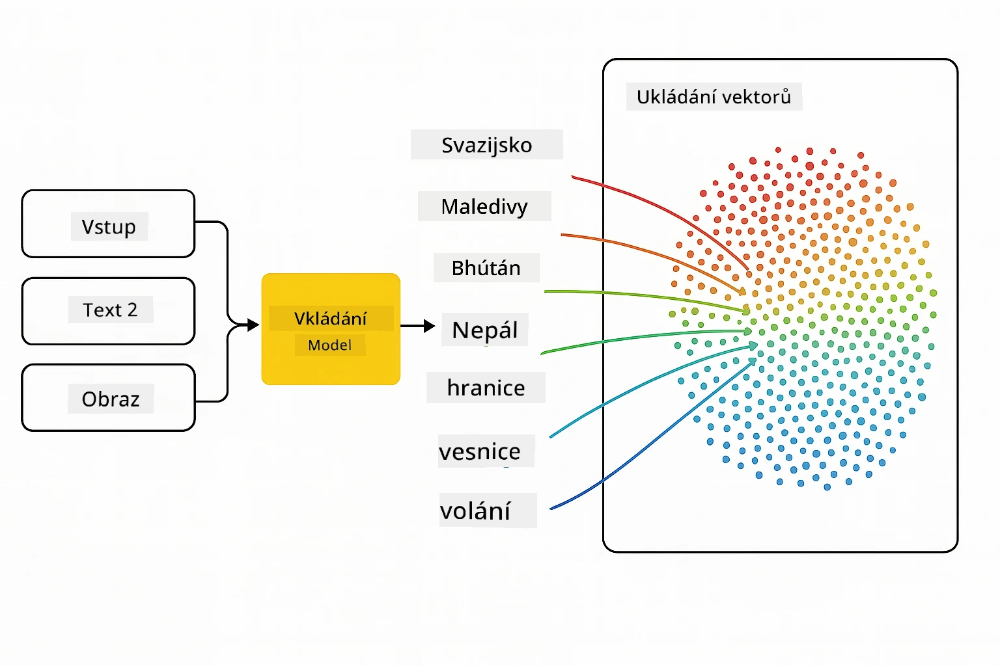
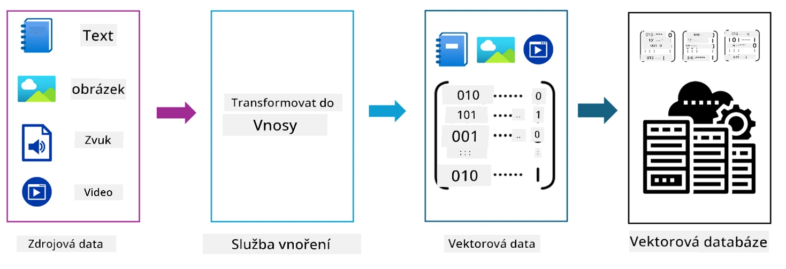
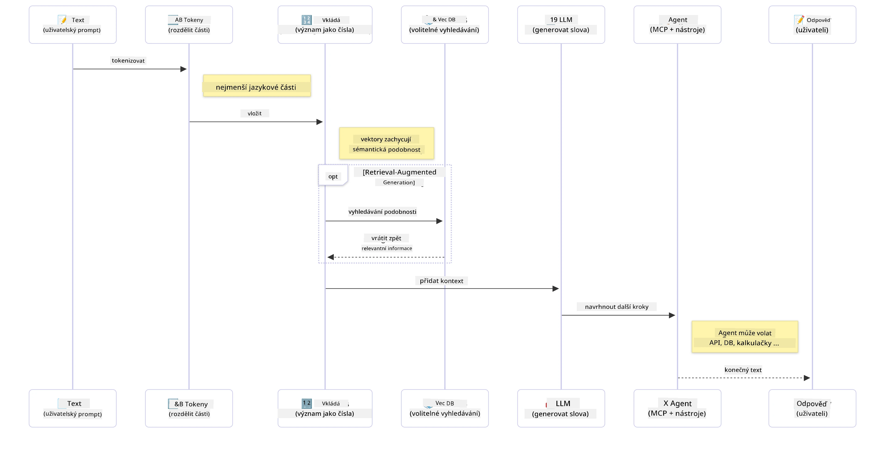

# Úvod do generativní AI - Java edice

> **Video**: [Podívejte se na videopřehled této lekce na YouTube.](https://www.youtube.com/watch?v=XH46tGp_eSw) Můžete také kliknout na náhledový obrázek výše.

## Co se naučíte

- **Základy generativní AI**, včetně LLM, prompt engineeringu, tokenů, embeddings a vektorových databází
- **Porovnání nástrojů pro vývoj AI v Javě**, včetně Azure OpenAI SDK, Spring AI a OpenAI Java SDK
- **Seznámení s Model Context Protocol** a jeho rolí v komunikaci AI agentů

## Obsah

- [Úvod](#úvod)
- [Rychlé připomenutí pojmů generativní AI](#rychlé-připomenutí-pojmů-generativní-ai)
- [Přehled prompt engineeringu](#přehled-prompt-engineeringu)
- [Tokeny, embeddings a agenti](#tokeny-embeddings-a-agenti)
- [Nástroje a knihovny pro vývoj AI v Javě](#nástroje-a-knihovny-pro-vývoj-ai-v-javě)
  - [OpenAI Java SDK](#openai-java-sdk)
  - [Spring AI](#spring-ai)
  - [Azure OpenAI Java SDK](#azure-openai-java-sdk)
- [Souhrn](#souhrn)
- [Další kroky](#další-kroky)

## Úvod

Vítejte v první kapitole Generativní AI pro začátečníky - Java edice! Tato základní lekce vám představí klíčové koncepty generativní AI a jak s nimi pracovat v Javě. Naučíte se základní stavební prvky AI aplikací, včetně Velkých jazykových modelů (LLM), tokenů, embeddings a AI agentů. Také si probereme hlavní Java nástroje, které budete používat v průběhu kurzu.

### Rychlé připomenutí pojmů generativní AI

Generativní AI je typ umělé inteligence, která vytváří nový obsah, jako je text, obrázky nebo kód, na základě vzorů a vztahů naučených z dat. Generativní AI modely dokážou generovat odpovědi podobné lidským, rozumět kontextu a někdy dokonce vytvářet obsah, který působí lidsky.

Při vývoji vašich AI aplikací v Javě budete pracovat s **generativními AI modely**, které vytvářejí obsah. Některé schopnosti těchto modelů zahrnují:

- **Generování textu**: Vytváření textu podobného lidskému pro chatovací roboty, obsah a doplňování textu.
- **Generování a analýza obrázků**: Produkce realistických obrázků, vylepšování fotografií a detekce objektů.
- **Generování kódu**: Psaní kódových úryvků nebo skriptů.

Existují specifické typy modelů optimalizované pro různé úkoly. Například jak **Malé jazykové modely (SLM)**, tak **Velké jazykové modely (LLM)** mohou zvládat generování textu, přičemž LLM obvykle nabídnou lepší výkon u složitějších úloh. Pro úkoly související s obrázky byste používali specializované modely pro vidění nebo multimodální modely.

Samozřejmě, odpovědi těchto modelů nejsou vždy dokonalé. Asi jste slyšeli o tom, že modely "halucinují" nebo generují nesprávné informace s jistotou. Ale můžete model nasměrovat k lepším odpovědím tím, že mu poskytnete jasné pokyny a kontext. Právě tady přichází na řadu **prompt engineering**.

#### Přehled prompt engineeringu

Prompt engineering je praxe navrhování účinných vstupů, které vedou AI modely k požadovaným výstupům. Zahrnuje:

- **Jasnost**: Dělat pokyny jasné a jednoznačné.
- **Kontext**: Poskytovat nezbytné pozadí.
- **Omezení**: Specifikovat jakákoliv omezení nebo formáty.

Některé osvědčené praktiky prompt engineeringu zahrnují návrh promptů, jasné instrukce, rozdělení úkolů, učení na základě jednoho nebo několika příkladů a ladění promptů. Testování různých promptů je nezbytné, abyste našli, co nejlépe vyhovuje vašemu konkrétnímu případu použití.

Při vývoji aplikací budete pracovat s různými typy promptů:
- **Systémové prompty**: Nastavují základní pravidla a kontext chování modelu
- **Uživatelské prompty**: Vstupní data od uživatelů vaší aplikace
- **Asistenční prompty**: Odpovědi modelu založené na systémových a uživatelských promtech

> **Další informace**: Více o prompt engineeringu najdete v [kapitole Prompt Engineering kurzu GenAI pro začátečníky](https://github.com/microsoft/generative-ai-for-beginners/tree/main/04-prompt-engineering-fundamentals)

#### Tokeny, embeddings a agenti

Při práci s generativními AI modely se setkáte s pojmy jako **tokeny**, **embeddings**, **agenti** a **Model Context Protocol (MCP)**. Zde je podrobný přehled těchto konceptů:

- **Tokeny**: Tokeny jsou nejmenší jednotkou textu v modelu. Mohou to být slova, znaky nebo podslova. Tokeny slouží k reprezentaci textových dat ve formátu, který model může chápat. Například věta „The quick brown fox jumped over the lazy dog“ může být tokenizována jako ["The", " quick", " brown", " fox", " jumped", " over", " the", " lazy", " dog"] nebo ["The", " qu", "ick", " br", "own", " fox", " jump", "ed", " over", " the", " la", "zy", " dog"] v závislosti na strategii tokenizace.

Tokenizace je proces rozdělování textu na tyto menší jednotky. To je důležité, protože modely pracují s tokeny místo surového textu. Počet tokenů v promptu ovlivňuje délku a kvalitu odpovědi modelu, protože modely mají limity tokenů pro své kontextové okno (např. 128K tokenů pro celkový kontext GPT-4o, zahrnující vstup i výstup).

  V Javě můžete použít knihovny jako OpenAI SDK, které tokenizaci automaticky zpracují při odesílání požadavků na AI modely.

- **Embeddings**: Embeddings jsou vektorové reprezentace tokenů, které zachycují jejich sémantický význam. Jsou to číselné reprezentace (obvykle pole desetinných čísel), které umožňují modelům rozumět vztahům mezi slovy a generovat kontextově relevantní odpovědi. Podobná slova mají podobné embeddings, což modelu umožňuje chápat pojmy jako synonyma a sémantické vztahy.

  V Javě můžete generovat embeddings pomocí OpenAI SDK nebo jiných knihoven podporujících generování embeddings. Tyto embeddings jsou nezbytné pro úkoly jako sémantické vyhledávání, kde chcete najít podobný obsah na základě významu místo přesných textových shod.

- **Vektorové databáze**: Vektorové databáze jsou specializované úložné systémy optimalizované pro embeddings. Umožňují efektivní vyhledávání podle podobnosti a jsou klíčové pro vzory Retrieval-Augmented Generation (RAG), kde je potřeba najít relevantní informace z velkých datových sad na základě sémantické podobnosti, nikoli přesných shod.

> **Poznámka**: V tomto kurzu se vektorovými databázemi nezabýváme, ale stojí za zmínku, protože se běžně používají v reálných aplikacích.

- **Agenti a MCP**: AI komponenty, které autonomně komunikují s modely, nástroji a externími systémy. Model Context Protocol (MCP) poskytuje standardizovaný způsob, jak agenti bezpečně přistupují k externím zdrojům dat a nástrojům. Více se dozvíte v našem [kurzu MCP pro začátečníky](https://github.com/microsoft/mcp-for-beginners).

V Java AI aplikacích použijete tokeny pro zpracování textu, embeddings pro sémantické vyhledávání a RAG, vektorové databáze pro vyhledávání dat a agenty s MCP pro tvorbu inteligentních systémů využívajících nástroje.

### Nástroje a knihovny pro vývoj AI v Javě

Java nabízí výborné nástroje pro vývoj AI. Existují tři hlavní knihovny, které budeme během kurzu zkoumat - OpenAI Java SDK, Azure OpenAI SDK a Spring AI.

Zde je rychlá referenční tabulka, která ukazuje, který SDK se používá v příkladech jednotlivých kapitol:

| Kapitola | Příklad | SDK |
|---------|---------|-----|
| 02-SetupDevEnvironment | github-models | OpenAI Java SDK |
| 02-SetupDevEnvironment | basic-chat-azure | Spring AI Azure OpenAI |
| 03-CoreGenerativeAITechniques | examples | Azure OpenAI SDK |
| 04-PracticalSamples | petstory | OpenAI Java SDK |
| 04-PracticalSamples | foundrylocal | OpenAI Java SDK |
| 04-PracticalSamples | calculator | Spring AI MCP SDK + LangChain4j |

**Odkazy na dokumentaci SDK:**
- [Azure OpenAI Java SDK](https://github.com/Azure/azure-sdk-for-java/tree/azure-ai-openai_1.0.0-beta.16/sdk/openai/azure-ai-openai)
- [Spring AI](https://docs.spring.io/spring-ai/reference/)
- [OpenAI Java SDK](https://github.com/openai/openai-java)
- [LangChain4j](https://docs.langchain4j.dev/)

#### OpenAI Java SDK

OpenAI SDK je oficiální Java knihovna pro OpenAI API. Poskytuje jednoduché a konzistentní rozhraní pro komunikaci s modely OpenAI, což usnadňuje integraci AI funkcí do Java aplikací. Příklad GitHub Models v kapitole 2, Pet Story a Foundry Local příklady v kapitole 4 ukazují použití OpenAI SDK.

#### Spring AI

Spring AI je komplexní framework, který přináší AI schopnosti do Spring aplikací, poskytující konzistentní abstraktní vrstvu napříč různými AI poskytovateli. Integrovaný je bezproblémově do Spring ekosystému, což ho činí ideální volbou pro podnikové Java aplikace, které potřebují AI.

Síla Spring AI spočívá v jeho bezproblémové integraci se Spring ekosystémem, což umožňuje snadno stavět produkčně připravené AI aplikace s dobře známými Spring vzory, jako jsou dependency injection, správa konfigurace a testovací frameworky. Spring AI použijete v kapitolách 2 a 4 k tvorbě aplikací využívajících jak OpenAI, tak Model Context Protocol (MCP) Spring AI knihovny.

##### Model Context Protocol (MCP)

[Model Context Protocol (MCP)](https://modelcontextprotocol.io/) je nově vznikající standard, který umožňuje AI aplikacím bezpečně komunikovat s externími zdroji dat a nástroji. MCP poskytuje standardizovaný způsob, jak AI modely přistupují ke kontextuálním informacím a vykonávají akce ve vašich aplikacích.

V kapitole 4 si vytvoříte jednoduchou MCP kalkulačku, která demonstruje základy Model Context Protocol se Spring AI, ukazující, jak vytvořit základní integrace nástrojů a architektury služeb.

#### Azure OpenAI Java SDK

Knihovna Azure OpenAI pro Javu je adaptací REST API OpenAI, která poskytuje idiomatické rozhraní a integraci s celým ekosystémem Azure SDK. V kapitole 3 budete vytvářet aplikace s využitím Azure OpenAI SDK, včetně chatovacích aplikací, volání funkcí a RAG (Retrieval-Augmented Generation) vzorů.

> Poznámka: Azure OpenAI SDK zaostává za OpenAI Java SDK co do funkcí, takže pro budoucí projekty zvažte použití OpenAI Java SDK.

## Souhrn

Tím jsme shrnuli základy! Nyní rozumíte:

- Základním konceptům generativní AI – od LLM a prompt engineeringu po tokeny, embeddings a vektorové databáze
- Vašim možnostem pro vývoj AI v Javě: Azure OpenAI SDK, Spring AI a OpenAI Java SDK
- Co je Model Context Protocol a jak umožňuje AI agentům pracovat s externími nástroji

## Další kroky

[Kapitola 2: Nastavení vývojového prostředí](../02-SetupDevEnvironment/README.md)

---

<!-- CO-OP TRANSLATOR DISCLAIMER START -->
**Upozornění**:
Tento dokument byl přeložen pomocí AI překladatelské služby [Co-op Translator](https://github.com/Azure/co-op-translator). Přestože usilujeme o přesnost, mějte prosím na paměti, že automatizované překlady mohou obsahovat chyby nebo nepřesnosti. Originální dokument v jeho původním jazyce by měl být považován za autoritativní zdroj. Pro kritické informace se doporučuje profesionální lidský překlad. Nejsme odpovědní za jakékoliv nedorozumění nebo nesprávné výklady vyplývající z použití tohoto překladu.
<!-- CO-OP TRANSLATOR DISCLAIMER END -->