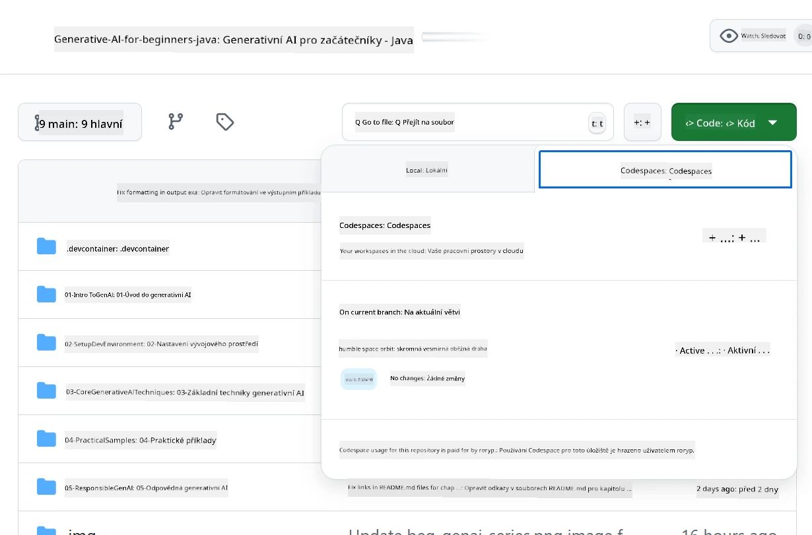
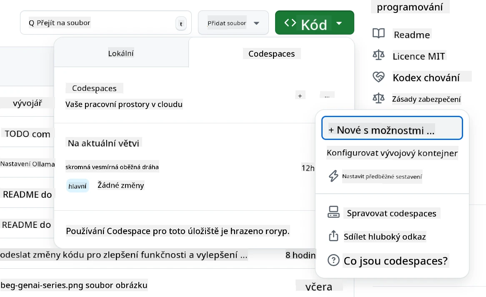
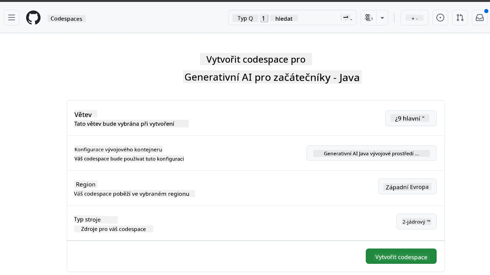
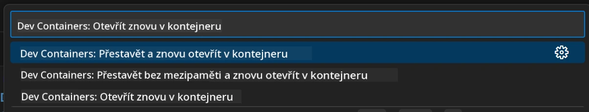
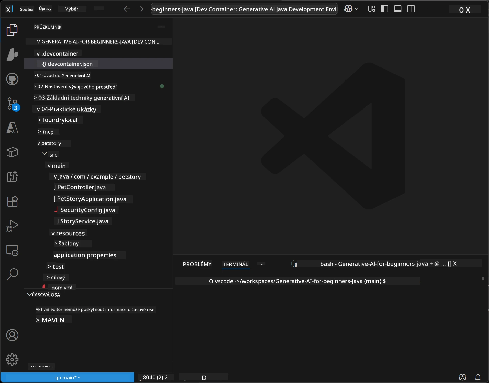
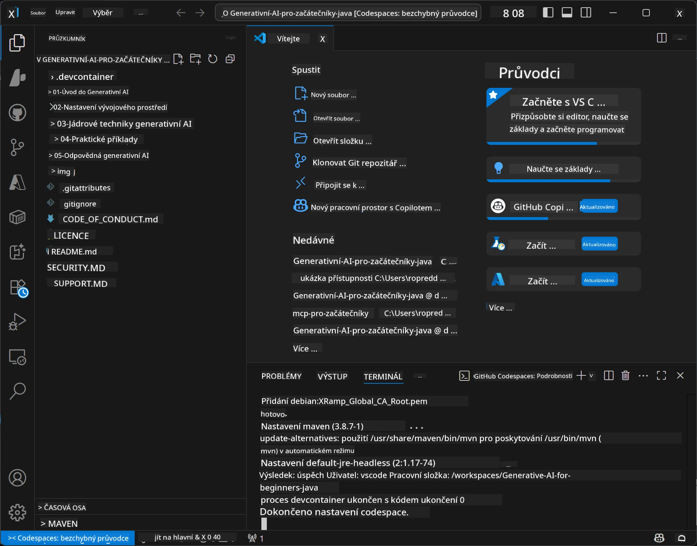

<!--
CO_OP_TRANSLATOR_METADATA:
{
  "original_hash": "96a30d42b9751a3d4e4b20e28d29d459",
  "translation_date": "2026-01-28T05:19:12+00:00",
  "source_file": "02-SetupDevEnvironment/README.md",
  "language_code": "cs"
}
-->
# Nastavení vývojového prostředí pro Generative AI pro Javu

> **Rychlý začátek**: Kódujte v cloudu za 2 minuty – přejděte na [Nastavení GitHub Codespaces](../../../02-SetupDevEnvironment) – není potřeba žádná lokální instalace a používají se modely GitHubu!

> **Máte zájem o Azure OpenAI?**, podívejte se na náš [Průvodce nastavením Azure OpenAI](getting-started-azure-openai.md) se kroky pro vytvoření nové Azure OpenAI služby.

## Co se naučíte

- Nastavení vývojového prostředí pro AI aplikace v Javě
- Výběr a konfigurace preferovaného vývojového prostředí (priorita cloudu s Codespaces, lokální dev kontejner nebo plná lokální instalace)
- Otestování vašeho nastavení připojením k GitHub modelům

## Obsah

- [Co se naučíte](../../../02-SetupDevEnvironment)
- [Úvod](../../../02-SetupDevEnvironment)
- [Krok 1: Nastavení vývojového prostředí](../../../02-SetupDevEnvironment)
  - [Možnost A: GitHub Codespaces (doporučeno)](../../../02-SetupDevEnvironment)
  - [Možnost B: Lokální dev kontejner](../../../02-SetupDevEnvironment)
  - [Možnost C: Použijte svou existující lokální instalaci](../../../02-SetupDevEnvironment)
- [Krok 2: Vytvoření osobního přístupového tokenu GitHub](../../../02-SetupDevEnvironment)
- [Krok 3: Otestujte své nastavení](../../../02-SetupDevEnvironment)
- [Řešení problémů](../../../02-SetupDevEnvironment)
- [Shrnutí](../../../02-SetupDevEnvironment)
- [Další kroky](../../../02-SetupDevEnvironment)

## Úvod

Tato kapitola vás provede nastavením vývojového prostředí. Jako hlavní příklad využijeme **GitHub Models**, protože jsou zdarma, snadno se nastavují pouze se GitHub účtem, nevyžadují kreditní kartu a poskytují přístup k více modelům pro experimentování.

**Není potřeba žádné lokální nastavení!** Můžete začít kódovat ihned s využitím GitHub Codespaces, které poskytuje plné vývojové prostředí ve vašem prohlížeči.


Pro tento kurz doporučujeme používat [**GitHub Models**](https://github.com/marketplace?type=models), protože jsou:
- **Zdarma** pro zahájení
- **Snadno** se nastavují pouze s GitHub účtem
- **Bez požadavku na kreditní kartu**
- **S více modely** pro experimentování

> **Poznámka**: GitHub Models použité v tomto školení mají tyto bezplatné limity:
> - 15 požadavků za minutu (150 denně)
> - cca 8 000 slov vstup, cca 4 000 slov výstup na jeden požadavek
> - 5 současných požadavků
> 
> Pro produkční použití upgradujte na Azure AI Foundry Models s vaším Azure účtem. Kód není potřeba měnit. Viz [dokumentace Azure AI Foundry](https://learn.microsoft.com/azure/ai-foundry/foundry-models/how-to/quickstart-github-models).

## Krok 1: Nastavení vývojového prostředí

<a name="quick-start-cloud"></a>

Vytvořili jsme předpřipravený vývojový kontejner, který minimalizuje dobu nastavení a zajišťuje, že máte všechny potřebné nástroje pro tento kurz Generative AI pro Javu. Vyberte si preferovaný způsob vývoje:

### Možnosti nastavení prostředí:

#### Možnost A: GitHub Codespaces (doporučeno)

**Začněte kódovat za 2 minuty – není třeba žádná lokální instalace!**

1. Forkněte tento repozitář do svého GitHub účtu
   > **Poznámka**: Pokud chcete upravit základní konfiguraci, podívejte se na [Dev Container Configuration](../../../.devcontainer/devcontainer.json)
2. Klikněte na **Code** → záložka **Codespaces** → **...** → **New with options...**
3. Použijte výchozí nastavení – tím vyberete **Dev container configuration**: **Generative AI Java Development Environment** vlastní devcontainer vytvořený pro tento kurz
4. Klikněte na **Create codespace**
5. Počkejte cca 2 minuty, než bude prostředí připraveno
6. Pokračujte na [Krok 2: Vytvoření GitHub tokenu](../../../02-SetupDevEnvironment)








> **Výhody Codespaces**:
> - Žádná lokální instalace není potřeba
> - Funguje na jakémkoli zařízení s prohlížečem
> - Předkonfigurované všechny nástroje a závislosti
> - Zdarma 60 hodin měsíčně pro osobní účty
> - Konzistentní prostředí pro všechny studenty

#### Možnost B: Lokální dev kontejner

**Pro vývojáře, kteří preferují lokální vývoj s Dockerem**

1. Forkněte a naklonujte tento repozitář na svůj lokální počítač
   > **Poznámka**: Pokud chcete upravit základní konfiguraci, podívejte se na [Dev Container Configuration](../../../.devcontainer/devcontainer.json)
2. Nainstalujte [Docker Desktop](https://www.docker.com/products/docker-desktop/) a [VS Code](https://code.visualstudio.com/)
3. Nainstalujte [Dev Containers rozšíření](https://marketplace.visualstudio.com/items?itemName=ms-vscode-remote.remote-containers) ve VS Code
4. Otevřete složku repozitáře ve VS Code
5. Při výzvě klikněte na **Reopen in Container** (nebo použijte `Ctrl+Shift+P` → "Dev Containers: Reopen in Container")
6. Počkejte na sestavení a spuštění kontejneru
7. Pokračujte na [Krok 2: Vytvoření GitHub tokenu](../../../02-SetupDevEnvironment)





#### Možnost C: Použijte svou existující lokální instalaci

**Pro vývojáře s existujícím Java prostředím**

Předpoklady:
- [Java 21+](https://www.oracle.com/java/technologies/javase/jdk21-archive-downloads.html) 
- [Maven 3.9+](https://maven.apache.org/download.cgi)
- [VS Code](https://code.visualstudio.com) nebo váš preferovaný IDE

Kroky:
1. Naklonujte tento repozitář na svůj lokální počítač
2. Otevřete projekt ve svém IDE
3. Pokračujte na [Krok 2: Vytvoření GitHub tokenu](../../../02-SetupDevEnvironment)

> **Profesionální tip**: Pokud máte slabý počítač, ale chcete VS Code lokálně, použijte GitHub Codespaces! Můžete připojit svůj lokální VS Code na cloud-hostovaný Codespace a získat to nejlepší z obou světů.




## Krok 2: Vytvoření osobního přístupového tokenu GitHub

1. Přejděte do [Nastavení GitHubu](https://github.com/settings/profile) a vyberte **Settings** z menu svého profilu.
2. V levém bočním panelu klikněte na **Developer settings** (obvykle dole).
3. Pod **Personal access tokens** klikněte na **Fine-grained tokens** (nebo přímo využijte tento [odkaz](https://github.com/settings/personal-access-tokens)).
4. Klikněte na **Generate new token**.
5. Do "Token name" vložte popisný název (např. `GenAI-Java-Course-Token`).
6. Nastavte datum expirace (doporučeno: 7 dní z důvodu bezpečnosti).
7. Pod "Resource owner" vyberte svůj uživatelský účet.
8. Pod "Repository access" vyberte repozitáře, které chcete použít s GitHub Models (nebo "All repositories", pokud je potřeba).
9. Pod "Account permissions" najděte **Models** a nastavte na **Read-only**.
10. Klikněte na **Generate token**.
11. **Zkopírujte a uložte si token okamžitě** – znovu jej už neuvidíte!

> **Bezpečnostní tip**: Používejte minimální potřebné oprávnění a co nejkratší praktickou dobu platnosti přístupových tokenů.

## Krok 3: Otestujte své nastavení s příkladem GitHub Models

Jakmile je vaše vývojové prostředí připraveno, otestujeme integraci GitHub Models pomocí našeho ukázkového projektu v [`02-SetupDevEnvironment/examples/github-models`](../../../02-SetupDevEnvironment/examples/github-models).

1. Otevřete terminál ve svém vývojovém prostředí.
2. Přejděte do složky s příkladem GitHub Models:
   ```bash
   cd 02-SetupDevEnvironment/examples/github-models
   ```
3. Nastavte svůj GitHub token jako proměnnou prostředí:
   ```bash
   # macOS/Linux
   export GITHUB_TOKEN=your_token_here
   
   # Windows (Příkazový řádek)
   set GITHUB_TOKEN=your_token_here
   
   # Windows (PowerShell)
   $env:GITHUB_TOKEN="your_token_here"
   ```

4. Spusťte aplikaci:
   ```bash
   mvn compile exec:java -Dexec.mainClass="com.example.githubmodels.App"
   ```

Měli byste vidět výstup podobný tomuto:
```text
Using model: gpt-4.1-nano
Sending request to GitHub Models...
Response: Hello World!
```

### Pochopení příkladového kódu

Nejprve se podívejme, co jsme právě spustili. Příklad v `examples/github-models` využívá OpenAI Java SDK k připojení k GitHub Models:

**Co tento kód dělá:**
- **Připojuje** se k GitHub Models pomocí vašeho osobního přístupového tokenu
- **Posílá** jednoduchou zprávu "Say Hello World!" AI modelu
- **Přijímá** a zobrazuje odpověď AI
- **Ověřuje**, že vaše nastavení funguje správně

**Klíčová závislost** (v `pom.xml`):
```xml
<dependency>
    <groupId>com.openai</groupId>
    <artifactId>openai-java</artifactId>
    <version>2.12.0</version>
</dependency>
```

**Hlavní kód** (`App.java`):
```java
// Připojte se k modelům GitHub pomocí OpenAI Java SDK
OpenAIClient client = OpenAIOkHttpClient.builder()
    .apiKey(pat)
    .baseUrl("https://models.inference.ai.azure.com")
    .build();

// Vytvořte požadavek na dokončení chatu
ChatCompletionCreateParams params = ChatCompletionCreateParams.builder()
    .model(modelId)
    .addSystemMessage("You are a concise assistant.")
    .addUserMessage("Say Hello World!")
    .build();

// Získejte odpověď AI
ChatCompletion response = client.chat().completions().create(params);
System.out.println("Response: " + response.choices().get(0).message().content().orElse("No response content"));
```

## Shrnutí

Skvělé! Nyní máte vše nastaveno:

- Vytvořen osobní přístupový token GitHub s správnými oprávněními pro přístup k AI modelům
- Nasměrováno a spuštěno své Java vývojové prostředí (ať už Codespaces, dev kontejnery nebo lokálně)
- Připojeno k GitHub Models pomocí OpenAI Java SDK zdarma pro vývoj AI
- Otestováno, že vše funguje, pomocí jednoduchého příkladu, který komunikuje s AI modely

## Další kroky

[Kapitola 3: Základní techniky generativní AI](../03-CoreGenerativeAITechniques/README.md)

## Řešení problémů

Máte problémy? Zde jsou běžné problémy a jejich řešení:

- **Token nefunguje?** 
  - Zkontrolujte, že jste zkopírovali celý token bez mezer navíc
  - Ověřte, že je token správně nastaven jako proměnná prostředí
  - Zkontrolujte, zda má token správná oprávnění (Models: Read-only)

- **Maven není nalezen?** 
  - Pokud používáte dev kontejnery/Codespaces, Maven by měl být předinstalovaný
  - Pro lokální setup zajistěte instalaci Java 21+ a Maven 3.9+
  - Použijte příkaz `mvn --version` k ověření instalace

- **Problémy s připojením?** 
  - Zkontrolujte své internetové připojení
  - Ověřte dostupnost GitHubu z vaší sítě
  - Ujistěte se, že nemáte firewall blokující přístup k GitHub Models endpointu

- **Dev container se nespouští?** 
  - Zkontrolujte, že Docker Desktop běží (pro lokální vývoj)
  - Zkuste rekonstrukci kontejneru: `Ctrl+Shift+P` → "Dev Containers: Rebuild Container"

- **Chyby při kompilaci aplikace?**
  - Ujistěte se, že jste ve správném adresáři: `02-SetupDevEnvironment/examples/github-models`
  - Zkuste čistou kompilaci: `mvn clean compile`

> **Potřebujete pomoc?**: Pokud problémy přetrvávají, otevřete issue v repozitáři a rádi vám pomůžeme.

---

<!-- CO-OP TRANSLATOR DISCLAIMER START -->
**Prohlášení o vyloučení odpovědnosti**:
Tento dokument byl přeložen pomocí AI překladatelské služby [Co-op Translator](https://github.com/Azure/co-op-translator). I když usilujeme o přesnost, vezměte prosím na vědomí, že automatické překlady mohou obsahovat chyby nebo nepřesnosti. Původní dokument v jeho mateřském jazyce by měl být považován za autoritativní zdroj. Pro kritické informace se doporučuje profesionální lidský překlad. Nejsme odpovědní za jakákoliv nedorozumění nebo nesprávné výklady vyplývající z použití tohoto překladu.
<!-- CO-OP TRANSLATOR DISCLAIMER END -->