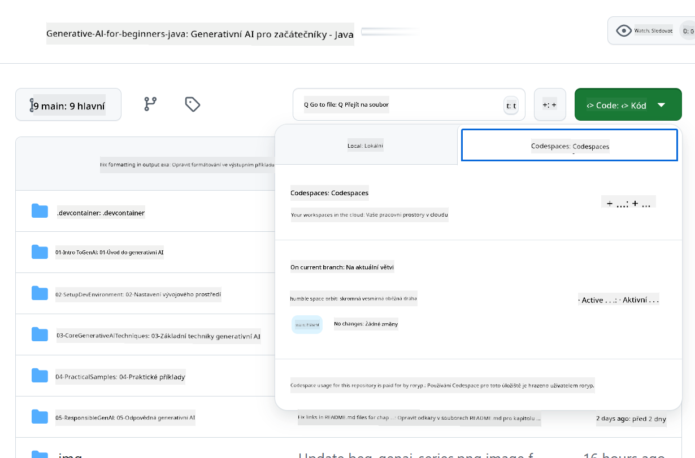

<!--
CO_OP_TRANSLATOR_METADATA:
{
  "original_hash": "bfdb4b4eadbee3a59ef742439f58326a",
  "translation_date": "2025-07-27T13:23:55+00:00",
  "source_file": "02-SetupDevEnvironment/getting-started-azure-openai.md",
  "language_code": "cs"
}
-->
# Nastavení vývojového prostředí pro Azure OpenAI

> **Rychlý start**: Tento průvodce je určen pro nastavení Azure OpenAI. Pro okamžitý začátek s bezplatnými modely použijte [GitHub Models with Codespaces](./README.md#quick-start-cloud).

Tento průvodce vám pomůže nastavit modely Azure AI Foundry pro vaše Java AI aplikace v tomto kurzu.

## Obsah

- [Přehled rychlého nastavení](../../../02-SetupDevEnvironment)
- [Krok 1: Vytvoření zdrojů Azure AI Foundry](../../../02-SetupDevEnvironment)
  - [Vytvoření hubu a projektu](../../../02-SetupDevEnvironment)
  - [Nasazení modelu GPT-4o-mini](../../../02-SetupDevEnvironment)
- [Krok 2: Vytvoření Codespace](../../../02-SetupDevEnvironment)
- [Krok 3: Konfigurace prostředí](../../../02-SetupDevEnvironment)
- [Krok 4: Testování nastavení](../../../02-SetupDevEnvironment)
- [Co dál?](../../../02-SetupDevEnvironment)
- [Zdroje](../../../02-SetupDevEnvironment)
- [Další zdroje](../../../02-SetupDevEnvironment)

## Přehled rychlého nastavení

1. Vytvořte zdroje Azure AI Foundry (Hub, Projekt, Model)
2. Vytvořte Codespace s kontejnerem pro vývoj v Javě
3. Nakonfigurujte soubor .env s přihlašovacími údaji Azure OpenAI
4. Otestujte nastavení pomocí ukázkového projektu

## Krok 1: Vytvoření zdrojů Azure AI Foundry

### Vytvoření hubu a projektu

1. Přejděte na [Azure AI Foundry Portal](https://ai.azure.com/) a přihlaste se
2. Klikněte na **+ Create** → **New hub** (nebo přejděte na **Management** → **All hubs** → **+ New hub**)
3. Nakonfigurujte svůj hub:
   - **Hub name**: např. "MyAIHub"
   - **Subscription**: Vyberte své Azure předplatné
   - **Resource group**: Vytvořte novou nebo vyberte existující
   - **Location**: Vyberte nejbližší lokalitu
   - **Storage account**: Použijte výchozí nebo nakonfigurujte vlastní
   - **Key vault**: Použijte výchozí nebo nakonfigurujte vlastní
   - Klikněte na **Next** → **Review + create** → **Create**
4. Po vytvoření klikněte na **+ New project** (nebo **Create project** z přehledu hubu)
   - **Project name**: např. "GenAIJava"
   - Klikněte na **Create**

### Nasazení modelu GPT-4o-mini

1. Ve svém projektu přejděte na **Model catalog** a vyhledejte **gpt-4o-mini**
   - *Alternativa: Přejděte na **Deployments** → **+ Create deployment***
2. Klikněte na **Deploy** na kartě modelu gpt-4o-mini
3. Nakonfigurujte nasazení:
   - **Deployment name**: "gpt-4o-mini"
   - **Model version**: Použijte nejnovější
   - **Deployment type**: Standard
4. Klikněte na **Deploy**
5. Po nasazení přejděte na záložku **Deployments** a zkopírujte tyto hodnoty:
   - **Deployment name** (např. "gpt-4o-mini")
   - **Target URI** (např. `https://your-hub-name.openai.azure.com/`) 
      > **Důležité**: Zkopírujte pouze základní URL (např. `https://myhub.openai.azure.com/`) nikoli celou cestu k endpointu.
   - **Key** (z části Keys and Endpoint)

> **Stále máte potíže?** Navštivte oficiální [Dokumentaci Azure AI Foundry](https://learn.microsoft.com/azure/ai-foundry/how-to/create-projects?tabs=ai-foundry&pivots=hub-project)

## Krok 2: Vytvoření Codespace

1. Forkněte tento repozitář do svého GitHub účtu
   > **Poznámka**: Pokud chcete upravit základní konfiguraci, podívejte se na [Dev Container Configuration](../../../.devcontainer/devcontainer.json)
2. Ve svém forkovaném repozitáři klikněte na **Code** → záložka **Codespaces**
3. Klikněte na **...** → **New with options...**

4. Vyberte **Dev container configuration**: 
   - **Generative AI Java Development Environment**
5. Klikněte na **Create codespace**

## Krok 3: Konfigurace prostředí

Jakmile je váš Codespace připraven, nastavte přihlašovací údaje Azure OpenAI:

1. **Přejděte na ukázkový projekt z kořenového adresáře repozitáře:**
   ```bash
   cd 02-SetupDevEnvironment/examples/basic-chat-azure
   ```

2. **Vytvořte soubor .env:**
   ```bash
   cp .env.example .env
   ```

3. **Upravte soubor .env s přihlašovacími údaji Azure OpenAI:**
   ```bash
   # Your Azure OpenAI API key (from Azure AI Foundry portal)
   AZURE_AI_KEY=your-actual-api-key-here
   
   # Your Azure OpenAI endpoint URL (e.g., https://myhub.openai.azure.com/)
   AZURE_AI_ENDPOINT=https://your-hub-name.openai.azure.com/
   ```

   > **Bezpečnostní poznámka**: 
   > - Nikdy nekomitujte svůj soubor `.env` do verzovacího systému
   > - Soubor `.env` je již zahrnut v `.gitignore`
   > - Udržujte své API klíče v bezpečí a pravidelně je rotujte

## Krok 4: Testování nastavení

Spusťte ukázkovou aplikaci pro otestování připojení k Azure OpenAI:

```bash
mvn clean spring-boot:run
```

Měli byste vidět odpověď od modelu GPT-4o-mini!

> **Uživatelé VS Code**: Můžete také stisknout `F5` ve VS Code pro spuštění aplikace. Konfigurace spuštění je již nastavena tak, aby automaticky načítala váš soubor `.env`.

> **Kompletní příklad**: Podívejte se na [End-to-End Azure OpenAI Example](./examples/basic-chat-azure/README.md) pro podrobné instrukce a řešení problémů.

## Co dál?

**Nastavení dokončeno!** Nyní máte:
- Azure OpenAI s nasazeným gpt-4o-mini
- Lokální konfiguraci souboru .env
- Připravené vývojové prostředí pro Javu

**Pokračujte na** [Kapitolu 3: Základní techniky generativní AI](../03-CoreGenerativeAITechniques/README.md) a začněte vytvářet AI aplikace!

## Zdroje

- [Dokumentace Azure AI Foundry](https://learn.microsoft.com/azure/ai-services/)
- [Spring AI Azure OpenAI Dokumentace](https://docs.spring.io/spring-ai/reference/api/clients/azure-openai-chat.html)
- [Azure OpenAI Java SDK](https://learn.microsoft.com/java/api/overview/azure/ai-openai-readme)

## Další zdroje

- [Stáhnout VS Code](https://code.visualstudio.com/Download)
- [Získat Docker Desktop](https://www.docker.com/products/docker-desktop)
- [Dev Container Configuration](../../../.devcontainer/devcontainer.json)

**Prohlášení:**  
Tento dokument byl přeložen pomocí služby pro automatický překlad [Co-op Translator](https://github.com/Azure/co-op-translator). Ačkoli se snažíme o přesnost, mějte prosím na paměti, že automatické překlady mohou obsahovat chyby nebo nepřesnosti. Původní dokument v jeho původním jazyce by měl být považován za autoritativní zdroj. Pro důležité informace se doporučuje profesionální lidský překlad. Neodpovídáme za žádná nedorozumění nebo nesprávné interpretace vyplývající z použití tohoto překladu.