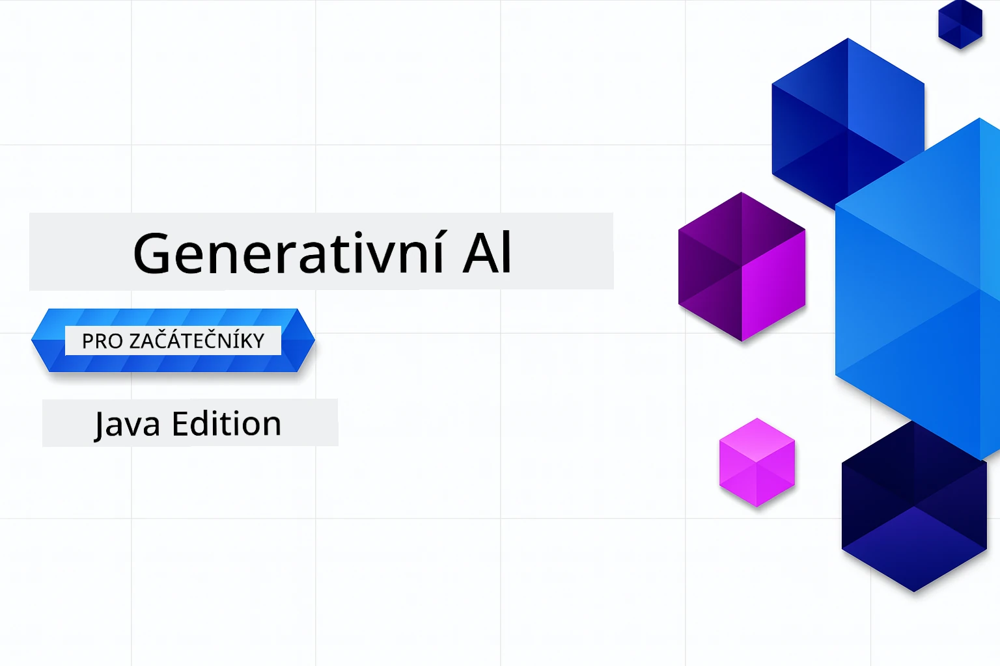

# Generativní AI pro začátečníky - edice Java
[](https://discord.gg/nTYy5BXMWG)



**Časová náročnost**: Celý workshop lze dokončit online bez lokální instalace. Nastavení prostředí zabere 2 minuty, prozkoumání ukázek 1–3 hodiny v závislosti na hloubce průzkumu.

> **Rychlý start** 

1. Vytvořte fork tohoto repozitáře na svůj GitHub účet
2. Klikněte na **Code** → záložka **Codespaces** → **...** → **New with options...**
3. Použijte výchozí nastavení – tím se vybere vývojový kontejner vytvořený pro tento kurz
4. Klikněte na **Create codespace**
5. Počkejte cca 2 minuty, než bude prostředí připraveno
6. Přejděte rovnou na [První příklad](./02-SetupDevEnvironment/README.md#step-2-create-a-github-personal-access-token)

## Podpora více jazyků

### Podporováno přes GitHub Action (automatizované a vždy aktuální)

<!-- CO-OP TRANSLATOR LANGUAGES TABLE START -->
[Arabsky](../ar/README.md) | [Bengálsky](../bn/README.md) | [Bulharsky](../bg/README.md) | [Barmština (Myanmar)](../my/README.md) | [Čínsky (zjednodušeně)](../zh-CN/README.md) | [Čínsky (tradičně, Hongkong)](../zh-HK/README.md) | [Čínsky (tradičně, Macao)](../zh-MO/README.md) | [Čínsky (tradičně, Tchaj-wan)](../zh-TW/README.md) | [Chorvatsky](../hr/README.md) | [Česky](./README.md) | [Dánsky](../da/README.md) | [Nizozemsky](../nl/README.md) | [Estonsky](../et/README.md) | [Finsky](../fi/README.md) | [Francouzsky](../fr/README.md) | [Německy](../de/README.md) | [Řecky](../el/README.md) | [Hebrejsky](../he/README.md) | [Hindsky](../hi/README.md) | [Maďarsky](../hu/README.md) | [Indonésky](../id/README.md) | [Italsky](../it/README.md) | [Japonsky](../ja/README.md) | [Kannadsky](../kn/README.md) | [Khmerština](../km/README.md) | [Korejsky](../ko/README.md) | [Litevsky](../lt/README.md) | [Malajsky](../ms/README.md) | [Malajalamsky](../ml/README.md) | [Maráthsky](../mr/README.md) | [Nepálsky](../ne/README.md) | [Nigerijská pidžinština](../pcm/README.md) | [Norsky](../no/README.md) | [Perzsky (Farsi)](../fa/README.md) | [Polsky](../pl/README.md) | [Portugalština (Brazílie)](../pt-BR/README.md) | [Portugalština (Portugalsko)](../pt-PT/README.md) | [Paňdžábsky (Gurmukhi)](../pa/README.md) | [Rumunsky](../ro/README.md) | [Rusky](../ru/README.md) | [Srbsky (cyrilice)](../sr/README.md) | [Slovensky](../sk/README.md) | [Slovinsky](../sl/README.md) | [Španělsky](../es/README.md) | [Swahili](../sw/README.md) | [Švédsky](../sv/README.md) | [Tagalog (Filipínsky)](../tl/README.md) | [Tamilsky](../ta/README.md) | [Telugsky](../te/README.md) | [Thajsky](../th/README.md) | [Turecky](../tr/README.md) | [Ukrajinsky](../uk/README.md) | [Urdsky](../ur/README.md) | [Vietnamština](../vi/README.md)

> **Preferujete klonovat lokálně?**
>
> Tento repozitář obsahuje více než 50 jazykových překladů, což značně zvětšuje velikost stahování. Pro klonování bez překladů použijte sparse checkout:
>
> **Bash / macOS / Linux:**
> ```bash
> git clone --filter=blob:none --sparse https://github.com/microsoft/Generative-AI-for-beginners-java.git
> cd Generative-AI-for-beginners-java
> git sparse-checkout set --no-cone '/*' '!translations' '!translated_images'
> ```
>
> **CMD (Windows):**
> ```cmd
> git clone --filter=blob:none --sparse https://github.com/microsoft/Generative-AI-for-beginners-java.git
> cd Generative-AI-for-beginners-java
> git sparse-checkout set --no-cone "/*" "!translations" "!translated_images"
> ```
>
> Díky tomu získáte vše potřebné pro dokončení kurzu s mnohem rychlejším stahováním.
<!-- CO-OP TRANSLATOR LANGUAGES TABLE END -->

## Struktura kurzu a cesta učení

### **Kapitola 1: Úvod do generativní AI**
- **Základní pojmy**: Porozumění velkým jazykovým modelům, tokenům, embeddingům a schopnostem AI
- **Java AI ekosystém**: Přehled Spring AI a OpenAI SDK
- **Protokol Model Context**: Úvod do MCP a jeho role v komunikaci AI agentů
- **Praktické aplikace**: Reálné scénáře včetně chatbotů a generování obsahu
- **[→ Začít kapitolu 1](./01-IntroToGenAI/README.md)**

### **Kapitola 2: Nastavení vývojového prostředí**
- **Konfigurace více poskytovatelů**: Nastavení GitHub Models, Azure OpenAI a OpenAI Java SDK integrací
- **Spring Boot + Spring AI**: Nejlepší postupy pro vývoj podnikových AI aplikací
- **GitHub Models**: Bezplatný přístup k AI modelům pro prototypování a učení (bez potřeby kreditní karty)
- **Nástroje pro vývoj**: Docker kontejnery, VS Code a konfigurace GitHub Codespaces
- **[→ Začít kapitolu 2](./02-SetupDevEnvironment/README.md)**

### **Kapitola 3: Klíčové techniky generativní AI**
- **Prompt engineering**: Techniky pro optimální odpovědi AI modelů
- **Embeddingy a vektorové operace**: Implementace sémantického vyhledávání a porovnávání podobnosti
- **Retrieval-Augmented Generation (RAG)**: Kombinace AI s vlastními zdroji dat
- **Volání funkcí**: Rozšíření schopností AI pomocí vlastních nástrojů a pluginů
- **[→ Začít kapitolu 3](./03-CoreGenerativeAITechniques/README.md)**

### **Kapitola 4: Praktické aplikace a projekty**
- **Generátor příběhů o domácích mazlíčcích** (`petstory/`): Kreativní generování obsahu s GitHub Models
- **Foundry Local Demo** (`foundrylocal/`): Lokální integrace AI modelu s OpenAI Java SDK
- **MCP kalkulační služba** (`calculator/`): Základní implementace Model Context Protocol se Spring AI
- **[→ Začít kapitolu 4](./04-PracticalSamples/README.md)**

### **Kapitola 5: Zodpovědný vývoj AI**
- **Bezpečnost GitHub Models**: Testování zabudovaného filtrování obsahu a bezpečnostních mechanismů (tvrdé bloky a jemné odmítnutí)
- **Demo zodpovědné AI**: Praktický příklad ukazující, jak moderní bezpečnostní systémy AI fungují
- **Nejlepší postupy**: Zásadní doporučení pro etický vývoj a nasazení AI
- **[→ Začít kapitolu 5](./05-ResponsibleGenAI/README.md)**

## Další zdroje

<!-- CO-OP TRANSLATOR OTHER COURSES START -->
### LangChain
[](https://aka.ms/langchain4j-for-beginners)
[](https://aka.ms/langchainjs-for-beginners?WT.mc_id=m365-94501-dwahlin)
[](https://github.com/microsoft/langchain-for-beginners?WT.mc_id=m365-94501-dwahlin)
---

### Azure / Edge / MCP / Agents
[](https://github.com/microsoft/AZD-for-beginners?WT.mc_id=academic-105485-koreyst)
[](https://github.com/microsoft/edgeai-for-beginners?WT.mc_id=academic-105485-koreyst)
[](https://github.com/microsoft/mcp-for-beginners?WT.mc_id=academic-105485-koreyst)
[](https://github.com/microsoft/ai-agents-for-beginners?WT.mc_id=academic-105485-koreyst)

---
 
### Séria generativní AI
[](https://github.com/microsoft/generative-ai-for-beginners?WT.mc_id=academic-105485-koreyst)
[-9333EA?style=for-the-badge&labelColor=E5E7EB&color=9333EA)](https://github.com/microsoft/Generative-AI-for-beginners-dotnet?WT.mc_id=academic-105485-koreyst)
[-C084FC?style=for-the-badge&labelColor=E5E7EB&color=C084FC)](https://github.com/microsoft/generative-ai-for-beginners-java?WT.mc_id=academic-105485-koreyst)
[-E879F9?style=for-the-badge&labelColor=E5E7EB&color=E879F9)](https://github.com/microsoft/generative-ai-with-javascript?WT.mc_id=academic-105485-koreyst)

---
 
### Základní učení
[](https://aka.ms/ml-beginners?WT.mc_id=academic-105485-koreyst)
[](https://aka.ms/datascience-beginners?WT.mc_id=academic-105485-koreyst)
[](https://aka.ms/ai-beginners?WT.mc_id=academic-105485-koreyst)
[](https://github.com/microsoft/Security-101?WT.mc_id=academic-96948-sayoung)

[](https://aka.ms/webdev-beginners?WT.mc_id=academic-105485-koreyst)
[](https://aka.ms/iot-beginners?WT.mc_id=academic-105485-koreyst)
[](https://github.com/microsoft/xr-development-for-beginners?WT.mc_id=academic-105485-koreyst)

---
 
### Série Copilot
[](https://aka.ms/GitHubCopilotAI?WT.mc_id=academic-105485-koreyst)
[](https://github.com/microsoft/mastering-github-copilot-for-dotnet-csharp-developers?WT.mc_id=academic-105485-koreyst)
[](https://github.com/microsoft/CopilotAdventures?WT.mc_id=academic-105485-koreyst)
<!-- CO-OP TRANSLATOR OTHER COURSES END -->

## Získání Pomoci

Pokud se zaseknete nebo máte jakékoli dotazy ohledně vytváření AI aplikací, připojte se k ostatním studentům a zkušeným vývojářům v diskuzích o MCP. Je to podpůrná komunita, kde jsou otázky vítány a znalosti volně sdíleny.

[](https://discord.gg/nTYy5BXMWG)

Pokud máte zpětnou vazbu k produktu nebo narazíte na chyby během vývoje, navštivte:

[](https://aka.ms/foundry/forum)

---

<!-- CO-OP TRANSLATOR DISCLAIMER START -->
**Prohlášení o vyloučení odpovědnosti**:  
Tento dokument byl přeložen pomocí AI překladatelské služby [Co-op Translator](https://github.com/Azure/co-op-translator). Ačkoliv usilujeme o přesnost, mějte prosím na paměti, že automatizované překlady mohou obsahovat chyby nebo nepřesnosti. Původní dokument v jeho rodném jazyce by měl být považován za autoritativní zdroj. Pro důležité informace se doporučuje profesionální lidský překlad. Nepřebíráme žádnou odpovědnost za nedorozumění či nesprávné interpretace vyplývající z použití tohoto překladu.
<!-- CO-OP TRANSLATOR DISCLAIMER END -->