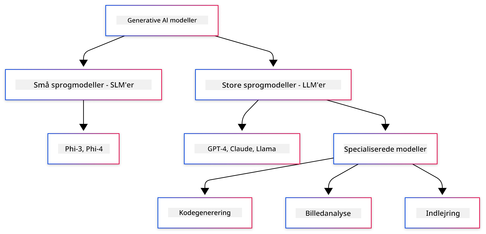
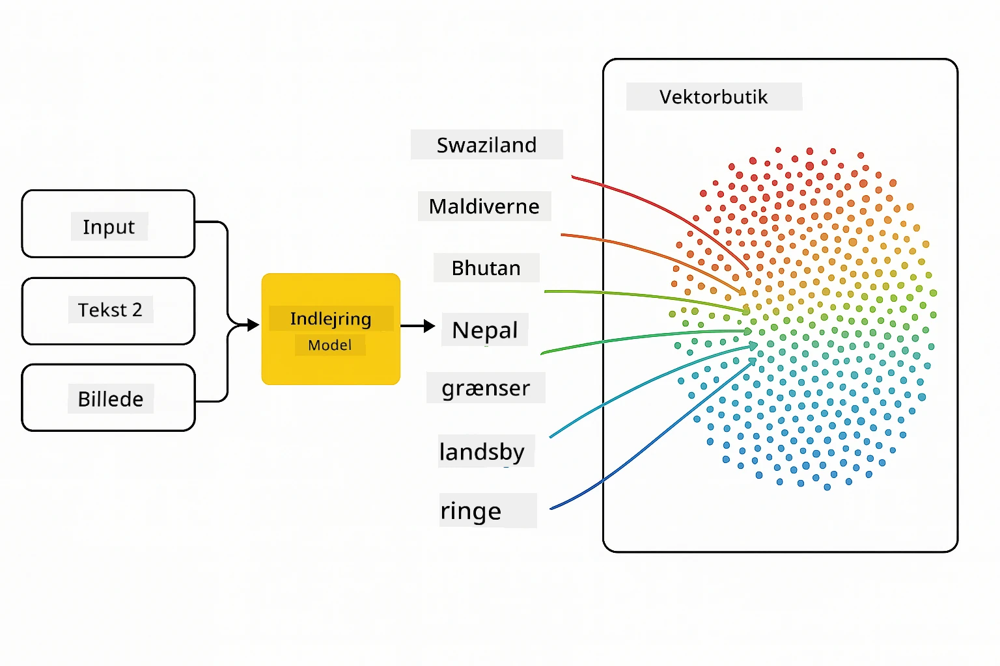
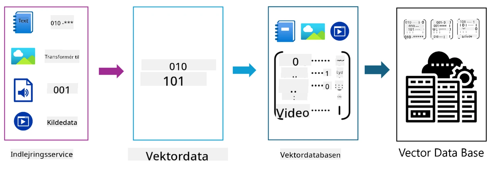
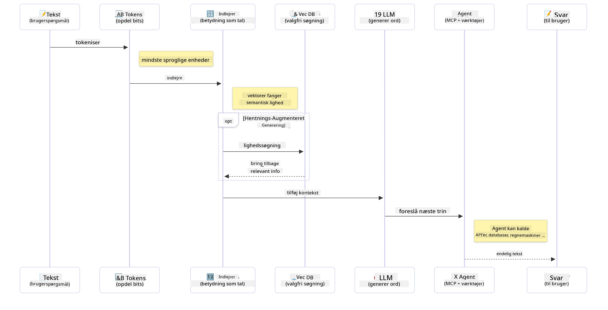

# Introduktion til Generativ AI - Java Edition

> **Video**: [Se videogenoversigten for denne lektion på YouTube.](https://www.youtube.com/watch?v=XH46tGp_eSw) Du kan også klikke på miniaturebilledet ovenfor.

## Hvad du vil lære

- **Grundlæggende om Generativ AI** inklusive LLM'er, prompt engineering, tokens, embeddings og vektordatabaser
- **Sammenlign Java AI udviklingsværktøjer** inklusive Azure OpenAI SDK, Spring AI og OpenAI Java SDK
- **Opdag Model Context Protocol** og dens rolle i AI-agent kommunikation

## Indholdsfortegnelse

- [Introduktion](#introduktion)
- [En hurtig opfriskning af generative AI-koncept](#en-hurtig-opfriskning-af-generative-ai-koncept)
- [Gennemgang af prompt engineering](#gennemgang-af-prompt-engineering)
- [Tokens, embeddings og agenter](#tokens-embeddings-og-agenter)
- [AI udviklingsværktøjer og biblioteker til Java](#ai-udviklingsværktøjer-og-biblioteker-til-java)
  - [OpenAI Java SDK](#openai-java-sdk)
  - [Spring AI](#spring-ai)
  - [Azure OpenAI Java SDK](#azure-openai-java-sdk)
- [Resumé](#resumé)
- [Næste trin](#næste-trin)

## Introduktion

Velkommen til det første kapitel af Generativ AI for begyndere - Java Edition! Denne grundlæggende lektion introducerer dig til kernebegreberne i generativ AI og hvordan du arbejder med dem ved hjælp af Java. Du vil lære om de essentielle byggesten i AI-applikationer, inklusive Large Language Models (LLM'er), tokens, embeddings og AI-agenter. Vi vil også udforske de primære Java-værktøjer, du vil bruge gennem hele dette kursus.

### En hurtig opfriskning af generative AI-koncept

Generativ AI er en type kunstig intelligens, der skaber nyt indhold, såsom tekst, billeder eller kode, baseret på mønstre og relationer lært fra data. Generative AI-modeller kan generere menneskelignende svar, forstå kontekst og nogle gange endda skabe indhold, der virker menneskeligt.

Når du udvikler dine Java AI-applikationer, vil du arbejde med **generative AI-modeller** til at skabe indhold. Nogle kapaciteter ved generative AI-modeller inkluderer:

- **Tekstgenerering**: Udarbejdelse af menneskelignende tekst til chatbots, indhold og tekstfærdiggørelse.
- **Billedgenerering og analyse**: Fremstilling af realistiske billeder, forbedring af fotos og genkendelse af objekter.
- **Kodegenerering**: Skrive kodestumper eller scripts.

Der findes specifikke typer af modeller, der er optimeret til forskellige opgaver. For eksempel kan både **Small Language Models (SLM'er)** og **Large Language Models (LLM'er)** håndtere tekstgenerering, hvor LLM'er typisk tilbyder bedre ydelse til komplekse opgaver. Til opgaver relateret til billeder vil man bruge specialiserede visionsmodeller eller multimodale modeller.

Selvfølgelig er svarene fra disse modeller ikke perfekte hele tiden. Du har sikkert hørt om modeller, der "hallucinerer" eller genererer forkert information på en autoritativ måde. Men du kan hjælpe med at styre modellen til at generere bedre svar ved at give dem klare instruktioner og kontekst. Det er her, **prompt engineering** kommer ind i billedet.

#### Gennemgang af prompt engineering

Prompt engineering er praksissen med at designe effektive input for at guide AI-modeller hen imod ønskede output. Det involverer:

- **Klarhed**: At gøre instruktioner klare og entydige.
- **Kontekst**: At give nødvendig baggrundsinformation.
- **Begrænsninger**: At specificere eventuelle begrænsninger eller formater.

Nogle bedste praksisser for prompt engineering inkluderer promptdesign, klare instruktioner, opdeling af opgaver, one-shot og few-shot læring samt prompt tuning. Det er vigtigt at teste forskellige prompts for at finde ud af, hvad der fungerer bedst i dit specifikke tilfælde.

Når du udvikler applikationer, vil du arbejde med forskellige prompt-typer:
- **System prompts**: Sætter basisreglerne og konteksten for modellens adfærd
- **User prompts**: Input data fra dine applikationsbrugere
- **Assistant prompts**: Modellens svar baseret på system- og brugerprompter

> **Lær mere**: Lær mere om prompt engineering i [Prompt Engineering kapitlet i GenAI for Beginners kurset](https://github.com/microsoft/generative-ai-for-beginners/tree/main/04-prompt-engineering-fundamentals)

#### Tokens, embeddings og agenter

Når du arbejder med generative AI-modeller, vil du støde på termer som **tokens**, **embeddings**, **agenter** og **Model Context Protocol (MCP)**. Her er en detaljeret oversigt over disse begreber:

- **Tokens**: Tokens er den mindste tekst-enhed i en model. De kan være ord, tegn eller underord. Tokens bruges til at repræsentere tekstdata i et format, som modellen kan forstå. For eksempel kan sætningen "The quick brown fox jumped over the lazy dog" blive tokeniseret som ["The", " quick", " brown", " fox", " jumped", " over", " the", " lazy", " dog"] eller ["The", " qu", "ick", " br", "own", " fox", " jump", "ed", " over", " the", " la", "zy", " dog"] afhængigt af tokeniseringsstrategien.

Tokenisering er processen med at bryde tekst ned i disse mindre enheder. Dette er afgørende, fordi modeller arbejder på tokens frem for rå tekst. Antallet af tokens i en prompt påvirker modellens responss længde og kvalitet, da modeller har tokenbegrænsninger for deres kontekstvindue (f.eks. 128K tokens for GPT-4o's samlede kontekst, inklusive både input og output).

  I Java kan du bruge biblioteker som OpenAI SDK til automatisk at håndtere tokenisering, når du sender forespørgsler til AI-modeller.

- **Embeddings**: Embeddings er vektorrepræsentationer af tokens, der indfanger semantisk betydning. De er numeriske repræsentationer (typisk arrays af flydende-punkt tal), der gør det muligt for modeller at forstå relationer mellem ord og generere kontekstuelt relevante svar. Lignende ord har lignende embeddings, hvilket giver modellen mulighed for at forstå begreber som synonymer og semantiske relationer.

  I Java kan du generere embeddings ved hjælp af OpenAI SDK eller andre biblioteker, der understøtter generering af embeddings. Disse embeddings er essentielle til opgaver som semantisk søgning, hvor du ønsker at finde lignende indhold baseret på mening i stedet for præcise tekstmatch.

- **Vektordatabaser**: Vektordatabaser er specialiserede lagringssystemer optimeret til embeddings. De muliggør effektiv lighedssøgning og er afgørende for Retrieval-Augmented Generation (RAG) mønstre, hvor du skal finde relevant information fra store datasæt baseret på semantisk lighed frem for præcise match.

> **Bemærk**: I dette kursus dækker vi ikke vektordatabaser, men mener, de er værd at nævne, da de ofte bruges i virkelige applikationer.

- **Agenter & MCP**: AI-komponenter der autonomt interagerer med modeller, værktøjer og eksterne systemer. Model Context Protocol (MCP) giver en standardiseret måde for agenter til sikkert at få adgang til eksterne datakilder og værktøjer. Lær mere i vores [MCP for Beginners](https://github.com/microsoft/mcp-for-beginners) kursus.

I Java AI-applikationer vil du bruge tokens til tekstbehandling, embeddings til semantisk søgning og RAG, vektordatabaser til dataopsamling og agenter med MCP til at bygge intelligente, værktøjsbrugende systemer. 

### AI udviklingsværktøjer og biblioteker til Java

Java tilbyder fremragende værktøjer til AI-udvikling. Der er tre hovedbiblioteker, som vi vil udforske gennem hele kurset - OpenAI Java SDK, Azure OpenAI SDK og Spring AI.

Her er en hurtig referencetabel, der viser, hvilket SDK der bruges i hver kapitels eksempler:

| Kapitel | Eksempel | SDK |
|---------|----------|-----|
| 02-SetupDevEnvironment | github-models | OpenAI Java SDK |
| 02-SetupDevEnvironment | basic-chat-azure | Spring AI Azure OpenAI |
| 03-CoreGenerativeAITechniques | examples | Azure OpenAI SDK |
| 04-PracticalSamples | petstory | OpenAI Java SDK |
| 04-PracticalSamples | foundrylocal | OpenAI Java SDK |
| 04-PracticalSamples | calculator | Spring AI MCP SDK + LangChain4j |

**SDK dokumentationslinks:**
- [Azure OpenAI Java SDK](https://github.com/Azure/azure-sdk-for-java/tree/azure-ai-openai_1.0.0-beta.16/sdk/openai/azure-ai-openai)
- [Spring AI](https://docs.spring.io/spring-ai/reference/)
- [OpenAI Java SDK](https://github.com/openai/openai-java)
- [LangChain4j](https://docs.langchain4j.dev/)

#### OpenAI Java SDK

OpenAI SDK er det officielle Java-bibliotek til OpenAI API'en. Det giver et simpelt og konsistent interface til at interagere med OpenAI's modeller og gør det nemt at integrere AI-funktionaliteter i Java-applikationer. Kapitel 2’s GitHub Models-eksempel, Kapitel 4’s Pet Story-applikation og Foundry Local-eksempel demonstrerer OpenAI SDK-tilgangen.

#### Spring AI

Spring AI er et omfattende framework, der bringer AI-funktioner til Spring-applikationer og giver et konsistent abstraktionslag på tværs af forskellige AI-udbydere. Det integreres sømløst med Spring-økosystemet, hvilket gør det til det ideelle valg for enterprise Java-applikationer, der har brug for AI-funktioner.

Styrken ved Spring AI ligger i dets problemfri integration med Spring-økosystemet, hvilket gør det nemt at bygge produktionsklare AI-applikationer med velkendte Spring-mønstre som afhængighedsinjektion, konfigurationsstyring og testframeworks. Du vil bruge Spring AI i Kapitel 2 og 4 til at bygge applikationer, der udnytter både OpenAI og Model Context Protocol (MCP) Spring AI-biblioteker.

##### Model Context Protocol (MCP)

[Model Context Protocol (MCP)](https://modelcontextprotocol.io/) er en fremspirende standard, der muliggør, at AI-applikationer sikkert kan interagere med eksterne datakilder og værktøjer. MCP leverer en standardiseret måde for AI-modeller at få adgang til kontekstuel information og udføre handlinger i dine applikationer.

I Kapitel 4 bygger du en simpel MCP kalkulatortjeneste, der demonstrerer grundlæggende Model Context Protocol med Spring AI, og viser, hvordan man laver basale værktøjsintegrationer og servicearkitekturer.

#### Azure OpenAI Java SDK

Azure OpenAI klientbiblioteket til Java er en tilpasning af OpenAI's REST API'er, der giver et idiomatisk interface og integration med resten af Azure SDK-økosystemet. I Kapitel 3 bygger du applikationer ved hjælp af Azure OpenAI SDK, inklusive chatapplikationer, funktionkald og RAG (Retrieval-Augmented Generation) mønstre.

> Bemærk: Azure OpenAI SDK halter bagefter OpenAI Java SDK med hensyn til funktioner, så til fremtidige projekter bør du overveje at bruge OpenAI Java SDK.

## Resumé

Det runder grundlaget af! Du forstår nu:

- De kernebegreber, der ligger bag generativ AI – fra LLM’er og prompt engineering til tokens, embeddings og vektordatabaser
- Dine toolkit-muligheder til Java AI-udvikling: Azure OpenAI SDK, Spring AI og OpenAI Java SDK
- Hvad Model Context Protocol er, og hvordan det gør det muligt for AI-agenter at arbejde med eksterne værktøjer

## Næste trin

[Kapitel 2: Opsætning af udviklingsmiljøet](../02-SetupDevEnvironment/README.md)

---

<!-- CO-OP TRANSLATOR DISCLAIMER START -->
**Ansvarsfraskrivelse**:  
Dette dokument er blevet oversat ved hjælp af AI-oversættelsestjenesten [Co-op Translator](https://github.com/Azure/co-op-translator). Selvom vi bestræber os på nøjagtighed, bedes du være opmærksom på, at automatiserede oversættelser kan indeholde fejl eller unøjagtigheder. Det oprindelige dokument på dets oprindelige sprog bør anses for at være den autoritative kilde. For kritiske oplysninger anbefales professionel menneskelig oversættelse. Vi påtager os intet ansvar for misforståelser eller fejltolkninger, der opstår som følge af brugen af denne oversættelse.
<!-- CO-OP TRANSLATOR DISCLAIMER END -->