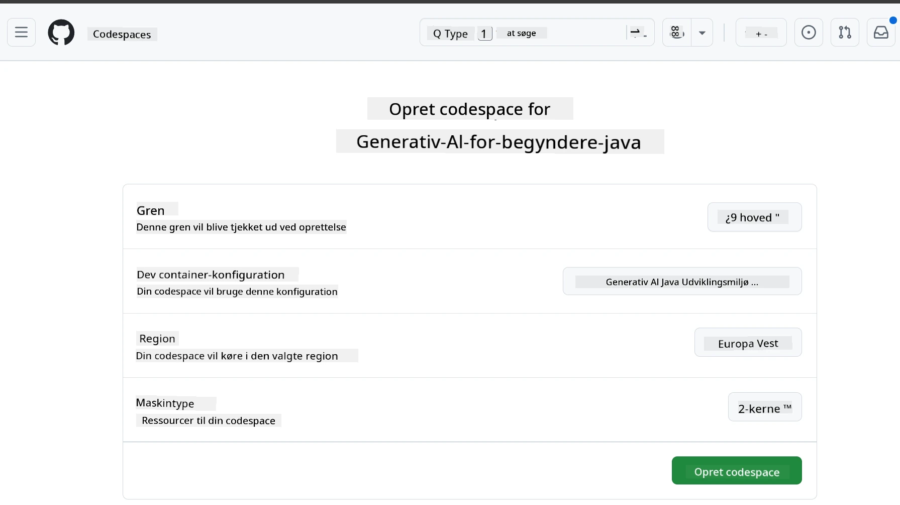
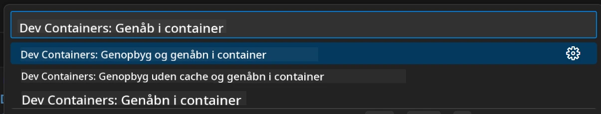
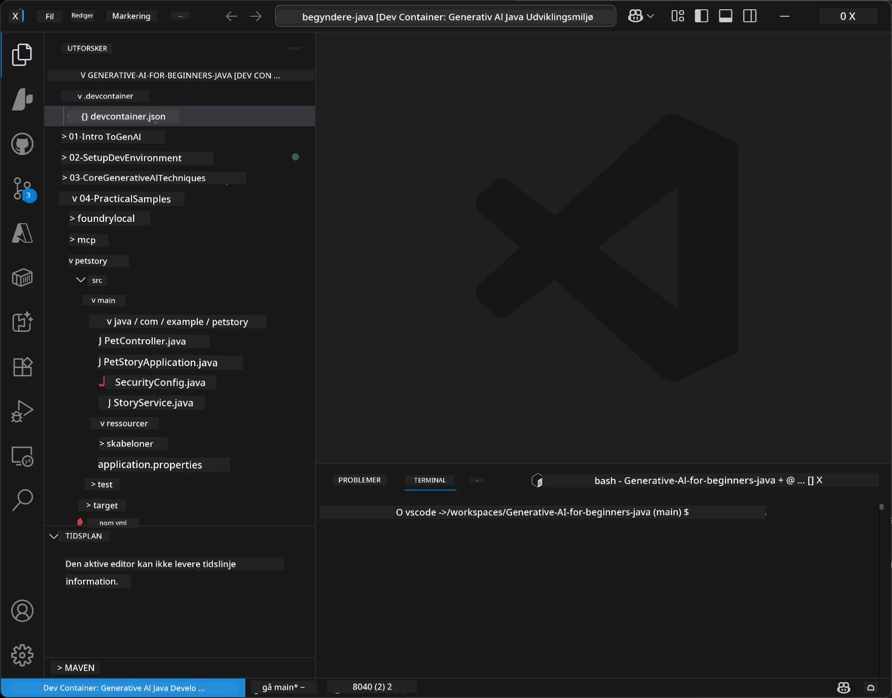
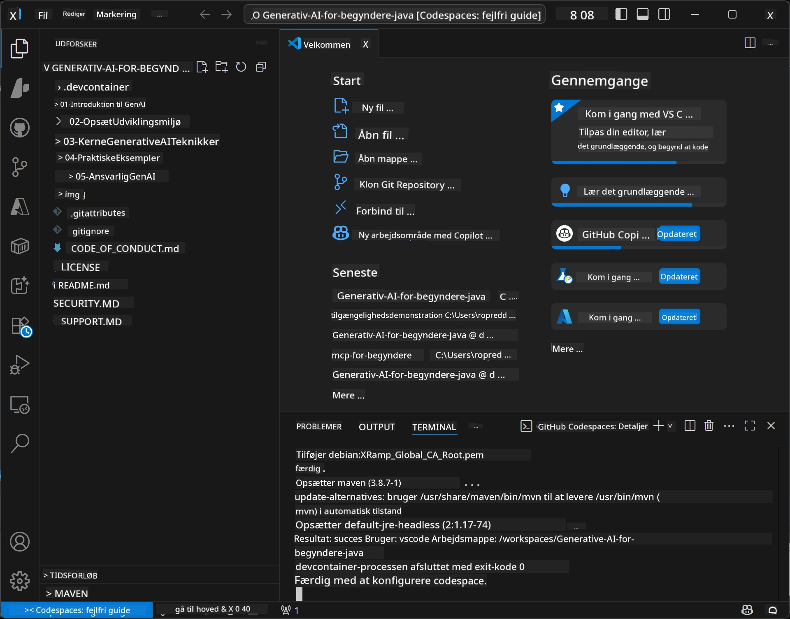

<!--
CO_OP_TRANSLATOR_METADATA:
{
  "original_hash": "96a30d42b9751a3d4e4b20e28d29d459",
  "translation_date": "2026-01-28T05:04:32+00:00",
  "source_file": "02-SetupDevEnvironment/README.md",
  "language_code": "da"
}
-->
# Opsætning af udviklingsmiljøet til Generativ AI for Java

> **Hurtig start**: Kode i skyen på 2 minutter - spring til [GitHub Codespaces Setup](../../../02-SetupDevEnvironment) - ingen lokal installation kræves og bruger github-modeller!

> **Interesseret i Azure OpenAI?**, se vores [Azure OpenAI Setup Guide](getting-started-azure-openai.md) med trin til at oprette en ny Azure OpenAI-ressource.

## Det du vil lære

- Opsæt et Java udviklingsmiljø til AI-applikationer
- Vælg og konfigurer dit foretrukne udviklingsmiljø (cloud-first med Codespaces, lokal dev container, eller fuld lokal opsætning)
- Test din opsætning ved at oprette forbindelse til GitHub Models

## Indholdsfortegnelse

- [Det du vil lære](../../../02-SetupDevEnvironment)
- [Introduktion](../../../02-SetupDevEnvironment)
- [Trin 1: Opsæt dit udviklingsmiljø](../../../02-SetupDevEnvironment)
  - [Mulighed A: GitHub Codespaces (Anbefalet)](../../../02-SetupDevEnvironment)
  - [Mulighed B: Lokal Dev Container](../../../02-SetupDevEnvironment)
  - [Mulighed C: Brug din eksisterende lokale installation](../../../02-SetupDevEnvironment)
- [Trin 2: Opret GitHub Personal Access Token](../../../02-SetupDevEnvironment)
- [Trin 3: Test din opsætning](../../../02-SetupDevEnvironment)
- [Fejlfinding](../../../02-SetupDevEnvironment)
- [Opsummering](../../../02-SetupDevEnvironment)
- [Næste skridt](../../../02-SetupDevEnvironment)

## Introduktion

Dette kapitel vil guide dig gennem opsætningen af et udviklingsmiljø. Vi bruger **GitHub Models** som vores primære eksempel, fordi det er gratis, nemt at sætte op med blot en GitHub-konto, kræver ikke kreditkort, og giver adgang til flere modeller til eksperimentering.

**Ingen lokal opsætning nødvendig!** Du kan begynde at kode med det samme ved at bruge GitHub Codespaces, som leverer et fuldt udviklingsmiljø i din browser.


Vi anbefaler at bruge [**GitHub Models**](https://github.com/marketplace?type=models) til dette kursus fordi det er:
- **Gratis** at komme i gang
- **Nemt** at opsætte med blot en GitHub-konto
- **Ingen kreditkort** påkrævet
- **Flere modeller** til rådighed for eksperimentering

> **Bemærk**: GitHub Models brugt i denne træning har disse gratis begrænsninger:
> - 15 anmodninger pr. minut (150 pr. dag)
> - ~8.000 ord ind, ~4.000 ord ud pr. anmodning
> - 5 samtidige anmodninger
> 
> Til produktionsbrug, opgrader til Azure AI Foundry Models med din Azure-konto. Din kode behøver ikke at ændres. Se [Azure AI Foundry dokumentationen](https://learn.microsoft.com/azure/ai-foundry/foundry-models/how-to/quickstart-github-models).


## Trin 1: Opsæt dit udviklingsmiljø

<a name="quick-start-cloud"></a>

Vi har oprettet en forkonfigureret udviklingscontainer for at minimere opsætningstiden og sikre, at du har alle nødvendige værktøjer til dette Generative AI for Java kursus. Vælg din foretrukne udviklingstilgang:

### Miljøopsætningsmuligheder:

#### Mulighed A: GitHub Codespaces (Anbefalet)

**Begynd at kode på 2 minutter - ingen lokal opsætning nødvendig!**

1. Fork dette repository til din GitHub-konto
   > **Bemærk**: Hvis du vil redigere den grundlæggende konfiguration, se venligst [Dev Container Configuration](../../../.devcontainer/devcontainer.json)
2. Klik på **Code** → **Codespaces** fanen → **...** → **Ny med muligheder...**
3. Brug standardindstillingerne – dette vælger **Dev container-konfigurationen**: **Generative AI Java Development Environment** speciallavet devcontainer til dette kursus
4. Klik på **Create codespace**
5. Vent ~2 minutter på at miljøet er klar
6. Fortsæt til [Trin 2: Opret GitHub Token](../../../02-SetupDevEnvironment)





> **Fordele ved Codespaces**:
> - Ingen lokal installation påkrævet
> - Virker på enhver enhed med en browser
> - Forudkonfigureret med alle værktøjer og afhængigheder
> - Gratis 60 timer pr. måned for personlige konti
> - Ensartet miljø for alle elever

#### Mulighed B: Lokal Dev Container

**For udviklere der foretrækker lokal udvikling med Docker**

1. Fork og clone dette repository til din lokale maskine
   > **Bemærk**: Hvis du vil redigere den grundlæggende konfiguration, se venligst [Dev Container Configuration](../../../.devcontainer/devcontainer.json)
2. Installer [Docker Desktop](https://www.docker.com/products/docker-desktop/) og [VS Code](https://code.visualstudio.com/)
3. Installer [Dev Containers udvidelsen](https://marketplace.visualstudio.com/items?itemName=ms-vscode-remote.remote-containers) i VS Code
4. Åbn repository-mappen i VS Code
5. Når du bliver spurgt, klik på **Reopen in Container** (eller brug `Ctrl+Shift+P` → "Dev Containers: Reopen in Container")
6. Vent på at containeren bygges og starter
7. Fortsæt til [Trin 2: Opret GitHub Token](../../../02-SetupDevEnvironment)





#### Mulighed C: Brug din eksisterende lokale installation

**For udviklere med eksisterende Java-miljøer**

Forudsætninger:
- [Java 21+](https://www.oracle.com/java/technologies/javase/jdk21-archive-downloads.html)
- [Maven 3.9+](https://maven.apache.org/download.cgi)
- [VS Code](https://code.visualstudio.com) eller dit foretrukne IDE

Trin:
1. Clone dette repository til din lokale maskine
2. Åbn projektet i dit IDE
3. Fortsæt til [Trin 2: Opret GitHub Token](../../../02-SetupDevEnvironment)

> **Pro Tip**: Har du en lav-spec-maskine, men vil bruge VS Code lokalt, så brug GitHub Codespaces! Du kan forbinde din lokale VS Code til et cloud-hosted Codespace og få det bedste fra begge verdener.




## Trin 2: Opret en GitHub Personal Access Token

1. Naviger til [GitHub Settings](https://github.com/settings/profile) og vælg **Settings** i din profilmenu.
2. Klik i venstre sidebjælke på **Developer settings** (normalt nederst).
3. Under **Personal access tokens**, klik på **Fine-grained tokens** (eller følg dette direkte [link](https://github.com/settings/personal-access-tokens)).
4. Klik på **Generate new token**.
5. Under "Token name", giv et beskrivende navn (f.eks. `GenAI-Java-Course-Token`).
6. Angiv en udløbsdato (anbefalet: 7 dage for bedst sikkerhedspraksis).
7. Under "Resource owner", vælg din bruger-konto.
8. Under "Repository access", vælg de repositories, du vil bruge med GitHub Models (eller "Alle repositories" hvis nødvendigt).
9. Under "Account permissions", find **Models** og sæt den til **Read-only**.
10. Klik på **Generate token**.
11. **Kopiér og gem din token nu** – du får den ikke vist igen!

> **Sikkerhedstips**: Brug den mindst mulige tilladelse og kortest praktisk gyldighedstid for dine adgangstokener.

## Trin 3: Test din opsætning med GitHub Models-eksemplet

Når dit udviklingsmiljø er klar, lad os teste GitHub Models integrationen med vores eksempelapplikation i [`02-SetupDevEnvironment/examples/github-models`](../../../02-SetupDevEnvironment/examples/github-models).

1. Åbn terminalen i dit udviklingsmiljø.
2. Naviger til GitHub Models eksemplet:
   ```bash
   cd 02-SetupDevEnvironment/examples/github-models
   ```
3. Sæt dit GitHub token som en miljøvariabel:
   ```bash
   # macOS/Linux
   export GITHUB_TOKEN=your_token_here
   
   # Windows (Kommandoprompt)
   set GITHUB_TOKEN=your_token_here
   
   # Windows (PowerShell)
   $env:GITHUB_TOKEN="your_token_here"
   ```

4. Kør applikationen:
   ```bash
   mvn compile exec:java -Dexec.mainClass="com.example.githubmodels.App"
   ```

Du burde se output som:
```text
Using model: gpt-4.1-nano
Sending request to GitHub Models...
Response: Hello World!
```

### Forståelse af eksempel-koden

Lad os først forstå hvad vi lige har kørt. Eksemplet under `examples/github-models` bruger OpenAI Java SDK til at forbinde til GitHub Models:

**Hvad denne kode gør:**
- **Forbinder** til GitHub Models ved hjælp af din personal access token
- **Sender** en simpel "Say Hello World!" besked til AI-modellen
- **Modtager** og viser AI'ens svar
- **Validerer** at din opsætning fungerer korrekt

**Nøgleafhængighed** (i `pom.xml`):
```xml
<dependency>
    <groupId>com.openai</groupId>
    <artifactId>openai-java</artifactId>
    <version>2.12.0</version>
</dependency>
```

**Hovedkode** (`App.java`):
```java
// Opret forbindelse til GitHub-modeller ved hjælp af OpenAI Java SDK
OpenAIClient client = OpenAIOkHttpClient.builder()
    .apiKey(pat)
    .baseUrl("https://models.inference.ai.azure.com")
    .build();

// Opret chatkompletteringsanmodning
ChatCompletionCreateParams params = ChatCompletionCreateParams.builder()
    .model(modelId)
    .addSystemMessage("You are a concise assistant.")
    .addUserMessage("Say Hello World!")
    .build();

// Hent AI-svar
ChatCompletion response = client.chat().completions().create(params);
System.out.println("Response: " + response.choices().get(0).message().content().orElse("No response content"));
```

## Opsummering

Fremragende! Du har nu alt sat op:

- Oprettet en GitHub Personal Access Token med de rette tilladelser til AI model-adgang
- Fået dit Java udviklingsmiljø op at køre (uanset om det er Codespaces, dev containers eller lokal)
- Forbundet til GitHub Models ved brug af OpenAI Java SDK til gratis AI-udvikling
- Testet at det hele virker med et simpelt eksempel, der kommunikerer med AI-modeller

## Næste skridt

[Kapitel 3: Kerne teknikker inden for Generativ AI](../03-CoreGenerativeAITechniques/README.md)

## Fejlfinding

Problemer? Her er almindelige problemer og løsninger:

- **Token virker ikke?**
  - Sørg for, at du har kopieret hele token uden ekstra mellemrum
  - Bekræft at token er korrekt sat som miljøvariabel
  - Tjek at din token har de korrekte tilladelser (Models: Read-only)

- **Maven ikke fundet?**
  - Hvis du bruger dev containers/Codespaces, burde Maven være forudinstalleret
  - For lokal opsætning, sikre at Java 21+ og Maven 3.9+ er installeret
  - Prøv `mvn --version` for at verificere installation

- **Forbindelsesproblemer?**
  - Tjek din internetforbindelse
  - Bekræft at GitHub er tilgængelig fra dit netværk
  - Sørg for, at du ikke er bag en firewall, der blokerer GitHub Models endpoint

- **Dev container starter ikke?**
  - Sørg for Docker Desktop kører (ved lokal udvikling)
  - Prøv at genopbygge containeren: `Ctrl+Shift+P` → "Dev Containers: Rebuild Container"

- **Kompileringsfejl i applikationen?**
  - Sørg for at du er i den korrekte mappe: `02-SetupDevEnvironment/examples/github-models`
  - Prøv at rydde op og genbygge: `mvn clean compile`

> **Brug for hjælp?**: Stadig problemer? Opret en issue i repository'et, og vi hjælper dig.

---

<!-- CO-OP TRANSLATOR DISCLAIMER START -->
**Ansvarsfraskrivelse**:
Dette dokument er blevet oversat ved hjælp af AI-oversættelsestjenesten [Co-op Translator](https://github.com/Azure/co-op-translator). Selvom vi bestræber os på nøjagtighed, bedes du være opmærksom på, at automatiserede oversættelser kan indeholde fejl eller unøjagtigheder. Det oprindelige dokument på dets modersmål skal betragtes som den autoritative kilde. For kritisk information anbefales professionel menneskelig oversættelse. Vi påtager os intet ansvar for misforståelser eller fejltolkninger, der opstår som følge af brugen af denne oversættelse.
<!-- CO-OP TRANSLATOR DISCLAIMER END -->