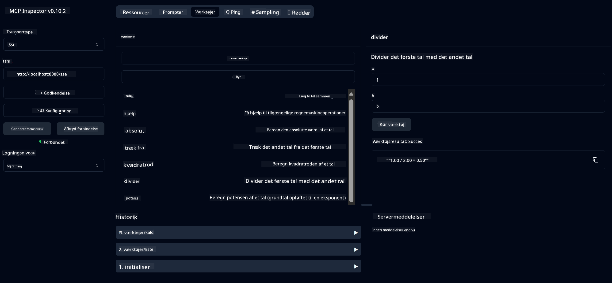

<!--
CO_OP_TRANSLATOR_METADATA:
{
  "original_hash": "5bd7a347d6ed1d706443f9129dd29dd9",
  "translation_date": "2025-07-25T09:37:57+00:00",
  "source_file": "04-PracticalSamples/mcp/calculator/README.md",
  "language_code": "da"
}
-->
# Grundlæggende Lommeregner MCP Service

>**Bemærk**: Dette kapitel inkluderer en [**Tutorial**](./TUTORIAL.md), der guider dig gennem eksemplerne.

Velkommen til din første praktiske oplevelse med **Model Context Protocol (MCP)**! I de tidligere kapitler har du lært om grundlæggende generativ AI og opsat dit udviklingsmiljø. Nu er det tid til at bygge noget praktisk.

Denne lommeregner-service demonstrerer, hvordan AI-modeller sikkert kan interagere med eksterne værktøjer ved hjælp af MCP. I stedet for at stole på AI-modellens til tider upålidelige matematiske evner, viser vi, hvordan man bygger et robust system, hvor AI kan kalde specialiserede tjenester for præcise beregninger.

## Indholdsfortegnelse

- [Hvad Du Vil Lære](../../../../../04-PracticalSamples/mcp/calculator)
- [Forudsætninger](../../../../../04-PracticalSamples/mcp/calculator)
- [Nøglebegreber](../../../../../04-PracticalSamples/mcp/calculator)
- [Hurtig Start](../../../../../04-PracticalSamples/mcp/calculator)
- [Tilgængelige Lommeregnerfunktioner](../../../../../04-PracticalSamples/mcp/calculator)
- [Testklienter](../../../../../04-PracticalSamples/mcp/calculator)
  - [1. Direkte MCP Klient (SDKClient)](../../../../../04-PracticalSamples/mcp/calculator)
  - [2. AI-drevet Klient (LangChain4jClient)](../../../../../04-PracticalSamples/mcp/calculator)
- [MCP Inspector (Web UI)](../../../../../04-PracticalSamples/mcp/calculator)
  - [Trin-for-Trin Instruktioner](../../../../../04-PracticalSamples/mcp/calculator)

## Hvad Du Vil Lære

Ved at arbejde med dette eksempel vil du forstå:
- Hvordan man opretter MCP-kompatible tjenester ved hjælp af Spring Boot
- Forskellen mellem direkte protokolkommunikation og AI-drevet interaktion
- Hvordan AI-modeller beslutter, hvornår og hvordan de skal bruge eksterne værktøjer
- Bedste praksis for at bygge AI-applikationer med værktøjsintegration

Perfekt for begyndere, der lærer MCP-konceptet og er klar til at bygge deres første AI-værktøjsintegration!

## Forudsætninger

- Java 21+
- Maven 3.6+
- **GitHub Token**: Påkrævet for den AI-drevne klient. Hvis du ikke har opsat dette endnu, se [Kapitel 2: Opsætning af dit udviklingsmiljø](../../../02-SetupDevEnvironment/README.md) for instruktioner.

## Nøglebegreber

**Model Context Protocol (MCP)** er en standardiseret måde for AI-applikationer at forbinde sikkert til eksterne værktøjer. Tænk på det som en "bro", der gør det muligt for AI-modeller at bruge eksterne tjenester som vores lommeregner. I stedet for at AI-modellen forsøger at udføre matematik selv (hvilket kan være upålideligt), kan den kalde vores lommeregner-service for at få præcise resultater. MCP sikrer, at denne kommunikation sker sikkert og konsekvent.

**Server-Sent Events (SSE)** muliggør realtidskommunikation mellem serveren og klienter. I modsætning til traditionelle HTTP-forespørgsler, hvor du spørger og venter på et svar, giver SSE serveren mulighed for kontinuerligt at sende opdateringer til klienten. Dette er perfekt til AI-applikationer, hvor svar kan streames eller tage tid at behandle.

**AI-værktøjer & Funktionskald** giver AI-modeller mulighed for automatisk at vælge og bruge eksterne funktioner (som lommeregnerfunktioner) baseret på brugerens forespørgsler. Når du spørger "Hvad er 15 + 27?", forstår AI-modellen, at du ønsker addition, kalder automatisk vores `add`-værktøj med de rigtige parametre (15, 27) og returnerer resultatet i naturligt sprog. AI fungerer som en intelligent koordinator, der ved, hvornår og hvordan hvert værktøj skal bruges.

## Hurtig Start

### 1. Naviger til lommeregner-applikationens mappe
```bash
cd Generative-AI-for-beginners-java/04-PracticalSamples/mcp/calculator
```

### 2. Byg & Kør
```bash
mvn clean install -DskipTests
java -jar target/calculator-server-0.0.1-SNAPSHOT.jar
```

### 3. Test med Klienter
- **SDKClient**: Direkte MCP-protokolinteraktion
- **LangChain4jClient**: AI-drevet naturlig sproginteraktion (kræver GitHub-token)

## Tilgængelige Lommeregnerfunktioner

- `add(a, b)`, `subtract(a, b)`, `multiply(a, b)`, `divide(a, b)`
- `power(base, exponent)`, `squareRoot(number)`, `absolute(number)`
- `modulus(a, b)`, `help()`

## Testklienter

### 1. Direkte MCP Klient (SDKClient)
Tester rå MCP-protokolkommunikation. Kør med:
```bash
mvn test-compile exec:java -Dexec.mainClass="com.microsoft.mcp.sample.client.SDKClient" -Dexec.classpathScope=test
```

### 2. AI-drevet Klient (LangChain4jClient)
Demonstrerer naturlig sproginteraktion med GitHub-modeller. Kræver GitHub-token (se [Forudsætninger](../../../../../04-PracticalSamples/mcp/calculator)).

**Kør:**
```bash
mvn test-compile exec:java -Dexec.mainClass="com.microsoft.mcp.sample.client.LangChain4jClient" -Dexec.classpathScope=test
```

## MCP Inspector (Web UI)

MCP Inspector giver en visuel webgrænseflade til at teste din MCP-service uden at skrive kode. Perfekt for begyndere til at forstå, hvordan MCP fungerer!

### Trin-for-Trin Instruktioner:

1. **Start lommeregner-serveren** (hvis den ikke allerede kører):
   ```bash
   java -jar target/calculator-server-0.0.1-SNAPSHOT.jar
   ```

2. **Installer og kør MCP Inspector** i et nyt terminalvindue:
   ```bash
   npx @modelcontextprotocol/inspector
   ```

3. **Åbn webgrænsefladen**:
   - Kig efter en besked som "Inspector running at http://localhost:6274"
   - Åbn den URL i din webbrowser

4. **Forbind til din lommeregner-service**:
   - I webgrænsefladen, sæt transporttypen til "SSE"
   - Sæt URL'en til: `http://localhost:8080/sse`
   - Klik på knappen "Connect"

5. **Udforsk tilgængelige værktøjer**:
   - Klik på "List Tools" for at se alle lommeregnerfunktioner
   - Du vil se funktioner som `add`, `subtract`, `multiply`, osv.

6. **Test en lommeregnerfunktion**:
   - Vælg et værktøj (f.eks. "add")
   - Indtast parametre (f.eks. `a: 15`, `b: 27`)
   - Klik på "Run Tool"
   - Se resultatet returneret af din MCP-service!

Denne visuelle tilgang hjælper dig med at forstå præcis, hvordan MCP-kommunikation fungerer, før du bygger dine egne klienter.



---
**Reference:** [MCP Server Boot Starter Docs](https://docs.spring.io/spring-ai/reference/api/mcp/mcp-server-boot-starter-docs.html)

**Ansvarsfraskrivelse**:  
Dette dokument er blevet oversat ved hjælp af AI-oversættelsestjenesten [Co-op Translator](https://github.com/Azure/co-op-translator). Selvom vi bestræber os på at sikre nøjagtighed, skal det bemærkes, at automatiserede oversættelser kan indeholde fejl eller unøjagtigheder. Det originale dokument på dets oprindelige sprog bør betragtes som den autoritative kilde. For kritisk information anbefales professionel menneskelig oversættelse. Vi påtager os ikke ansvar for eventuelle misforståelser eller fejltolkninger, der måtte opstå som følge af brugen af denne oversættelse.