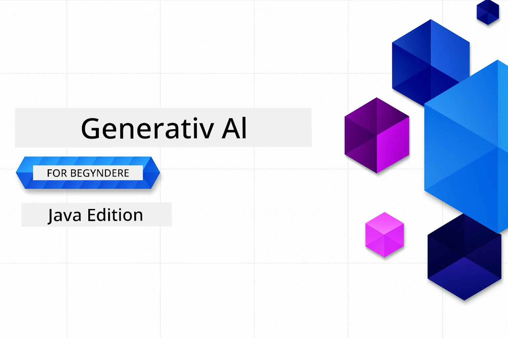

# Generativ AI for Begyndere - Java Edition
[](https://discord.gg/nTYy5BXMWG)



**Tid**: Hele workshoppen kan gennemføres online uden lokal opsætning. Miljøopsætningen tager 2 minutter, og udforskning af eksempler kræver 1-3 timer afhængigt af udforskningsdybden.

> **Hurtig start**

1. Fork dette repository til din GitHub-konto
2. Klik på **Code** → **Codespaces** fanen → **...** → **New with options...**
3. Brug standardindstillingerne – det vil vælge udviklingscontaineren oprettet til dette kursus
4. Klik **Create codespace**
5. Vent ~2 minutter på at miljøet er klar
6. Gå direkte til [Det første eksempel](./02-SetupDevEnvironment/README.md#step-2-create-a-github-personal-access-token)

> **Foretrækker du at klone lokalt?**
>
> Dette repository inkluderer 50+ sprogoversættelser, hvilket betydeligt øger downloadstørrelsen. For at klone uden oversættelser, brug sparse checkout:
> ```bash
> git clone --filter=blob:none --sparse https://github.com/microsoft/Generative-AI-for-beginners-java.git
> cd Generative-AI-for-beginners-java
> git sparse-checkout set --no-cone '/*' '!translations' '!translated_images'
> ```
> Dette giver dig alt, hvad du behøver for at gennemføre kurset med en meget hurtigere download.


## Fleresprogssupport

### Understøttet via GitHub Action (Automatiseret & Altid Opdateret)

<!-- CO-OP TRANSLATOR LANGUAGES TABLE START -->
[Arabisk](../ar/README.md) | [Bengalsk](../bn/README.md) | [Bulgarsk](../bg/README.md) | [Burmesisk (Myanmar)](../my/README.md) | [Kinesisk (Forenklet)](../zh-CN/README.md) | [Kinesisk (Traditionelt, Hong Kong)](../zh-HK/README.md) | [Kinesisk (Traditionelt, Macau)](../zh-MO/README.md) | [Kinesisk (Traditionelt, Taiwan)](../zh-TW/README.md) | [Kroatisk](../hr/README.md) | [Tjekkisk](../cs/README.md) | [Dansk](./README.md) | [Hollandsk](../nl/README.md) | [Estisk](../et/README.md) | [Finsk](../fi/README.md) | [Fransk](../fr/README.md) | [Tysk](../de/README.md) | [Grekisk](../el/README.md) | [Hebraisk](../he/README.md) | [Hindi](../hi/README.md) | [Ungarsk](../hu/README.md) | [Indonesisk](../id/README.md) | [Italiensk](../it/README.md) | [Japansk](../ja/README.md) | [Kannada](../kn/README.md) | [Koreansk](../ko/README.md) | [Litauisk](../lt/README.md) | [Malaysisk](../ms/README.md) | [Malayalam](../ml/README.md) | [Marathi](../mr/README.md) | [Nepalesisk](../ne/README.md) | [Nigeriansk Pidgin](../pcm/README.md) | [Norsk](../no/README.md) | [Persisk (Farsi)](../fa/README.md) | [Polsk](../pl/README.md) | [Portugisisk (Brasilien)](../pt-BR/README.md) | [Portugisisk (Portugal)](../pt-PT/README.md) | [Punjabi (Gurmukhi)](../pa/README.md) | [Rumænsk](../ro/README.md) | [Russisk](../ru/README.md) | [Serbisk (Cyrillisk)](../sr/README.md) | [Slovakisk](../sk/README.md) | [Slovensk](../sl/README.md) | [Spansk](../es/README.md) | [Swahili](../sw/README.md) | [Svensk](../sv/README.md) | [Tagalog (Filipino)](../tl/README.md) | [Tamil](../ta/README.md) | [Telugu](../te/README.md) | [Thai](../th/README.md) | [Tyrkisk](../tr/README.md) | [Ukrainsk](../uk/README.md) | [Urdu](../ur/README.md) | [Vietnamesisk](../vi/README.md)

> **Foretrækker du at klone lokalt?**

> Dette repository inkluderer 50+ sprogoversættelser, hvilket betydeligt øger downloadstørrelsen. For at klone uden oversættelser, brug sparse checkout:
> ```bash
> git clone --filter=blob:none --sparse https://github.com/microsoft/Generative-AI-for-beginners-java.git
> cd Generative-AI-for-beginners-java
> git sparse-checkout set --no-cone '/*' '!translations' '!translated_images'
> ```
> Dette giver dig alt, hvad du behøver for at gennemføre kurset med en meget hurtigere download.
<!-- CO-OP TRANSLATOR LANGUAGES TABLE END -->

## Kursusstruktur & Læringsvej

### **Kapitel 1: Introduktion til Generativ AI**
- **Kernebegreber**: Forståelse af store sprogmodeller, tokens, embeddings og AI’s kapaciteter
- **Java AI Økosystem**: Oversigt over Spring AI og OpenAI SDK’er
- **Model Context Protocol**: Introduktion til MCP og dens rolle i AI-agentkommunikation
- **Praktiske Anvendelser**: Virkelige scenarier inklusive chatbots og indholdsgenerering
- **[→ Start Kapitel 1](./01-IntroToGenAI/README.md)**

### **Kapitel 2: Opsætning af Udviklingsmiljø**
- **Multi-udbyder Konfiguration**: Opsæt GitHub Models, Azure OpenAI og OpenAI Java SDK-integrationer
- **Spring Boot + Spring AI**: Bedste praksis til virksomheders AI-applikationsudvikling
- **GitHub Models**: Gratis AI-modeladgang til prototyping og læring (ingen kreditkort nødvendig)
- **Udviklingsværktøjer**: Docker-containere, VS Code og GitHub Codespaces konfiguration
- **[→ Start Kapitel 2](./02-SetupDevEnvironment/README.md)**

### **Kapitel 3: Kerne Generative AI Teknikker**
- **Prompt Engineering**: Teknikker til optimale AI-modelsvar
- **Embeddings & Vektoroperationer**: Implementering af semantisk søgning og ligheds matching
- **Retrieval-Augmented Generation (RAG)**: Kombiner AI med dine egne datakilder
- **Function Calling**: Udvid AI’s funktionaliteter med brugerdefinerede værktøjer og plugins
- **[→ Start Kapitel 3](./03-CoreGenerativeAITechniques/README.md)**

### **Kapitel 4: Praktiske Anvendelser & Projekter**
- **Pet Story Generator** (`petstory/`): Kreativ indholdsgenerering med GitHub Models
- **Foundry Local Demo** (`foundrylocal/`): Lokal AI-modelintegration med OpenAI Java SDK
- **MCP Calculator Service** (`calculator/`): Grundlæggende Model Context Protocol-implementering med Spring AI
- **[→ Start Kapitel 4](./04-PracticalSamples/README.md)**

### **Kapitel 5: Ansvarlig AI-udvikling**
- **GitHub Models Sikkerhed**: Test indbygget indholdsfiltning og sikringsmekanismer (hårde blokeringer og bløde afslag)
- **Ansvarlig AI Demo**: Praktisk eksempel, der viser hvordan moderne AI-sikkerhedssystemer fungerer
- **Bedste Praksis**: Vigtige retningslinjer for etisk AI-udvikling og implementering
- **[→ Start Kapitel 5](./05-ResponsibleGenAI/README.md)**

## Yderligere Ressourcer

<!-- CO-OP TRANSLATOR OTHER COURSES START -->
### LangChain
[](https://aka.ms/langchain4j-for-beginners)
[](https://aka.ms/langchainjs-for-beginners?WT.mc_id=m365-94501-dwahlin)

---

### Azure / Edge / MCP / Agenter
[](https://github.com/microsoft/AZD-for-beginners?WT.mc_id=academic-105485-koreyst)
[](https://github.com/microsoft/edgeai-for-beginners?WT.mc_id=academic-105485-koreyst)
[](https://github.com/microsoft/mcp-for-beginners?WT.mc_id=academic-105485-koreyst)
[](https://github.com/microsoft/ai-agents-for-beginners?WT.mc_id=academic-105485-koreyst)

---

### Generativ AI Serie
[](https://github.com/microsoft/generative-ai-for-beginners?WT.mc_id=academic-105485-koreyst)
[-9333EA?style=for-the-badge&labelColor=E5E7EB&color=9333EA)](https://github.com/microsoft/Generative-AI-for-beginners-dotnet?WT.mc_id=academic-105485-koreyst)
[-C084FC?style=for-the-badge&labelColor=E5E7EB&color=C084FC)](https://github.com/microsoft/generative-ai-for-beginners-java?WT.mc_id=academic-105485-koreyst)
[-E879F9?style=for-the-badge&labelColor=E5E7EB&color=E879F9)](https://github.com/microsoft/generative-ai-with-javascript?WT.mc_id=academic-105485-koreyst)

---

### Kerne Læring
[](https://aka.ms/ml-beginners?WT.mc_id=academic-105485-koreyst)
[](https://aka.ms/datascience-beginners?WT.mc_id=academic-105485-koreyst)
[](https://aka.ms/ai-beginners?WT.mc_id=academic-105485-koreyst)
[](https://github.com/microsoft/Security-101?WT.mc_id=academic-96948-sayoung)
[](https://aka.ms/webdev-beginners?WT.mc_id=academic-105485-koreyst)
[](https://aka.ms/iot-beginners?WT.mc_id=academic-105485-koreyst)
[](https://github.com/microsoft/xr-development-for-beginners?WT.mc_id=academic-105485-koreyst)

---
 
### Copilot-serie
[](https://aka.ms/GitHubCopilotAI?WT.mc_id=academic-105485-koreyst)
[](https://github.com/microsoft/mastering-github-copilot-for-dotnet-csharp-developers?WT.mc_id=academic-105485-koreyst)
[](https://github.com/microsoft/CopilotAdventures?WT.mc_id=academic-105485-koreyst)
<!-- CO-OP TRANSLATOR OTHER COURSES END -->

## Få hjælp

Hvis du sidder fast eller har spørgsmål om at bygge AI-apps. Deltag sammen med andre lærende og erfarne udviklere i diskussioner om MCP. Det er et støttende fællesskab, hvor spørgsmål er velkomne, og viden deles frit.

[](https://discord.gg/nTYy5BXMWG)

Hvis du har feedback på produkter eller fejl under udvikling, besøg:

[](https://aka.ms/foundry/forum)

---

<!-- CO-OP TRANSLATOR DISCLAIMER START -->
**Ansvarsfraskrivelse**:  
Dette dokument er oversat ved hjælp af AI-oversættelsestjenesten [Co-op Translator](https://github.com/Azure/co-op-translator). Selvom vi bestræber os på nøjagtighed, bedes du være opmærksom på, at automatiserede oversættelser kan indeholde fejl eller unøjagtigheder. Det oprindelige dokument på dets modersmål bør betragtes som den autoritative kilde. For kritisk information anbefales professionel menneskelig oversættelse. Vi påtager os intet ansvar for misforståelser eller fejltolkninger, der opstår ved brug af denne oversættelse.
<!-- CO-OP TRANSLATOR DISCLAIMER END -->