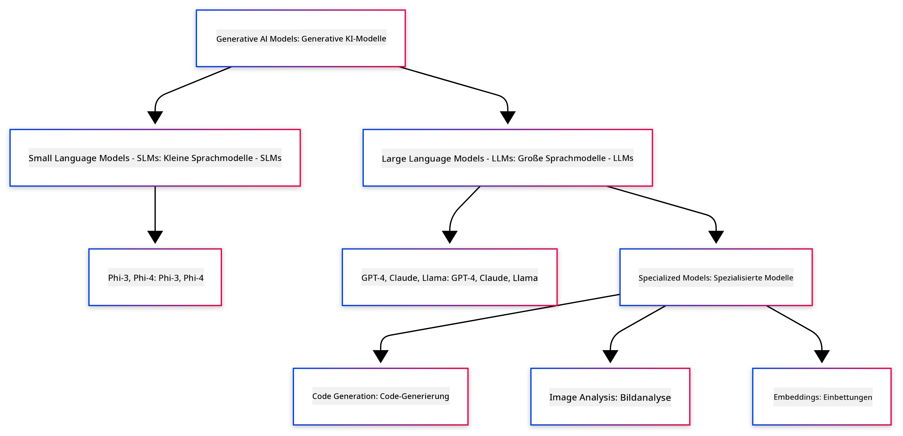
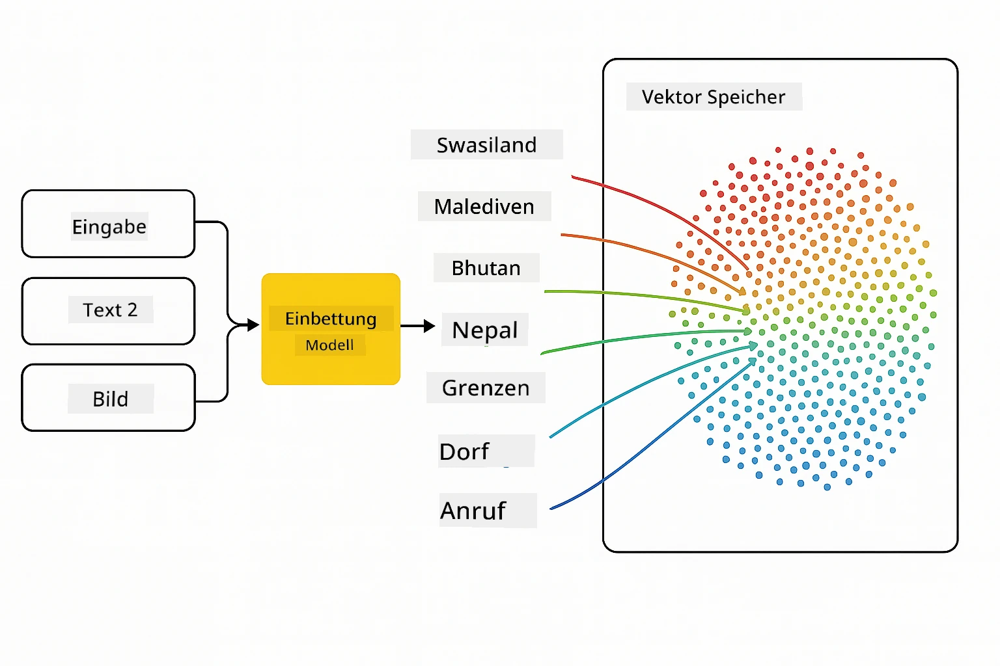
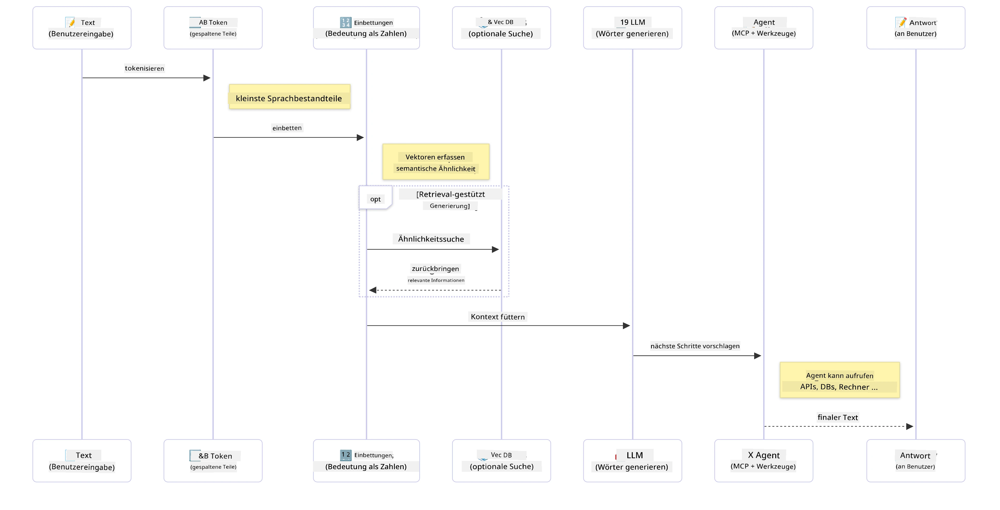

<!--
CO_OP_TRANSLATOR_METADATA:
{
  "original_hash": "75bfb080ca725e8a9aa9c80cae25fba1",
  "translation_date": "2025-07-29T08:02:29+00:00",
  "source_file": "01-IntroToGenAI/README.md",
  "language_code": "de"
}
-->
# Einführung in Generative KI - Java Edition

## Was Sie lernen werden

- **Grundlagen der generativen KI**, einschließlich LLMs, Prompt-Engineering, Tokens, Embeddings und Vektordatenbanken
- **Vergleich von Java-Entwicklungstools für KI**, einschließlich Azure OpenAI SDK, Spring AI und OpenAI Java SDK
- **Entdecken des Model Context Protocol** und dessen Rolle in der Kommunikation von KI-Agenten

## Inhaltsverzeichnis

- [Einleitung](../../../01-IntroToGenAI)
- [Ein kurzer Überblick über Konzepte der generativen KI](../../../01-IntroToGenAI)
- [Überblick über Prompt-Engineering](../../../01-IntroToGenAI)
- [Tokens, Embeddings und Agenten](../../../01-IntroToGenAI)
- [Entwicklungstools und Bibliotheken für KI in Java](../../../01-IntroToGenAI)
  - [OpenAI Java SDK](../../../01-IntroToGenAI)
  - [Spring AI](../../../01-IntroToGenAI)
  - [Azure OpenAI Java SDK](../../../01-IntroToGenAI)
- [Zusammenfassung](../../../01-IntroToGenAI)
- [Nächste Schritte](../../../01-IntroToGenAI)

## Einleitung

Willkommen zum ersten Kapitel von Generative KI für Anfänger - Java Edition! Diese grundlegende Lektion führt Sie in die Kernkonzepte der generativen KI ein und zeigt, wie Sie mit Java damit arbeiten können. Sie lernen die wesentlichen Bausteine von KI-Anwendungen kennen, darunter Large Language Models (LLMs), Tokens, Embeddings und KI-Agenten. Außerdem erkunden wir die wichtigsten Java-Tools, die Sie im Verlauf dieses Kurses verwenden werden.

### Ein kurzer Überblick über Konzepte der generativen KI

Generative KI ist eine Art von künstlicher Intelligenz, die neue Inhalte wie Texte, Bilder oder Code basierend auf Mustern und Beziehungen erstellt, die aus Daten gelernt wurden. Generative KI-Modelle können menschenähnliche Antworten generieren, Kontext verstehen und manchmal sogar Inhalte erstellen, die menschlich wirken.

Während Sie Ihre Java-KI-Anwendungen entwickeln, arbeiten Sie mit **generativen KI-Modellen**, um Inhalte zu erstellen. Einige Fähigkeiten generativer KI-Modelle umfassen:

- **Textgenerierung**: Erstellen von menschenähnlichem Text für Chatbots, Inhalte und Textvervollständigung.
- **Bildgenerierung und -analyse**: Erstellen realistischer Bilder, Verbessern von Fotos und Erkennen von Objekten.
- **Codegenerierung**: Schreiben von Code-Snippets oder Skripten.

Es gibt spezifische Modelltypen, die für verschiedene Aufgaben optimiert sind. Beispielsweise können sowohl **Small Language Models (SLMs)** als auch **Large Language Models (LLMs)** Text generieren, wobei LLMs in der Regel eine bessere Leistung bei komplexen Aufgaben bieten. Für bildbezogene Aufgaben würden Sie spezialisierte Vision-Modelle oder multimodale Modelle verwenden.

Natürlich sind die Antworten dieser Modelle nicht immer perfekt. Sie haben wahrscheinlich schon gehört, dass Modelle „halluzinieren“ oder falsche Informationen auf autoritäre Weise generieren können. Aber Sie können das Modell durch klare Anweisungen und Kontext dazu bringen, bessere Antworten zu generieren. Hier kommt das **Prompt-Engineering** ins Spiel.

#### Überblick über Prompt-Engineering

Prompt-Engineering ist die Praxis, effektive Eingaben zu entwerfen, um KI-Modelle zu gewünschten Ausgaben zu führen. Es umfasst:

- **Klarheit**: Klare und eindeutige Anweisungen geben.
- **Kontext**: Notwendige Hintergrundinformationen bereitstellen.
- **Einschränkungen**: Begrenzungen oder Formate spezifizieren.

Einige bewährte Praktiken im Prompt-Engineering umfassen das Design von Prompts, klare Anweisungen, Aufgabenzerlegung, One-Shot- und Few-Shot-Lernen sowie Prompt-Tuning. Das Testen verschiedener Prompts ist entscheidend, um herauszufinden, was für Ihren spezifischen Anwendungsfall am besten funktioniert.

Beim Entwickeln von Anwendungen arbeiten Sie mit verschiedenen Prompt-Typen:
- **System-Prompts**: Legen die Grundregeln und den Kontext für das Verhalten des Modells fest.
- **Benutzer-Prompts**: Die Eingabedaten Ihrer Anwendungsbenutzer.
- **Assistenten-Prompts**: Die Antworten des Modells basierend auf System- und Benutzer-Prompts.

> **Mehr erfahren**: Erfahren Sie mehr über Prompt-Engineering im [Kapitel Prompt-Engineering des GenAI für Anfänger-Kurses](https://github.com/microsoft/generative-ai-for-beginners/tree/main/04-prompt-engineering-fundamentals)

#### Tokens, Embeddings und Agenten

Beim Arbeiten mit generativen KI-Modellen stoßen Sie auf Begriffe wie **Tokens**, **Embeddings**, **Agenten** und **Model Context Protocol (MCP)**. Hier ist eine detaillierte Übersicht dieser Konzepte:

- **Tokens**: Tokens sind die kleinste Einheit von Text in einem Modell. Sie können Wörter, Zeichen oder Teilwörter sein. Tokens werden verwendet, um Textdaten in einem Format darzustellen, das das Modell verstehen kann. Zum Beispiel könnte der Satz „The quick brown fox jumped over the lazy dog“ als ["The", " quick", " brown", " fox", " jumped", " over", " the", " lazy", " dog"] oder ["The", " qu", "ick", " br", "own", " fox", " jump", "ed", " over", " the", " la", "zy", " dog"] tokenisiert werden, je nach Tokenisierungsstrategie.

Die Tokenisierung ist der Prozess des Zerlegens von Text in diese kleineren Einheiten. Dies ist entscheidend, da Modelle mit Tokens und nicht mit Rohtext arbeiten. Die Anzahl der Tokens in einem Prompt beeinflusst die Länge und Qualität der Modellantwort, da Modelle Token-Limits für ihr Kontextfenster haben (z. B. 128K Tokens für GPT-4o's Gesamtkontext, einschließlich Eingabe und Ausgabe).

  In Java können Sie Bibliotheken wie das OpenAI SDK verwenden, um die Tokenisierung automatisch zu handhaben, wenn Sie Anfragen an KI-Modelle senden.

- **Embeddings**: Embeddings sind Vektorrepräsentationen von Tokens, die semantische Bedeutungen erfassen. Sie sind numerische Darstellungen (typischerweise Arrays von Gleitkommazahlen), die es Modellen ermöglichen, Beziehungen zwischen Wörtern zu verstehen und kontextuell relevante Antworten zu generieren. Ähnliche Wörter haben ähnliche Embeddings, wodurch das Modell Konzepte wie Synonyme und semantische Beziehungen verstehen kann.

  In Java können Sie Embeddings mit dem OpenAI SDK oder anderen Bibliotheken generieren, die die Erstellung von Embeddings unterstützen. Diese Embeddings sind entscheidend für Aufgaben wie semantische Suche, bei der Sie ähnliche Inhalte basierend auf Bedeutung und nicht auf exakten Textübereinstimmungen finden möchten.

- **Vektordatenbanken**: Vektordatenbanken sind spezialisierte Speichersysteme, die für Embeddings optimiert sind. Sie ermöglichen effiziente Ähnlichkeitssuche und sind entscheidend für Retrieval-Augmented Generation (RAG)-Muster, bei denen Sie relevante Informationen aus großen Datensätzen basierend auf semantischer Ähnlichkeit und nicht auf exakten Übereinstimmungen finden müssen.

> **Hinweis**: In diesem Kurs behandeln wir keine Vektordatenbanken, halten sie jedoch für erwähnenswert, da sie häufig in realen Anwendungen verwendet werden.

- **Agenten & MCP**: KI-Komponenten, die autonom mit Modellen, Tools und externen Systemen interagieren. Das Model Context Protocol (MCP) bietet eine standardisierte Möglichkeit für Agenten, sicher auf externe Datenquellen und Tools zuzugreifen. Erfahren Sie mehr in unserem [MCP für Anfänger](https://github.com/microsoft/mcp-for-beginners)-Kurs.

In Java-KI-Anwendungen verwenden Sie Tokens für die Textverarbeitung, Embeddings für semantische Suche und RAG, Vektordatenbanken für die Datenabfrage und Agenten mit MCP, um intelligente, toolnutzende Systeme zu erstellen.

### Entwicklungstools und Bibliotheken für KI in Java

Java bietet hervorragende Tools für die KI-Entwicklung. Es gibt drei Hauptbibliotheken, die wir im Verlauf dieses Kurses erkunden werden - OpenAI Java SDK, Azure OpenAI SDK und Spring AI.

Hier ist eine schnelle Referenztabelle, die zeigt, welches SDK in den Beispielen der einzelnen Kapitel verwendet wird:

| Kapitel | Beispiel | SDK |
|---------|----------|-----|
| 02-SetupDevEnvironment | github-models | OpenAI Java SDK |
| 02-SetupDevEnvironment | basic-chat-azure | Spring AI Azure OpenAI |
| 03-CoreGenerativeAITechniques | Beispiele | Azure OpenAI SDK |
| 04-PracticalSamples | petstory | OpenAI Java SDK |
| 04-PracticalSamples | foundrylocal | OpenAI Java SDK |
| 04-PracticalSamples | calculator | Spring AI MCP SDK + LangChain4j |

**SDK-Dokumentationslinks:**
- [Azure OpenAI Java SDK](https://github.com/Azure/azure-sdk-for-java/tree/azure-ai-openai_1.0.0-beta.16/sdk/openai/azure-ai-openai)
- [Spring AI](https://docs.spring.io/spring-ai/reference/)
- [OpenAI Java SDK](https://github.com/openai/openai-java)
- [LangChain4j](https://docs.langchain4j.dev/)

#### OpenAI Java SDK

Das OpenAI SDK ist die offizielle Java-Bibliothek für die OpenAI-API. Es bietet eine einfache und konsistente Schnittstelle für die Interaktion mit den Modellen von OpenAI und erleichtert die Integration von KI-Funktionen in Java-Anwendungen. Kapitel 2's GitHub Models-Beispiel, Kapitel 4's Pet Story-Anwendung und Foundry Local-Beispiel demonstrieren den Ansatz des OpenAI SDK.

#### Spring AI

Spring AI ist ein umfassendes Framework, das KI-Funktionen in Spring-Anwendungen bringt und eine konsistente Abstraktionsebene über verschiedene KI-Anbieter bietet. Es integriert sich nahtlos in das Spring-Ökosystem und ist die ideale Wahl für Unternehmens-Java-Anwendungen, die KI-Funktionen benötigen.

Die Stärke von Spring AI liegt in seiner nahtlosen Integration in das Spring-Ökosystem, wodurch es einfach ist, produktionsreife KI-Anwendungen mit vertrauten Spring-Mustern wie Dependency Injection, Konfigurationsmanagement und Testframeworks zu erstellen. Sie verwenden Spring AI in Kapitel 2 und 4, um Anwendungen zu erstellen, die sowohl OpenAI als auch die Model Context Protocol (MCP) Spring AI-Bibliotheken nutzen.

##### Model Context Protocol (MCP)

Das [Model Context Protocol (MCP)](https://modelcontextprotocol.io/) ist ein aufkommender Standard, der es KI-Anwendungen ermöglicht, sicher mit externen Datenquellen und Tools zu interagieren. MCP bietet eine standardisierte Möglichkeit für KI-Modelle, auf kontextuelle Informationen zuzugreifen und Aktionen in Ihren Anwendungen auszuführen.

In Kapitel 4 erstellen Sie einen einfachen MCP-Rechnerdienst, der die Grundlagen des Model Context Protocol mit Spring AI demonstriert und zeigt, wie man grundlegende Tool-Integrationen und Service-Architekturen erstellt.

#### Azure OpenAI Java SDK

Die Azure OpenAI-Clientbibliothek für Java ist eine Anpassung der REST-APIs von OpenAI, die eine idiomatische Schnittstelle und Integration mit dem Rest des Azure SDK-Ökosystems bietet. In Kapitel 3 erstellen Sie Anwendungen mit dem Azure OpenAI SDK, einschließlich Chat-Anwendungen, Funktionsaufrufen und RAG (Retrieval-Augmented Generation)-Mustern.

> Hinweis: Das Azure OpenAI SDK hinkt dem OpenAI Java SDK in Bezug auf Funktionen hinterher, daher sollten Sie für zukünftige Projekte das OpenAI Java SDK in Betracht ziehen.

## Zusammenfassung

Das war's mit den Grundlagen! Sie verstehen jetzt:

- Die Kernkonzepte hinter generativer KI - von LLMs und Prompt-Engineering bis hin zu Tokens, Embeddings und Vektordatenbanken
- Ihre Tool-Optionen für die Java-KI-Entwicklung: Azure OpenAI SDK, Spring AI und OpenAI Java SDK
- Was das Model Context Protocol ist und wie es KI-Agenten ermöglicht, mit externen Tools zu arbeiten

## Nächste Schritte

[Kapitel 2: Einrichten der Entwicklungsumgebung](../02-SetupDevEnvironment/README.md)

**Haftungsausschluss**:  
Dieses Dokument wurde mit dem KI-Übersetzungsdienst [Co-op Translator](https://github.com/Azure/co-op-translator) übersetzt. Obwohl wir uns um Genauigkeit bemühen, weisen wir darauf hin, dass automatisierte Übersetzungen Fehler oder Ungenauigkeiten enthalten können. Das Originaldokument in seiner ursprünglichen Sprache sollte als maßgebliche Quelle betrachtet werden. Für kritische Informationen wird eine professionelle menschliche Übersetzung empfohlen. Wir haften nicht für Missverständnisse oder Fehlinterpretationen, die sich aus der Nutzung dieser Übersetzung ergeben.