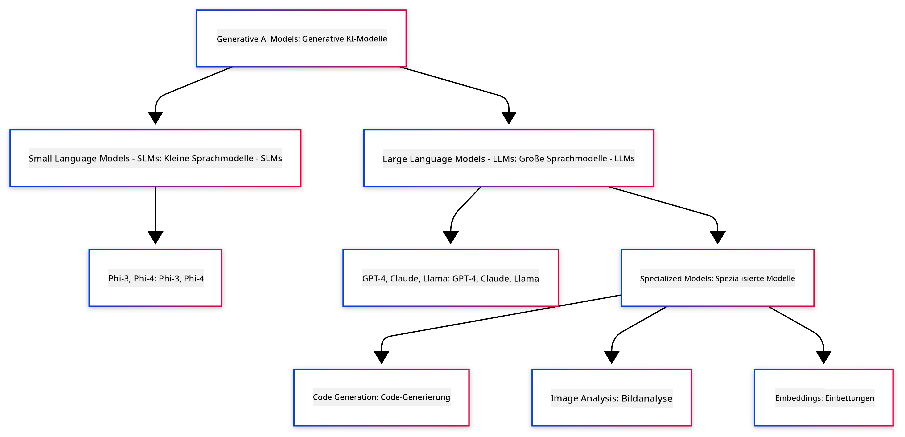
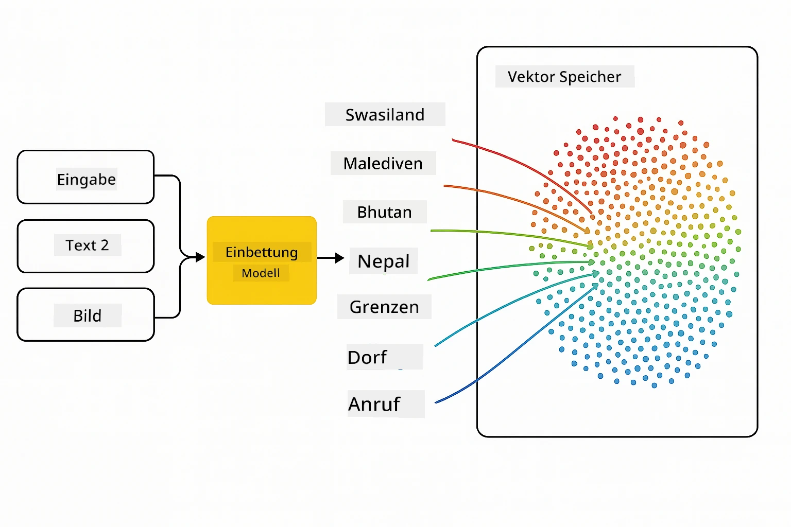
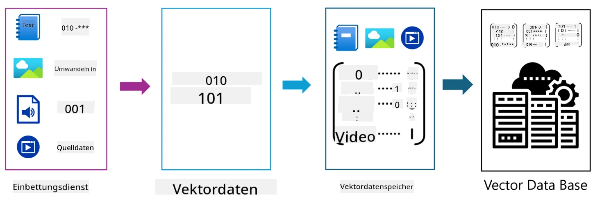
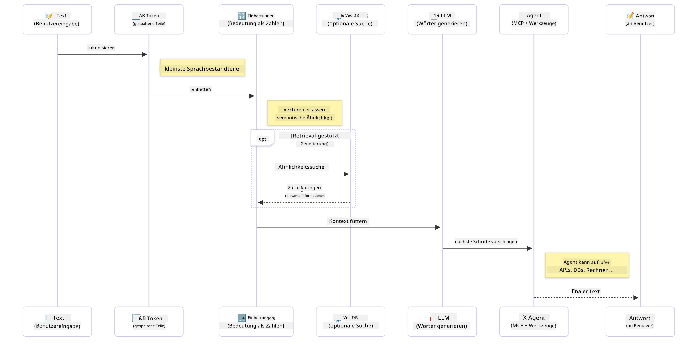

# Einführung in Generative KI - Java Edition

> **Video**: [Sehen Sie sich die Videoübersicht zu dieser Lektion auf YouTube an.](https://www.youtube.com/watch?v=XH46tGp_eSw) Sie können auch auf das obenstehende Vorschaubild klicken.

## Was Sie lernen werden

- **Grundlagen der generativen KI** einschließlich LLMs, Prompt-Engineering, Tokens, Embeddings und Vektordatenbanken
- **Vergleich von Java KI-Entwicklungstools** einschließlich Azure OpenAI SDK, Spring AI und OpenAI Java SDK
- **Entdecken Sie das Model Context Protocol** und seine Rolle in der KI-Agenten-Kommunikation

## Inhaltsverzeichnis

- [Einführung](#einführung)
- [Eine kurze Auffrischung der Konzepte der generativen KI](#eine-kurze-auffrischung-der-konzepte-der-generativen-ki)
- [Überblick zum Prompt-Engineering](#überblick-zum-prompt-engineering)
- [Tokens, Embeddings und Agenten](#tokens-embeddings-und-agenten)
- [KI-Entwicklungstools und Bibliotheken für Java](#ki-entwicklungstools-und-bibliotheken-für-java)
  - [OpenAI Java SDK](#openai-java-sdk)
  - [Spring AI](#spring-ai)
  - [Azure OpenAI Java SDK](#azure-openai-java-sdk)
- [Zusammenfassung](#zusammenfassung)
- [Nächste Schritte](#nächste-schritte)

## Einführung

Willkommen zum ersten Kapitel von Generative KI für Anfänger - Java Edition! Diese grundlegende Lektion führt Sie in die Kernkonzepte der generativen KI ein und zeigt, wie Sie mit ihnen in Java arbeiten. Sie lernen die wesentlichen Bausteine von KI-Anwendungen kennen, darunter Large Language Models (LLMs), Tokens, Embeddings und KI-Agenten. Außerdem erkunden wir die wichtigsten Java-Tools, die Sie im Verlauf dieses Kurses verwenden werden.

### Eine kurze Auffrischung der Konzepte der generativen KI

Generative KI ist eine Art künstlicher Intelligenz, die neue Inhalte wie Texte, Bilder oder Code erzeugt, basierend auf Mustern und Beziehungen, die aus Daten gelernt wurden. Generative KI-Modelle können menschenähnliche Antworten generieren, Kontext verstehen und manchmal sogar Inhalte erstellen, die wie von Menschen gemacht erscheinen.

Während Sie Ihre Java KI-Anwendungen entwickeln, arbeiten Sie mit **generativen KI-Modellen** zur Erstellung von Inhalten. Einige Fähigkeiten generativer KI-Modelle umfassen:

- **Textgenerierung**: Erstellung menschenähnlicher Texte für Chatbots, Inhalte und Textvervollständigung.
- **Bildgenerierung und -analyse**: Produktion realistischer Bilder, Verbesserung von Fotos und Erkennung von Objekten.
- **Codegenerierung**: Schreiben von Code-Schnipseln oder Skripten.

Es gibt bestimmte Modelltypen, die für verschiedene Aufgaben optimiert sind. So können sowohl **Small Language Models (SLMs)** als auch **Large Language Models (LLMs)** Text generieren, wobei LLMs typischerweise bessere Leistungen bei komplexen Aufgaben bieten. Für bildbezogene Aufgaben würden Sie spezialisierte Vision-Modelle oder multimodale Modelle verwenden.

Natürlich sind die Antworten dieser Modelle nicht immer perfekt. Sie haben wahrscheinlich schon von Modellen gehört, die „halluzinieren“ oder auf autoritäre Weise falsche Informationen generieren. Aber Sie können das Modell dabei unterstützen, bessere Antworten zu generieren, indem Sie klare Anweisungen und Kontext bereitstellen. Hier kommt das **Prompt Engineering** ins Spiel.

#### Überblick zum Prompt-Engineering

Prompt Engineering ist die Praxis, effektive Eingaben zu gestalten, um KI-Modelle zu gewünschten Ausgaben zu lenken. Es umfasst:

- **Klarheit**: Anweisungen klar und eindeutig formulieren.
- **Kontext**: Notwendige Hintergrundinformationen bereitstellen.
- **Einschränkungen**: Jegliche Begrenzungen oder Formate festlegen.

Einige bewährte Verfahren für Prompt Engineering umfassen Prompt-Design, klare Anweisungen, Aufgabenteilung, One-Shot- und Few-Shot-Lernen sowie Prompt Tuning. Das Testen verschiedener Prompts ist entscheidend, um herauszufinden, was für Ihren spezifischen Anwendungsfall am besten funktioniert.

Beim Entwickeln von Anwendungen arbeiten Sie mit verschiedenen Prompt-Typen:
- **System-Prompts**: Setzen die Grundregeln und den Kontext für das Verhalten des Modells
- **User-Prompts**: Die Eingabedaten Ihrer Anwendungsnutzer
- **Assistant-Prompts**: Die Antworten des Modells basierend auf System- und User-Prompts

> **Mehr erfahren**: Erfahren Sie mehr über Prompt Engineering im [Kapitel Prompt Engineering des GenAI für Anfänger-Kurses](https://github.com/microsoft/generative-ai-for-beginners/tree/main/04-prompt-engineering-fundamentals)

#### Tokens, Embeddings und Agenten

Beim Arbeiten mit generativen KI-Modellen stoßen Sie auf Begriffe wie **Tokens**, **Embeddings**, **Agenten** und **Model Context Protocol (MCP)**. Hier ist eine detaillierte Übersicht dieser Konzepte:

- **Tokens**: Tokens sind die kleinste Texteingabeeinheit in einem Modell. Sie können Wörter, Zeichen oder Teilwörter sein. Tokens werden verwendet, um Textdaten in einem Format darzustellen, das das Modell versteht. Zum Beispiel könnte der Satz „The quick brown fox jumped over the lazy dog“ tokenisiert werden als ["The", " quick", " brown", " fox", " jumped", " over", " the", " lazy", " dog"] oder ["The", " qu", "ick", " br", "own", " fox", " jump", "ed", " over", " the", " la", "zy", " dog"], abhängig von der Tokenisierungsstrategie.

Tokenisierung ist der Prozess des Zerlegens von Text in diese kleineren Einheiten. Das ist wichtig, weil Modelle auf Tokens statt auf Rohtext operieren. Die Anzahl der Tokens in einem Prompt beeinflusst die Länge und Qualität der Antwort, da Modelle Token-Grenzen in ihrem Kontextfenster haben (z. B. 128K Tokens für den Gesamtkontext von GPT-4o, inklusive Eingabe und Ausgabe).

  In Java können Sie Bibliotheken wie das OpenAI SDK verwenden, um Tokenisierung automatisch zu handhaben, wenn Sie Anfragen an KI-Modelle senden.

- **Embeddings**: Embeddings sind Vektor-Darstellungen von Tokens, die semantische Bedeutung erfassen. Sie sind numerische Repräsentationen (typischerweise Arrays von Fließkommazahlen), die es Modellen ermöglichen, Beziehungen zwischen Wörtern zu verstehen und kontextuell relevante Antworten zu generieren. Ähnliche Wörter haben ähnliche Embeddings, was dem Modell das Verständnis von Synonymen und semantischen Beziehungen ermöglicht.

  In Java können Sie Embeddings mithilfe des OpenAI SDK oder anderer Bibliotheken, die Embedding-Erzeugung unterstützen, generieren. Diese Embeddings sind wesentlich für Aufgaben wie semantische Suche, bei denen Sie ähnliche Inhalte basierend auf Bedeutung und nicht auf exakten Textübereinstimmungen finden möchten.

- **Vektordatenbanken**: Vektordatenbanken sind spezialisierte Speichersysteme, die für Embeddings optimiert sind. Sie ermöglichen eine effiziente Ähnlichkeitssuche und sind entscheidend für Retrieval-Augmented Generation (RAG)-Muster, bei denen Sie relevante Informationen basierend auf semantischer Ähnlichkeit und nicht auf exakten Übereinstimmungen aus großen Datensätzen abrufen müssen.

> **Hinweis**: In diesem Kurs behandeln wir Vektordatenbanken nicht, finden sie aber erwähnenswert, da sie in realen Anwendungen häufig verwendet werden.

- **Agenten & MCP**: KI-Komponenten, die autonom mit Modellen, Tools und externen Systemen interagieren. Das Model Context Protocol (MCP) bietet eine standardisierte Art für Agenten, sicher auf externe Datenquellen und Tools zuzugreifen. Erfahren Sie mehr in unserem [MCP für Anfänger](https://github.com/microsoft/mcp-for-beginners) Kurs.

In Java KI-Anwendungen verwenden Sie Tokens zur Textverarbeitung, Embeddings für semantische Suche und RAG, Vektordatenbanken für Datenabruf und Agenten mit MCP für den Aufbau intelligenter, tool-nutzender Systeme.

### KI-Entwicklungstools und Bibliotheken für Java

Java bietet ausgezeichnete Werkzeuge für die KI-Entwicklung. Es gibt drei Hauptbibliotheken, die wir im Verlauf dieses Kurses erkunden werden – OpenAI Java SDK, Azure OpenAI SDK und Spring AI.

Hier eine schnelle Referenztabelle, welche SDKs in den Beispielen der Kapitel verwendet werden:

| Kapitel | Beispiel | SDK |
|---------|----------|-----|
| 02-SetupDevEnvironment | github-models | OpenAI Java SDK |
| 02-SetupDevEnvironment | basic-chat-azure | Spring AI Azure OpenAI |
| 03-CoreGenerativeAITechniques | examples | Azure OpenAI SDK |
| 04-PracticalSamples | petstory | OpenAI Java SDK |
| 04-PracticalSamples | foundrylocal | OpenAI Java SDK |
| 04-PracticalSamples | calculator | Spring AI MCP SDK + LangChain4j |

**SDK-Dokumentationslinks:**
- [Azure OpenAI Java SDK](https://github.com/Azure/azure-sdk-for-java/tree/azure-ai-openai_1.0.0-beta.16/sdk/openai/azure-ai-openai)
- [Spring AI](https://docs.spring.io/spring-ai/reference/)
- [OpenAI Java SDK](https://github.com/openai/openai-java)
- [LangChain4j](https://docs.langchain4j.dev/)

#### OpenAI Java SDK

Das OpenAI SDK ist die offizielle Java-Bibliothek für die OpenAI API. Es bietet eine einfache und konsistente Schnittstelle zur Interaktion mit OpenAI-Modellen und erleichtert so die Integration von KI-Funktionalitäten in Java-Anwendungen. Das GitHub Models-Beispiel aus Kapitel 2 sowie die Pet Story-Anwendung und Foundry Local-Beispiel aus Kapitel 4 demonstrieren den OpenAI SDK-Ansatz.

#### Spring AI

Spring AI ist ein umfassendes Framework, das KI-Fähigkeiten in Spring-Anwendungen bringt und eine konsistente Abstraktionsebene über verschiedene KI-Anbieter bietet. Es integriert sich nahtlos in das Spring-Ökosystem und ist die ideale Wahl für Enterprise-Java-Anwendungen, die KI-Funktionalitäten benötigen.

Die Stärke von Spring AI liegt in der nahtlosen Integration in das Spring-Ökosystem, was es einfach macht, produktionsreife KI-Anwendungen mit vertrauten Spring-Patterns wie Dependency Injection, Konfigurationsmanagement und Testframeworks zu bauen. Sie verwenden Spring AI in Kapitel 2 und 4, um Anwendungen zu erstellen, die sowohl OpenAI als auch die Model Context Protocol (MCP) Spring AI-Bibliotheken nutzen.

##### Model Context Protocol (MCP)

Das [Model Context Protocol (MCP)](https://modelcontextprotocol.io/) ist ein aufkommender Standard, der KI-Anwendungen ermöglicht, sicher mit externen Datenquellen und Tools zu interagieren. MCP bietet eine standardisierte Methode, damit KI-Modelle auf kontextuelle Informationen zugreifen und Aktionen in Ihren Anwendungen ausführen können.

In Kapitel 4 bauen Sie einen einfachen MCP Calculator-Service, der die Grundlagen des Model Context Protocol mit Spring AI demonstriert und zeigt, wie man grundlegende Tool-Integrationen und Service-Architekturen erstellt.

#### Azure OpenAI Java SDK

Die Azure OpenAI Client-Bibliothek für Java ist eine Anpassung der REST-APIs von OpenAI, die eine idiomatische Schnittstelle und Integration mit dem Rest des Azure SDK-Ökosystems bietet. In Kapitel 3 bauen Sie Anwendungen mit dem Azure OpenAI SDK, darunter Chat-Anwendungen, Funktionsaufrufe und Retrieval-Augmented Generation (RAG) Muster.

> Hinweis: Das Azure OpenAI SDK hinkt dem OpenAI Java SDK in Bezug auf Funktionen hinterher, daher sollten Sie für zukünftige Projekte die Verwendung des OpenAI Java SDK in Betracht ziehen.

## Zusammenfassung

Damit sind die Grundlagen abgeschlossen! Sie verstehen jetzt:

- Die Kernkonzepte hinter generativer KI – von LLMs und Prompt Engineering bis hin zu Tokens, Embeddings und Vektordatenbanken
- Ihre Werkzeugoptionen für die Java KI-Entwicklung: Azure OpenAI SDK, Spring AI und OpenAI Java SDK
- Was das Model Context Protocol ist und wie es KI-Agenten ermöglicht, mit externen Tools zu arbeiten

## Nächste Schritte

[Kapitel 2: Einrichten der Entwicklungsumgebung](../02-SetupDevEnvironment/README.md)

---

<!-- CO-OP TRANSLATOR DISCLAIMER START -->
**Haftungsausschluss**:  
Dieses Dokument wurde mit dem KI-Übersetzungsdienst [Co-op Translator](https://github.com/Azure/co-op-translator) übersetzt. Obwohl wir uns um Genauigkeit bemühen, beachten Sie bitte, dass automatisierte Übersetzungen Fehler oder Ungenauigkeiten enthalten können. Das Originaldokument in seiner Ursprungssprache gilt als maßgebliche Quelle. Für kritische Informationen wird eine professionelle menschliche Übersetzung empfohlen. Wir übernehmen keine Haftung für Missverständnisse oder Fehlinterpretationen, die aus der Nutzung dieser Übersetzung entstehen.
<!-- CO-OP TRANSLATOR DISCLAIMER END -->