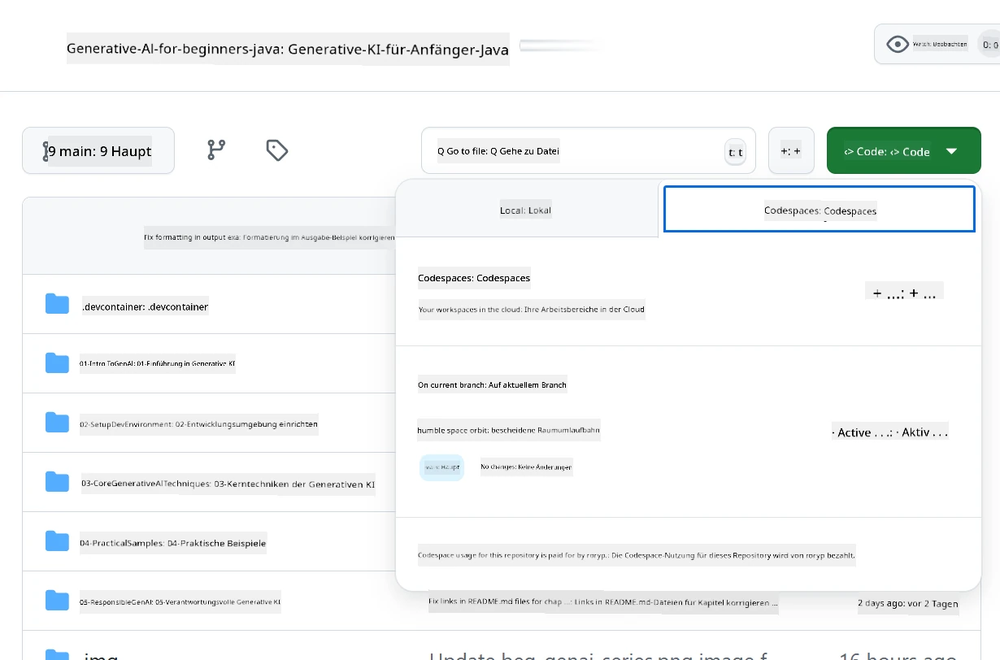
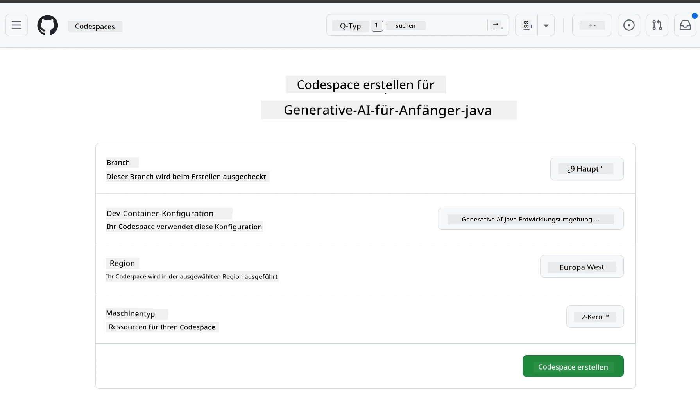
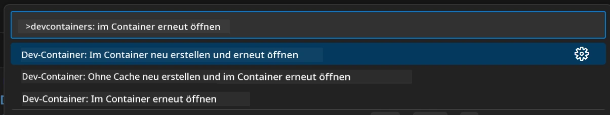
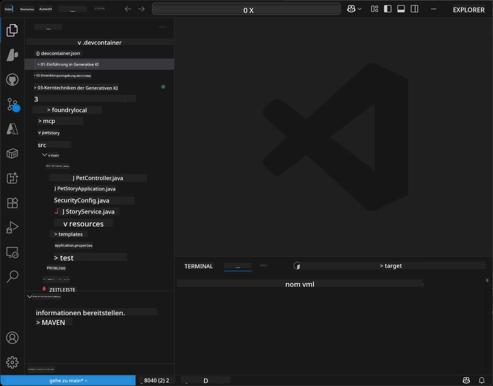
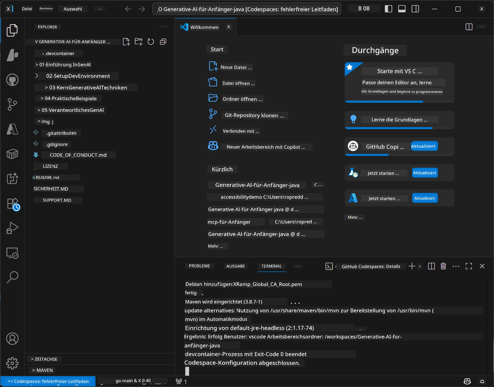

# Einrichtung der Entwicklungsumgebung für Generative KI für Java

> **Schnellstart**: Programmieren in der Cloud in 2 Minuten – springen Sie zu [GitHub Codespaces Einrichtung](../../../02-SetupDevEnvironment) – keine lokale Installation erforderlich und verwendet GitHub-Modelle!

> **Interessiert an Azure OpenAI?** Siehe unseren [Azure OpenAI Einrichtungsguide](getting-started-azure-openai.md) mit Schritten zur Erstellung einer neuen Azure OpenAI-Ressource.

## Was Sie lernen werden

- Einrichtung einer Java-Entwicklungsumgebung für KI-Anwendungen
- Auswahl und Konfiguration Ihrer bevorzugten Entwicklungsumgebung (Cloud-first mit Codespaces, lokale Dev-Container oder vollständige lokale Einrichtung)
- Testen Ihrer Einrichtung durch Verbindung zu GitHub-Modellen

## Inhaltsverzeichnis

- [Was Sie lernen werden](../../../02-SetupDevEnvironment)
- [Einführung](../../../02-SetupDevEnvironment)
- [Schritt 1: Einrichten Ihrer Entwicklungsumgebung](../../../02-SetupDevEnvironment)
  - [Option A: GitHub Codespaces (empfohlen)](../../../02-SetupDevEnvironment)
  - [Option B: Lokaler Dev-Container](../../../02-SetupDevEnvironment)
  - [Option C: Verwenden Sie Ihre bestehende lokale Installation](../../../02-SetupDevEnvironment)
- [Schritt 2: Erstellen eines GitHub Personal Access Token](../../../02-SetupDevEnvironment)
- [Schritt 3: Testen Sie Ihre Einrichtung](../../../02-SetupDevEnvironment)
- [Fehlerbehebung](../../../02-SetupDevEnvironment)
- [Zusammenfassung](../../../02-SetupDevEnvironment)
- [Nächste Schritte](../../../02-SetupDevEnvironment)

## Einführung

Dieses Kapitel führt Sie durch die Einrichtung einer Entwicklungsumgebung. Wir verwenden **GitHub-Modelle** als unser primäres Beispiel, da es kostenlos ist, mit nur einem GitHub-Konto einfach einzurichten, keine Kreditkarte benötigt und Zugang zu mehreren Modellen für Experimente bietet.

**Keine lokale Einrichtung erforderlich!** Sie können sofort mit der Programmierung beginnen, indem Sie GitHub Codespaces verwenden, die eine vollständige Entwicklungsumgebung in Ihrem Browser bereitstellen.


Wir empfehlen die Nutzung von [**GitHub Models**](https://github.com/marketplace?type=models) für diesen Kurs, weil es:
- **Kostenlos** zum Einstieg ist
- **Einfach** mit nur einem GitHub-Konto einzurichten ist
- **Keine Kreditkarte** benötigt
- **Mehrere Modelle** für Experimente bereitstellt

> **Hinweis**: Die in diesem Training verwendeten GitHub-Modelle haben folgende kostenlose Limits:
> - 15 Anfragen pro Minute (150 pro Tag)
> - ~8.000 Wörter Eingabe, ~4.000 Wörter Ausgabe pro Anfrage
> - 5 gleichzeitige Anfragen
> 
> Für den Produktionseinsatz verwenden Sie Azure AI Foundry Models mit Ihrem Azure-Konto. Ihr Code muss nicht geändert werden. Siehe die [Azure AI Foundry Dokumentation](https://learn.microsoft.com/azure/ai-foundry/foundry-models/how-to/quickstart-github-models).


## Schritt 1: Einrichten Ihrer Entwicklungsumgebung

<a name="quick-start-cloud"></a>

Wir haben einen vorkonfigurierten Entwicklungscontainer erstellt, um die Einrichtungszeit zu minimieren und sicherzustellen, dass Sie alle notwendigen Werkzeuge für diesen Generative AI für Java-Kurs haben. Wählen Sie Ihren bevorzugten Entwicklungsansatz:

### Optionen zur Umgebungseinrichtung:

#### Option A: GitHub Codespaces (empfohlen)

**Starten Sie die Programmierung in 2 Minuten – keine lokale Einrichtung notwendig!**

1. Forken Sie dieses Repository in Ihr GitHub-Konto
   > **Hinweis**: Wenn Sie die Grundkonfiguration bearbeiten möchten, sehen Sie sich bitte die [Dev Container Konfiguration](../../../.devcontainer/devcontainer.json) an
2. Klicken Sie auf **Code** → Tab **Codespaces** → **...** → **Neu mit Optionen...**
3. Verwenden Sie die Standardwerte – dies wählt die **Dev Container-Konfiguration**: **Generative AI Java Development Environment**, der benutzerdefinierte Devcontainer, der für diesen Kurs erstellt wurde
4. Klicken Sie auf **Codespace erstellen**
5. Warten Sie ca. 2 Minuten, bis die Umgebung bereit ist
6. Fahren Sie fort mit [Schritt 2: Erstellen eines GitHub Tokens](../../../02-SetupDevEnvironment)







> **Vorteile von Codespaces**:
> - Keine lokale Installation erforderlich
> - Funktioniert auf jedem Gerät mit Browser
> - Vorgefertigt mit allen Tools und Abhängigkeiten
> - 60 freie Stunden pro Monat für persönliche Konten
> - Einheitliche Umgebung für alle Lernenden

#### Option B: Lokaler Dev-Container

**Für Entwickler, die lokale Entwicklung mit Docker bevorzugen**

1. Forken und klonen Sie dieses Repository auf Ihre lokale Maschine
   > **Hinweis**: Wenn Sie die Grundkonfiguration bearbeiten möchten, sehen Sie sich bitte die [Dev Container Konfiguration](../../../.devcontainer/devcontainer.json) an
2. Installieren Sie [Docker Desktop](https://www.docker.com/products/docker-desktop/) und [VS Code](https://code.visualstudio.com/)
3. Installieren Sie die [Dev Containers Erweiterung](https://marketplace.visualstudio.com/items?itemName=ms-vscode-remote.remote-containers) in VS Code
4. Öffnen Sie den Repository-Ordner in VS Code
5. Wenn Sie dazu aufgefordert werden, klicken Sie auf **Im Container erneut öffnen** (oder verwenden Sie `Ctrl+Shift+P` → „Dev Containers: Im Container erneut öffnen“)
6. Warten Sie, bis der Container gebaut und gestartet ist
7. Fahren Sie fort mit [Schritt 2: Erstellen eines GitHub Tokens](../../../02-SetupDevEnvironment)





#### Option C: Verwenden Sie Ihre bestehende lokale Installation

**Für Entwickler mit vorhandenen Java-Umgebungen**

Voraussetzungen:
- [Java 21+](https://www.oracle.com/java/technologies/javase/jdk21-archive-downloads.html) 
- [Maven 3.9+](https://maven.apache.org/download.cgi)
- [VS Code](https://code.visualstudio.com) oder Ihre bevorzugte IDE

Schritte:
1. Klonen Sie dieses Repository auf Ihre lokale Maschine
2. Öffnen Sie das Projekt in Ihrer IDE
3. Fahren Sie fort mit [Schritt 2: Erstellen eines GitHub Tokens](../../../02-SetupDevEnvironment)

> **Profi-Tipp**: Wenn Sie ein leistungsschwächeres Gerät haben, aber VS Code lokal verwenden möchten, benutzen Sie GitHub Codespaces! Sie können Ihr lokales VS Code mit einem cloud-gehosteten Codespace verbinden für das Beste aus beiden Welten.




## Schritt 2: Erstellen eines GitHub Personal Access Token

1. Navigieren Sie zu [GitHub Einstellungen](https://github.com/settings/profile) und wählen Sie **Einstellungen** aus Ihrem Profilmenü.
2. Klicken Sie in der linken Seitenleiste auf **Entwicklereinstellungen** (normalerweise ganz unten).
3. Unter **Personal access tokens** klicken Sie auf **Feingranulare Tokens** (oder folgen Sie diesem direkten [Link](https://github.com/settings/personal-access-tokens)).
4. Klicken Sie auf **Neues Token generieren**.
5. Unter „Token-Name“ geben Sie einen beschreibenden Namen ein (z. B. `GenAI-Java-Kurs-Token`).
6. Legen Sie ein Ablaufdatum fest (empfohlen: 7 Tage aus Sicherheitsgründen).
7. Wählen Sie unter „Ressourcenbesitzer“ Ihr Benutzerkonto aus.
8. Wählen Sie unter „Repository-Zugriff“ die Repositories aus, die Sie mit GitHub-Modelle verwenden möchten (oder „Alle Repositories“, falls benötigt).
9. Unter „Kontoberechtigungen“ finden Sie **Models** und setzen es auf **Nur Lesen**.
10. Klicken Sie auf **Token generieren**.
11. **Kopieren Sie Ihr Token jetzt und speichern Sie es – Sie werden es nicht wieder sehen!**

> **Sicherheitstipp**: Verwenden Sie den minimal erforderlichen Umfang und die kürzeste praktische Ablaufzeit für Ihre Zugriffstoken.

## Schritt 3: Testen Sie Ihre Einrichtung mit dem GitHub Models Beispiel

Sobald Ihre Entwicklungsumgebung bereit ist, testen wir die GitHub Models Integration mit unserer Beispielanwendung in [`02-SetupDevEnvironment/examples/github-models`](../../../02-SetupDevEnvironment/examples/github-models).

1. Öffnen Sie das Terminal in Ihrer Entwicklungsumgebung.
2. Navigieren Sie zum GitHub Models Beispiel:
   ```bash
   cd 02-SetupDevEnvironment/examples/github-models
   ```
3. Setzen Sie Ihr GitHub-Token als Umgebungsvariable:
   ```bash
   # macOS/Linux
   export GITHUB_TOKEN=your_token_here
   
   # Windows (Eingabeaufforderung)
   set GITHUB_TOKEN=your_token_here
   
   # Windows (PowerShell)
   $env:GITHUB_TOKEN="your_token_here"
   ```

4. Starten Sie die Anwendung:
   ```bash
   mvn compile exec:java -Dexec.mainClass="com.example.githubmodels.App"
   ```

Sie sollten eine Ausgabe ähnlich der folgenden sehen:
```text
Using model: gpt-4.1-nano
Sending request to GitHub Models...
Response: Hello World!
```

### Das Beispielprogramm verstehen

Zuerst verstehen wir, was wir gerade ausgeführt haben. Das Beispiel unter `examples/github-models` verwendet das OpenAI Java SDK, um sich mit GitHub Models zu verbinden:

**Was dieser Code macht:**
- **Verbindet** sich mit GitHub Models über Ihr Personal Access Token
- **Sendet** eine einfache Nachricht „Say Hello World!“ an das KI-Modell
- **Erhält** und zeigt die Antwort der KI an
- **Validiert**, dass Ihre Einrichtung korrekt funktioniert

**Wichtige Abhängigkeit** (in `pom.xml`):
```xml
<dependency>
    <groupId>com.openai</groupId>
    <artifactId>openai-java</artifactId>
    <version>2.12.0</version>
</dependency>
```

**Hauptcode** (`App.java`):
```java
// Mit GitHub-Modellen über das OpenAI Java SDK verbinden
OpenAIClient client = OpenAIOkHttpClient.builder()
    .apiKey(pat)
    .baseUrl("https://models.inference.ai.azure.com")
    .build();

// Chat-Vervollständigungsanfrage erstellen
ChatCompletionCreateParams params = ChatCompletionCreateParams.builder()
    .model(modelId)
    .addSystemMessage("You are a concise assistant.")
    .addUserMessage("Say Hello World!")
    .build();

// KI-Antwort erhalten
ChatCompletion response = client.chat().completions().create(params);
System.out.println("Response: " + response.choices().get(0).message().content().orElse("No response content"));
```

## Zusammenfassung

Super! Jetzt haben Sie alles eingerichtet:

- GitHub Personal Access Token mit den richtigen Berechtigungen für den Zugriff auf KI-Modelle erstellt
- Ihre Java-Entwicklungsumgebung zum Laufen gebracht (ob Codespaces, Dev-Container oder lokal)
- Sich mit GitHub Models über das OpenAI Java SDK für kostenlose KI-Entwicklung verbunden
- Mit einem einfachen Beispiel getestet, das mit KI-Modellen kommuniziert

## Nächste Schritte

[Kapitels 3: Core Generative AI Techniques](../03-CoreGenerativeAITechniques/README.md)

## Fehlerbehebung

Probleme? Hier sind häufige Probleme und Lösungen:

- **Token funktioniert nicht?** 
  - Stellen Sie sicher, dass Sie das gesamte Token ohne zusätzliche Leerzeichen kopiert haben
  - Vergewissern Sie sich, dass das Token korrekt als Umgebungsvariable gesetzt ist
  - Prüfen Sie, ob Ihr Token die richtigen Berechtigungen hat (Models: Nur Lesen)

- **Maven nicht gefunden?** 
  - Wenn Sie Dev-Container/Codespaces verwenden, sollte Maven vorinstalliert sein
  - Für eine lokale Einrichtung stellen Sie sicher, dass Java 21+ und Maven 3.9+ installiert sind
  - Versuchen Sie `mvn --version` zur Überprüfung der Installation

- **Verbindungsprobleme?** 
  - Prüfen Sie Ihre Internetverbindung
  - Vergewissern Sie sich, dass GitHub von Ihrem Netzwerk aus erreichbar ist
  - Stellen Sie sicher, dass keine Firewall das GitHub Models-Endpunkt blockiert

- **Dev-Container startet nicht?** 
  - Stellen Sie sicher, dass Docker Desktop läuft (für lokale Entwicklung)
  - Versuchen Sie, den Container neu zu bauen: `Ctrl+Shift+P` → „Dev Containers: Container neu bauen“

- **Kompilierungsfehler in der Anwendung?**
  - Prüfen Sie, dass Sie sich im richtigen Verzeichnis befinden: `02-SetupDevEnvironment/examples/github-models`
  - Versuchen Sie, zu säubern und neu zu bauen: `mvn clean compile`

> **Brauchen Sie Hilfe?**: Noch Probleme? Öffnen Sie ein Issue im Repository und wir helfen Ihnen weiter.

---

<!-- CO-OP TRANSLATOR DISCLAIMER START -->
**Haftungsausschluss**:  
Dieses Dokument wurde mit dem KI-Übersetzungsdienst [Co-op Translator](https://github.com/Azure/co-op-translator) übersetzt. Obwohl wir uns um Genauigkeit bemühen, beachten Sie bitte, dass automatisierte Übersetzungen Fehler oder Ungenauigkeiten enthalten können. Das Originaldokument in seiner Ursprungssprache ist die maßgebliche Quelle. Für wichtige Informationen empfehlen wir eine professionelle menschliche Übersetzung. Wir übernehmen keine Haftung für Missverständnisse oder Fehlinterpretationen, die durch die Nutzung dieser Übersetzung entstehen.
<!-- CO-OP TRANSLATOR DISCLAIMER END -->