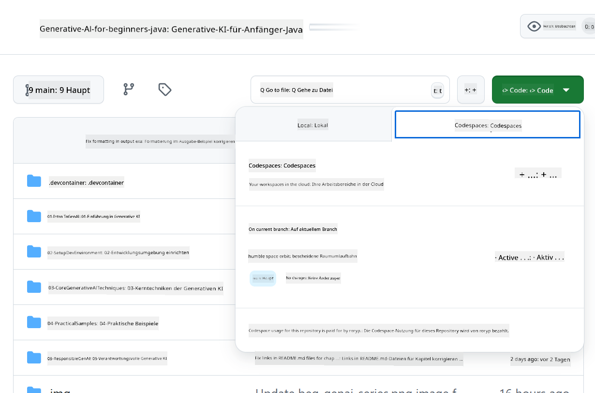

<!--
CO_OP_TRANSLATOR_METADATA:
{
  "original_hash": "bfdb4b4eadbee3a59ef742439f58326a",
  "translation_date": "2025-07-27T12:50:09+00:00",
  "source_file": "02-SetupDevEnvironment/getting-started-azure-openai.md",
  "language_code": "de"
}
-->
# Einrichten der Entwicklungsumgebung für Azure OpenAI

> **Schnellstart**: Diese Anleitung ist für die Einrichtung von Azure OpenAI gedacht. Für einen sofortigen Start mit kostenlosen Modellen nutzen Sie [GitHub Models mit Codespaces](./README.md#quick-start-cloud).

Diese Anleitung hilft Ihnen, Azure AI Foundry-Modelle für Ihre Java-AI-Anwendungen in diesem Kurs einzurichten.

## Inhaltsverzeichnis

- [Kurzübersicht zur Einrichtung](../../../02-SetupDevEnvironment)
- [Schritt 1: Azure AI Foundry-Ressourcen erstellen](../../../02-SetupDevEnvironment)
  - [Hub und Projekt erstellen](../../../02-SetupDevEnvironment)
  - [GPT-4o-mini-Modell bereitstellen](../../../02-SetupDevEnvironment)
- [Schritt 2: Codespace erstellen](../../../02-SetupDevEnvironment)
- [Schritt 3: Umgebung konfigurieren](../../../02-SetupDevEnvironment)
- [Schritt 4: Einrichtung testen](../../../02-SetupDevEnvironment)
- [Wie geht es weiter?](../../../02-SetupDevEnvironment)
- [Ressourcen](../../../02-SetupDevEnvironment)
- [Zusätzliche Ressourcen](../../../02-SetupDevEnvironment)

## Kurzübersicht zur Einrichtung

1. Azure AI Foundry-Ressourcen erstellen (Hub, Projekt, Modell)
2. Codespace mit Java-Entwicklungscontainer erstellen
3. `.env`-Datei mit Azure OpenAI-Zugangsdaten konfigurieren
4. Einrichtung mit dem Beispielprojekt testen

## Schritt 1: Azure AI Foundry-Ressourcen erstellen

### Hub und Projekt erstellen

1. Gehen Sie zum [Azure AI Foundry Portal](https://ai.azure.com/) und melden Sie sich an.
2. Klicken Sie auf **+ Erstellen** → **Neuer Hub** (oder navigieren Sie zu **Verwaltung** → **Alle Hubs** → **+ Neuer Hub**).
3. Konfigurieren Sie Ihren Hub:
   - **Hub-Name**: z. B. "MyAIHub"
   - **Abonnement**: Wählen Sie Ihr Azure-Abonnement aus
   - **Ressourcengruppe**: Neu erstellen oder bestehende auswählen
   - **Standort**: Wählen Sie den nächstgelegenen Standort
   - **Speicherkonto**: Standard verwenden oder benutzerdefiniert konfigurieren
   - **Key Vault**: Standard verwenden oder benutzerdefiniert konfigurieren
   - Klicken Sie auf **Weiter** → **Überprüfen + Erstellen** → **Erstellen**
4. Nach der Erstellung klicken Sie auf **+ Neues Projekt** (oder **Projekt erstellen** aus der Hub-Übersicht).
   - **Projektname**: z. B. "GenAIJava"
   - Klicken Sie auf **Erstellen**

### GPT-4o-mini-Modell bereitstellen

1. Gehen Sie in Ihrem Projekt zu **Modellkatalog** und suchen Sie nach **gpt-4o-mini**.
   - *Alternative: Gehen Sie zu **Bereitstellungen** → **+ Bereitstellung erstellen***
2. Klicken Sie auf **Bereitstellen** auf der gpt-4o-mini-Modellkarte.
3. Konfigurieren Sie die Bereitstellung:
   - **Bereitstellungsname**: "gpt-4o-mini"
   - **Modellversion**: Neueste verwenden
   - **Bereitstellungstyp**: Standard
4. Klicken Sie auf **Bereitstellen**.
5. Nach der Bereitstellung gehen Sie zum Tab **Bereitstellungen** und kopieren Sie folgende Werte:
   - **Bereitstellungsname** (z. B. "gpt-4o-mini")
   - **Ziel-URI** (z. B. `https://your-hub-name.openai.azure.com/`) 
      > **Wichtig**: Kopieren Sie nur die Basis-URL (z. B. `https://myhub.openai.azure.com/`) und nicht den vollständigen Endpunktpfad.
   - **Schlüssel** (aus dem Abschnitt Schlüssel und Endpunkt)

> **Haben Sie weiterhin Probleme?** Besuchen Sie die offizielle [Azure AI Foundry-Dokumentation](https://learn.microsoft.com/azure/ai-foundry/how-to/create-projects?tabs=ai-foundry&pivots=hub-project).

## Schritt 2: Codespace erstellen

1. Forken Sie dieses Repository in Ihrem GitHub-Konto.
   > **Hinweis**: Wenn Sie die grundlegende Konfiguration bearbeiten möchten, werfen Sie einen Blick auf die [Dev Container-Konfiguration](../../../.devcontainer/devcontainer.json).
2. In Ihrem geforkten Repository klicken Sie auf **Code** → Tab **Codespaces**.
3. Klicken Sie auf **...** → **Neu mit Optionen...**.

4. Wählen Sie **Dev Container-Konfiguration**: 
   - **Generative AI Java Entwicklungsumgebung**
5. Klicken Sie auf **Codespace erstellen**.

## Schritt 3: Umgebung konfigurieren

Sobald Ihr Codespace bereit ist, richten Sie Ihre Azure OpenAI-Zugangsdaten ein:

1. **Navigieren Sie zum Beispielprojekt aus dem Repository-Stammverzeichnis:**
   ```bash
   cd 02-SetupDevEnvironment/examples/basic-chat-azure
   ```

2. **Erstellen Sie Ihre `.env`-Datei:**
   ```bash
   cp .env.example .env
   ```

3. **Bearbeiten Sie die `.env`-Datei mit Ihren Azure OpenAI-Zugangsdaten:**
   ```bash
   # Your Azure OpenAI API key (from Azure AI Foundry portal)
   AZURE_AI_KEY=your-actual-api-key-here
   
   # Your Azure OpenAI endpoint URL (e.g., https://myhub.openai.azure.com/)
   AZURE_AI_ENDPOINT=https://your-hub-name.openai.azure.com/
   ```

   > **Sicherheitshinweis**: 
   > - Committen Sie Ihre `.env`-Datei niemals in die Versionskontrolle.
   > - Die `.env`-Datei ist bereits in `.gitignore` enthalten.
   > - Halten Sie Ihre API-Schlüssel sicher und rotieren Sie diese regelmäßig.

## Schritt 4: Einrichtung testen

Führen Sie die Beispielanwendung aus, um Ihre Azure OpenAI-Verbindung zu testen:

```bash
mvn clean spring-boot:run
```

Sie sollten eine Antwort vom GPT-4o-mini-Modell sehen!

> **VS Code-Nutzer**: Sie können auch `F5` in VS Code drücken, um die Anwendung auszuführen. Die Startkonfiguration ist bereits so eingerichtet, dass Ihre `.env`-Datei automatisch geladen wird.

> **Vollständiges Beispiel**: Sehen Sie sich das [End-to-End Azure OpenAI Beispiel](./examples/basic-chat-azure/README.md) für detaillierte Anweisungen und Fehlerbehebung an.

## Wie geht es weiter?

**Einrichtung abgeschlossen!** Sie haben jetzt:
- Azure OpenAI mit gpt-4o-mini bereitgestellt
- Lokale `.env`-Datei-Konfiguration
- Java-Entwicklungsumgebung bereit

**Weiter zu** [Kapitel 3: Kerntechniken der generativen KI](../03-CoreGenerativeAITechniques/README.md), um mit dem Aufbau von KI-Anwendungen zu beginnen!

## Ressourcen

- [Azure AI Foundry-Dokumentation](https://learn.microsoft.com/azure/ai-services/)
- [Spring AI Azure OpenAI-Dokumentation](https://docs.spring.io/spring-ai/reference/api/clients/azure-openai-chat.html)
- [Azure OpenAI Java SDK](https://learn.microsoft.com/java/api/overview/azure/ai-openai-readme)

## Zusätzliche Ressourcen

- [VS Code herunterladen](https://code.visualstudio.com/Download)
- [Docker Desktop erhalten](https://www.docker.com/products/docker-desktop)
- [Dev Container-Konfiguration](../../../.devcontainer/devcontainer.json)

**Haftungsausschluss**:  
Dieses Dokument wurde mit dem KI-Übersetzungsdienst [Co-op Translator](https://github.com/Azure/co-op-translator) übersetzt. Obwohl wir uns um Genauigkeit bemühen, beachten Sie bitte, dass automatisierte Übersetzungen Fehler oder Ungenauigkeiten enthalten können. Das Originaldokument in seiner ursprünglichen Sprache sollte als maßgebliche Quelle betrachtet werden. Für kritische Informationen wird eine professionelle menschliche Übersetzung empfohlen. Wir übernehmen keine Haftung für Missverständnisse oder Fehlinterpretationen, die sich aus der Nutzung dieser Übersetzung ergeben.