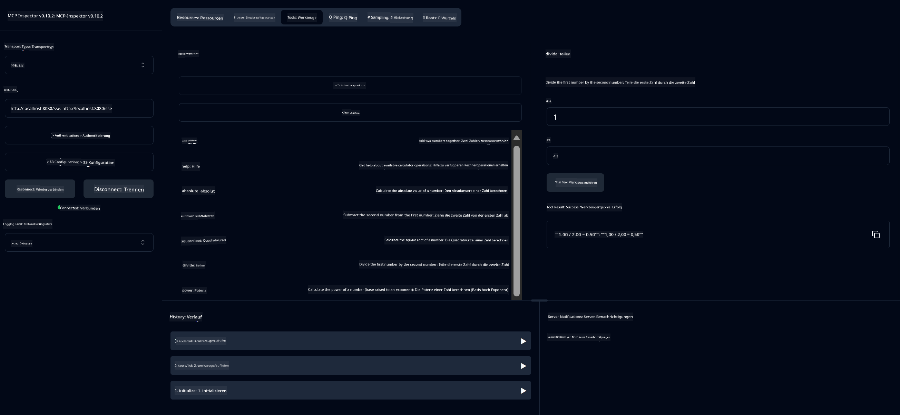

<!--
CO_OP_TRANSLATOR_METADATA:
{
  "original_hash": "7bf9a4a832911269a8bd0decb97ff36c",
  "translation_date": "2025-07-21T16:45:10+00:00",
  "source_file": "04-PracticalSamples/mcp/calculator/README.md",
  "language_code": "de"
}
-->
# Grundlegender Rechner-MCP-Dienst

>**Hinweis**: Dieses Kapitel enthält ein [**Tutorial**](./TUTORIAL.md), das Sie durch das Ausführen der fertigen Beispiele führt.

Willkommen zu Ihrer ersten praktischen Erfahrung mit dem **Model Context Protocol (MCP)**! In den vorherigen Kapiteln haben Sie die Grundlagen der generativen KI kennengelernt und Ihre Entwicklungsumgebung eingerichtet. Jetzt ist es an der Zeit, etwas Praktisches zu erstellen.

Dieser Rechnerdienst demonstriert, wie KI-Modelle sicher mit externen Tools über MCP interagieren können. Anstatt sich auf die manchmal unzuverlässigen mathematischen Fähigkeiten des KI-Modells zu verlassen, zeigen wir Ihnen, wie Sie ein robustes System erstellen können, bei dem die KI spezialisierte Dienste für präzise Berechnungen aufruft.

## Inhaltsverzeichnis

- [Was Sie lernen werden](../../../../../04-PracticalSamples/mcp/calculator)
- [Voraussetzungen](../../../../../04-PracticalSamples/mcp/calculator)
- [Wichtige Konzepte](../../../../../04-PracticalSamples/mcp/calculator)
- [Schnellstart](../../../../../04-PracticalSamples/mcp/calculator)
- [Verfügbare Rechneroperationen](../../../../../04-PracticalSamples/mcp/calculator)
- [Test-Clients](../../../../../04-PracticalSamples/mcp/calculator)
  - [1. Direkter MCP-Client (SDKClient)](../../../../../04-PracticalSamples/mcp/calculator)
  - [2. KI-gestützter Client (LangChain4jClient)](../../../../../04-PracticalSamples/mcp/calculator)
- [MCP Inspector (Web-UI)](../../../../../04-PracticalSamples/mcp/calculator)
  - [Schritt-für-Schritt-Anleitung](../../../../../04-PracticalSamples/mcp/calculator)

## Was Sie lernen werden

Durch die Arbeit an diesem Beispiel werden Sie verstehen:
- Wie man MCP-kompatible Dienste mit Spring Boot erstellt
- Den Unterschied zwischen direkter Protokollkommunikation und KI-gestützter Interaktion
- Wie KI-Modelle entscheiden, wann und wie sie externe Tools nutzen
- Best Practices für den Aufbau von KI-Anwendungen mit Tool-Integration

Perfekt für Anfänger, die MCP-Konzepte lernen und ihre erste KI-Tool-Integration erstellen möchten!

## Voraussetzungen

- Java 21+
- Maven 3.6+
- **GitHub-Token**: Erforderlich für den KI-gestützten Client. Wenn Sie dies noch nicht eingerichtet haben, lesen Sie [Kapitel 2: Einrichten Ihrer Entwicklungsumgebung](../../../02-SetupDevEnvironment/README.md) für Anweisungen.

## Wichtige Konzepte

**Model Context Protocol (MCP)** ist eine standardisierte Methode, mit der KI-Anwendungen sicher mit externen Tools verbunden werden können. Stellen Sie es sich als eine "Brücke" vor, die es KI-Modellen ermöglicht, externe Dienste wie unseren Rechner zu nutzen. Anstatt dass das KI-Modell selbst versucht, Mathematik zu betreiben (was unzuverlässig sein kann), kann es unseren Rechnerdienst aufrufen, um genaue Ergebnisse zu erhalten. MCP stellt sicher, dass diese Kommunikation sicher und konsistent erfolgt.

**Server-Sent Events (SSE)** ermöglichen eine Echtzeitkommunikation zwischen Server und Clients. Im Gegensatz zu traditionellen HTTP-Anfragen, bei denen Sie eine Anfrage stellen und auf eine Antwort warten, kann der Server bei SSE kontinuierlich Updates an den Client senden. Dies ist ideal für KI-Anwendungen, bei denen Antworten gestreamt oder zeitaufwändig verarbeitet werden können.

**KI-Tools & Funktionsaufrufe** ermöglichen es KI-Modellen, automatisch externe Funktionen (wie Rechneroperationen) basierend auf Benutzeranfragen auszuwählen und zu nutzen. Wenn Sie beispielsweise fragen: "Was ist 15 + 27?", versteht das KI-Modell, dass Sie eine Addition wünschen, ruft automatisch unser `add`-Tool mit den richtigen Parametern (15, 27) auf und gibt das Ergebnis in natürlicher Sprache zurück. Die KI agiert als intelligenter Koordinator, der weiß, wann und wie jedes Tool verwendet werden soll.

## Schnellstart

### 1. Navigieren Sie zum Verzeichnis der Rechneranwendung
```bash
cd Generative-AI-for-beginners-java/04-PracticalSamples/mcp/calculator
```

### 2. Bauen & Ausführen
```bash
mvn clean install -DskipTests
java -jar target/calculator-server-0.0.1-SNAPSHOT.jar
```

### 2. Testen mit Clients
- **SDKClient**: Direkte MCP-Protokollinteraktion
- **LangChain4jClient**: KI-gestützte Interaktion in natürlicher Sprache (erfordert GitHub-Token)

## Verfügbare Rechneroperationen

- `add(a, b)`, `subtract(a, b)`, `multiply(a, b)`, `divide(a, b)`
- `power(base, exponent)`, `squareRoot(number)`, `absolute(number)`
- `modulus(a, b)`, `help()`

## Test-Clients

### 1. Direkter MCP-Client (SDKClient)
Testet die direkte Kommunikation über das MCP-Protokoll. Ausführen mit:
```bash
mvn test-compile exec:java -Dexec.mainClass="com.microsoft.mcp.sample.client.SDKClient" -Dexec.classpathScope=test
```

### 2. KI-gestützter Client (LangChain4jClient)
Demonstriert die Interaktion in natürlicher Sprache mit GitHub-Modellen. Erfordert einen GitHub-Token (siehe [Voraussetzungen](../../../../../04-PracticalSamples/mcp/calculator)).

**Ausführen:**
```bash
mvn test-compile exec:java -Dexec.mainClass="com.microsoft.mcp.sample.client.LangChain4jClient" -Dexec.classpathScope=test
```

## MCP Inspector (Web-UI)

Der MCP Inspector bietet eine visuelle Weboberfläche, um Ihren MCP-Dienst zu testen, ohne Code schreiben zu müssen. Perfekt für Anfänger, um zu verstehen, wie MCP funktioniert!

### Schritt-für-Schritt-Anleitung:

1. **Starten Sie den Rechner-Server** (falls noch nicht ausgeführt):
   ```bash
   java -jar target/calculator-server-0.0.1-SNAPSHOT.jar
   ```

2. **Installieren und starten Sie den MCP Inspector** in einem neuen Terminal:
   ```bash
   npx @modelcontextprotocol/inspector
   ```

3. **Öffnen Sie die Weboberfläche**:
   - Suchen Sie nach einer Nachricht wie "Inspector running at http://localhost:6274"
   - Öffnen Sie diese URL in Ihrem Webbrowser

4. **Verbinden Sie sich mit Ihrem Rechnerdienst**:
   - Stellen Sie in der Weboberfläche den Transporttyp auf "SSE" ein
   - Setzen Sie die URL auf: `http://localhost:8080/sse`
   - Klicken Sie auf die Schaltfläche "Connect"

5. **Verfügbare Tools erkunden**:
   - Klicken Sie auf "List Tools", um alle Rechneroperationen anzuzeigen
   - Sie sehen Funktionen wie `add`, `subtract`, `multiply` usw.

6. **Eine Rechneroperation testen**:
   - Wählen Sie ein Tool aus (z. B. "add")
   - Geben Sie Parameter ein (z. B. `a: 15`, `b: 27`)
   - Klicken Sie auf "Run Tool"
   - Sehen Sie sich das Ergebnis an, das von Ihrem MCP-Dienst zurückgegeben wird!

Dieser visuelle Ansatz hilft Ihnen, genau zu verstehen, wie die MCP-Kommunikation funktioniert, bevor Sie Ihre eigenen Clients erstellen.



---
**Referenz:** [MCP Server Boot Starter Docs](https://docs.spring.io/spring-ai/reference/api/mcp/mcp-server-boot-starter-docs.html)

**Haftungsausschluss**:  
Dieses Dokument wurde mit dem KI-Übersetzungsdienst [Co-op Translator](https://github.com/Azure/co-op-translator) übersetzt. Obwohl wir uns um Genauigkeit bemühen, beachten Sie bitte, dass automatisierte Übersetzungen Fehler oder Ungenauigkeiten enthalten können. Das Originaldokument in seiner ursprünglichen Sprache sollte als maßgebliche Quelle betrachtet werden. Für kritische Informationen wird eine professionelle menschliche Übersetzung empfohlen. Wir übernehmen keine Haftung für Missverständnisse oder Fehlinterpretationen, die sich aus der Nutzung dieser Übersetzung ergeben.