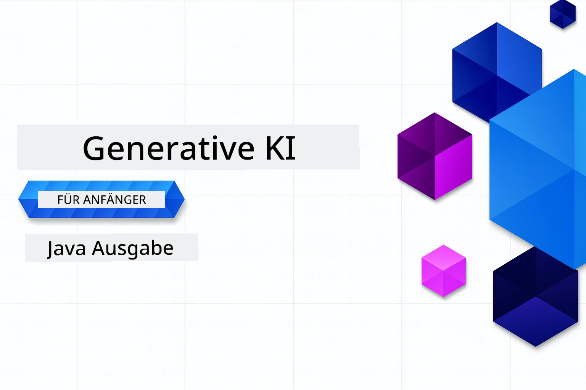

# Generative KI für Anfänger – Java Edition
[](https://discord.gg/nTYy5BXMWG)



**Zeitaufwand**: Der gesamte Workshop kann online ohne lokale Einrichtung abgeschlossen werden. Die Umgebungseinrichtung dauert 2 Minuten, das Erkunden der Beispiele benötigt je nach Erkundungstiefe 1–3 Stunden.

> **Schnellstart**

1. Forken Sie dieses Repository in Ihrem GitHub-Konto
2. Klicken Sie auf **Code** → Reiter **Codespaces** → **...** → **Neu mit Optionen...**
3. Verwenden Sie die Standardwerte – dies wählt den für diesen Kurs erstellten Development-Container aus
4. Klicken Sie auf **Codespace erstellen**
5. Warten Sie ca. 2 Minuten, bis die Umgebung bereit ist
6. Springen Sie direkt zu [Dem ersten Beispiel](./02-SetupDevEnvironment/README.md#step-2-create-a-github-personal-access-token)

> **Bevorzugen Sie es, lokal zu klonen?**
>
> Dieses Repository enthält über 50 Sprachübersetzungen, was die Download-Größe erheblich erhöht. Um ohne Übersetzungen zu klonen, verwenden Sie Sparse Checkout:
> ```bash
> git clone --filter=blob:none --sparse https://github.com/microsoft/Generative-AI-for-beginners-java.git
> cd Generative-AI-for-beginners-java
> git sparse-checkout set --no-cone '/*' '!translations' '!translated_images'
> ```
> Damit erhalten Sie alles, was Sie zum Abschluss des Kurses benötigen, mit einem deutlich schnelleren Download.


## Mehrsprachige Unterstützung

### Unterstützt über GitHub Action (Automatisiert & stets aktuell)

<!-- CO-OP TRANSLATOR LANGUAGES TABLE START -->
[Arabisch](../ar/README.md) | [Bengalisch](../bn/README.md) | [Bulgarisch](../bg/README.md) | [Birmanisch (Myanmar)](../my/README.md) | [Chinesisch (vereinfacht)](../zh-CN/README.md) | [Chinesisch (traditionell, Hongkong)](../zh-HK/README.md) | [Chinesisch (traditionell, Macau)](../zh-MO/README.md) | [Chinesisch (traditionell, Taiwan)](../zh-TW/README.md) | [Kroatisch](../hr/README.md) | [Tschechisch](../cs/README.md) | [Dänisch](../da/README.md) | [Niederländisch](../nl/README.md) | [Estnisch](../et/README.md) | [Finnisch](../fi/README.md) | [Französisch](../fr/README.md) | [Deutsch](./README.md) | [Griechisch](../el/README.md) | [Hebräisch](../he/README.md) | [Hindi](../hi/README.md) | [Ungarisch](../hu/README.md) | [Indonesisch](../id/README.md) | [Italienisch](../it/README.md) | [Japanisch](../ja/README.md) | [Kannada](../kn/README.md) | [Koreanisch](../ko/README.md) | [Litauisch](../lt/README.md) | [Malaiisch](../ms/README.md) | [Malayalam](../ml/README.md) | [Marathi](../mr/README.md) | [Nepalesisch](../ne/README.md) | [Nigerianisches Pidgin](../pcm/README.md) | [Norwegisch](../no/README.md) | [Persisch (Farsi)](../fa/README.md) | [Polnisch](../pl/README.md) | [Portugiesisch (Brasilien)](../pt-BR/README.md) | [Portugiesisch (Portugal)](../pt-PT/README.md) | [Punjabi (Gurmukhi)](../pa/README.md) | [Rumänisch](../ro/README.md) | [Russisch](../ru/README.md) | [Serbisch (Kyrillisch)](../sr/README.md) | [Slowakisch](../sk/README.md) | [Slowenisch](../sl/README.md) | [Spanisch](../es/README.md) | [Suaheli](../sw/README.md) | [Schwedisch](../sv/README.md) | [Tagalog (Filipino)](../tl/README.md) | [Tamil](../ta/README.md) | [Telugu](../te/README.md) | [Thailändisch](../th/README.md) | [Türkisch](../tr/README.md) | [Ukrainisch](../uk/README.md) | [Urdu](../ur/README.md) | [Vietnamesisch](../vi/README.md)

## Kursstruktur & Lernweg

### **Kapitel 1: Einführung in Generative KI**
- **Kernkonzepte**: Verständnis von großen Sprachmodellen, Tokens, Einbettungen und KI-Fähigkeiten
- **Java KI-Ökosystem**: Überblick über Spring AI und OpenAI SDKs
- **Modell-Kontext-Protokoll**: Einführung in MCP und dessen Rolle in der KI-Agenten-Kommunikation
- **Praktische Anwendungen**: Anwendungsfälle aus der Praxis, einschließlich Chatbots und Inhaltserstellung
- **[→ Kapitel 1 starten](./01-IntroToGenAI/README.md)**

### **Kapitel 2: Einrichtung der Entwicklungsumgebung**
- **Multi-Provider-Konfiguration**: Einrichten von GitHub Models, Azure OpenAI und OpenAI Java SDK-Integrationen
- **Spring Boot + Spring AI**: Best Practices für die Entwicklung von Unternehmens-KI-Anwendungen
- **GitHub Models**: Kostenloser KI-Modellzugang für Prototyping und Lernen (keine Kreditkarte erforderlich)
- **Entwicklungstools**: Docker-Container, VS Code und GitHub Codespaces-Konfiguration
- **[→ Kapitel 2 starten](./02-SetupDevEnvironment/README.md)**

### **Kapitel 3: Grundlagen der Generativen KI-Techniken**
- **Prompt Engineering**: Techniken für optimale Antworten von KI-Modellen
- **Einbettungen & Vektoroperationen**: Implementierung von semantischer Suche und Ähnlichkeitsabgleich
- **Retrieval-Augmented Generation (RAG)**: Kombination von KI mit eigenen Datenquellen
- **Funktionsaufrufe**: Erweiterung der KI-Fähigkeiten mit benutzerdefinierten Tools und Plugins
- **[→ Kapitel 3 starten](./03-CoreGenerativeAITechniques/README.md)**

### **Kapitel 4: Praktische Anwendungen & Projekte**
- **Pet Story Generator** (`petstory/`): Kreative Inhaltserstellung mit GitHub Models
- **Foundry Local Demo** (`foundrylocal/`): Lokale KI-Modellintegration mit OpenAI Java SDK
- **MCP Rechnerdienst** (`calculator/`): Grundlegende Implementierung des Modell-Kontext-Protokolls mit Spring AI
- **[→ Kapitel 4 starten](./04-PracticalSamples/README.md)**

### **Kapitel 5: Verantwortungsvolle KI-Entwicklung**
- **GitHub Models Sicherheit**: Testen von integrierten Inhaltsfiltern und Sicherheitsmechanismen (harte Sperren und weiche Ablehnungen)
- **Responsible AI Demo**: Praxisbeispiel, das zeigt, wie moderne KI-Sicherheitssysteme funktionieren
- **Best Practices**: Wesentliche Richtlinien für ethische KI-Entwicklung und -Bereitstellung
- **[→ Kapitel 5 starten](./05-ResponsibleGenAI/README.md)**

## Weitere Ressourcen

<!-- CO-OP TRANSLATOR OTHER COURSES START -->
### LangChain
[](https://aka.ms/langchain4j-for-beginners)
[](https://aka.ms/langchainjs-for-beginners?WT.mc_id=m365-94501-dwahlin)

---

### Azure / Edge / MCP / Agents
[](https://github.com/microsoft/AZD-for-beginners?WT.mc_id=academic-105485-koreyst)
[](https://github.com/microsoft/edgeai-for-beginners?WT.mc_id=academic-105485-koreyst)
[](https://github.com/microsoft/mcp-for-beginners?WT.mc_id=academic-105485-koreyst)
[](https://github.com/microsoft/ai-agents-for-beginners?WT.mc_id=academic-105485-koreyst)

---
 
### Generative KI Serie
[](https://github.com/microsoft/generative-ai-for-beginners?WT.mc_id=academic-105485-koreyst)
[-9333EA?style=for-the-badge&labelColor=E5E7EB&color=9333EA)](https://github.com/microsoft/Generative-AI-for-beginners-dotnet?WT.mc_id=academic-105485-koreyst)
[-C084FC?style=for-the-badge&labelColor=E5E7EB&color=C084FC)](https://github.com/microsoft/generative-ai-for-beginners-java?WT.mc_id=academic-105485-koreyst)
[-E879F9?style=for-the-badge&labelColor=E5E7EB&color=E879F9)](https://github.com/microsoft/generative-ai-with-javascript?WT.mc_id=academic-105485-koreyst)

---
 
### Grundlegendes Lernen
[](https://aka.ms/ml-beginners?WT.mc_id=academic-105485-koreyst)
[](https://aka.ms/datascience-beginners?WT.mc_id=academic-105485-koreyst)
[](https://aka.ms/ai-beginners?WT.mc_id=academic-105485-koreyst)
[](https://github.com/microsoft/Security-101?WT.mc_id=academic-96948-sayoung)
[](https://aka.ms/webdev-beginners?WT.mc_id=academic-105485-koreyst)
[](https://aka.ms/iot-beginners?WT.mc_id=academic-105485-koreyst)
[](https://github.com/microsoft/xr-development-for-beginners?WT.mc_id=academic-105485-koreyst)

---
 
### Copilot-Serie
[](https://aka.ms/GitHubCopilotAI?WT.mc_id=academic-105485-koreyst)
[](https://github.com/microsoft/mastering-github-copilot-for-dotnet-csharp-developers?WT.mc_id=academic-105485-koreyst)
[](https://github.com/microsoft/CopilotAdventures?WT.mc_id=academic-105485-koreyst)
<!-- CO-OP TRANSLATOR OTHER COURSES END -->

## Hilfe erhalten

Wenn Sie nicht weiterkommen oder Fragen zum Erstellen von KI-Apps haben, schließen Sie sich anderen Lernenden und erfahrenen Entwicklern in Diskussionen über MCP an. Es ist eine unterstützende Gemeinschaft, in der Fragen willkommen sind und Wissen frei geteilt wird.

[](https://discord.gg/nTYy5BXMWG)

Wenn Sie Produktfeedback oder Fehler während der Entwicklung haben, besuchen Sie:

[](https://aka.ms/foundry/forum)

---

<!-- CO-OP TRANSLATOR DISCLAIMER START -->
**Haftungsausschluss**:  
Dieses Dokument wurde mit dem KI-Übersetzungsdienst [Co-op Translator](https://github.com/Azure/co-op-translator) übersetzt. Obwohl wir uns um Genauigkeit bemühen, bitten wir zu berücksichtigen, dass automatisierte Übersetzungen Fehler oder Ungenauigkeiten enthalten können. Das Originaldokument in der Ursprungssprache ist als maßgebliche Quelle zu betrachten. Für kritische Informationen empfehlen wir eine professionelle menschliche Übersetzung. Wir übernehmen keine Haftung für Missverständnisse oder Fehlinterpretationen, die durch die Verwendung dieser Übersetzung entstehen.
<!-- CO-OP TRANSLATOR DISCLAIMER END -->