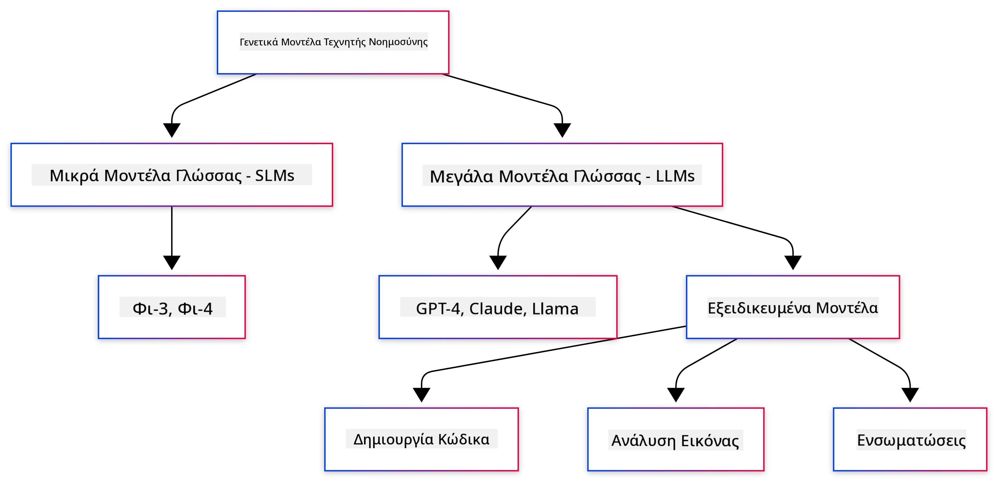
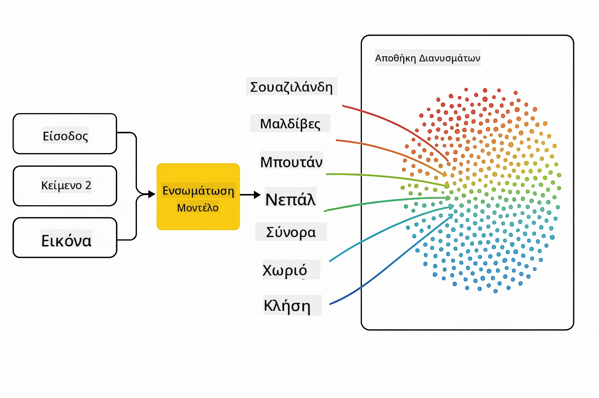
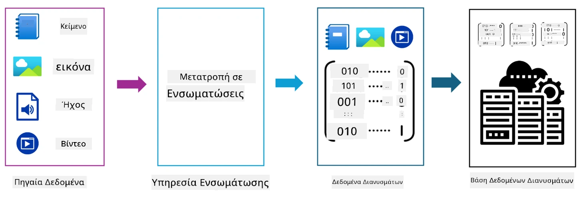
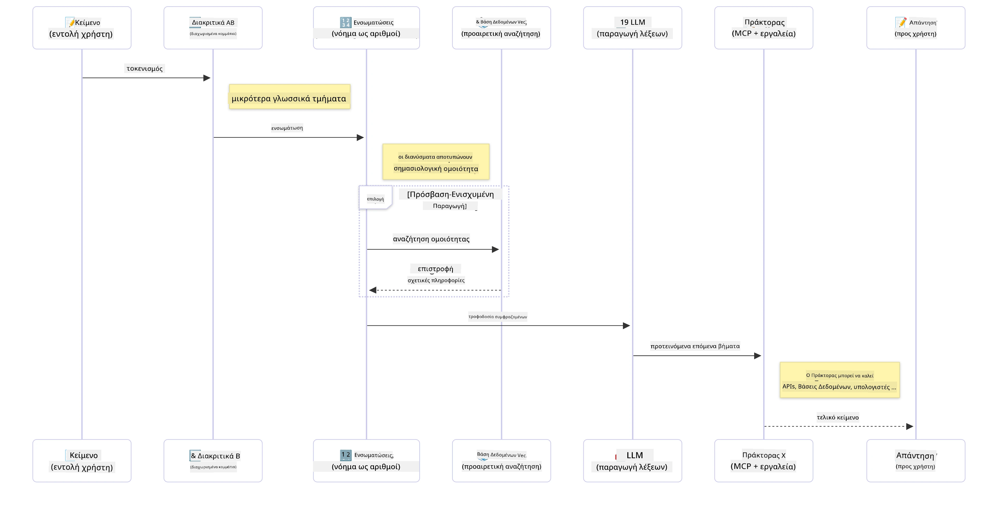

# Εισαγωγή στην Γενετική Τεχνητή Νοημοσύνη - Έκδοση Java

> **Βίντεο**: [Δείτε την επισκόπηση αυτού του μαθήματος στο YouTube.](https://www.youtube.com/watch?v=XH46tGp_eSw) Μπορείτε επίσης να κάνετε κλικ στην εικόνα μικρογραφίας παραπάνω.

## Τι θα μάθετε

- **Βασικά στοιχεία της Γενετικής Τεχνητής Νοημοσύνης** περιλαμβάνοντας LLMs, προτροπές, tokens, embeddings και βάσεις δεδομένων με διανύσματα
- **Σύγκριση εργαλείων ανάπτυξης AI για Java** περιλαμβάνοντας Azure OpenAI SDK, Spring AI και OpenAI Java SDK
- **Ανακάλυψη του Πρωτοκόλλου Συμφραζομένων Μοντέλου** και του ρόλου του στην επικοινωνία των πρακτόρων AI

## Πίνακας Περιεχομένων

- [Εισαγωγή](#εισαγωγή)
- [Μια γρήγορη ανανέωση στις έννοιες της Γενετικής Τεχνητής Νοημοσύνης](#μια-γρήγορη-ανανέωση-στις-έννοιες-της-γενετικής-τεχνητής-νοημοσύνης)
- [Ανασκόπηση προτροπών](#ανασκόπηση-μηχανικής-προτροπών)
- [Tokens, embeddings και πράκτορες](#tokens-embeddings-και-πράκτορες)
- [Εργαλεία και Βιβλιοθήκες Ανάπτυξης AI για Java](#εργαλεία-και-βιβλιοθήκες-ανάπτυξης-ai-για-java)
  - [OpenAI Java SDK](#openai-java-sdk)
  - [Spring AI](#spring-ai)
  - [Azure OpenAI Java SDK](#azure-openai-java-sdk)
- [Περίληψη](#περίληψη)
- [Επόμενα Βήματα](#επόμενα-βήματα)

## Εισαγωγή

Καλώς ήρθατε στο πρώτο κεφάλαιο της Γενετικής Τεχνητής Νοημοσύνης για Αρχάριους - Έκδοση Java! Αυτό το βασικό μάθημα σας εισάγει στις βασικές έννοιες της γενετικής τεχνητής νοημοσύνης και πώς να δουλεύετε με αυτές χρησιμοποιώντας Java. Θα μάθετε για τα ουσιώδη δομικά στοιχεία των εφαρμογών AI, όπως τα Μεγάλα Μοντέλα Γλώσσας (LLMs), τα tokens, τα embeddings και τους πράκτορες AI. Θα εξερευνήσουμε επίσης τα κύρια εργαλεία Java που θα χρησιμοποιήσετε καθ’ όλη τη διάρκεια αυτού του μαθήματος.

### Μια γρήγορη ανανέωση στις έννοιες της Γενετικής Τεχνητής Νοημοσύνης

Η Γενετική Τεχνητή Νοημοσύνη είναι ένα είδος τεχνητής νοημοσύνης που δημιουργεί νέο περιεχόμενο, όπως κείμενο, εικόνες ή κώδικα, βασισμένο σε πρότυπα και σχέσεις που μαθαίνει από δεδομένα. Τα μοντέλα γενετικής AI μπορούν να παράγουν απαντήσεις που μοιάζουν ανθρώπινες, να κατανοούν συμφραζόμενα, και μερικές φορές ακόμη να δημιουργούν περιεχόμενο που φαίνεται ανθρώπινο.

Καθώς αναπτύσσετε τις εφαρμογές AI σας σε Java, θα δουλέψετε με **γενετικά μοντέλα AI** για τη δημιουργία περιεχομένου. Κάποιες δυνατότητες των γενετικών μοντέλων AI περιλαμβάνουν:

- **Δημιουργία Κειμένου**: Σύνταξη κειμένου που μοιάζει ανθρώπινο για chatbots, περιεχόμενο και συμπλήρωση κειμένου.
- **Δημιουργία και Ανάλυση Εικόνων**: Παραγωγή ρεαλιστικών εικόνων, βελτίωση φωτογραφιών και ανίχνευση αντικειμένων.
- **Δημιουργία Κώδικα**: Γραφή αποσπασμάτων κώδικα ή σεναρίων.

Υπάρχουν συγκεκριμένοι τύποι μοντέλων που είναι βελτιστοποιημένοι για διαφορετικές εργασίες. Για παράδειγμα, τόσο τα **Μικρά Μοντέλα Γλώσσας (SLMs)** όσο και τα **Μεγάλα Μοντέλα Γλώσσας (LLMs)** μπορούν να χειριστούν τη δημιουργία κειμένου, με τα LLMs να προσφέρουν συνήθως καλύτερη απόδοση για σύνθετες εργασίες. Για εργασίες σχετικές με εικόνες, θα χρησιμοποιήσετε εξειδικευμένα μοντέλα όρασης ή πολυτροπικά μοντέλα.

Φυσικά, οι απαντήσεις από αυτά τα μοντέλα δεν είναι τέλειες πάντα. Πιθανώς έχετε ακούσει ότι τα μοντέλα «παραληρούν» ή παράγουν ανακριβείς πληροφορίες με αυθεντικό τρόπο. Αλλά μπορείτε να βοηθήσετε το μοντέλο να δημιουργήσει καλύτερες απαντήσεις δίνοντάς του σαφείς οδηγίες και συμφραζόμενα. Εκεί μπαίνει η **μηχανική προτροπών**.

#### Ανασκόπηση μηχανικής προτροπών

Η μηχανική προτροπών είναι η πρακτική σχεδιασμού αποτελεσματικών εισόδων για την καθοδήγηση μοντέλων AI προς επιθυμητά αποτελέσματα. Περιλαμβάνει:

- **Σαφήνεια**: Κάνοντας τις οδηγίες σαφείς και αδιαμφισβήτητες.
- **Συμφραζόμενα**: Παρέχοντας τις απαραίτητες πληροφορίες υπόβαθρου.
- **Περιορισμοί**: Καθορίζοντας τυχόν περιορισμούς ή μορφές.

Κάποιες βέλτιστες πρακτικές για τη μηχανική προτροπών περιλαμβάνουν το σχεδιασμό προτροπών, σαφείς οδηγίες, ανάλυση εργασιών, εκμάθηση με ένα ή λίγα παραδείγματα, και βελτιστοποίηση προτροπών. Η δοκιμή διαφόρων προτροπών είναι ουσιώδης για να βρείτε τι λειτουργεί καλύτερα για τη συγκεκριμένη περίπτωση χρήσης σας.

Κατά την ανάπτυξη εφαρμογών, θα δουλέψετε με διαφορετικούς τύπους προτροπών:
- **Προτροπές συστήματος**: Ορίζουν τους βασικούς κανόνες και το πλαίσιο για τη συμπεριφορά του μοντέλου
- **Προτροπές χρήστη**: Τα δεδομένα εισόδου από τους χρήστες της εφαρμογής σας
- **Προτροπές βοηθού**: Οι απαντήσεις του μοντέλου βασισμένες στις προτροπές συστήματος και χρήστη

> **Μάθετε περισσότερα**: Μάθετε περισσότερα για τη μηχανική προτροπών στο [κεφάλαιο Μηχανικής Προτροπών του μαθήματος GenAI για Αρχάριους](https://github.com/microsoft/generative-ai-for-beginners/tree/main/04-prompt-engineering-fundamentals)

#### Tokens, embeddings και πράκτορες

Όταν δουλεύετε με γενετικά μοντέλα AI, θα συναντήσετε όρους όπως **tokens**, **embeddings**, **πράκτορες** και **Πρωτόκολλο Συμφραζομένων Μοντέλου (MCP)**. Ακολουθεί μια λεπτομερής επισκόπηση αυτών των εννοιών:

- **Tokens**: Τα tokens είναι η μικρότερη μονάδα κειμένου σε ένα μοντέλο. Μπορεί να είναι λέξεις, χαρακτήρες ή υπολέξεις. Τα tokens χρησιμοποιούνται για να αναπαραστήσουν τα δεδομένα κειμένου σε μια μορφή που το μοντέλο μπορεί να κατανοήσει. Για παράδειγμα, η πρόταση "The quick brown fox jumped over the lazy dog" μπορεί να διασπαστεί σε tokens ως ["The", " quick", " brown", " fox", " jumped", " over", " the", " lazy", " dog"] ή ["The", " qu", "ick", " br", "own", " fox", " jump", "ed", " over", " the", " la", "zy", " dog"] ανάλογα με τη στρατηγική τοκενισμού.

Ο τοκενισμός είναι η διαδικασία διαχωρισμού κειμένου σε αυτές τις μικρότερες μονάδες. Αυτό είναι κρίσιμο επειδή τα μοντέλα λειτουργούν με tokens αντί για ακατέργαστο κείμενο. Ο αριθμός των tokens σε μια προτροπή επηρεάζει το μήκος και την ποιότητα της απάντησης του μοντέλου, καθώς τα μοντέλα έχουν όρια tokens για το πλαίσιο τους (π.χ. 128K tokens για το συνολικό πλαίσιο του GPT-4o, συμπεριλαμβανομένης εισόδου και εξόδου).

  Σε Java, μπορείτε να χρησιμοποιήσετε βιβλιοθήκες όπως το OpenAI SDK για να διαχειριστείτε αυτόματα τον τοκενισμό κατά την αποστολή αιτημάτων προς μοντέλα AI.

- **Embeddings**: Τα embeddings είναι αναπαραστάσεις σε διανύσματα των tokens που αποτυπώνουν σημασιολογική σημασία. Είναι αριθμητικές αναπαραστάσεις (συνήθως πίνακες αριθμών κινητής υποδιαστολής) που επιτρέπουν στα μοντέλα να κατανοούν τις σχέσεις μεταξύ λέξεων και να δημιουργούν συμφραζόμενες σχετικές απαντήσεις. Παρόμοιες λέξεις έχουν παρόμοια embeddings, επιτρέποντας στο μοντέλο να κατανοεί έννοιες όπως τα συνώνυμα και τις σημασιολογικές σχέσεις.

  Σε Java, μπορείτε να δημιουργήσετε embeddings χρησιμοποιώντας το OpenAI SDK ή άλλες βιβλιοθήκες που υποστηρίζουν τη δημιουργία embeddings. Αυτά τα embeddings είναι ουσιώδη για εργασίες όπως η σημασιολογική αναζήτηση, όπου θέλετε να βρείτε παρόμοιο περιεχόμενο βασισμένο στη σημασία και όχι στις ακριβείς αντιστοιχίες κειμένου.

- **Βάσεις δεδομένων διανυσμάτων**: Οι βάσεις δεδομένων διανυσμάτων είναι εξειδικευμένα συστήματα αποθήκευσης βελτιστοποιημένα για embeddings. Επιτρέπουν αποτελεσματική αναζήτηση ομοιότητας και είναι κρίσιμες για πρότυπα ανάκτησης ενισχυμένης δημιουργίας (RAG) όπου χρειάζεται να βρείτε σχετικές πληροφορίες από μεγάλο όγκο δεδομένων βασισμένες σε σημασιολογική ομοιότητα αντί για ακριβείς αντιστοιχίες.

> **Σημείωση**: Σε αυτό το μάθημα δεν θα καλύψουμε τις βάσεις δεδομένων διανυσμάτων αλλά αξίζει να τις αναφέρουμε καθώς χρησιμοποιούνται συχνά σε εφαρμογές του πραγματικού κόσμου.

- **Πράκτορες & MCP**: Συστατικά AI που αλληλεπιδρούν αυτόνομα με μοντέλα, εργαλεία και εξωτερικά συστήματα. Το Πρωτόκολλο Συμφραζομένων Μοντέλου (MCP) παρέχει έναν τυποποιημένο τρόπο για πράκτορες να έχουν ασφαλή πρόσβαση σε εξωτερικές πηγές δεδομένων και εργαλεία. Μάθετε περισσότερα στο μάθημά μας [MCP για Αρχάριους](https://github.com/microsoft/mcp-for-beginners).

Στις εφαρμογές AI σε Java, θα χρησιμοποιήσετε tokens για την επεξεργασία κειμένου, embeddings για σημασιολογική αναζήτηση και RAG, βάσεις δεδομένων διανυσμάτων για ανάκτηση δεδομένων, και πράκτορες με MCP για να κατασκευάσετε έξυπνα συστήματα που χρησιμοποιούν εργαλεία.

### Εργαλεία και Βιβλιοθήκες Ανάπτυξης AI για Java

Η Java προσφέρει εξαιρετικά εργαλεία για ανάπτυξη AI. Υπάρχουν τρεις κύριες βιβλιοθήκες που θα εξερευνήσουμε κατά τη διάρκεια αυτού του μαθήματος - OpenAI Java SDK, Azure OpenAI SDK, και Spring AI.

Εδώ είναι ένας γρήγορος πίνακας αναφοράς που δείχνει ποιο SDK χρησιμοποιείται στα παραδείγματα κάθε κεφαλαίου:

| Κεφάλαιο | Παράδειγμα | SDK |
|---------|--------|-----|
| 02-SetupDevEnvironment | github-models | OpenAI Java SDK |
| 02-SetupDevEnvironment | basic-chat-azure | Spring AI Azure OpenAI |
| 03-CoreGenerativeAITechniques | examples | Azure OpenAI SDK |
| 04-PracticalSamples | petstory | OpenAI Java SDK |
| 04-PracticalSamples | foundrylocal | OpenAI Java SDK |
| 04-PracticalSamples | calculator | Spring AI MCP SDK + LangChain4j |

**Σύνδεσμοι Τεκμηρίωσης SDK:**
- [Azure OpenAI Java SDK](https://github.com/Azure/azure-sdk-for-java/tree/azure-ai-openai_1.0.0-beta.16/sdk/openai/azure-ai-openai)
- [Spring AI](https://docs.spring.io/spring-ai/reference/)
- [OpenAI Java SDK](https://github.com/openai/openai-java)
- [LangChain4j](https://docs.langchain4j.dev/)

#### OpenAI Java SDK

Το OpenAI SDK είναι η επίσημη βιβλιοθήκη Java για το OpenAI API. Παρέχει μια απλή και συνεπή διεπαφή για αλληλεπίδραση με τα μοντέλα της OpenAI, καθιστώντας εύκολη την ενσωμάτωση δυνατοτήτων AI σε εφαρμογές Java. Το παράδειγμα GitHub Models του Κεφαλαίου 2, η εφαρμογή Pet Story και το παράδειγμα Foundry Local του Κεφαλαίου 4 παρουσιάζουν την προσέγγιση του OpenAI SDK.

#### Spring AI

Το Spring AI είναι ένα ολοκληρωμένο πλαίσιο που φέρνει δυνατότητες AI στις εφαρμογές Spring, παρέχοντας ένα συνεκτικό επίπεδο αφαίρεσης ανάμεσα σε διάφορους παρόχους AI. Ενσωματώνεται άψογα στο οικοσύστημα Spring, καθιστώντας το ιδανικό για επιχειρηματικές εφαρμογές Java που χρειάζονται δυνατότητες AI.

Η δύναμη του Spring AI έγκειται στην απρόσκοπτη ενσωμάτωση με το οικοσύστημα Spring, καθιστώντας εύκολη την κατασκευή εφαρμογών AI έτοιμων για παραγωγή, με οικείες σχεδιαστικές πατέντες του Spring όπως η έγχυση εξαρτήσεων, η διαχείριση ρυθμίσεων, και τα πλαίσια δοκιμών. Θα χρησιμοποιήσετε το Spring AI στα Κεφάλαια 2 και 4 για να κατασκευάσετε εφαρμογές που αξιοποιούν τόσο το OpenAI όσο και τη βιβλιοθήκη Model Context Protocol (MCP) του Spring AI.

##### Πρωτόκολλο Συμφραζομένων Μοντέλου (MCP)

Το [Πρωτόκολλο Συμφραζομένων Μοντέλου (MCP)](https://modelcontextprotocol.io/) είναι ένα αναδυόμενο πρότυπο που επιτρέπει στις εφαρμογές AI να αλληλεπιδρούν με ασφάλεια με εξωτερικές πηγές δεδομένων και εργαλεία. Το MCP παρέχει έναν τυποποιημένο τρόπο για τα μοντέλα AI να αποκτούν πρόσβαση σε συμφραζόμενες πληροφορίες και να εκτελούν ενέργειες στις εφαρμογές σας.

Στο Κεφάλαιο 4, θα κατασκευάσετε μια απλή υπηρεσία υπολογισμού MCP που δείχνει τα βασικά του Πρωτοκόλλου Συμφραζομένων Μοντέλου με το Spring AI, παρουσιάζοντας πώς να δημιουργήσετε βασικές ενσωματώσεις εργαλείων και αρχιτεκτονικές υπηρεσιών.

#### Azure OpenAI Java SDK

Η βιβλιοθήκη πελάτη Azure OpenAI για Java είναι μια προσαρμογή των REST APIs της OpenAI που παρέχει μια εθιμοτυπική διεπαφή και ενσωμάτωση με το υπόλοιπο οικοσύστημα SDK της Azure. Στο Κεφάλαιο 3, θα κατασκευάσετε εφαρμογές χρησιμοποιώντας το Azure OpenAI SDK, συμπεριλαμβανομένων εφαρμογών συνομιλίας, κλήσεων συναρτήσεων και προτύπων RAG (Retrieval-Augmented Generation).

> Σημείωση: Το Azure OpenAI SDK υστερεί σε χαρακτηριστικά σε σχέση με το OpenAI Java SDK, οπότε για μελλοντικά έργα, εξετάστε τη χρήση του OpenAI Java SDK.

## Περίληψη

Αυτά ολοκληρώνουν τα θεμέλια! Τώρα κατανοείτε:

- Τις βασικές έννοιες πίσω από τη γενετική AI - από τα LLMs και τη μηχανική προτροπών μέχρι τα tokens, τα embeddings και τις βάσεις δεδομένων διανυσμάτων
- Τις επιλογές εργαλείων που έχετε για ανάπτυξη AI σε Java: Azure OpenAI SDK, Spring AI, και OpenAI Java SDK
- Τι είναι το Πρωτόκολλο Συμφραζομένων Μοντέλου και πώς επιτρέπει σε πράκτορες AI να συνεργάζονται με εξωτερικά εργαλεία

## Επόμενα Βήματα

[Κεφάλαιο 2: Ρύθμιση του Περιβάλλοντος Ανάπτυξης](../02-SetupDevEnvironment/README.md)

---

<!-- CO-OP TRANSLATOR DISCLAIMER START -->
**Αποποίηση Ευθυνών**:  
Αυτό το έγγραφο έχει μεταφραστεί χρησιμοποιώντας την υπηρεσία μετάφρασης με τεχνητή νοημοσύνη [Co-op Translator](https://github.com/Azure/co-op-translator). Παρά τις προσπάθειές μας για ακρίβεια, παρακαλούμε να σημειώσετε ότι οι αυτοματοποιημένες μεταφράσεις μπορεί να περιέχουν λάθη ή ανακρίβειες. Το πρωτότυπο έγγραφο στη μητρική του γλώσσα πρέπει να θεωρείται η αυθεντική πηγή. Για κρίσιμες πληροφορίες, συνιστάται η επαγγελματική ανθρώπινη μετάφραση. Δεν φέρουμε ευθύνη για τυχόν παρεξηγήσεις ή λανθασμένες ερμηνείες που προκύπτουν από τη χρήση αυτής της μετάφρασης.
<!-- CO-OP TRANSLATOR DISCLAIMER END -->