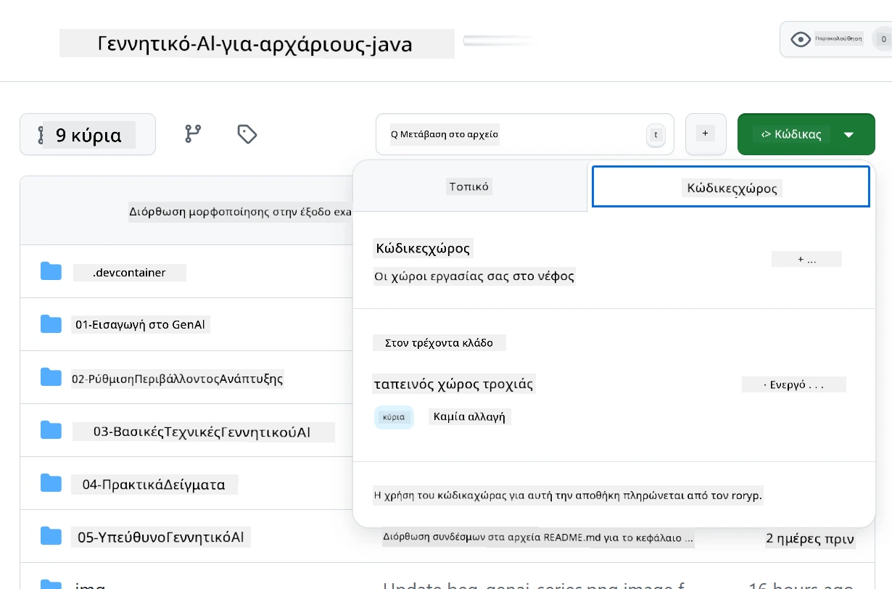
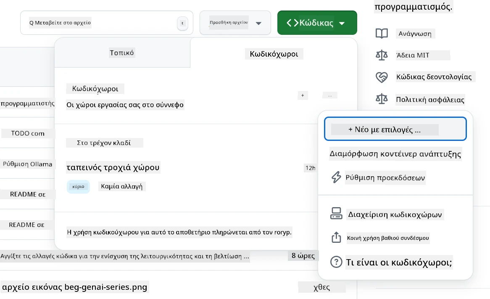
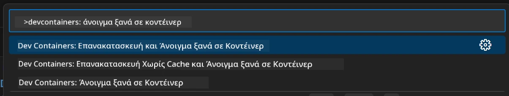
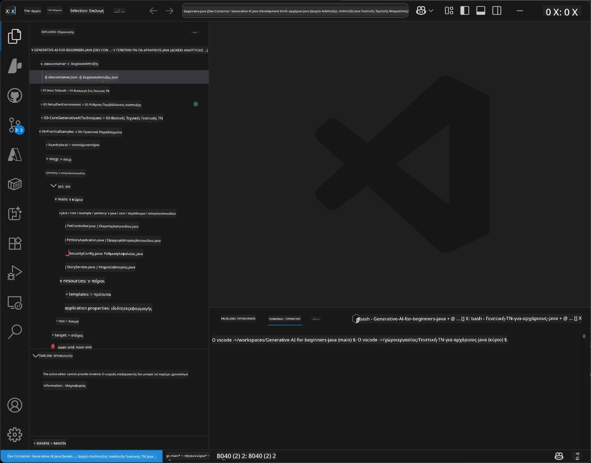
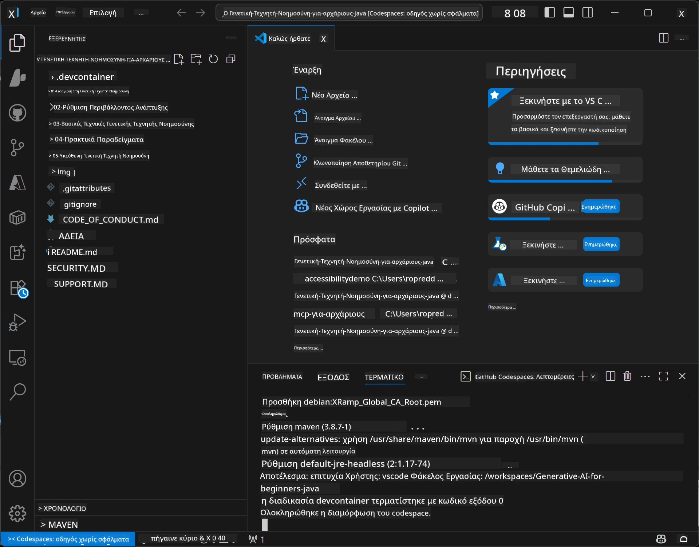

<!--
CO_OP_TRANSLATOR_METADATA:
{
  "original_hash": "96a30d42b9751a3d4e4b20e28d29d459",
  "translation_date": "2026-01-28T05:00:48+00:00",
  "source_file": "02-SetupDevEnvironment/README.md",
  "language_code": "el"
}
-->
# Ρύθμιση του Περιβάλλοντος Ανάπτυξης για Γενετική AI για Java

> **Γρήγορη Εκκίνηση**: Κωδικοποιήστε στο Cloud σε 2 λεπτά - Μεταβείτε στο [GitHub Codespaces Setup](../../../02-SetupDevEnvironment) - δεν απαιτείται τοπική εγκατάσταση και χρησιμοποιεί μοντέλα του GitHub!

> **Ενδιαφέρεστε για Azure OpenAI;**, δείτε τον [Οδηγό Ρύθμισης Azure OpenAI](getting-started-azure-openai.md) με βήματα για τη δημιουργία ενός νέου πόρου Azure OpenAI.

## Τι θα μάθετε

- Ρύθμιση περιβάλλοντος ανάπτυξης Java για εφαρμογές AI
- Επιλογή και διαμόρφωση του προτιμώμενου περιβάλλοντος ανάπτυξης (cloud-first με Codespaces, τοπικό dev container, ή πλήρης τοπική ρύθμιση)
- Δοκιμή της ρύθμισης με σύνδεση στα μοντέλα GitHub

## Περιεχόμενα

- [Τι θα μάθετε](../../../02-SetupDevEnvironment)
- [Εισαγωγή](../../../02-SetupDevEnvironment)
- [Βήμα 1: Ρυθμίστε το Περιβάλλον Ανάπτυξής σας](../../../02-SetupDevEnvironment)
  - [Επιλογή Α: GitHub Codespaces (Συνιστάται)](../../../02-SetupDevEnvironment)
  - [Επιλογή Β: Τοπικό Dev Container](../../../02-SetupDevEnvironment)
  - [Επιλογή Γ: Χρήση της Υφιστάμενης Τοπικής Εγκατάστασης](../../../02-SetupDevEnvironment)
- [Βήμα 2: Δημιουργία Προσωπικού Access Token GitHub](../../../02-SetupDevEnvironment)
- [Βήμα 3: Δοκιμή της Ρύθμισής σας](../../../02-SetupDevEnvironment)
- [Επίλυση Προβλημάτων](../../../02-SetupDevEnvironment)
- [Περίληψη](../../../02-SetupDevEnvironment)
- [Επόμενα Βήματα](../../../02-SetupDevEnvironment)

## Εισαγωγή

Αυτό το κεφάλαιο θα σας καθοδηγήσει στη ρύθμιση ενός περιβάλλοντος ανάπτυξης. Θα χρησιμοποιήσουμε τα **GitHub Models** ως κύριο παράδειγμα επειδή είναι δωρεάν, εύκολα στη ρύθμιση με μόνο έναν λογαριασμό GitHub, δεν απαιτεί πιστωτική κάρτα και παρέχει πρόσβαση σε πολλά μοντέλα για πειραματισμό.

**Δεν απαιτείται τοπική ρύθμιση!** Μπορείτε να ξεκινήσετε αμέσως να κωδικοποιείτε χρησιμοποιώντας GitHub Codespaces, που παρέχει πλήρες περιβάλλον ανάπτυξης στον browser σας.


Συνιστούμε τη χρήση των [**GitHub Models**](https://github.com/marketplace?type=models) για αυτό το μάθημα επειδή είναι:
- **Δωρεάν** για να ξεκινήσετε
- **Εύκολο** στη ρύθμιση με μόνο έναν λογαριασμό GitHub
- **Χωρίς ανάγκη πιστωτικής κάρτας**
- **Πολλαπλά μοντέλα** διαθέσιμα για πειραματισμό

> **Σημείωση**: Τα GitHub Models που χρησιμοποιούνται σε αυτή την εκπαίδευση έχουν τα παρακάτω δωρεάν όρια:
> - 15 αιτήματα ανά λεπτό (150 ανά ημέρα)
> - ~8.000 λέξεις εισόδου, ~4.000 λέξεις εξόδου ανά αίτημα
> - 5 ταυτόχρονα αιτήματα
> 
> Για χρήση στην παραγωγή, αναβαθμίστε σε Azure AI Foundry Models με τον λογαριασμό Azure σας. Δεν χρειάζεται να αλλάξετε τον κώδικά σας. Δείτε την [τεκμηρίωση Azure AI Foundry](https://learn.microsoft.com/azure/ai-foundry/foundry-models/how-to/quickstart-github-models).


## Βήμα 1: Ρυθμίστε το Περιβάλλον Ανάπτυξής σας

<a name="quick-start-cloud"></a>

Έχουμε δημιουργήσει ένα προκαθορισμένο development container για να ελαχιστοποιήσουμε το χρόνο ρύθμισης και να διασφαλίσουμε ότι έχετε όλα τα απαραίτητα εργαλεία για αυτό το μάθημα Γενετικής AI για Java. Επιλέξτε την προτιμώμενη μέθοδο ανάπτυξης:

### Επιλογές Ρύθμισης Περιβάλλοντος:

#### Επιλογή Α: GitHub Codespaces (Συνιστάται)

**Ξεκινήστε να κωδικοποιείτε σε 2 λεπτά - δεν απαιτείται τοπική ρύθμιση!**

1. Κάντε fork αυτό το αποθετήριο στο λογαριασμό GitHub σας
   > **Σημείωση**: Αν θέλετε να επεξεργαστείτε τη βασική διαμόρφωση, παρακαλώ δείτε το [Dev Container Configuration](../../../.devcontainer/devcontainer.json)
2. Κάντε κλικ **Code** → καρτέλα **Codespaces** → **...** → **New with options...**
3. Χρησιμοποιήστε τις προεπιλογές – αυτό θα επιλέξει τη **Dev container configuration**: **Generative AI Java Development Environment**, προσαρμοσμένο devcontainer δημιουργημένο για αυτό το μάθημα
4. Κάντε κλικ στο **Create codespace**
5. Περιμένετε περίπου 2 λεπτά μέχρι να είναι έτοιμο το περιβάλλον
6. Συνεχίστε στο [Βήμα 2: Δημιουργία GitHub Token](../../../02-SetupDevEnvironment)






> **Πλεονεκτήματα των Codespaces**:
> - Δεν απαιτείται τοπική εγκατάσταση
> - Λειτουργεί σε οποιαδήποτε συσκευή με browser
> - Προδιαμορφωμένο με όλα τα εργαλεία και εξαρτήσεις
> - Δωρεάν 60 ώρες ανά μήνα για προσωπικούς λογαριασμούς
> - Συνεπές περιβάλλον για όλους τους μαθητές

#### Επιλογή Β: Τοπικό Dev Container

**Για προγραμματιστές που προτιμούν τοπική ανάπτυξη με Docker**

1. Κάντε fork και clone αυτό το αποθετήριο στην τοπική σας μηχανή
   > **Σημείωση**: Αν θέλετε να επεξεργαστείτε τη βασική διαμόρφωση, παρακαλώ δείτε το [Dev Container Configuration](../../../.devcontainer/devcontainer.json)
2. Εγκαταστήστε το [Docker Desktop](https://www.docker.com/products/docker-desktop/) και το [VS Code](https://code.visualstudio.com/)
3. Εγκαταστήστε την επέκταση [Dev Containers](https://marketplace.visualstudio.com/items?itemName=ms-vscode-remote.remote-containers) στο VS Code
4. Ανοίξτε το φάκελο του αποθετηρίου στο VS Code
5. Όταν ζητηθεί, κάντε κλικ στο **Reopen in Container** (ή χρησιμοποιήστε `Ctrl+Shift+P` → "Dev Containers: Reopen in Container")
6. Περιμένετε να ολοκληρωθεί η κατασκευή και εκκίνηση του container
7. Συνεχίστε στο [Βήμα 2: Δημιουργία GitHub Token](../../../02-SetupDevEnvironment)





#### Επιλογή Γ: Χρήση της Υφιστάμενης Τοπικής Εγκατάστασης

**Για προγραμματιστές με υπάρχοντα περιβάλλοντα Java**

Απαιτήσεις:
- [Java 21+](https://www.oracle.com/java/technologies/javase/jdk21-archive-downloads.html) 
- [Maven 3.9+](https://maven.apache.org/download.cgi)
- [VS Code](https://code.visualstudio.com) ή το προτιμώμενο IDE σας

Βήματα:
1. Κλωνοποιήστε αυτό το αποθετήριο στην τοπική μηχανή σας
2. Ανοίξτε το έργο στο IDE σας
3. Συνεχίστε στο [Βήμα 2: Δημιουργία GitHub Token](../../../02-SetupDevEnvironment)

> **Επαγγελματική Συμβουλή**: Αν έχετε μηχανή χαμηλών προδιαγραφών αλλά θέλετε το VS Code τοπικά, χρησιμοποιήστε το GitHub Codespaces! Μπορείτε να συνδέσετε το τοπικό VS Code σε ένα φιλοξενούμενο στο cloud Codespace για το καλύτερο και από τους δύο κόσμους.




## Βήμα 2: Δημιουργία Προσωπικού Access Token GitHub

1. Μεταβείτε στις [Ρυθμίσεις του GitHub](https://github.com/settings/profile) και επιλέξτε **Settings** από το μενού προφίλ σας.
2. Στην αριστερή πλευρική μπάρα, κάντε κλικ στο **Developer settings** (συνήθως κάτω κάτω).
3. Κάτω από **Personal access tokens**, κάντε κλικ στο **Fine-grained tokens** (ή ακολουθήστε αυτόν τον άμεσο [σύνδεσμο](https://github.com/settings/personal-access-tokens)).
4. Κάντε κλικ στο **Generate new token**.
5. Στο "Token name", δώστε μια περιγραφική ονομασία (π.χ., `GenAI-Java-Course-Token`).
6. Ορίστε ημερομηνία λήξης (συνιστάται: 7 ημέρες για βέλτιστες πρακτικές ασφαλείας).
7. Στο "Resource owner" επιλέξτε τον λογαριασμό χρήστη σας.
8. Στο "Repository access" επιλέξτε τα αποθετήρια που θέλετε να χρησιμοποιήσετε με το GitHub Models (ή "All repositories" αν χρειάζεται).
9. Στα "Account permissions", βρείτε **Models** και ορίστε το σε **Read-only**.
10. Κάντε κλικ στο **Generate token**.
11. **Αντιγράψτε και αποθηκεύστε το token τώρα** – δεν θα το δείτε ξανά!

> **Συμβουλή Ασφαλείας**: Χρησιμοποιήστε το ελάχιστο απαιτούμενο εύρος και τη μικρότερη πρακτική διάρκεια λήξης για τα tokens πρόσβασης σας.

## Βήμα 3: Δοκιμή της Ρύθμισής σας με το Παράδειγμα GitHub Models

Αφού είναι έτοιμο το περιβάλλον ανάπτυξης, ας δοκιμάσουμε την ενσωμάτωση των GitHub Models με την εφαρμογή παραδείγματος στο [`02-SetupDevEnvironment/examples/github-models`](../../../02-SetupDevEnvironment/examples/github-models).

1. Ανοίξτε το τερματικό στο περιβάλλον ανάπτυξής σας.
2. Μεταβείτε στο παράδειγμα GitHub Models:
   ```bash
   cd 02-SetupDevEnvironment/examples/github-models
   ```
3. Ορίστε το GitHub token σας ως μεταβλητή περιβάλλοντος:
   ```bash
   # macOS/Linux
   export GITHUB_TOKEN=your_token_here
   
   # Windows (Γραμμή Εντολών)
   set GITHUB_TOKEN=your_token_here
   
   # Windows (PowerShell)
   $env:GITHUB_TOKEN="your_token_here"
   ```

4. Εκτελέστε την εφαρμογή:
   ```bash
   mvn compile exec:java -Dexec.mainClass="com.example.githubmodels.App"
   ```

Θα δείτε έξοδο παρόμοια με:
```text
Using model: gpt-4.1-nano
Sending request to GitHub Models...
Response: Hello World!
```

### Κατανόηση του Κώδικα Παραδείγματος

Πρώτα, ας καταλάβουμε τι μόλις εκτελέσαμε. Το παράδειγμα στο `examples/github-models` χρησιμοποιεί το OpenAI Java SDK για σύνδεση στα GitHub Models:

**Τι κάνει αυτός ο κώδικας:**
- **Συνδέεται** με τα GitHub Models χρησιμοποιώντας το προσωπικό access token σας
- **Στέλνει** ένα απλό μήνυμα "Say Hello World!" στο μοντέλο AI
- **Λαμβάνει** και εμφανίζει την απάντηση του AI
- **Επαληθεύει** ότι η ρύθμιση λειτουργεί σωστά

**Βασική Εξάρτηση** (στο `pom.xml`):
```xml
<dependency>
    <groupId>com.openai</groupId>
    <artifactId>openai-java</artifactId>
    <version>2.12.0</version>
</dependency>
```

**Κύριος Κώδικας** (`App.java`):
```java
// Συνδεθείτε με τα μοντέλα GitHub χρησιμοποιώντας το OpenAI Java SDK
OpenAIClient client = OpenAIOkHttpClient.builder()
    .apiKey(pat)
    .baseUrl("https://models.inference.ai.azure.com")
    .build();

// Δημιουργήστε αίτημα ολοκλήρωσης συνομιλίας
ChatCompletionCreateParams params = ChatCompletionCreateParams.builder()
    .model(modelId)
    .addSystemMessage("You are a concise assistant.")
    .addUserMessage("Say Hello World!")
    .build();

// Λάβετε απάντηση AI
ChatCompletion response = client.chat().completions().create(params);
System.out.println("Response: " + response.choices().get(0).message().content().orElse("No response content"));
```

## Περίληψη

Τέλεια! Τώρα έχετε όλα έτοιμα:

- Δημιουργήσατε ένα Προσωπικό Access Token GitHub με τα σωστά δικαιώματα για πρόσβαση σε μοντέλα AI
- Τρέχετε το περιβάλλον ανάπτυξης Java σας (είτε Codespaces, dev containers, είτε τοπικό)
- Συνδεθήκατε στα GitHub Models χρησιμοποιώντας το OpenAI Java SDK για δωρεάν ανάπτυξη AI
- Δοκιμάσατε ότι όλα λειτουργούν με ένα απλό παράδειγμα που επικοινωνεί με τα μοντέλα AI

## Επόμενα Βήματα

[Κεφάλαιο 3: Βασικές Τεχνικές Γενετικής AI](../03-CoreGenerativeAITechniques/README.md)

## Επίλυση Προβλημάτων

Έχετε προβλήματα; Εδώ είναι κοινά ζητήματα και λύσεις:

- **Το token δεν λειτουργεί;** 
  - Επιβεβαιώστε ότι αντιγράψατε ολόκληρο το token χωρίς επιπλέον κενά
  - Ελέγξτε ότι το token έχει οριστεί σωστά ως μεταβλητή περιβάλλοντος
  - Βεβαιωθείτε ότι το token έχει τα σωστά δικαιώματα (Models: Read-only)

- **Δεν βρέθηκε το Maven;** 
  - Αν χρησιμοποιείτε dev containers/Codespaces, το Maven πρέπει να είναι ήδη εγκατεστημένο
  - Για τοπική ρύθμιση, βεβαιωθείτε ότι έχετε εγκαταστήσει Java 21+ και Maven 3.9+
  - Δοκιμάστε `mvn --version` για να ελέγξετε την εγκατάσταση

- **Προβλήματα σύνδεσης;** 
  - Ελέγξτε τη σύνδεσή σας στο διαδίκτυο
  - Βεβαιωθείτε ότι το GitHub είναι προσβάσιμο από το δίκτυό σας
  - Σιγουρευτείτε ότι δεν είστε πίσω από firewall που μπλοκάρει το endpoint των GitHub Models

- **Το dev container δεν ξεκινά;** 
  - Βεβαιωθείτε ότι το Docker Desktop τρέχει (για τοπική ανάπτυξη)
  - Δοκιμάστε να ξαναχτίσετε το container: `Ctrl+Shift+P` → "Dev Containers: Rebuild Container"

- **Σφάλματα κατά τη μεταγλώττιση της εφαρμογής;**
  - Βεβαιωθείτε ότι βρίσκεστε στον σωστό φάκελο: `02-SetupDevEnvironment/examples/github-models`
  - Δοκιμάστε καθάρισμα και ξανακατασκευή: `mvn clean compile`

> **Χρειάζεστε βοήθεια;**: Αν εξακολουθείτε να έχετε προβλήματα, ανοίξτε ένα issue στο αποθετήριο και θα σας βοηθήσουμε.

---

<!-- CO-OP TRANSLATOR DISCLAIMER START -->
**Αποποίηση ευθυνών**:  
Αυτό το έγγραφο έχει μεταφραστεί χρησιμοποιώντας την υπηρεσία αυτόματης μετάφρασης AI [Co-op Translator](https://github.com/Azure/co-op-translator). Παρότι προσπαθούμε για ακρίβεια, παρακαλούμε να λάβετε υπόψη ότι οι αυτόματες μεταφράσεις μπορεί να περιέχουν λάθη ή ανακρίβειες. Το πρωτότυπο έγγραφο στη γλώσσα του θεωρείται η αυθεντική πηγή. Για κρίσιμες πληροφορίες, συνιστάται επαγγελματική ανθρώπινη μετάφραση. Δεν φέρουμε καμία ευθύνη για τυχόν παρερμηνείες ή λανθασμένες αντιλήψεις που προκύπτουν από τη χρήση αυτής της μετάφρασης.
<!-- CO-OP TRANSLATOR DISCLAIMER END -->