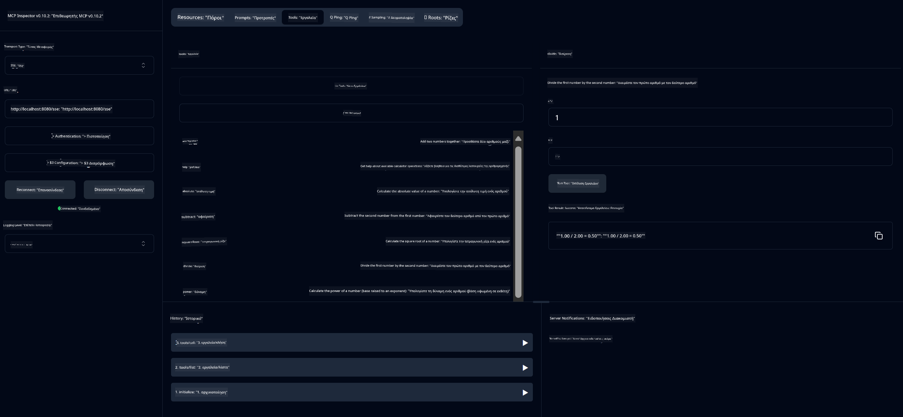

<!--
CO_OP_TRANSLATOR_METADATA:
{
  "original_hash": "5bd7a347d6ed1d706443f9129dd29dd9",
  "translation_date": "2025-07-25T09:31:48+00:00",
  "source_file": "04-PracticalSamples/mcp/calculator/README.md",
  "language_code": "el"
}
-->
# Βασική Υπηρεσία Υπολογιστή MCP

>**Σημείωση**: Αυτό το κεφάλαιο περιλαμβάνει ένα [**Tutorial**](./TUTORIAL.md) που σας καθοδηγεί μέσα από τα παραδείγματα.

Καλώς ήρθατε στην πρώτη σας πρακτική εμπειρία με το **Model Context Protocol (MCP)**! Στα προηγούμενα κεφάλαια, μάθατε τα βασικά της γενετικής τεχνητής νοημοσύνης και ρυθμίσατε το περιβάλλον ανάπτυξής σας. Τώρα είναι η ώρα να δημιουργήσετε κάτι πρακτικό.

Αυτή η υπηρεσία υπολογιστή δείχνει πώς τα μοντέλα τεχνητής νοημοσύνης μπορούν να αλληλεπιδρούν με ασφάλεια με εξωτερικά εργαλεία χρησιμοποιώντας το MCP. Αντί να βασιζόμαστε στις, μερικές φορές, αναξιόπιστες μαθηματικές ικανότητες του μοντέλου, θα σας δείξουμε πώς να δημιουργήσετε ένα αξιόπιστο σύστημα όπου η τεχνητή νοημοσύνη μπορεί να καλεί εξειδικευμένες υπηρεσίες για ακριβείς υπολογισμούς.

## Πίνακας Περιεχομένων

- [Τι Θα Μάθετε](../../../../../04-PracticalSamples/mcp/calculator)
- [Προαπαιτούμενα](../../../../../04-PracticalSamples/mcp/calculator)
- [Βασικές Έννοιες](../../../../../04-PracticalSamples/mcp/calculator)
- [Γρήγορη Εκκίνηση](../../../../../04-PracticalSamples/mcp/calculator)
- [Διαθέσιμες Λειτουργίες Υπολογιστή](../../../../../04-PracticalSamples/mcp/calculator)
- [Πελάτες Δοκιμών](../../../../../04-PracticalSamples/mcp/calculator)
  - [1. Άμεσος Πελάτης MCP (SDKClient)](../../../../../04-PracticalSamples/mcp/calculator)
  - [2. Πελάτης με Τεχνητή Νοημοσύνη (LangChain4jClient)](../../../../../04-PracticalSamples/mcp/calculator)
- [MCP Inspector (Web UI)](../../../../../04-PracticalSamples/mcp/calculator)
  - [Οδηγίες Βήμα-Βήμα](../../../../../04-PracticalSamples/mcp/calculator)

## Τι Θα Μάθετε

Μέσα από αυτό το παράδειγμα, θα κατανοήσετε:
- Πώς να δημιουργήσετε υπηρεσίες συμβατές με MCP χρησιμοποιώντας το Spring Boot
- Τη διαφορά μεταξύ άμεσης επικοινωνίας πρωτοκόλλου και αλληλεπίδρασης με τεχνητή νοημοσύνη
- Πώς τα μοντέλα τεχνητής νοημοσύνης αποφασίζουν πότε και πώς να χρησιμοποιούν εξωτερικά εργαλεία
- Βέλτιστες πρακτικές για την ανάπτυξη εφαρμογών τεχνητής νοημοσύνης με εργαλεία

Ιδανικό για αρχάριους που μαθαίνουν τις έννοιες του MCP και είναι έτοιμοι να δημιουργήσουν την πρώτη τους ενσωμάτωση εργαλείων τεχνητής νοημοσύνης!

## Προαπαιτούμενα

- Java 21+
- Maven 3.6+
- **GitHub Token**: Απαιτείται για τον πελάτη με τεχνητή νοημοσύνη. Αν δεν το έχετε ρυθμίσει ακόμα, δείτε το [Κεφάλαιο 2: Ρύθμιση του περιβάλλοντος ανάπτυξης](../../../02-SetupDevEnvironment/README.md) για οδηγίες.

## Βασικές Έννοιες

Το **Model Context Protocol (MCP)** είναι ένας τυποποιημένος τρόπος για τις εφαρμογές τεχνητής νοημοσύνης να συνδέονται με ασφάλεια με εξωτερικά εργαλεία. Σκεφτείτε το ως μια "γέφυρα" που επιτρέπει στα μοντέλα τεχνητής νοημοσύνης να χρησιμοποιούν εξωτερικές υπηρεσίες, όπως ο υπολογιστής μας. Αντί το μοντέλο να προσπαθεί να κάνει μαθηματικούς υπολογισμούς μόνο του (που μπορεί να είναι αναξιόπιστο), μπορεί να καλέσει την υπηρεσία υπολογιστή μας για να πάρει ακριβή αποτελέσματα. Το MCP διασφαλίζει ότι αυτή η επικοινωνία γίνεται με ασφάλεια και συνέπεια.

Τα **Server-Sent Events (SSE)** επιτρέπουν την επικοινωνία σε πραγματικό χρόνο μεταξύ του διακομιστή και των πελατών. Σε αντίθεση με τις παραδοσιακές αιτήσεις HTTP, όπου ζητάτε και περιμένετε μια απάντηση, τα SSE επιτρέπουν στον διακομιστή να στέλνει συνεχώς ενημερώσεις στον πελάτη. Αυτό είναι ιδανικό για εφαρμογές τεχνητής νοημοσύνης όπου οι απαντήσεις μπορεί να μεταδίδονται ή να απαιτούν χρόνο για επεξεργασία.

Τα **Εργαλεία Τεχνητής Νοημοσύνης & Κλήση Λειτουργιών** επιτρέπουν στα μοντέλα τεχνητής νοημοσύνης να επιλέγουν και να χρησιμοποιούν αυτόματα εξωτερικές λειτουργίες (όπως λειτουργίες υπολογιστή) με βάση τα αιτήματα των χρηστών. Όταν ρωτάτε "Πόσο κάνει 15 + 27;", το μοντέλο τεχνητής νοημοσύνης καταλαβαίνει ότι θέλετε πρόσθεση, καλεί αυτόματα το εργαλείο `add` με τις σωστές παραμέτρους (15, 27) και επιστρέφει το αποτέλεσμα σε φυσική γλώσσα. Η τεχνητή νοημοσύνη λειτουργεί ως ένας έξυπνος συντονιστής που ξέρει πότε και πώς να χρησιμοποιεί κάθε εργαλείο.

## Γρήγορη Εκκίνηση

### 1. Μεταβείτε στον κατάλογο της εφαρμογής υπολογιστή
```bash
cd Generative-AI-for-beginners-java/04-PracticalSamples/mcp/calculator
```

### 2. Δημιουργία & Εκτέλεση
```bash
mvn clean install -DskipTests
java -jar target/calculator-server-0.0.1-SNAPSHOT.jar
```

### 3. Δοκιμή με Πελάτες
- **SDKClient**: Άμεση αλληλεπίδραση με το πρωτόκολλο MCP
- **LangChain4jClient**: Αλληλεπίδραση φυσικής γλώσσας με τεχνητή νοημοσύνη (απαιτεί GitHub token)

## Διαθέσιμες Λειτουργίες Υπολογιστή

- `add(a, b)`, `subtract(a, b)`, `multiply(a, b)`, `divide(a, b)`
- `power(base, exponent)`, `squareRoot(number)`, `absolute(number)`
- `modulus(a, b)`, `help()`

## Πελάτες Δοκιμών

### 1. Άμεσος Πελάτης MCP (SDKClient)
Δοκιμάζει την ακατέργαστη επικοινωνία του πρωτοκόλλου MCP. Εκτελέστε με:
```bash
mvn test-compile exec:java -Dexec.mainClass="com.microsoft.mcp.sample.client.SDKClient" -Dexec.classpathScope=test
```

### 2. Πελάτης με Τεχνητή Νοημοσύνη (LangChain4jClient)
Δείχνει την αλληλεπίδραση φυσικής γλώσσας με μοντέλα GitHub. Απαιτεί GitHub token (δείτε [Προαπαιτούμενα](../../../../../04-PracticalSamples/mcp/calculator)).

**Εκτέλεση:**
```bash
mvn test-compile exec:java -Dexec.mainClass="com.microsoft.mcp.sample.client.LangChain4jClient" -Dexec.classpathScope=test
```

## MCP Inspector (Web UI)

Το MCP Inspector παρέχει μια οπτική διεπαφή ιστού για να δοκιμάσετε την υπηρεσία MCP σας χωρίς να γράψετε κώδικα. Ιδανικό για αρχάριους που θέλουν να κατανοήσουν πώς λειτουργεί το MCP!

### Οδηγίες Βήμα-Βήμα:

1. **Εκκινήστε τον διακομιστή υπολογιστή** (αν δεν εκτελείται ήδη):
   ```bash
   java -jar target/calculator-server-0.0.1-SNAPSHOT.jar
   ```

2. **Εγκαταστήστε και εκτελέστε το MCP Inspector** σε ένα νέο τερματικό:
   ```bash
   npx @modelcontextprotocol/inspector
   ```

3. **Ανοίξτε τη διεπαφή ιστού**:
   - Αναζητήστε ένα μήνυμα όπως "Inspector running at http://localhost:6274"
   - Ανοίξτε αυτό το URL στον περιηγητή σας

4. **Συνδεθείτε με την υπηρεσία υπολογιστή σας**:
   - Στη διεπαφή ιστού, ορίστε τον τύπο μεταφοράς σε "SSE"
   - Ορίστε το URL σε: `http://localhost:8080/sse`
   - Πατήστε το κουμπί "Connect"

5. **Εξερευνήστε τα διαθέσιμα εργαλεία**:
   - Πατήστε "List Tools" για να δείτε όλες τις λειτουργίες του υπολογιστή
   - Θα δείτε λειτουργίες όπως `add`, `subtract`, `multiply`, κ.λπ.

6. **Δοκιμάστε μια λειτουργία υπολογιστή**:
   - Επιλέξτε ένα εργαλείο (π.χ., "add")
   - Εισάγετε παραμέτρους (π.χ., `a: 15`, `b: 27`)
   - Πατήστε "Run Tool"
   - Δείτε το αποτέλεσμα που επιστρέφεται από την υπηρεσία MCP σας!

Αυτή η οπτική προσέγγιση σας βοηθά να κατανοήσετε ακριβώς πώς λειτουργεί η επικοινωνία MCP πριν δημιουργήσετε τους δικούς σας πελάτες.



---
**Αναφορά:** [Έγγραφα MCP Server Boot Starter](https://docs.spring.io/spring-ai/reference/api/mcp/mcp-server-boot-starter-docs.html)

**Αποποίηση ευθύνης**:  
Αυτό το έγγραφο έχει μεταφραστεί χρησιμοποιώντας την υπηρεσία αυτόματης μετάφρασης [Co-op Translator](https://github.com/Azure/co-op-translator). Παρόλο που καταβάλλουμε προσπάθειες για ακρίβεια, παρακαλούμε να έχετε υπόψη ότι οι αυτόματες μεταφράσεις ενδέχεται να περιέχουν λάθη ή ανακρίβειες. Το πρωτότυπο έγγραφο στη μητρική του γλώσσα θα πρέπει να θεωρείται η αυθεντική πηγή. Για κρίσιμες πληροφορίες, συνιστάται επαγγελματική ανθρώπινη μετάφραση. Δεν φέρουμε ευθύνη για τυχόν παρεξηγήσεις ή εσφαλμένες ερμηνείες που προκύπτουν από τη χρήση αυτής της μετάφρασης.