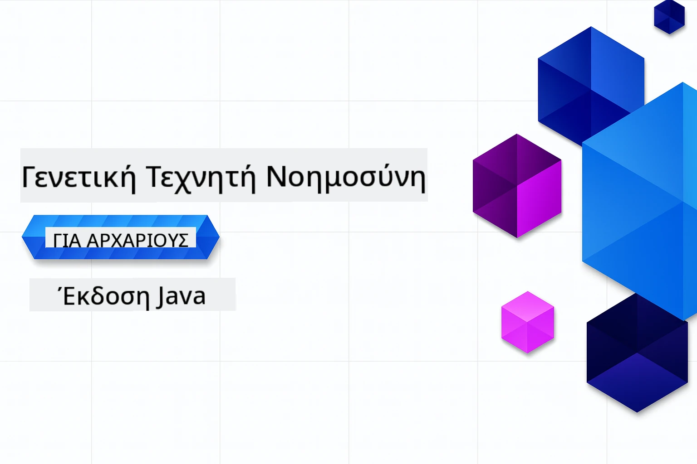

# Γεννητική Τεχνητή Νοημοσύνη για Αρχάριους - Έκδοση Java
[](https://discord.gg/nTYy5BXMWG)



**Δέσμευση Χρόνου**: Το εργαστήριο μπορεί να ολοκληρωθεί εξολοκλήρου online χωρίς τοπική εγκατάσταση. Η ρύθμιση του περιβάλλοντος διαρκεί 2 λεπτά, με την εξερεύνηση των παραδειγμάτων να απαιτεί 1-3 ώρες ανάλογα με το βάθος μελέτης.

> **Γρήγορη Έναρξη**

1. Κάντε fork αυτό το αποθετήριο στον λογαριασμό σας στο GitHub
2. Πατήστε **Code** → καρτέλα **Codespaces** → **...** → **Νέο με επιλογές...**
3. Χρησιμοποιήστε τις προεπιλογές – αυτό θα επιλέξει το container ανάπτυξης που δημιουργήθηκε για το μάθημα
4. Κάντε κλικ στο **Create codespace**
5. Περιμένετε ~2 λεπτά μέχρι να είναι έτοιμο το περιβάλλον
6. Πηγαίνετε απευθείας στο [Το πρώτο παράδειγμα](./02-SetupDevEnvironment/README.md#step-2-create-a-github-personal-access-token)

> **Προτιμάτε να Κλωνοποιήσετε Τοπικά;**
>
> Αυτό το αποθετήριο περιλαμβάνει πάνω από 50 μεταφράσεις γλωσσών που αυξάνουν σημαντικά το μέγεθος λήψης. Για να κλωνοποιήσετε χωρίς τις μεταφράσεις, χρησιμοποιήστε sparse checkout:
> ```bash
> git clone --filter=blob:none --sparse https://github.com/microsoft/Generative-AI-for-beginners-java.git
> cd Generative-AI-for-beginners-java
> git sparse-checkout set --no-cone '/*' '!translations' '!translated_images'
> ```
> Αυτό σας δίνει ό,τι χρειάζεστε για να ολοκληρώσετε το μάθημα με πολύ γρηγορότερη λήψη.

## Υποστήριξη Πολλών Γλωσσών

### Υποστηρίζεται μέσω GitHub Action (Αυτοματοποιημένο & Πάντα Ενημερωμένο)

<!-- CO-OP TRANSLATOR LANGUAGES TABLE START -->
[Αραβικά](../ar/README.md) | [Βεγγαλικά](../bn/README.md) | [Βουλγαρικά](../bg/README.md) | [Βιρμανικά (Μιανμάρ)](../my/README.md) | [Κινέζικα (Απλοποιημένα)](../zh-CN/README.md) | [Κινέζικα (Παραδοσιακά, Χονγκ Κονγκ)](../zh-HK/README.md) | [Κινέζικα (Παραδοσιακά, Μακάο)](../zh-MO/README.md) | [Κινέζικα (Παραδοσιακά, Ταϊβάν)](../zh-TW/README.md) | [Κροατικά](../hr/README.md) | [Τσέχικα](../cs/README.md) | [Δανικά](../da/README.md) | [Ολλανδικά](../nl/README.md) | [Εσθονικά](../et/README.md) | [Φινλανδικά](../fi/README.md) | [Γαλλικά](../fr/README.md) | [Γερμανικά](../de/README.md) | [Ελληνικά](./README.md) | [Εβραϊκά](../he/README.md) | [Χίντι](../hi/README.md) | [Ουγγρικά](../hu/README.md) | [Ινδονησιακά](../id/README.md) | [Ιταλικά](../it/README.md) | [Ιαπωνικά](../ja/README.md) | [Καννάδα](../kn/README.md) | [Κορεατικά](../ko/README.md) | [Λιθουανικά](../lt/README.md) | [Μαλάι](../ms/README.md) | [Μαλαγιαλάμ](../ml/README.md) | [Μαράθι](../mr/README.md) | [Νεπάλι](../ne/README.md) | [Νιγηριανό Πίντιν](../pcm/README.md) | [Νορβηγικά](../no/README.md) | [Περσικά (Φαρσί)](../fa/README.md) | [Πολωνικά](../pl/README.md) | [Πορτογαλικά (Βραζιλία)](../pt-BR/README.md) | [Πορτογαλικά (Πορτογαλία)](../pt-PT/README.md) | [Πουντζάμπι (Γκουρμούκι)](../pa/README.md) | [Ρουμανικά](../ro/README.md) | [Ρωσικά](../ru/README.md) | [Σερβικά (Κυριλλικά)](../sr/README.md) | [Σλοβακικά](../sk/README.md) | [Σλοβενικά](../sl/README.md) | [Ισπανικά](../es/README.md) | [Σουαχίλι](../sw/README.md) | [Σουηδικά](../sv/README.md) | [Ταγκάλογκ (Φιλιππινέζικα)](../tl/README.md) | [Ταμίλ](../ta/README.md) | [Τελούγκου](../te/README.md) | [Ταϊλανδικά](../th/README.md) | [Τουρκικά](../tr/README.md) | [Ουκρανικά](../uk/README.md) | [Ουρντού](../ur/README.md) | [Βιετναμικά](../vi/README.md)

## Δομή Μαθήματος & Μονοπάτι Μάθησης

### **Κεφάλαιο 1: Εισαγωγή στην Γεννητική Τεχνητή Νοημοσύνη**
- **Βασικές Έννοιες**: Κατανόηση Μεγάλων Γλωσσικών Μοντέλων, tokens, embeddings και δυνατοτήτων AI
- **Οικοσύστημα Java AI**: Επισκόπηση των Spring AI και OpenAI SDKs
- **Πρωτόκολλο Περιβάλλοντος Μοντέλου**: Εισαγωγή στο MCP και ο ρόλος του στην επικοινωνία των AI agents
- **Πρακτικές Εφαρμογές**: Πραγματικά σενάρια όπως chatbot και δημιουργία περιεχομένου
- **[→ Ξεκινήστε το Κεφάλαιο 1](./01-IntroToGenAI/README.md)**

### **Κεφάλαιο 2: Ρύθμιση Περιβάλλοντος Ανάπτυξης**
- **Διαμόρφωση Πολλαπλών Παρόχων**: Ρύθμιση GitHub Models, Azure OpenAI, και OpenAI Java SDK ενσωματώσεων
- **Spring Boot + Spring AI**: Καλύτερες πρακτικές για ανάπτυξη επιχειρηματικών εφαρμογών AI
- **GitHub Models**: Δωρεάν πρόσβαση σε μοντέλα AI για πρωτοτυποποίηση και μάθηση (δεν απαιτείται πιστωτική κάρτα)
- **Εργαλεία Ανάπτυξης**: Docker containers, VS Code και διαμόρφωση GitHub Codespaces
- **[→ Ξεκινήστε το Κεφάλαιο 2](./02-SetupDevEnvironment/README.md)**

### **Κεφάλαιο 3: Βασικές Τεχνικές Γεννητικής AI**
- **Μηχανική Ερωτημάτων (Prompt Engineering)**: Τεχνικές για βέλτιστες απαντήσεις μοντέλων AI
- **Embeddings & Λειτουργίες Διανυσμάτων**: Υλοποίηση σεμανούς αναζήτησης και αντιστοίχισης ομοιότητας
- **Retrieval-Augmented Generation (RAG)**: Συνδυασμός AI με δικές σας πηγές δεδομένων
- **Κλήση Λειτουργιών**: Επέκταση δυνατοτήτων AI με προσαρμοσμένα εργαλεία και πρόσθετα
- **[→ Ξεκινήστε το Κεφάλαιο 3](./03-CoreGenerativeAITechniques/README.md)**

### **Κεφάλαιο 4: Πρακτικές Εφαρμογές & Έργα**
- **Γεννήτρια Ιστοριών Κατοικιδίων** (`petstory/`): Δημιουργική παραγωγή περιεχομένου με GitHub Models
- **Δοκιμαστικό Foundry Τοπικά** (`foundrylocal/`): Τοπική ενσωμάτωση μοντέλου AI με OpenAI Java SDK
- **Υπηρεσία Υπολογιστή MCP** (`calculator/`): Βασική υλοποίηση Model Context Protocol με Spring AI
- **[→ Ξεκινήστε το Κεφάλαιο 4](./04-PracticalSamples/README.md)**

### **Κεφάλαιο 5: Υπεύθυνη Ανάπτυξη AI**
- **Ασφάλεια GitHub Models**: Δοκιμάστε ενσωματωμένα φίλτρα περιεχομένου και μηχανισμούς ασφαλείας (σκληροί αποκλεισμοί και μαλακές απορρίψεις)
- **Δείγμα Υπεύθυνης AI**: Πρακτικό παράδειγμα που δείχνει πώς λειτουργούν τα σύγχρονα συστήματα ασφαλείας AI
- **Καλύτερες Πρακτικές**: Βασικές οδηγίες για ηθική ανάπτυξη και ανάθεση AI
- **[→ Ξεκινήστε το Κεφάλαιο 5](./05-ResponsibleGenAI/README.md)**

## Πρόσθετοι Πόροι

<!-- CO-OP TRANSLATOR OTHER COURSES START -->
### LangChain
[](https://aka.ms/langchain4j-for-beginners)
[](https://aka.ms/langchainjs-for-beginners?WT.mc_id=m365-94501-dwahlin)
[](https://github.com/microsoft/langchain-for-beginners?WT.mc_id=m365-94501-dwahlin)
---

### Azure / Edge / MCP / Agents
[](https://github.com/microsoft/AZD-for-beginners?WT.mc_id=academic-105485-koreyst)
[](https://github.com/microsoft/edgeai-for-beginners?WT.mc_id=academic-105485-koreyst)
[](https://github.com/microsoft/mcp-for-beginners?WT.mc_id=academic-105485-koreyst)
[](https://github.com/microsoft/ai-agents-for-beginners?WT.mc_id=academic-105485-koreyst)

---
 
### Σειρά Γεννητικής AI
[](https://github.com/microsoft/generative-ai-for-beginners?WT.mc_id=academic-105485-koreyst)
[-9333EA?style=for-the-badge&labelColor=E5E7EB&color=9333EA)](https://github.com/microsoft/Generative-AI-for-beginners-dotnet?WT.mc_id=academic-105485-koreyst)
[-C084FC?style=for-the-badge&labelColor=E5E7EB&color=C084FC)](https://github.com/microsoft/generative-ai-for-beginners-java?WT.mc_id=academic-105485-koreyst)
[-E879F9?style=for-the-badge&labelColor=E5E7EB&color=E879F9)](https://github.com/microsoft/generative-ai-with-javascript?WT.mc_id=academic-105485-koreyst)

---
 
### Βασική Μάθηση
[](https://aka.ms/ml-beginners?WT.mc_id=academic-105485-koreyst)
[](https://aka.ms/datascience-beginners?WT.mc_id=academic-105485-koreyst)
[](https://aka.ms/ai-beginners?WT.mc_id=academic-105485-koreyst)
[](https://github.com/microsoft/Security-101?WT.mc_id=academic-96948-sayoung)
[](https://aka.ms/webdev-beginners?WT.mc_id=academic-105485-koreyst)
[](https://aka.ms/iot-beginners?WT.mc_id=academic-105485-koreyst)
[](https://github.com/microsoft/xr-development-for-beginners?WT.mc_id=academic-105485-koreyst)

---
 
### Σειρά Copilot
[](https://aka.ms/GitHubCopilotAI?WT.mc_id=academic-105485-koreyst)
[](https://github.com/microsoft/mastering-github-copilot-for-dotnet-csharp-developers?WT.mc_id=academic-105485-koreyst)
[](https://github.com/microsoft/CopilotAdventures?WT.mc_id=academic-105485-koreyst)
<!-- CO-OP TRANSLATOR OTHER COURSES END -->

## Λήψη Βοήθειας

Εάν κολλήσετε ή έχετε οποιεσδήποτε ερωτήσεις σχετικά με τη δημιουργία εφαρμογών AI. Ενταχθείτε σε άλλους μαθητές και έμπειρους προγραμματιστές σε συζητήσεις για το MCP. Είναι μια υποστηρικτική κοινότητα όπου οι ερωτήσεις είναι ευπρόσδεκτες και η γνώση μοιράζεται ελεύθερα.

[](https://discord.gg/nTYy5BXMWG)

Εάν έχετε σχόλια προϊόντος ή σφάλματα κατά τη δημιουργία, επισκεφτείτε:

[](https://aka.ms/foundry/forum)

---

<!-- CO-OP TRANSLATOR DISCLAIMER START -->
**Αποποίηση ευθύνης**:
Αυτό το έγγραφο έχει μεταφραστεί χρησιμοποιώντας την υπηρεσία μετάφρασης με τεχνητή νοημοσύνη [Co-op Translator](https://github.com/Azure/co-op-translator). Ενώ επιδιώκουμε την ακρίβεια, παρακαλούμε να γνωρίζετε ότι οι αυτοματοποιημένες μεταφράσεις ενδέχεται να περιέχουν σφάλματα ή ανακρίβειες. Το πρωτότυπο έγγραφο στη μητρική του γλώσσα πρέπει να θεωρείται η αυθεντική πηγή. Για κρίσιμες πληροφορίες, συνιστάται επαγγελματική ανθρώπινη μετάφραση. Δεν φέρουμε ευθύνη για τυχόν παρεξηγήσεις ή λανθασμένες ερμηνείες που προκύπτουν από τη χρήση αυτής της μετάφρασης.
<!-- CO-OP TRANSLATOR DISCLAIMER END -->