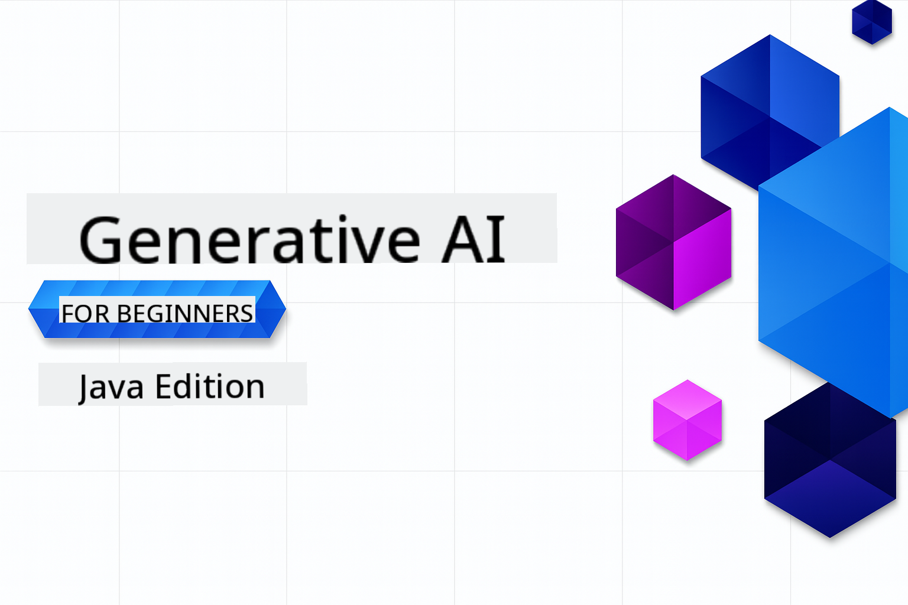

<!--
CO_OP_TRANSLATOR_METADATA:
{
  "original_hash": "4d04ae8088f6a3c3fcbab18cbdfe4002",
  "translation_date": "2025-10-03T08:00:11+00:00",
  "source_file": "README.md",
  "language_code": "en"
}
-->
# Generative AI for Beginners - Java Edition

**Time Commitment**: This workshop can be completed entirely online without requiring local setup. Setting up the environment takes about 2 minutes, and exploring the examples can take 1-3 hours depending on how deeply you dive into them.

> **Quick Start** 

1. Fork this repository to your GitHub account.
2. Click **Code** → **Codespaces** tab → **...** → **New with options...**
3. Use the default settings – this will select the Development container created for this course.
4. Click **Create codespace**.
5. Wait approximately 2 minutes for the environment to be ready.
6. Jump directly to [The first example](./02-SetupDevEnvironment/README.md#step-2-create-a-github-personal-access-token).

## Multi-Language Support

### Supported via GitHub Action (Automated & Always Up-to-Date)

[French](../fr/README.md) | [Spanish](../es/README.md) | [German](../de/README.md) | [Russian](../ru/README.md) | [Arabic](../ar/README.md) | [Persian (Farsi)](../fa/README.md) | [Urdu](../ur/README.md) | [Chinese (Simplified)](../zh/README.md) | [Chinese (Traditional, Macau)](../mo/README.md) | [Chinese (Traditional, Hong Kong)](../hk/README.md) | [Chinese (Traditional, Taiwan)](../tw/README.md) | [Japanese](../ja/README.md) | [Korean](../ko/README.md) | [Hindi](../hi/README.md) | [Bengali](../bn/README.md) | [Marathi](../mr/README.md) | [Nepali](../ne/README.md) | [Punjabi (Gurmukhi)](../pa/README.md) | [Portuguese (Portugal)](../pt/README.md) | [Portuguese (Brazil)](../br/README.md) | [Italian](../it/README.md) | [Polish](../pl/README.md) | [Turkish](../tr/README.md) | [Greek](../el/README.md) | [Thai](../th/README.md) | [Swedish](../sv/README.md) | [Danish](../da/README.md) | [Norwegian](../no/README.md) | [Finnish](../fi/README.md) | [Dutch](../nl/README.md) | [Hebrew](../he/README.md) | [Vietnamese](../vi/README.md) | [Indonesian](../id/README.md) | [Malay](../ms/README.md) | [Tagalog (Filipino)](../tl/README.md) | [Swahili](../sw/README.md) | [Hungarian](../hu/README.md) | [Czech](../cs/README.md) | [Slovak](../sk/README.md) | [Romanian](../ro/README.md) | [Bulgarian](../bg/README.md) | [Serbian (Cyrillic)](../sr/README.md) | [Croatian](../hr/README.md) | [Slovenian](../sl/README.md) | [Ukrainian](../uk/README.md) | [Burmese (Myanmar)](../my/README.md)

## Course Structure & Learning Path

### **Chapter 1: Introduction to Generative AI**
- **Core Concepts**: Learn about Large Language Models, tokens, embeddings, and AI capabilities.
- **Java AI Ecosystem**: Overview of Spring AI and OpenAI SDKs.
- **Model Context Protocol**: Introduction to MCP and its role in AI agent communication.
- **Practical Applications**: Explore real-world use cases like chatbots and content generation.
- **[→ Start Chapter 1](./01-IntroToGenAI/README.md)**

### **Chapter 2: Development Environment Setup**
- **Multi-Provider Configuration**: Set up integrations for GitHub Models, Azure OpenAI, and OpenAI Java SDK.
- **Spring Boot + Spring AI**: Best practices for developing enterprise AI applications.
- **GitHub Models**: Access free AI models for prototyping and learning (no credit card required).
- **Development Tools**: Configure Docker containers, VS Code, and GitHub Codespaces.
- **[→ Start Chapter 2](./02-SetupDevEnvironment/README.md)**

### **Chapter 3: Core Generative AI Techniques**
- **Prompt Engineering**: Learn techniques to optimize AI model responses.
- **Embeddings & Vector Operations**: Implement semantic search and similarity matching.
- **Retrieval-Augmented Generation (RAG)**: Combine AI with your own data sources.
- **Function Calling**: Extend AI capabilities with custom tools and plugins.
- **[→ Start Chapter 3](./03-CoreGenerativeAITechniques/README.md)**

### **Chapter 4: Practical Applications & Projects**
- **Pet Story Generator** (`petstory/`): Generate creative content using GitHub Models.
- **Foundry Local Demo** (`foundrylocal/`): Integrate local AI models with OpenAI Java SDK.
- **MCP Calculator Service** (`calculator/`): Implement a basic Model Context Protocol with Spring AI.
- **[→ Start Chapter 4](./04-PracticalSamples/README.md)**

### **Chapter 5: Responsible AI Development**
- **GitHub Models Safety**: Test built-in content filtering and safety mechanisms (hard blocks and soft refusals).
- **Responsible AI Demo**: Hands-on example demonstrating modern AI safety systems.
- **Best Practices**: Learn essential guidelines for ethical AI development and deployment.
- **[→ Start Chapter 5](./05-ResponsibleGenAI/README.md)**

## Additional Resources 

- [Edge AI for Beginners](https://github.com/microsoft/edgeai-for-beginners)
- [MCP For Beginners](https://github.com/microsoft/mcp-for-beginners)
- [AI Agents For Beginners](https://github.com/microsoft/ai-agents-for-beginners)
- [Generative AI for Beginners using .NET](https://github.com/microsoft/Generative-AI-for-beginners-dotnet)
- [Generative AI for Beginners using JavaScript](https://github.com/microsoft/generative-ai-with-javascript)
- [Generative AI for Beginners](https://github.com/microsoft/generative-ai-for-beginners)
- [ML for Beginners](https://aka.ms/ml-beginners)
- [Data Science for Beginners](https://aka.ms/datascience-beginners)
- [AI for Beginners](https://aka.ms/ai-beginners)
- [Cybersecurity for Beginners](https://github.com/microsoft/Security-101)
- [Web Dev for Beginners](https://aka.ms/webdev-beginners)
- [IoT for Beginners](https://aka.ms/iot-beginners)
- [XR Development for Beginners](https://github.com/microsoft/xr-development-for-beginners)
- [Mastering GitHub Copilot for AI Paired Programming](https://aka.ms/GitHubCopilotAI)
- [Mastering GitHub Copilot for C#/.NET Developers](https://github.com/microsoft/mastering-github-copilot-for-dotnet-csharp-developers)
- [Choose Your Own Copilot Adventure](https://github.com/microsoft/CopilotAdventures)
- [RAG Chat App with Azure AI Services](https://github.com/Azure-Samples/azure-search-openai-demo-java)

## Getting Help

If you encounter any issues or have questions about building AI applications, join:

For product feedback or troubleshooting errors, visit:

---

**Disclaimer**:  
This document has been translated using the AI translation service [Co-op Translator](https://github.com/Azure/co-op-translator). While we aim for accuracy, please note that automated translations may contain errors or inaccuracies. The original document in its native language should be regarded as the authoritative source. For critical information, professional human translation is recommended. We are not responsible for any misunderstandings or misinterpretations resulting from the use of this translation.