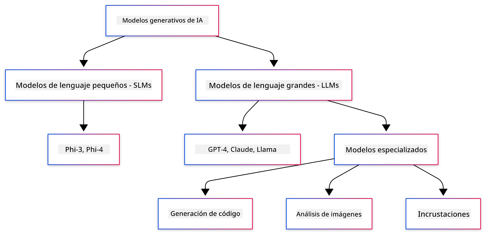
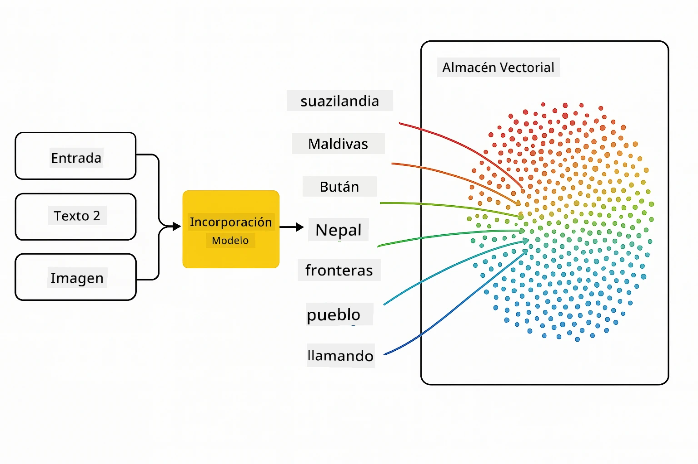
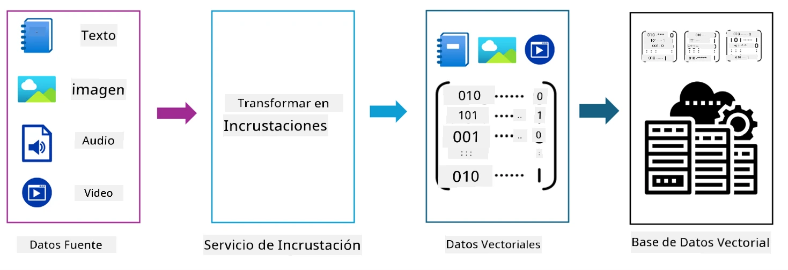
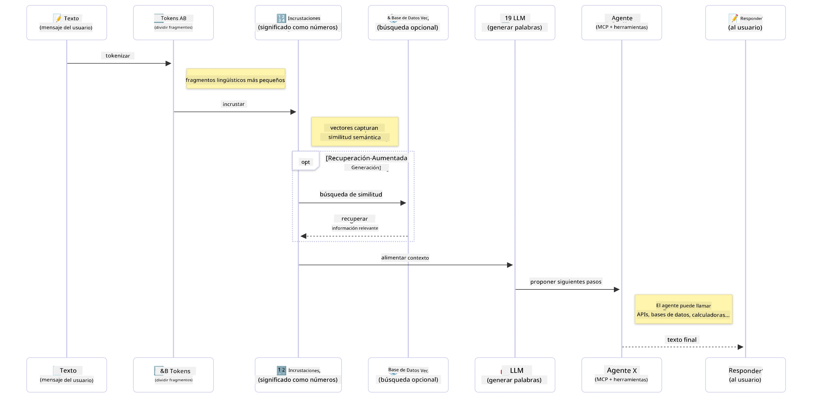

# Introducción a la IA Generativa - Edición Java

> **Video**: [Mira la visión general en video para esta lección en YouTube.](https://www.youtube.com/watch?v=XH46tGp_eSw) También puedes hacer clic en la imagen de vista previa arriba.

## Qué Aprenderás

- **Fundamentos de IA generativa** incluyendo LLMs, ingeniería de prompts, tokens, embeddings y bases de datos vectoriales
- **Comparar las herramientas de desarrollo de IA en Java** incluyendo Azure OpenAI SDK, Spring AI y OpenAI Java SDK
- **Descubrir el Protocolo de Contexto de Modelo** y su papel en la comunicación de agentes de IA

## Tabla de Contenidos

- [Introducción](#introducción)
- [Un repaso rápido sobre conceptos de IA generativa](#un-repaso-rápido-sobre-conceptos-de-ia-generativa)
- [Revisión de ingeniería de prompts](#revisión-de-ingeniería-de-prompts)
- [Tokens, embeddings y agentes](#tokens-embeddings-y-agentes)
- [Herramientas y bibliotecas de desarrollo de IA para Java](#herramientas-y-bibliotecas-de-desarrollo-de-ia-para-java)
  - [OpenAI Java SDK](#openai-java-sdk)
  - [Spring AI](#spring-ai)
  - [Azure OpenAI Java SDK](#azure-openai-java-sdk)
- [Resumen](#resumen)
- [Próximos pasos](#próximos-pasos)

## Introducción

¡Bienvenido al primer capítulo de IA Generativa para Principiantes - Edición Java! Esta lección fundamental te introduce a los conceptos centrales de la IA generativa y cómo trabajar con ellos usando Java. Aprenderás sobre los bloques básicos esenciales de las aplicaciones de IA, incluyendo Modelos de Lenguaje Grande (LLMs), tokens, embeddings y agentes de IA. También exploraremos las principales herramientas de Java que usarás durante este curso.

### Un repaso rápido sobre conceptos de IA generativa

La IA generativa es un tipo de inteligencia artificial que crea nuevo contenido, como texto, imágenes o código, basándose en patrones y relaciones aprendidas de datos. Los modelos de IA generativa pueden generar respuestas parecidas a las humanas, entender el contexto y a veces incluso crear contenido que parece humano.

Al desarrollar tus aplicaciones de IA en Java, trabajarás con **modelos de IA generativa** para crear contenido. Algunas capacidades de los modelos de IA generativa incluyen:

- **Generación de texto**: Crear textos parecidos a los humanos para chatbots, contenido y completado de texto.
- **Generación y análisis de imágenes**: Producir imágenes realistas, mejorar fotos y detectar objetos.
- **Generación de código**: Escribir fragmentos o scripts de código.

Existen tipos específicos de modelos optimizados para diferentes tareas. Por ejemplo, tanto los **Modelos de Lenguaje Pequeños (SLMs)** como los **Modelos de Lenguaje Grande (LLMs)** pueden manejar generación de texto, con LLMs que generalmente ofrecen mejor desempeño para tareas complejas. Para tareas relacionadas con imágenes, usarías modelos especializados de visión o modelos multimodales.

Por supuesto, las respuestas de estos modelos no son perfectas todo el tiempo. Probablemente hayas oído hablar de modelos que “alucinan” o generan información incorrecta de manera autoritaria. Pero puedes ayudar a guiar al modelo para generar mejores respuestas proporcionándole instrucciones claras y contexto. Aquí es donde entra la **ingeniería de prompts**.

#### Revisión de ingeniería de prompts

La ingeniería de prompts es la práctica de diseñar entradas efectivas para guiar a los modelos de IA hacia salidas deseadas. Involucra:

- **Claridad**: Hacer las instrucciones claras y sin ambigüedades.
- **Contexto**: Proporcionar la información de fondo necesaria.
- **Restricciones**: Especificar cualquier limitación o formato.

Algunas mejores prácticas para la ingeniería de prompts incluyen diseño de prompts, instrucciones claras, desglose de tareas, aprendizaje one-shot y few-shot, y ajuste de prompts. Probar diferentes prompts es esencial para encontrar lo que mejor funciona para tu caso específico.

Al desarrollar aplicaciones, trabajarás con diferentes tipos de prompts:
- **Prompts del sistema**: Establecen las reglas base y el contexto para el comportamiento del modelo
- **Prompts del usuario**: Los datos de entrada de los usuarios de tu aplicación
- **Prompts del asistente**: Las respuestas del modelo basadas en los prompts del sistema y usuario

> **Aprende más**: Aprende más sobre ingeniería de prompts en el [capítulo de Ingeniería de Prompts del curso GenAI para Principiantes](https://github.com/microsoft/generative-ai-for-beginners/tree/main/04-prompt-engineering-fundamentals)

#### Tokens, embeddings y agentes

Al trabajar con modelos de IA generativa, encontrarás términos como **tokens**, **embeddings**, **agentes** y **Protocolo de Contexto de Modelo (MCP)**. Aquí una descripción detallada de estos conceptos:

- **Tokens**: Los tokens son la unidad más pequeña de texto en un modelo. Pueden ser palabras, caracteres o subpalabras. Los tokens se usan para representar datos de texto en un formato que el modelo pueda entender. Por ejemplo, la oración "The quick brown fox jumped over the lazy dog" podría tokenizarse como ["The", " quick", " brown", " fox", " jumped", " over", " the", " lazy", " dog"] o ["The", " qu", "ick", " br", "own", " fox", " jump", "ed", " over", " the", " la", "zy", " dog"] dependiendo de la estrategia de tokenización.

La tokenización es el proceso de descomponer el texto en estas unidades más pequeñas. Esto es crucial porque los modelos operan sobre tokens en lugar de texto bruto. El número de tokens en un prompt afecta la longitud y calidad de la respuesta del modelo, ya que los modelos tienen límites de tokens para su ventana contextual (por ejemplo, 128K tokens para el contexto total de GPT-4o, incluyendo entrada y salida).

  En Java, puedes usar bibliotecas como el OpenAI SDK para manejar automáticamente la tokenización al enviar solicitudes a modelos de IA.

- **Embeddings**: Los embeddings son representaciones vectoriales de tokens que capturan el significado semántico. Son representaciones numéricas (típicamente arreglos de números de punto flotante) que permiten a los modelos entender relaciones entre palabras y generar respuestas contextualmente relevantes. Palabras similares tienen embeddings similares, lo que permite al modelo comprender conceptos como sinónimos y relaciones semánticas.

  En Java, puedes generar embeddings usando el OpenAI SDK u otras bibliotecas que soporten generación de embeddings. Estos embeddings son esenciales para tareas como búsqueda semántica, donde quieres encontrar contenido similar basado en significado en lugar de coincidencias textuales exactas.

- **Bases de datos vectoriales**: Las bases de datos vectoriales son sistemas de almacenamiento especializados optimizados para embeddings. Permiten búsquedas eficientes por similitud y son cruciales para patrones de Generación Aumentada por Recuperación (RAG) donde necesitas encontrar información relevante de grandes conjuntos de datos basados en similitud semántica en lugar de coincidencias exactas.

> **Nota**: En este curso, no cubriremos bases de datos vectoriales pero creemos que vale la pena mencionarlas ya que se usan comúnmente en aplicaciones del mundo real.

- **Agentes y MCP**: Componentes de IA que interactúan de manera autónoma con modelos, herramientas y sistemas externos. El Protocolo de Contexto de Modelo (MCP) proporciona una forma estandarizada para que los agentes accedan de manera segura a fuentes de datos y herramientas externas. Aprende más en nuestro curso [MCP para Principiantes](https://github.com/microsoft/mcp-for-beginners).

En aplicaciones de IA en Java, usarás tokens para procesamiento de texto, embeddings para búsqueda semántica y RAG, bases de datos vectoriales para recuperación de datos, y agentes con MCP para construir sistemas inteligentes que usan herramientas.

### Herramientas y bibliotecas de desarrollo de IA para Java

Java ofrece excelentes herramientas para desarrollo de IA. Hay tres bibliotecas principales que exploraremos en todo el curso - OpenAI Java SDK, Azure OpenAI SDK y Spring AI.

Aquí una tabla rápida de referencia que muestra qué SDK se usa en los ejemplos de cada capítulo:

| Capítulo | Ejemplo | SDK |
|---------|--------|-----|
| 02-SetupDevEnvironment | github-models | OpenAI Java SDK |
| 02-SetupDevEnvironment | basic-chat-azure | Spring AI Azure OpenAI |
| 03-CoreGenerativeAITechniques | examples | Azure OpenAI SDK |
| 04-PracticalSamples | petstory | OpenAI Java SDK |
| 04-PracticalSamples | foundrylocal | OpenAI Java SDK |
| 04-PracticalSamples | calculator | Spring AI MCP SDK + LangChain4j |

**Enlaces a la documentación del SDK:**
- [Azure OpenAI Java SDK](https://github.com/Azure/azure-sdk-for-java/tree/azure-ai-openai_1.0.0-beta.16/sdk/openai/azure-ai-openai)
- [Spring AI](https://docs.spring.io/spring-ai/reference/)
- [OpenAI Java SDK](https://github.com/openai/openai-java)
- [LangChain4j](https://docs.langchain4j.dev/)

#### OpenAI Java SDK

El SDK OpenAI es la biblioteca oficial en Java para la API de OpenAI. Proporciona una interfaz simple y consistente para interactuar con los modelos de OpenAI, facilitando la integración de capacidades de IA en aplicaciones Java. El ejemplo de Modelos GitHub del Capítulo 2, la aplicación Pet Story y ejemplo Foundry Local del Capítulo 4 demuestran el enfoque con OpenAI SDK.

#### Spring AI

Spring AI es un marco integral que trae capacidades de IA a aplicaciones Spring, proporcionando una capa de abstracción consistente a través de diferentes proveedores de IA. Se integra perfectamente en el ecosistema Spring, siendo la opción ideal para aplicaciones Java empresariales que necesitan capacidades de IA.

La fortaleza de Spring AI radica en su integración fluida con el ecosistema Spring, lo que facilita construir aplicaciones de IA listas para producción con patrones familiares de Spring como inyección de dependencias, gestión de configuración y frameworks de pruebas. Usarás Spring AI en Capítulos 2 y 4 para construir aplicaciones que aprovechan tanto OpenAI como la Librería MCP de Spring AI.

##### Protocolo de Contexto de Modelo (MCP)

El [Protocolo de Contexto de Modelo (MCP)](https://modelcontextprotocol.io/) es un estándar emergente que permite a aplicaciones de IA interactuar de forma segura con fuentes de datos y herramientas externas. MCP proporciona una forma estandarizada para que los modelos de IA accedan a información contextual y ejecuten acciones en tus aplicaciones.

En el Capítulo 4, construirás un servicio calculadora MCP sencillo que demuestra los fundamentos del Protocolo de Contexto de Modelo con Spring AI, mostrando cómo crear integraciones básicas de herramientas y arquitecturas de servicio.

#### Azure OpenAI Java SDK

La biblioteca cliente Azure OpenAI para Java es una adaptación de las API REST de OpenAI que proporciona una interfaz idiomática e integración con el resto del ecosistema de Azure SDK. En el Capítulo 3, construirás aplicaciones usando el SDK de Azure OpenAI, incluyendo aplicaciones de chat, llamadas a funciones y patrones RAG (Generación Aumentada por Recuperación).

> Nota: El SDK de Azure OpenAI está atrasado respecto al OpenAI Java SDK en cuanto a características, por lo que para proyectos futuros considera usar el OpenAI Java SDK.

## Resumen

¡Eso concluye los fundamentos! Ahora entiendes:

- Los conceptos centrales detrás de la IA generativa - desde LLMs e ingeniería de prompts hasta tokens, embeddings y bases de datos vectoriales
- Tus opciones de herramientas para desarrollo de IA en Java: Azure OpenAI SDK, Spring AI y OpenAI Java SDK
- Qué es el Protocolo de Contexto de Modelo y cómo permite que agentes de IA trabajen con herramientas externas

## Próximos pasos

[Capítulo 2: Configuración del Entorno de Desarrollo](../02-SetupDevEnvironment/README.md)

---

<!-- CO-OP TRANSLATOR DISCLAIMER START -->
**Aviso legal**:
Este documento ha sido traducido utilizando el servicio de traducción automática [Co-op Translator](https://github.com/Azure/co-op-translator). Aunque nos esforzamos por la precisión, tenga en cuenta que las traducciones automáticas pueden contener errores o inexactitudes. El documento original en su idioma nativo debe considerarse la fuente autorizada. Para información crítica, se recomienda la traducción profesional humana. No nos responsabilizamos por malentendidos o interpretaciones erróneas derivados del uso de esta traducción.
<!-- CO-OP TRANSLATOR DISCLAIMER END -->