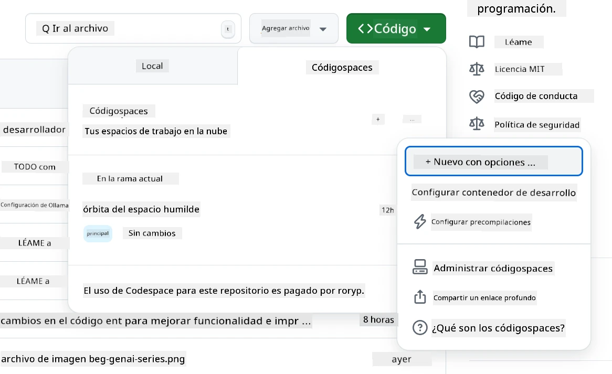
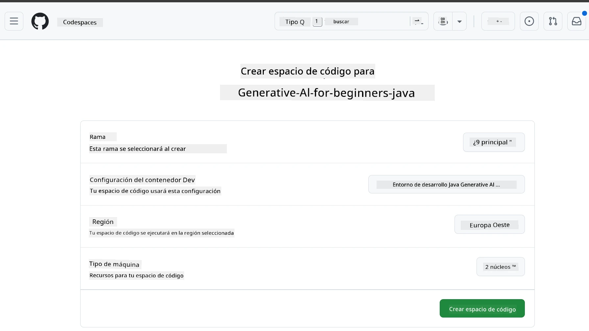
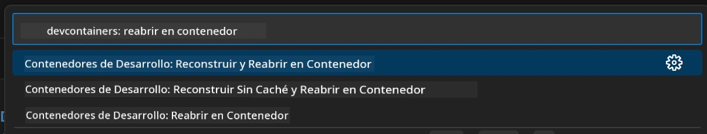
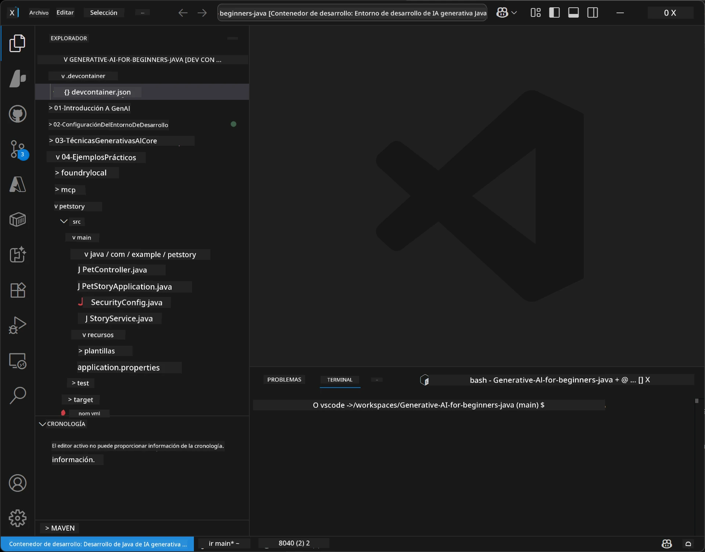
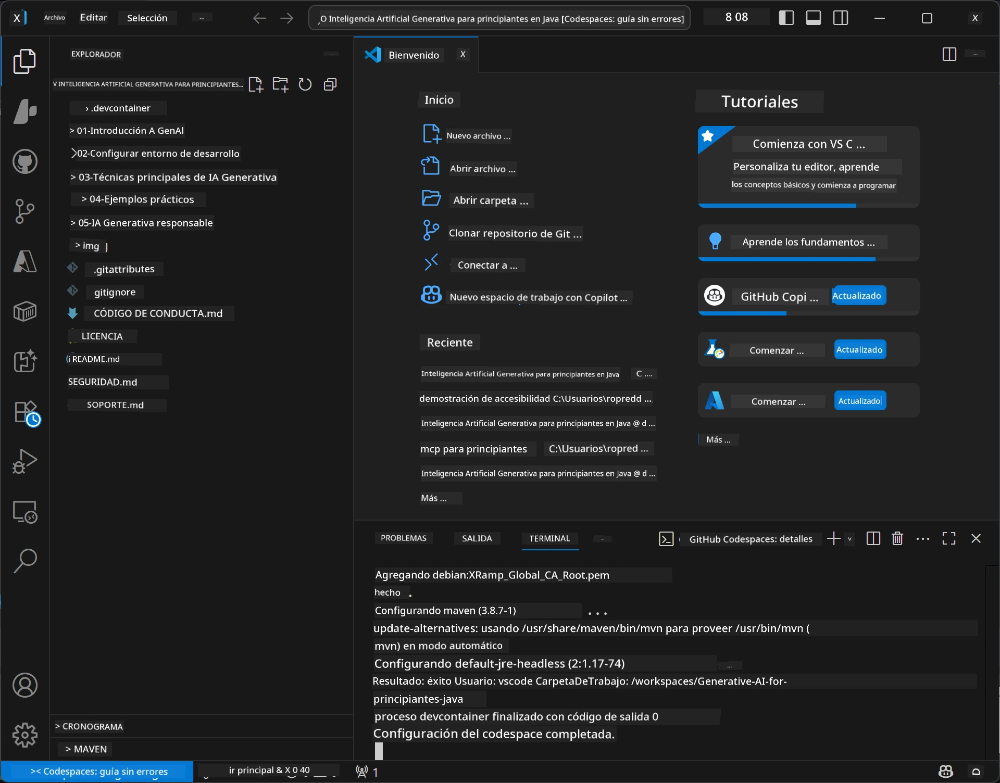

<!--
CO_OP_TRANSLATOR_METADATA:
{
  "original_hash": "96a30d42b9751a3d4e4b20e28d29d459",
  "translation_date": "2026-01-28T04:36:22+00:00",
  "source_file": "02-SetupDevEnvironment/README.md",
  "language_code": "es"
}
-->
# Configuración del Entorno de Desarrollo para Generative AI para Java

> **Inicio rápido**: Programa en la nube en 2 minutos - Salta a [Configuración de GitHub Codespaces](../../../02-SetupDevEnvironment) - ¡no se requiere instalación local y usa modelos de GitHub!

> **¿Interesado en Azure OpenAI?**, consulta nuestra [Guía de configuración de Azure OpenAI](getting-started-azure-openai.md) con pasos para crear un nuevo recurso de Azure OpenAI.

## Lo que aprenderás

- Configurar un entorno de desarrollo Java para aplicaciones de IA
- Elegir y configurar tu entorno de desarrollo preferido (priorizando la nube con Codespaces, contenedor de desarrollo local o configuración local completa)
- Probar tu configuración conectándote a los modelos de GitHub

## Tabla de Contenidos

- [Lo que aprenderás](../../../02-SetupDevEnvironment)
- [Introducción](../../../02-SetupDevEnvironment)
- [Paso 1: Configura tu entorno de desarrollo](../../../02-SetupDevEnvironment)
  - [Opción A: GitHub Codespaces (Recomendado)](../../../02-SetupDevEnvironment)
  - [Opción B: Contenedor de desarrollo local](../../../02-SetupDevEnvironment)
  - [Opción C: Usa tu instalación local existente](../../../02-SetupDevEnvironment)
- [Paso 2: Crea un token de acceso personal de GitHub](../../../02-SetupDevEnvironment)
- [Paso 3: Prueba tu configuración](../../../02-SetupDevEnvironment)
- [Solución de problemas](../../../02-SetupDevEnvironment)
- [Resumen](../../../02-SetupDevEnvironment)
- [Próximos pasos](../../../02-SetupDevEnvironment)

## Introducción

Este capítulo te guiará en la configuración de un entorno de desarrollo. Usaremos **GitHub Models** como nuestro ejemplo principal porque es gratuito, fácil de configurar solo con una cuenta de GitHub, no requiere tarjeta de crédito y ofrece acceso a múltiples modelos para experimentar.

**¡No se requiere configuración local!** Puedes empezar a programar inmediatamente usando GitHub Codespaces, que proporciona un entorno de desarrollo completo en tu navegador.


Recomendamos usar [**GitHub Models**](https://github.com/marketplace?type=models) para este curso porque es:
- **Gratis** para comenzar
- **Fácil** de configurar solo con una cuenta de GitHub
- **No requiere tarjeta de crédito**
- **Múltiples modelos** disponibles para experimentar

> **Nota**: Los modelos de GitHub usados en esta capacitación tienen estos límites gratuitos:
> - 15 solicitudes por minuto (150 por día)
> - ~8,000 palabras de entrada, ~4,000 palabras de salida por solicitud
> - 5 solicitudes concurrentes
> 
> Para uso en producción, actualiza a Azure AI Foundry Models con tu cuenta de Azure. No necesitas cambiar tu código. Consulta la [documentación de Azure AI Foundry](https://learn.microsoft.com/azure/ai-foundry/foundry-models/how-to/quickstart-github-models).


## Paso 1: Configura tu entorno de desarrollo

<a name="quick-start-cloud"></a>

Hemos creado un contenedor de desarrollo preconfigurado para minimizar el tiempo de configuración y asegurarnos de que tengas todas las herramientas necesarias para este curso de Generative AI para Java. Elige tu enfoque preferido de desarrollo:

### Opciones de configuración del entorno:

#### Opción A: GitHub Codespaces (Recomendado)

**¡Comienza a programar en 2 minutos - no se requiere configuración local!**

1. Haz fork de este repositorio en tu cuenta de GitHub
   > **Nota**: Si quieres editar la configuración básica, consulta [Configuración del contenedor de desarrollo](../../../.devcontainer/devcontainer.json)
2. Haz clic en **Code** → pestaña **Codespaces** → **...** → **Nuevo con opciones...**
3. Usa los valores predeterminados – esto seleccionará la **Configuración del contenedor de desarrollo**: **Generative AI Java Development Environment**, un devcontainer personalizado creado para este curso
4. Haz clic en **Crear codespace**
5. Espera ~2 minutos a que el entorno esté listo
6. Continúa con [Paso 2: Crea token de GitHub](../../../02-SetupDevEnvironment)







> **Beneficios de Codespaces**:
> - No requiere instalación local
> - Funciona en cualquier dispositivo con navegador
> - Preconfigurado con todas las herramientas y dependencias
> - 60 horas gratis al mes para cuentas personales
> - Entorno consistente para todos los estudiantes

#### Opción B: Contenedor de desarrollo local

**Para desarrolladores que prefieren desarrollo local con Docker**

1. Haz fork y clona este repositorio en tu máquina local
   > **Nota**: Si quieres editar la configuración básica, consulta [Configuración del contenedor de desarrollo](../../../.devcontainer/devcontainer.json)
2. Instala [Docker Desktop](https://www.docker.com/products/docker-desktop/) y [VS Code](https://code.visualstudio.com/)
3. Instala la [extensión Dev Containers](https://marketplace.visualstudio.com/items?itemName=ms-vscode-remote.remote-containers) en VS Code
4. Abre la carpeta del repositorio en VS Code
5. Cuando se te pida, haz clic en **Reabrir en contenedor** (o usa `Ctrl+Shift+P` → "Dev Containers: Reopen in Container")
6. Espera a que el contenedor se construya y arranque
7. Continúa con [Paso 2: Crea token de GitHub](../../../02-SetupDevEnvironment)





#### Opción C: Usa tu instalación local existente

**Para desarrolladores con entornos Java ya existentes**

Requisitos previos:
- [Java 21+](https://www.oracle.com/java/technologies/javase/jdk21-archive-downloads.html) 
- [Maven 3.9+](https://maven.apache.org/download.cgi)
- [VS Code](https://code.visualstudio.com) o tu IDE preferido

Pasos:
1. Clona este repositorio en tu máquina local
2. Abre el proyecto en tu IDE
3. Continúa con [Paso 2: Crea token de GitHub](../../../02-SetupDevEnvironment)

> **Consejo profesional**: Si tienes un equipo con pocas especificaciones pero quieres VS Code local, ¡usa GitHub Codespaces! Puedes conectar tu VS Code local a un Codespace alojado en la nube para lo mejor de ambos mundos.




## Paso 2: Crea un token de acceso personal de GitHub

1. Navega a [Configuraciones de GitHub](https://github.com/settings/profile) y selecciona **Settings** en el menú de tu perfil.
2. En la barra lateral izquierda, haz clic en **Developer settings** (generalmente al final).
3. Bajo **Personal access tokens**, haz clic en **Fine-grained tokens** (o sigue este enlace directo [link](https://github.com/settings/personal-access-tokens)).
4. Haz clic en **Generate new token**.
5. En "Token name", proporciona un nombre descriptivo (por ejemplo, `GenAI-Java-Course-Token`).
6. Establece una fecha de expiración (recomendado: 7 días por buenas prácticas de seguridad).
7. En "Resource owner", selecciona tu cuenta de usuario.
8. En "Repository access", selecciona los repositorios que quieras usar con GitHub Models (o "All repositories" si es necesario).
9. En "Account permissions", encuentra **Models** y configúralo como **Read-only**.
10. Haz clic en **Generate token**.
11. **Copia y guarda tu token ahora** – ¡no lo verás de nuevo!

> **Consejo de seguridad**: Usa el alcance mínimo requerido y el tiempo de expiración más corto que sea práctico para tus tokens de acceso.

## Paso 3: Prueba tu configuración con el ejemplo de GitHub Models

Una vez que tu entorno de desarrollo esté listo, vamos a probar la integración con GitHub Models usando nuestra aplicación ejemplo en [`02-SetupDevEnvironment/examples/github-models`](../../../02-SetupDevEnvironment/examples/github-models).

1. Abre la terminal en tu entorno de desarrollo.
2. Navega al ejemplo de GitHub Models:
   ```bash
   cd 02-SetupDevEnvironment/examples/github-models
   ```
3. Establece tu token de GitHub como una variable de entorno:
   ```bash
   # macOS/Linux
   export GITHUB_TOKEN=your_token_here
   
   # Windows (Símbolo del sistema)
   set GITHUB_TOKEN=your_token_here
   
   # Windows (PowerShell)
   $env:GITHUB_TOKEN="your_token_here"
   ```

4. Ejecuta la aplicación:
   ```bash
   mvn compile exec:java -Dexec.mainClass="com.example.githubmodels.App"
   ```

Verás una salida similar a:
```text
Using model: gpt-4.1-nano
Sending request to GitHub Models...
Response: Hello World!
```

### Entendiendo el código del ejemplo

Primero, entendamos qué acabamos de ejecutar. El ejemplo en `examples/github-models` usa el SDK Java de OpenAI para conectarse a GitHub Models:

**Lo que hace este código:**
- **Se conecta** a GitHub Models usando tu token de acceso personal
- **Envía** un simple mensaje "Say Hello World!" al modelo de IA
- **Recibe** y muestra la respuesta de la IA
- **Valida** que tu configuración está funcionando correctamente

**Dependencia clave** (en `pom.xml`):
```xml
<dependency>
    <groupId>com.openai</groupId>
    <artifactId>openai-java</artifactId>
    <version>2.12.0</version>
</dependency>
```

**Código principal** (`App.java`):
```java
// Conéctese a los modelos de GitHub usando el SDK de OpenAI para Java
OpenAIClient client = OpenAIOkHttpClient.builder()
    .apiKey(pat)
    .baseUrl("https://models.inference.ai.azure.com")
    .build();

// Crear solicitud de finalización de chat
ChatCompletionCreateParams params = ChatCompletionCreateParams.builder()
    .model(modelId)
    .addSystemMessage("You are a concise assistant.")
    .addUserMessage("Say Hello World!")
    .build();

// Obtener respuesta de IA
ChatCompletion response = client.chat().completions().create(params);
System.out.println("Response: " + response.choices().get(0).message().content().orElse("No response content"));
```

## Resumen

¡Genial! Ahora tienes todo configurado:

- Creaste un token de acceso personal de GitHub con los permisos correctos para acceder a los modelos de IA
- Tu entorno de desarrollo Java está funcionando (ya sea Codespaces, contenedores o local)
- Te conectaste a GitHub Models usando el SDK Java de OpenAI para desarrollo de IA gratis
- Probaste que todo funciona con un ejemplo simple que interactúa con modelos de IA

## Próximos pasos

[Capítulo 3: Técnicas principales de Generative AI](../03-CoreGenerativeAITechniques/README.md)

## Solución de problemas

¿Tienes problemas? Aquí están los problemas comunes y soluciones:

- **¿El token no funciona?** 
  - Asegúrate de haber copiado el token completo sin espacios adicionales
  - Verifica que el token esté correctamente configurado como variable de entorno
  - Confirma que tu token tiene los permisos correctos (Models: Sólo lectura)

- **¿Maven no se encuentra?** 
  - Si usas contenedores dev/Codespaces, Maven debe estar preinstalado
  - Para configuración local, asegúrate de tener Java 21+ y Maven 3.9+ instalados
  - Prueba `mvn --version` para verificar la instalación

- **¿Problemas de conexión?** 
  - Revisa tu conexión a internet
  - Verifica que GitHub sea accesible desde tu red
  - Asegúrate de no estar detrás de un firewall que bloquee el endpoint de GitHub Models

- **¿El contenedor dev no inicia?** 
  - Asegúrate de que Docker Desktop esté en ejecución (para desarrollo local)
  - Intenta reconstruir el contenedor: `Ctrl+Shift+P` → "Dev Containers: Rebuild Container"

- **¿Errores de compilación de la aplicación?**
  - Asegúrate de estar en el directorio correcto: `02-SetupDevEnvironment/examples/github-models`
  - Intenta limpiar y reconstruir: `mvn clean compile`

> **¿Necesitas ayuda?**: ¿Sigues teniendo problemas? Abre un issue en el repositorio y te ayudaremos.

---

<!-- CO-OP TRANSLATOR DISCLAIMER START -->
**Aviso legal**:
Este documento ha sido traducido utilizando el servicio de traducción automática [Co-op Translator](https://github.com/Azure/co-op-translator). Aunque nos esforzamos por la precisión, tenga en cuenta que las traducciones automáticas pueden contener errores o inexactitudes. El documento original en su idioma nativo debe considerarse la fuente autorizada. Para información crítica, se recomienda la traducción profesional realizada por humanos. No nos responsabilizamos por ningún malentendido o interpretación errónea que surja del uso de esta traducción.
<!-- CO-OP TRANSLATOR DISCLAIMER END -->