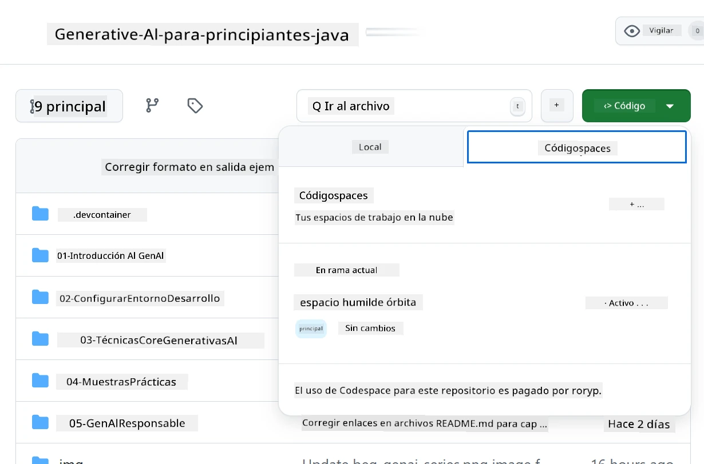

# Configuración del Entorno de Desarrollo para Azure OpenAI

> **Inicio Rápido**: Esta guía es para configurar Azure OpenAI. Para comenzar de inmediato con modelos gratuitos, utiliza [Modelos de GitHub con Codespaces](./README.md#quick-start-cloud).

Esta guía te ayudará a configurar los modelos de Azure AI Foundry para tus aplicaciones de Java AI en este curso.

## Tabla de Contenidos

- [Resumen de Configuración Rápida](../../../02-SetupDevEnvironment)
- [Paso 1: Crear Recursos de Azure AI Foundry](../../../02-SetupDevEnvironment)
  - [Crear un Hub y un Proyecto](../../../02-SetupDevEnvironment)
  - [Desplegar el Modelo GPT-4o-mini](../../../02-SetupDevEnvironment)
- [Paso 2: Crear tu Codespace](../../../02-SetupDevEnvironment)
- [Paso 3: Configurar tu Entorno](../../../02-SetupDevEnvironment)
- [Paso 4: Probar tu Configuración](../../../02-SetupDevEnvironment)
- [¿Qué Sigue?](../../../02-SetupDevEnvironment)
- [Recursos](../../../02-SetupDevEnvironment)
- [Recursos Adicionales](../../../02-SetupDevEnvironment)

## Resumen de Configuración Rápida

1. Crea recursos de Azure AI Foundry (Hub, Proyecto, Modelo)
2. Crea un Codespace con un contenedor de desarrollo para Java
3. Configura tu archivo .env con las credenciales de Azure OpenAI
4. Prueba tu configuración con el proyecto de ejemplo

## Paso 1: Crear Recursos de Azure AI Foundry

### Crear un Hub y un Proyecto

1. Ve al [Portal de Azure AI Foundry](https://ai.azure.com/) e inicia sesión.
2. Haz clic en **+ Crear** → **Nuevo hub** (o navega a **Administración** → **Todos los hubs** → **+ Nuevo hub**).
3. Configura tu hub:
   - **Nombre del hub**: por ejemplo, "MiHubAI"
   - **Suscripción**: Selecciona tu suscripción de Azure
   - **Grupo de recursos**: Crea uno nuevo o selecciona uno existente
   - **Ubicación**: Elige la más cercana a ti
   - **Cuenta de almacenamiento**: Usa la predeterminada o configura una personalizada
   - **Key vault**: Usa el predeterminado o configura uno personalizado
   - Haz clic en **Siguiente** → **Revisar y crear** → **Crear**
4. Una vez creado, haz clic en **+ Nuevo proyecto** (o **Crear proyecto** desde la vista general del hub).
   - **Nombre del proyecto**: por ejemplo, "GenAIJava"
   - Haz clic en **Crear**

### Desplegar el Modelo GPT-4o-mini

1. En tu proyecto, ve a **Catálogo de modelos** y busca **gpt-4o-mini**.
   - *Alternativa: Ve a **Despliegues** → **+ Crear despliegue***
2. Haz clic en **Desplegar** en la tarjeta del modelo gpt-4o-mini.
3. Configura el despliegue:
   - **Nombre del despliegue**: "gpt-4o-mini"
   - **Versión del modelo**: Usa la más reciente
   - **Tipo de despliegue**: Estándar
4. Haz clic en **Desplegar**.
5. Una vez desplegado, ve a la pestaña **Despliegues** y copia estos valores:
   - **Nombre del despliegue** (por ejemplo, "gpt-4o-mini")
   - **URI de destino** (por ejemplo, `https://tu-nombre-hub.openai.azure.com/`)  
      > **Importante**: Copia solo la URL base (por ejemplo, `https://mihub.openai.azure.com/`) y no la ruta completa del endpoint.
   - **Clave** (de la sección Claves y Endpoint)

> **¿Sigues teniendo problemas?** Visita la [Documentación oficial de Azure AI Foundry](https://learn.microsoft.com/azure/ai-foundry/how-to/create-projects?tabs=ai-foundry&pivots=hub-project).

## Paso 2: Crear tu Codespace

1. Haz un fork de este repositorio en tu cuenta de GitHub.
   > **Nota**: Si deseas editar la configuración básica, revisa la [Configuración del Contenedor de Desarrollo](../../../.devcontainer/devcontainer.json).
2. En tu repositorio bifurcado, haz clic en **Code** → pestaña **Codespaces**.
3. Haz clic en **...** → **Nuevo con opciones...**  

4. Selecciona **Configuración del contenedor de desarrollo**: 
   - **Entorno de Desarrollo de Java para Generative AI**
5. Haz clic en **Crear codespace**.

## Paso 3: Configurar tu Entorno

Una vez que tu Codespace esté listo, configura tus credenciales de Azure OpenAI:

1. **Navega al proyecto de ejemplo desde la raíz del repositorio:**
   ```bash
   cd 02-SetupDevEnvironment/examples/basic-chat-azure
   ```

2. **Crea tu archivo .env:**
   ```bash
   cp .env.example .env
   ```

3. **Edita el archivo .env con tus credenciales de Azure OpenAI:**
   ```bash
   # Your Azure OpenAI API key (from Azure AI Foundry portal)
   AZURE_AI_KEY=your-actual-api-key-here
   
   # Your Azure OpenAI endpoint URL (e.g., https://myhub.openai.azure.com/)
   AZURE_AI_ENDPOINT=https://your-hub-name.openai.azure.com/
   ```

   > **Nota de Seguridad**: 
   > - Nunca subas tu archivo `.env` al control de versiones.
   > - El archivo `.env` ya está incluido en `.gitignore`.
   > - Mantén tus claves API seguras y rótalas regularmente.

## Paso 4: Probar tu Configuración

Ejecuta la aplicación de ejemplo para probar tu conexión con Azure OpenAI:

```bash
mvn clean spring-boot:run
```

¡Deberías ver una respuesta del modelo GPT-4o-mini!

> **Usuarios de VS Code**: También puedes presionar `F5` en VS Code para ejecutar la aplicación. La configuración de lanzamiento ya está preparada para cargar automáticamente tu archivo `.env`.

> **Ejemplo completo**: Consulta el [Ejemplo Completo de Azure OpenAI](./examples/basic-chat-azure/README.md) para instrucciones detalladas y solución de problemas.

## ¿Qué Sigue?

**¡Configuración Completa!** Ahora tienes:
- Azure OpenAI con gpt-4o-mini desplegado
- Configuración local del archivo .env
- Entorno de desarrollo para Java listo

**Continúa con** [Capítulo 3: Técnicas Básicas de Generative AI](../03-CoreGenerativeAITechniques/README.md) para comenzar a construir aplicaciones de IA.

## Recursos

- [Documentación de Azure AI Foundry](https://learn.microsoft.com/azure/ai-services/)
- [Documentación de Spring AI Azure OpenAI](https://docs.spring.io/spring-ai/reference/api/clients/azure-openai-chat.html)
- [SDK de Azure OpenAI para Java](https://learn.microsoft.com/java/api/overview/azure/ai-openai-readme)

## Recursos Adicionales

- [Descargar VS Code](https://code.visualstudio.com/Download)
- [Obtener Docker Desktop](https://www.docker.com/products/docker-desktop)
- [Configuración del Contenedor de Desarrollo](../../../.devcontainer/devcontainer.json)

**Descargo de responsabilidad**:  
Este documento ha sido traducido utilizando el servicio de traducción automática [Co-op Translator](https://github.com/Azure/co-op-translator). Aunque nos esforzamos por garantizar la precisión, tenga en cuenta que las traducciones automatizadas pueden contener errores o imprecisiones. El documento original en su idioma nativo debe considerarse como la fuente autorizada. Para información crítica, se recomienda una traducción profesional realizada por humanos. No nos hacemos responsables de malentendidos o interpretaciones erróneas que puedan surgir del uso de esta traducción.