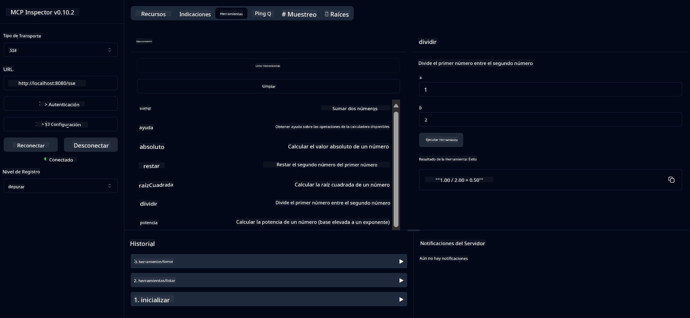

<!--
CO_OP_TRANSLATOR_METADATA:
{
  "original_hash": "5bd7a347d6ed1d706443f9129dd29dd9",
  "translation_date": "2025-07-25T08:42:57+00:00",
  "source_file": "04-PracticalSamples/mcp/calculator/README.md",
  "language_code": "es"
}
-->
# Servicio MCP de Calculadora Básica

>**Nota**: Este capítulo incluye un [**Tutorial**](./TUTORIAL.md) que te guía a través de los ejemplos.

¡Bienvenido a tu primera experiencia práctica con el **Protocolo de Contexto de Modelo (MCP)**! En los capítulos anteriores, aprendiste sobre los fundamentos de la IA generativa y configuraste tu entorno de desarrollo. Ahora es momento de construir algo práctico.

Este servicio de calculadora demuestra cómo los modelos de IA pueden interactuar de manera segura con herramientas externas utilizando MCP. En lugar de depender de las capacidades matemáticas a veces poco confiables del modelo de IA, te mostraremos cómo construir un sistema robusto donde la IA pueda llamar a servicios especializados para realizar cálculos precisos.

## Tabla de Contenidos

- [Lo que Aprenderás](../../../../../04-PracticalSamples/mcp/calculator)
- [Requisitos Previos](../../../../../04-PracticalSamples/mcp/calculator)
- [Conceptos Clave](../../../../../04-PracticalSamples/mcp/calculator)
- [Inicio Rápido](../../../../../04-PracticalSamples/mcp/calculator)
- [Operaciones Disponibles de la Calculadora](../../../../../04-PracticalSamples/mcp/calculator)
- [Clientes de Prueba](../../../../../04-PracticalSamples/mcp/calculator)
  - [1. Cliente MCP Directo (SDKClient)](../../../../../04-PracticalSamples/mcp/calculator)
  - [2. Cliente Potenciado por IA (LangChain4jClient)](../../../../../04-PracticalSamples/mcp/calculator)
- [Inspector MCP (Interfaz Web)](../../../../../04-PracticalSamples/mcp/calculator)
  - [Instrucciones Paso a Paso](../../../../../04-PracticalSamples/mcp/calculator)

## Lo que Aprenderás

Al trabajar con este ejemplo, entenderás:
- Cómo crear servicios compatibles con MCP utilizando Spring Boot
- La diferencia entre la comunicación directa por protocolo y la interacción potenciada por IA
- Cómo los modelos de IA deciden cuándo y cómo usar herramientas externas
- Mejores prácticas para construir aplicaciones de IA habilitadas con herramientas

¡Perfecto para principiantes que están aprendiendo conceptos de MCP y listos para construir su primera integración de herramientas con IA!

## Requisitos Previos

- Java 21+
- Maven 3.6+
- **Token de GitHub**: Necesario para el cliente potenciado por IA. Si aún no lo has configurado, consulta [Capítulo 2: Configuración de tu entorno de desarrollo](../../../02-SetupDevEnvironment/README.md) para obtener instrucciones.

## Conceptos Clave

**Protocolo de Contexto de Modelo (MCP)** es una forma estandarizada para que las aplicaciones de IA se conecten de manera segura a herramientas externas. Piensa en él como un "puente" que permite a los modelos de IA usar servicios externos como nuestra calculadora. En lugar de que el modelo de IA intente hacer cálculos por sí mismo (lo cual puede ser poco confiable), puede llamar a nuestro servicio de calculadora para obtener resultados precisos. MCP asegura que esta comunicación ocurra de manera segura y consistente.

**Eventos Enviados por el Servidor (SSE)** habilitan la comunicación en tiempo real entre el servidor y los clientes. A diferencia de las solicitudes HTTP tradicionales donde preguntas y esperas una respuesta, SSE permite que el servidor envíe actualizaciones continuamente al cliente. Esto es perfecto para aplicaciones de IA donde las respuestas pueden ser transmitidas o tomar tiempo para procesarse.

**Herramientas de IA y Llamadas a Funciones** permiten que los modelos de IA elijan y usen automáticamente funciones externas (como operaciones de calculadora) basándose en las solicitudes del usuario. Cuando preguntas "¿Cuánto es 15 + 27?", el modelo de IA entiende que quieres sumar, llama automáticamente a nuestra herramienta `add` con los parámetros correctos (15, 27) y devuelve el resultado en lenguaje natural. La IA actúa como un coordinador inteligente que sabe cuándo y cómo usar cada herramienta.

## Inicio Rápido

### 1. Navega al directorio de la aplicación de calculadora
```bash
cd Generative-AI-for-beginners-java/04-PracticalSamples/mcp/calculator
```

### 2. Construye y Ejecuta
```bash
mvn clean install -DskipTests
java -jar target/calculator-server-0.0.1-SNAPSHOT.jar
```

### 2. Prueba con Clientes
- **SDKClient**: Interacción directa con el protocolo MCP
- **LangChain4jClient**: Interacción en lenguaje natural potenciada por IA (requiere token de GitHub)

## Operaciones Disponibles de la Calculadora

- `add(a, b)`, `subtract(a, b)`, `multiply(a, b)`, `divide(a, b)`
- `power(base, exponent)`, `squareRoot(number)`, `absolute(number)`
- `modulus(a, b)`, `help()`

## Clientes de Prueba

### 1. Cliente MCP Directo (SDKClient)
Prueba la comunicación cruda del protocolo MCP. Ejecuta con:
```bash
mvn test-compile exec:java -Dexec.mainClass="com.microsoft.mcp.sample.client.SDKClient" -Dexec.classpathScope=test
```

### 2. Cliente Potenciado por IA (LangChain4jClient)
Demuestra la interacción en lenguaje natural con modelos de GitHub. Requiere token de GitHub (consulta [Requisitos Previos](../../../../../04-PracticalSamples/mcp/calculator)).

**Ejecuta:**
```bash
mvn test-compile exec:java -Dexec.mainClass="com.microsoft.mcp.sample.client.LangChain4jClient" -Dexec.classpathScope=test
```

## Inspector MCP (Interfaz Web)

El Inspector MCP proporciona una interfaz web visual para probar tu servicio MCP sin necesidad de escribir código. ¡Perfecto para principiantes que quieren entender cómo funciona MCP!

### Instrucciones Paso a Paso:

1. **Inicia el servidor de calculadora** (si no está ya en ejecución):
   ```bash
   java -jar target/calculator-server-0.0.1-SNAPSHOT.jar
   ```

2. **Instala y ejecuta el Inspector MCP** en una nueva terminal:
   ```bash
   npx @modelcontextprotocol/inspector
   ```

3. **Abre la interfaz web**:
   - Busca un mensaje como "Inspector ejecutándose en http://localhost:6274"
   - Abre esa URL en tu navegador web

4. **Conéctate a tu servicio de calculadora**:
   - En la interfaz web, configura el tipo de transporte como "SSE"
   - Configura la URL como: `http://localhost:8080/sse`
   - Haz clic en el botón "Conectar"

5. **Explora las herramientas disponibles**:
   - Haz clic en "Listar Herramientas" para ver todas las operaciones de la calculadora
   - Verás funciones como `add`, `subtract`, `multiply`, etc.

6. **Prueba una operación de la calculadora**:
   - Selecciona una herramienta (por ejemplo, "add")
   - Ingresa los parámetros (por ejemplo, `a: 15`, `b: 27`)
   - Haz clic en "Ejecutar Herramienta"
   - Observa el resultado devuelto por tu servicio MCP.

Este enfoque visual te ayuda a entender exactamente cómo funciona la comunicación MCP antes de construir tus propios clientes.



---
**Referencia:** [Documentación de MCP Server Boot Starter](https://docs.spring.io/spring-ai/reference/api/mcp/mcp-server-boot-starter-docs.html)

**Descargo de responsabilidad**:  
Este documento ha sido traducido utilizando el servicio de traducción automática [Co-op Translator](https://github.com/Azure/co-op-translator). Si bien nos esforzamos por lograr precisión, tenga en cuenta que las traducciones automáticas pueden contener errores o imprecisiones. El documento original en su idioma nativo debe considerarse como la fuente autorizada. Para información crítica, se recomienda una traducción profesional realizada por humanos. No nos hacemos responsables de malentendidos o interpretaciones erróneas que puedan surgir del uso de esta traducción.