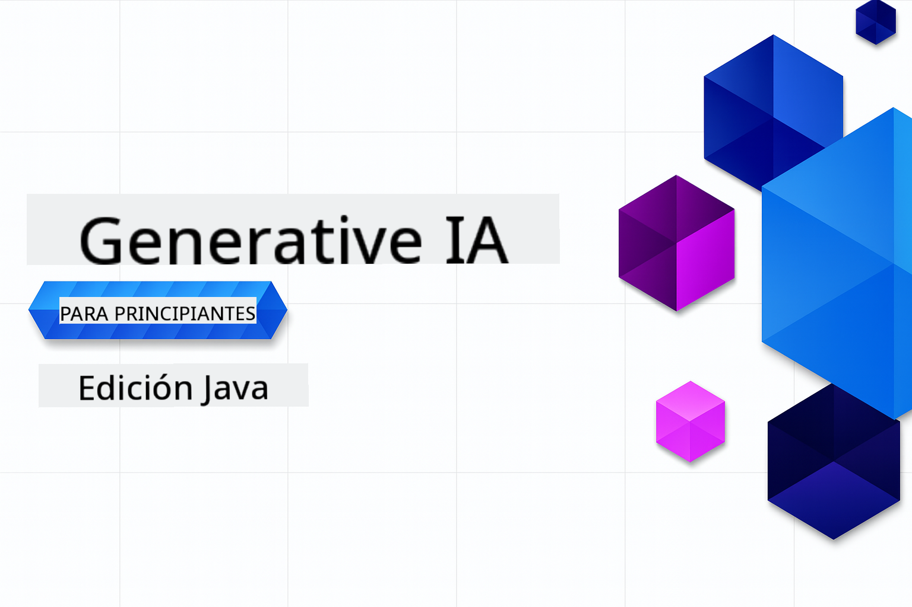

<!--
CO_OP_TRANSLATOR_METADATA:
{
  "original_hash": "2ee0f50497c11d1941347ac61fb017a9",
  "translation_date": "2025-07-21T15:53:39+00:00",
  "source_file": "README.md",
  "language_code": "es"
}
-->
# Generative AI para Principiantes - Edición Java

> **NOTE: Inicio Rápido**: ¡Todo el curso se puede realizar en línea, sin necesidad de configuración local!
1. Haz un fork de este repositorio en tu cuenta de GitHub
2. Haz clic en **Code** → pestaña **Codespaces** → **...** → **New with options...**
3. Usa los valores predeterminados: esto seleccionará el contenedor de desarrollo creado para este curso
4. Haz clic en **Create codespace**
5. Espera ~2 minutos para que el entorno esté listo
6. Ve directamente a [Crear tu Token de Modelos de GitHub](./02-SetupDevEnvironment/README.md#step-2-create-a-github-personal-access-token)

## Soporte Multilingüe

### Soportado a través de GitHub Action (Automatizado y Siempre Actualizado)

[Francés](../fr/README.md) | [Español](./README.md) | [Alemán](../de/README.md) | [Ruso](../ru/README.md) | [Árabe](../ar/README.md) | [Persa (Farsi)](../fa/README.md) | [Urdu](../ur/README.md) | [Chino (Simplificado)](../zh/README.md) | [Chino (Tradicional, Macao)](../mo/README.md) | [Chino (Tradicional, Hong Kong)](../hk/README.md) | [Chino (Tradicional, Taiwán)](../tw/README.md) | [Japonés](../ja/README.md) | [Coreano](../ko/README.md) | [Hindi](../hi/README.md) | [Bengalí](../bn/README.md) | [Maratí](../mr/README.md) | [Nepalí](../ne/README.md) | [Panyabí (Gurmukhi)](../pa/README.md) | [Portugués (Portugal)](../pt/README.md) | [Portugués (Brasil)](../br/README.md) | [Italiano](../it/README.md) | [Polaco](../pl/README.md) | [Turco](../tr/README.md) | [Griego](../el/README.md) | [Tailandés](../th/README.md) | [Sueco](../sv/README.md) | [Danés](../da/README.md) | [Noruego](../no/README.md) | [Finlandés](../fi/README.md) | [Holandés](../nl/README.md) | [Hebreo](../he/README.md) | [Vietnamita](../vi/README.md) | [Indonesio](../id/README.md) | [Malayo](../ms/README.md) | [Tagalo (Filipino)](../tl/README.md) | [Suajili](../sw/README.md) | [Húngaro](../hu/README.md) | [Checo](../cs/README.md) | [Eslovaco](../sk/README.md) | [Rumano](../ro/README.md) | [Búlgaro](../bg/README.md) | [Serbio (Cirílico)](../sr/README.md) | [Croata](../hr/README.md) | [Esloveno](../sl/README.md) | [Ucraniano](../uk/README.md) | [Birmano (Myanmar)](../my/README.md)

## Estructura del Curso y Ruta de Aprendizaje

**Compromiso de Tiempo**: La configuración del entorno toma 2 minutos, y los tutoriales prácticos requieren de 1 a 3 horas cada uno, dependiendo de la profundidad de exploración.

### **Capítulo 1: Introducción a la Generative AI**
- **Conceptos Básicos**: Comprender los Modelos de Lenguaje Extenso, tokens, embeddings y capacidades de IA
- **Ecosistema de IA en Java**: Resumen de Spring AI y OpenAI SDKs
- **Protocolo de Contexto del Modelo**: Introducción al MCP y su papel en la comunicación de agentes de IA
- **Aplicaciones Prácticas**: Escenarios del mundo real, incluyendo chatbots y generación de contenido
- **[→ Comenzar el Capítulo 1](./01-IntroToGenAI/README.md)**

### **Capítulo 2: Configuración del Entorno de Desarrollo**
- **Configuración Multi-Proveedor**: Configura integraciones de GitHub Models, Azure OpenAI y OpenAI Java SDK
- **Spring Boot + Spring AI**: Mejores prácticas para el desarrollo de aplicaciones empresariales de IA
- **GitHub Models**: Acceso gratuito a modelos de IA para prototipos y aprendizaje (sin necesidad de tarjeta de crédito)
- **Herramientas de Desarrollo**: Configuración de contenedores Docker, VS Code y GitHub Codespaces
- **[→ Comenzar el Capítulo 2](./02-SetupDevEnvironment/README.md)**

### **Capítulo 3: Técnicas Básicas de Generative AI**
- **Ingeniería de Prompts**: Técnicas para obtener respuestas óptimas de los modelos de IA
- **Embeddings y Operaciones Vectoriales**: Implementar búsqueda semántica y coincidencia de similitud
- **Generación Aumentada por Recuperación (RAG)**: Combina IA con tus propias fuentes de datos
- **Llamadas a Funciones**: Extiende las capacidades de IA con herramientas y plugins personalizados
- **[→ Comenzar el Capítulo 3](./03-CoreGenerativeAITechniques/README.md)**

### **Capítulo 4: Aplicaciones Prácticas y Proyectos**
- **Generador de Historias de Mascotas** (`petstory/`): Generación creativa de contenido con GitHub Models
- **Demo Local de Foundry** (`foundrylocal/`): Integración de modelos de IA locales con OpenAI Java SDK
- **Servicio de Calculadora MCP** (`mcp/calculator/`): Implementación básica del Protocolo de Contexto del Modelo con Spring AI
- **[→ Comenzar el Capítulo 4](./04-PracticalSamples/README.md)**

### **Capítulo 5: Desarrollo Responsable de IA**
- **Seguridad en GitHub Models**: Prueba de los filtros de contenido y mecanismos de seguridad integrados
- **Demo de IA Responsable**: Ejemplo práctico que muestra cómo funcionan los filtros de seguridad de IA
- **Mejores Prácticas**: Pautas esenciales para el desarrollo y despliegue ético de IA
- **[→ Comenzar el Capítulo 5](./05-ResponsibleGenAI/README.md)**

## Recursos Adicionales 

- [AI Agents For Beginners](https://github.com/microsoft/ai-agents-for-beginners)
- [Generative AI for Beginners using .NET](https://github.com/microsoft/Generative-AI-for-beginners-dotnet)
- [Generative AI for Beginners using JavaScript](https://github.com/microsoft/generative-ai-with-javascript)
- [Generative AI for Beginners](https://github.com/microsoft/generative-ai-for-beginners)
- [ML for Beginners](https://aka.ms/ml-beginners)
- [Data Science for Beginners](https://aka.ms/datascience-beginners)
- [AI for Beginners](https://aka.ms/ai-beginners)
- [Cybersecurity for Beginners](https://github.com/microsoft/Security-101)
- [Web Dev for Beginners](https://aka.ms/webdev-beginners)
- [IoT for Beginners](https://aka.ms/iot-beginners)
- [XR Development for Beginners](https://github.com/microsoft/xr-development-for-beginners)
- [Mastering GitHub Copilot for AI Paired Programming](https://aka.ms/GitHubCopilotAI)
- [Mastering GitHub Copilot for C#/.NET Developers](https://github.com/microsoft/mastering-github-copilot-for-dotnet-csharp-developers)
- [Choose Your Own Copilot Adventure](https://github.com/microsoft/CopilotAdventures)
- [RAG Chat App with Azure AI Services](https://github.com/Azure-Samples/azure-search-openai-demo-java)

**Descargo de responsabilidad**:  
Este documento ha sido traducido utilizando el servicio de traducción automática [Co-op Translator](https://github.com/Azure/co-op-translator). Aunque nos esforzamos por garantizar la precisión, tenga en cuenta que las traducciones automatizadas pueden contener errores o imprecisiones. El documento original en su idioma nativo debe considerarse como la fuente autorizada. Para información crítica, se recomienda una traducción profesional realizada por humanos. No nos hacemos responsables de malentendidos o interpretaciones erróneas que puedan surgir del uso de esta traducción.