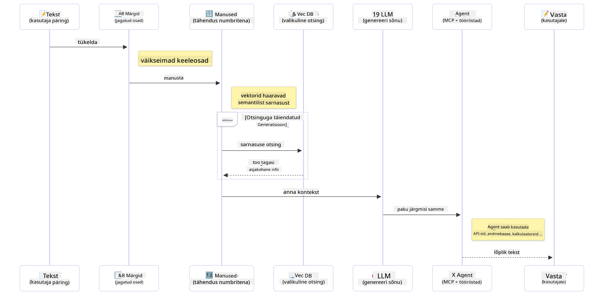

<!--
CO_OP_TRANSLATOR_METADATA:
{
  "original_hash": "75bfb080ca725e8a9aa9c80cae25fba1",
  "translation_date": "2025-10-11T10:49:08+00:00",
  "source_file": "01-IntroToGenAI/README.md",
  "language_code": "et"
}
-->
# Generatiivse tehisintellekti sissejuhatus - Java väljaanne

## Mida sa õpid

- **Generatiivse tehisintellekti põhialused**, sealhulgas LLM-id, promptide inseneeria, tokenid, embeddingud ja vektoriandmebaasid
- **Võrdle Java tehisintellekti arendustööriistu**, sealhulgas Azure OpenAI SDK, Spring AI ja OpenAI Java SDK
- **Tutvu Model Context Protocoliga** ja selle rolliga tehisintellekti agentide suhtluses

## Sisukord

- [Sissejuhatus](../../../01-IntroToGenAI)
- [Kiire ülevaade generatiivse tehisintellekti mõistetest](../../../01-IntroToGenAI)
- [Promptide inseneeria ülevaade](../../../01-IntroToGenAI)
- [Tokenid, embeddingud ja agendid](../../../01-IntroToGenAI)
- [Tehisintellekti arendustööriistad ja -raamatukogud Java jaoks](../../../01-IntroToGenAI)
  - [OpenAI Java SDK](../../../01-IntroToGenAI)
  - [Spring AI](../../../01-IntroToGenAI)
  - [Azure OpenAI Java SDK](../../../01-IntroToGenAI)
- [Kokkuvõte](../../../01-IntroToGenAI)
- [Järgmised sammud](../../../01-IntroToGenAI)

## Sissejuhatus

Tere tulemast generatiivse tehisintellekti algajate kursuse esimesse peatükki - Java väljaanne! See sissejuhatav õppetund tutvustab sulle generatiivse tehisintellekti põhikontseptsioone ja nende kasutamist Java abil. Sa õpid tundma tehisintellekti rakenduste olulisi ehituskive, sealhulgas suured keelemudelid (LLM-id), tokenid, embeddingud ja tehisintellekti agendid. Samuti uurime peamisi Java tööriistu, mida selles kursuses kasutad.

### Kiire ülevaade generatiivse tehisintellekti mõistetest

Generatiivne tehisintellekt on tehisintellekti tüüp, mis loob uut sisu, näiteks teksti, pilte või koodi, tuginedes andmetest õpitud mustritele ja seostele. Generatiivsed tehisintellekti mudelid suudavad genereerida inimlikke vastuseid, mõista konteksti ja mõnikord isegi luua sisu, mis tundub inimlik.

Java tehisintellekti rakenduste arendamisel töötad **generatiivsete tehisintellekti mudelitega**, et luua sisu. Generatiivse tehisintellekti mudelite mõned võimed hõlmavad:

- **Teksti genereerimine**: Inimlikult kõlava teksti loomine vestlusrobotite, sisu ja tekstide täiendamise jaoks.
- **Piltide genereerimine ja analüüs**: Realistlike piltide loomine, fotode täiustamine ja objektide tuvastamine.
- **Koodi genereerimine**: Koodilõikude või skriptide kirjutamine.

On olemas spetsiaalseid mudeleid, mis on optimeeritud erinevate ülesannete jaoks. Näiteks nii **väikesed keelemudelid (SLM-id)** kui ka **suured keelemudelid (LLM-id)** suudavad teostada teksti genereerimist, kusjuures LLM-id pakuvad tavaliselt keerukamate ülesannete jaoks paremat jõudlust. Piltidega seotud ülesannete jaoks kasutatakse spetsiaalseid visuaalseid mudeleid või multimodaalseid mudeleid.

Muidugi ei ole nende mudelite vastused alati täiuslikud. Oled ilmselt kuulnud, et mudelid võivad "hallutsineerida" või esitada ekslikku teavet autoriteetsel viisil. Kuid sa saad aidata mudelil paremaid vastuseid genereerida, andes sellele selgeid juhiseid ja konteksti. Siin tulebki mängu **promptide inseneeria**.

#### Promptide inseneeria ülevaade

Promptide inseneeria on praktika, mille eesmärk on kujundada tõhusad sisendid, et suunata tehisintellekti mudeleid soovitud väljundite poole. See hõlmab:

- **Selgus**: Tee juhised selgeks ja ühemõtteliseks.
- **Kontekst**: Paku vajalikku taustteavet.
- **Piirangud**: Määra kõik piirangud või formaadid.

Mõned parimad tavad promptide inseneerias hõlmavad promptide kujundamist, selgeid juhiseid, ülesannete jaotamist, ühe- ja vähese näitega õppimist ning promptide häälestamist. Erinevate promptide testimine on oluline, et leida, mis sinu konkreetse kasutusjuhtumi jaoks kõige paremini töötab.

Rakenduste arendamisel töötad erinevat tüüpi promptidega:
- **Süsteemi promptid**: Määravad mudeli käitumise põhireeglid ja konteksti
- **Kasutaja promptid**: Sinu rakenduse kasutajate sisendandmed
- **Assistendi promptid**: Mudeli vastused, mis põhinevad süsteemi ja kasutaja promptidel

> **Loe rohkem**: Loe rohkem promptide inseneeriast [GenAI algajate kursuse Promptide inseneeria peatükis](https://github.com/microsoft/generative-ai-for-beginners/tree/main/04-prompt-engineering-fundamentals)

#### Tokenid, embeddingud ja agendid

Generatiivsete tehisintellekti mudelitega töötades puutud kokku selliste mõistetega nagu **tokenid**, **embeddingud**, **agendid** ja **Model Context Protocol (MCP)**. Siin on nende mõistete üksikasjalik ülevaade:

- **Tokenid**: Tokenid on mudeli jaoks väikseimad tekstiosad. Need võivad olla sõnad, tähed või osasõnad. Tokenid esindavad tekstandmeid formaadis, millest mudel aru saab. Näiteks lause "The quick brown fox jumped over the lazy dog" võib tokeniseerida järgmiselt: ["The", " quick", " brown", " fox", " jumped", " over", " the", " lazy", " dog"] või ["The", " qu", "ick", " br", "own", " fox", " jump", "ed", " over", " the", " la", "zy", " dog"], sõltuvalt tokeniseerimisstrateegiast.

Tokeniseerimine on protsess, mille käigus tekst jagatakse väiksemateks osadeks. See on oluline, kuna mudelid töötavad tokenitega, mitte toortekstiga. Tokenite arv promptis mõjutab mudeli vastuse pikkust ja kvaliteeti, kuna mudelitel on kontekstiakna jaoks tokenite piirangud (nt GPT-4o puhul 128K tokenit, mis hõlmab nii sisendit kui ka väljundit).

  Javas saad kasutada näiteks OpenAI SDK-d, et tokeniseerimist automaatselt hallata, kui saadad päringuid tehisintellekti mudelitele.

- **Embeddingud**: Embeddingud on tokenite vektorilised esitlused, mis hõlmavad semantilist tähendust. Need on numbrilised esitused (tavaliselt ujukomaarvude massiivid), mis võimaldavad mudelitel mõista sõnade vahelisi seoseid ja genereerida konteksti arvestavaid vastuseid. Sarnastel sõnadel on sarnased embeddingud, mis võimaldab mudelil mõista sünonüüme ja semantilisi seoseid.

  Javas saad embeddinguid genereerida OpenAI SDK või muude embeddingute genereerimist toetavate raamatukogude abil. Need embeddingud on olulised selliste ülesannete jaoks nagu semantiline otsing, kus soovid leida sarnast sisu tähenduse, mitte täpse tekstivastavuse põhjal.

- **Vektoriandmebaasid**: Vektoriandmebaasid on spetsiaalsed salvestussüsteemid, mis on optimeeritud embeddingute jaoks. Need võimaldavad tõhusat sarnasuse otsingut ja on olulised RAG (Retrieval-Augmented Generation) mustrite jaoks, kus on vaja leida asjakohast teavet suurtest andmekogumitest semantilise sarnasuse, mitte täpse vastavuse alusel.

> **Märkus**: Selles kursuses me vektoriandmebaase ei käsitle, kuid need on mainimist väärt, kuna neid kasutatakse sageli päriselu rakendustes.

- **Agendid ja MCP**: Tehisintellekti komponendid, mis suhtlevad iseseisvalt mudelite, tööriistade ja väliste süsteemidega. Model Context Protocol (MCP) pakub standardiseeritud viisi agentidele, et turvaliselt juurde pääseda välistele andmeallikatele ja tööriistadele. Loe rohkem meie [MCP algajatele](https://github.com/microsoft/mcp-for-beginners) kursusest.

Java tehisintellekti rakendustes kasutad tokeneid tekstide töötlemiseks, embeddinguid semantilise otsingu ja RAG jaoks, vektoriandmebaase andmete leidmiseks ning agente koos MCP-ga intelligentsete, tööriistu kasutavate süsteemide loomiseks.

### Tehisintellekti arendustööriistad ja -raamatukogud Java jaoks

Java pakub suurepäraseid tööriistu tehisintellekti arendamiseks. Selles kursuses uurime kolme peamist raamatukogu - OpenAI Java SDK, Azure OpenAI SDK ja Spring AI.

Siin on kiire võrdlustabel, mis näitab, millist SDK-d kasutatakse iga peatüki näidetes:

| Peatükk | Näide | SDK |
|---------|-------|-----|
| 02-SetupDevEnvironment | github-models | OpenAI Java SDK |
| 02-SetupDevEnvironment | basic-chat-azure | Spring AI Azure OpenAI |
| 03-CoreGenerativeAITechniques | näited | Azure OpenAI SDK |
| 04-PracticalSamples | petstory | OpenAI Java SDK |
| 04-PracticalSamples | foundrylocal | OpenAI Java SDK |
| 04-PracticalSamples | calculator | Spring AI MCP SDK + LangChain4j |

**SDK dokumentatsiooni lingid:**
- [Azure OpenAI Java SDK](https://github.com/Azure/azure-sdk-for-java/tree/azure-ai-openai_1.0.0-beta.16/sdk/openai/azure-ai-openai)
- [Spring AI](https://docs.spring.io/spring-ai/reference/)
- [OpenAI Java SDK](https://github.com/openai/openai-java)
- [LangChain4j](https://docs.langchain4j.dev/)

#### OpenAI Java SDK

OpenAI SDK on OpenAI API ametlik Java raamatukogu. See pakub lihtsat ja ühtset liidest OpenAI mudelitega suhtlemiseks, muutes tehisintellekti võimaluste integreerimise Java rakendustesse lihtsaks. 2. peatüki GitHubi mudelite näide, 4. peatüki Pet Story rakendus ja Foundry Local näide demonstreerivad OpenAI SDK lähenemist.

#### Spring AI

Spring AI on terviklik raamistik, mis toob tehisintellekti võimalused Springi rakendustesse, pakkudes ühtset abstraktsioonikihti erinevate tehisintellekti pakkujate vahel. See integreerub sujuvalt Springi ökosüsteemiga, muutes selle ideaalseks valikuks ettevõtte Java rakendustele, mis vajavad tehisintellekti võimalusi.

Spring AI tugevus seisneb selle sujuvas integreerimises Springi ökosüsteemiga, mis muudab tootmiskõlblike tehisintellekti rakenduste loomise lihtsaks, kasutades tuttavaid Springi mustreid, nagu sõltuvuste süstimine, konfiguratsioonihaldus ja testimisraamistikud. Kasutad Spring AI-d 2. ja 4. peatükis, et luua rakendusi, mis kasutavad nii OpenAI kui ka Model Context Protocol (MCP) Spring AI raamatukogusid.

##### Model Context Protocol (MCP)

[Model Context Protocol (MCP)](https://modelcontextprotocol.io/) on uus standard, mis võimaldab tehisintellekti rakendustel turvaliselt suhelda väliste andmeallikate ja tööriistadega. MCP pakub standardiseeritud viisi, kuidas tehisintellekti mudelid saavad juurdepääsu kontekstuaalsele teabele ja täita toiminguid sinu rakendustes.

4. peatükis ehitad lihtsa MCP kalkulaatoriteenuse, mis demonstreerib Model Context Protocoli põhialuseid Spring AI abil, näidates, kuidas luua põhilisi tööriistade integreerimisi ja teenuse arhitektuure.

#### Azure OpenAI Java SDK

Azure OpenAI kliendiraamatukogu Java jaoks on OpenAI REST API-de kohandatud versioon, mis pakub idiomaatilist liidest ja integreerub ülejäänud Azure SDK ökosüsteemiga. 3. peatükis ehitad rakendusi, kasutades Azure OpenAI SDK-d, sealhulgas vestlusrakendusi, funktsioonikutsumisi ja RAG (Retrieval-Augmented Generation) mustreid.

> Märkus: Azure OpenAI SDK jääb funktsioonide osas OpenAI Java SDK-le alla, seega tulevaste projektide jaoks kaalu OpenAI Java SDK kasutamist.

## Kokkuvõte

Sellega on alused kaetud! Nüüd mõistad:

- Generatiivse tehisintellekti põhikontseptsioone - alates LLM-idest ja promptide inseneeriast kuni tokenite, embeddingute ja vektoriandmebaasideni
- Oma tööriistakomplekti valikuid Java tehisintellekti arenduseks: Azure OpenAI SDK, Spring AI ja OpenAI Java SDK
- Mis on Model Context Protocol ja kuidas see võimaldab tehisintellekti agentidel töötada väliste tööriistadega

## Järgmised sammud

[2. peatükk: Arenduskeskkonna seadistamine](../02-SetupDevEnvironment/README.md)

---

**Lahtiütlus**:  
See dokument on tõlgitud AI tõlketeenuse [Co-op Translator](https://github.com/Azure/co-op-translator) abil. Kuigi püüame tagada täpsust, palume arvestada, et automaatsed tõlked võivad sisaldada vigu või ebatäpsusi. Algne dokument selle algses keeles tuleks pidada autoriteetseks allikaks. Olulise teabe puhul soovitame kasutada professionaalset inimtõlget. Me ei vastuta selle tõlke kasutamisest tulenevate arusaamatuste või valesti tõlgenduste eest.