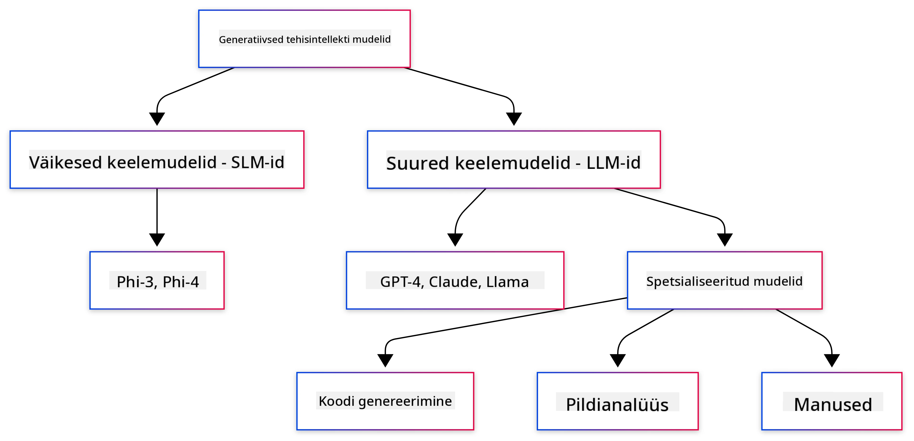
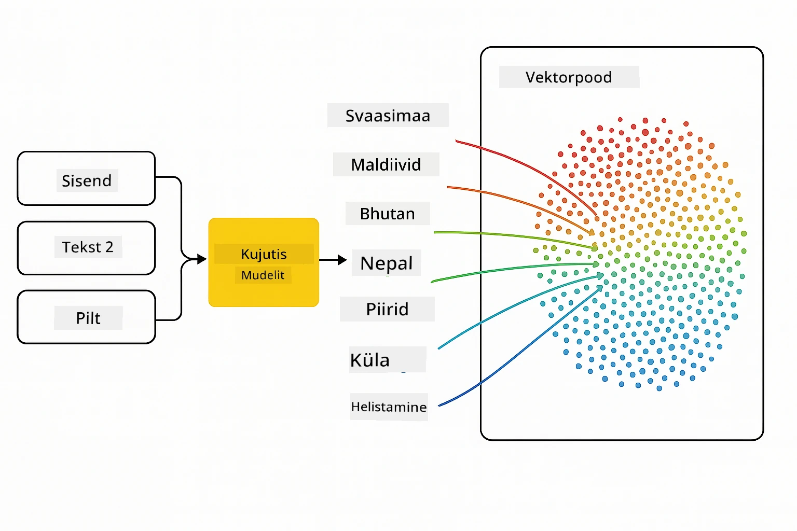
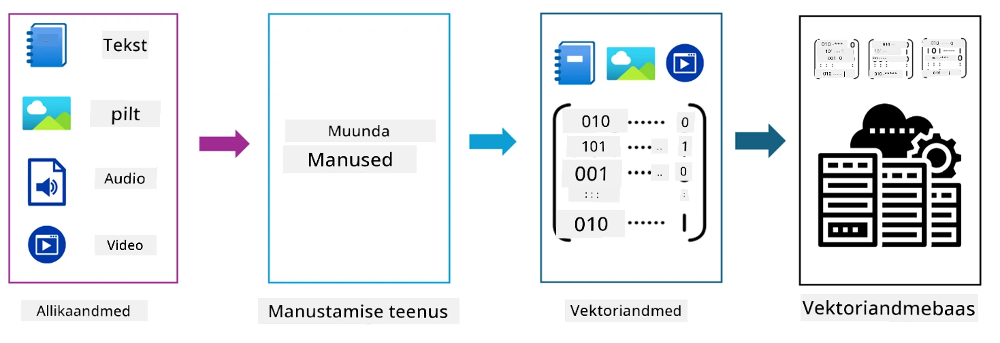
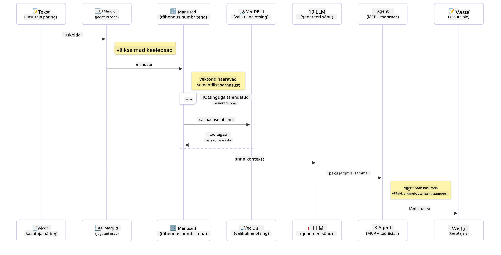

# Sissejuhatus generatiivse tehisintellekti - Java väljaanne

> **Video**: [Vaata selle õppetüki videoülevaadet YouTube'is.](https://www.youtube.com/watch?v=XH46tGp_eSw) Võid ka ülalolevale pisipildile klõpsata.

## Mida sa õpid

- **Generatiivse tehisintellekti alused** sealhulgas LLM-id, prompti inseneritöö, tokenid, embeddingud ja vektorandmebaasid
- **Java AI arendustööriistade võrdlus** sealhulgas Azure OpenAI SDK, Spring AI ja OpenAI Java SDK
- **Mudelikonteksti protokolli avastamine** ja selle roll AI agentide suhtluses

## Sisukord

- [Sissejuhatus](#sissejuhatus)
- [Kiire värskendus generatiivse tehisintellekti kontseptsioonidele](#kiire-värskendus-generatiivse-tehisintellekti-kontseptsioonidele)
- [Prompti inseneritöö ülevaade](#prompti-inseneritöö-ülevaade)
- [Tokenid, embeddingud ja agendid](#tokenid-embeddingud-ja-agendid)
- [AI arendustööriistad ja -raamatukogud Javale](#ai-arendustööriistad-ja-raamatukogud-javale)
  - [OpenAI Java SDK](#openai-java-sdk)
  - [Spring AI](#spring-ai)
  - [Azure OpenAI Java SDK](#azure-openai-java-sdk)
- [Kokkuvõte](#kokkuvõte)
- [Järgmised sammud](#järgmised-sammud)

## Sissejuhatus

Tere tulemast Generatiivse tehisintellekti algajatele esimese peatüki juurde - Java väljaanne! See põhjalik õppetükk tutvustab sulle generatiivse tehisintellekti keskseid mõisteid ja seda, kuidas nendega Java abil töötada. Õpid tehisintellekti rakenduste põhikomponentide kohta, sealhulgas suured keelemudelid (LLM-id), tokenid, embeddingud ja AI agendid. Samuti uurime peamisi Java tööriistu, mida selle kursuse jooksul kasutad.

### Kiire värskendus generatiivse tehisintellekti kontseptsioonidele

Generatiivne tehisintellekt on tehisintellekti tüüp, mis loob uut sisu, nagu tekst, pildid või kood, andmetest õpitud mustrite ja seoste põhjal. Generatiivse AI mudelid suudavad luua inimliku kõlaga vastuseid, mõista konteksti ja mõnikord isegi genereerida sisu, mis näib inimliku olevat.

Java AI rakendusi arendades töötad **generatiivsete AI mudelitega**, et sisu luua. Mõned generatiivsete AI mudelite võimed on:

- **Teksti genereerimine**: Inimliku kõlaga teksti loomine vestlusrobotitele, sisule ja teksti täiendamiseks.
- **Pildi loomine ja analüüs**: Realistlike piltide tootmine, fotode täiustamine ja objektide tuvastamine.
- **Koodi genereerimine**: Koodilõikude või skriptide kirjutamine.

On olemas erinevaid mudeleid, mis on optimeeritud erinevateks ülesanneteks. Näiteks nii **väikesed keelemudelid (SLM-id)** kui ka **suured keelemudelid (LLM-id)** suudavad teksti genereerida, kusjuures LLM-id pakuvad tavaliselt paremat sooritust keerukamates ülesannetes. Pildiga seotud ülesannete jaoks kasutaksid spetsialiseeritud nägemismudeleid või multimodaalseid mudeleid.

Loomulikult ei ole mudelite vastused alati täiuslikud. Sa oled tõenäoliselt kuulnud mudelitest, kes "hallutsineerivad" või genereerivad valesid andmeid autoriteetselt. Kuid sa saad aidata mudelil paremaid vastuseid genereerida, andes neile selged juhised ja konteksti. Siin tulebki mängu **prompti inseneritöö**.

#### Prompti inseneritöö ülevaade

Prompti inseneritöö on efektiivsete sisendite kavandamine, et suunata AI mudeleid soovitud väljundite poole. See hõlmab:

- **Selgus**: Juhiste muutmine selgeteks ja ühemõttelisteks.
- **Kontekst**: Vajalik taustateabe esitamine.
- **Piirangud**: Mis tahes piirangute või formaatide määramine.

Parimad praktikad prompti inseneritöös hõlmavad prompti kavandamist, selgeid juhiseid, ülesande jagamist, ühe- ja väheseandmelist õppimist ning promptide häälestamist. Erinevate promptide testimine on hädavajalik, et leida, mis sinu konkreetse kasutusjuhtumi jaoks kõige paremini toimib.

Rakendusi arendades töötad erinevate promptide tüüpidega:
- **Süsteemi promptid**: Määravad mudeleid käitumise põhireeglid ja konteksti
- **Kasutajapromptid**: Sinu rakenduse kasutajate sisendandmed
- **Assisteerivad promptid**: Mudeli vastused süsteemi ja kasutajapromptide põhjal

> **Õpi rohkem**: Lisateavet prompti inseneritöö kohta leiad [GenAI algajate kursuse peatükist "Prompt Engineering"](https://github.com/microsoft/generative-ai-for-beginners/tree/main/04-prompt-engineering-fundamentals)

#### Tokenid, embeddingud ja agendid

Generatiivsete AI mudelitega töötades kohtad termineid nagu **tokenid**, **embeddingud**, **agendid** ja **Mudelikonteksti protokoll (MCP)**. Siin on neile mõistetele detailne ülevaade:

- **Tokenid**: Tokenid on mudelis teksti väikseimad üksused. Need võivad olla sõnad, tähemärgid või alam-sõnad. Tokenid esindavad teksti andmeid vormingus, mida mudel suudab mõista. Näiteks lause "The quick brown fox jumped over the lazy dog" võiks tokeniseerida nii ["The", " quick", " brown", " fox", " jumped", " over", " the", " lazy", " dog"] või ["The", " qu", "ick", " br", "own", " fox", " jump", "ed", " over", " the", " la", "zy", " dog"], sõltuvalt tokeniseerimisstrateegiast.

Tokeniseerimine on tekstide jaotamine nendeks väiksemateks üksusteks. See on ülimalt oluline, sest mudelid töötlevad tokenite, mitte toore teksti peal. Tokenite arv promptis mõjutab mudeli vastuse pikkust ja kvaliteeti, kuna mudelitel on tokenite piirangud oma kontekstiväljas (näiteks GPT-4o puhul kogukontekst 128K tokenit, mis hõlmab nii sisendit kui väljundit).

Java keeles saad kasutada OpenAI SDK-t, mis tokeniseerimise automaatselt ära teeb, kui sa AI mudelitele päringuid saadad.

- **Embeddingud**: Embeddingud on tokenite vektorilised esitlused, mis haaravad semantilist tähendust. Need on numbrilised esitlused (tavaliselt ujukoma-väärtuste massiivid), mis võimaldavad mudelitel mõista sõnade vahelisi suhteid ning genereerida kontekstuaalselt asjakohaseid vastuseid. Sarnased sõnad omavad sarnaseid embeddinguid, mis võimaldab mudelil mõista sünonüüme ja semantilisi seoseid.

Java keeles saad embeddinguid genereerida kasutades OpenAI SDK-d või muid embeddingute loomist toetavaid raamatukogusid. Need embeddingud on olulised ülesannetes nagu semantiline otsing, kus soovid leida sarnast sisu tähenduse, mitte täpse tekstivastavuse põhjal.

- **Vektorandmebaasid**: Vektorandmebaasid on spetsialiseeritud salvestussüsteemid, mis on optimeeritud embeddingute jaoks. Need võimaldavad tõhusat sarnasuse otsingut ja on hädavajalikud Retrieval-Augmented Generation (RAG) mustrites, kus vaja leida suures andmestikus olulist teavet semantilise sarnasuse, mitte täpse vastavuse põhjal.

> **Märkus**: Selles kursuses me vektorandmebaase ei hõlma, kuid mainime neid, kuna need on reaalse maailma rakendustes sageli kasutusel.

- **Agendid ja MCP**: AI komponendid, kes autonoomselt suhtlevad mudelite, tööriistade ja välistingimuste süsteemidega. Mudelikonteksti protokoll (MCP) pakub standardiseeritud viisi agentide turvaliseks juurdepääsuks välistingimuste andmeallikatele ja tööriistadele. Loe lisaks meie [MCP algajate kursusest](https://github.com/microsoft/mcp-for-beginners).

Java AI rakendustes kasutad tokeniteks tekstitöötluseks, embeddinguid semantilise otsingu ja RAG jaoks, vektorandmebaase andmete päringuks ning agente koos MCP-ga intelligentsete, tööriistu kasutavate süsteemide loomisel.

### AI arendustööriistad ja -raamatukogud Javale

Java pakub suurepäraseid tööriistu AI arenduseks. Selles kursuses uurime kolme peamist raamatukogu - OpenAI Java SDK, Azure OpenAI SDK ja Spring AI.

Siin on kiire viitetabel, mis näitab, millist SDK-d kasutatakse iga peatüki näidetes:

| Peatükk | Näidis | SDK |
|---------|--------|-----|
| 02-SetupDevEnvironment | github-models | OpenAI Java SDK |
| 02-SetupDevEnvironment | basic-chat-azure | Spring AI Azure OpenAI |
| 03-CoreGenerativeAITechniques | examples | Azure OpenAI SDK |
| 04-PracticalSamples | petstory | OpenAI Java SDK |
| 04-PracticalSamples | foundrylocal | OpenAI Java SDK |
| 04-PracticalSamples | calculator | Spring AI MCP SDK + LangChain4j |

**SDK dokumentatsiooni lingid:**
- [Azure OpenAI Java SDK](https://github.com/Azure/azure-sdk-for-java/tree/azure-ai-openai_1.0.0-beta.16/sdk/openai/azure-ai-openai)
- [Spring AI](https://docs.spring.io/spring-ai/reference/)
- [OpenAI Java SDK](https://github.com/openai/openai-java)
- [LangChain4j](https://docs.langchain4j.dev/)

#### OpenAI Java SDK

OpenAI SDK on ametlik Java raamatukogu OpenAI API jaoks. See pakub lihtsat ja ühtset liidest OpenAI mudelitega suhtlemiseks, muutes AI võimete integreerimise Java rakendustesse lihtsaks. Peatüki 2 GitHubi mudelite näide, peatüki 4 Pet Story rakendus ja Foundry Local näide demonstreerivad OpenAI SDK lähenemist.

#### Spring AI

Spring AI on põhjalik raamistik, mis toob AI võimed Springi rakendustesse, pakkudes ühtset abstraktsioonitasandit erinevate AI pakkujate vahel. See integreerub sujuvalt Springi ökosüsteemiga, muutes selle ideaalseks valikuks ettevõtte Java rakenduste jaoks, mis vajavad AI võimeid.

Spring AI tugevus seisneb selle sujuvas integreerumises Springi ökosüsteemiga, võimaldades ehitada tootmiskõlblikke AI rakendusi tuttavate Springi mustritega nagu sõltuvuste süstimine, konfiguratsiooni haldamine ja testimisraamistikud. Kasutad Spring AI-d peatükkides 2 ja 4, et ehitada rakendusi, mis kasutavad nii OpenAI kui ka Mudelikonteksti protokolli (MCP) Spring AI raamatukogusid.

##### Mudelikonteksti protokoll (MCP)

[Mudelikonteksti protokoll (MCP)](https://modelcontextprotocol.io/) on uueajastu standard, mis võimaldab AI rakendustel turvaliselt suhelda välistingimuste andmeallikate ja tööriistadega. MCP pakub standardiseeritud viisi AI mudelitele kontekstiteabe ligipääsuks ja toimingute sooritamiseks sinu rakendustes.

Peatükis 4 ehitad lihtsa MCP kalkulaatoriteenuse, mis demonstreerib Mudelikonteksti protokolli põhialuseid Spring AI-ga, näidates kuidas luua lihtsaid tööriista integratsioone ja teenuse arhitektuure.

#### Azure OpenAI Java SDK

Azure OpenAI klientraamatukogu Javale on OpenAI REST API-de adaptsioon, mis pakub idiomaatilist liidest ja integreerub teiste Azure SDK ökosüsteemi osadega. Peatükis 3 ehitad rakendusi kasutades Azure OpenAI SDK-d, sealhulgas vestlusrakendusi, funktsioonikõnesid ja RAG (Retrieval-Augmented Generation) mustreid.

> Märkus: Azure OpenAI SDK jookseb järele OpenAI Java SDK-st funktsioonide poolest, seega tulevaste projektide puhul tasub kaaluda OpenAI Java SDK kasutamist.

## Kokkuvõte

See lõpetab põhialused! Sa mõistad nüüd:

- Generatiivse AI keskseid mõisteid - LLM-i ja prompti inseneritööst kuni tokenite, embeddingute ja vektorandmebaasideni
- Java AI arendustööriistade valikuid: Azure OpenAI SDK, Spring AI ja OpenAI Java SDK
- Mis on Mudelikonteksti protokoll ja kuidas see võimaldab AI agentidel töötada välistingimuste tööriistadega

## Järgmised sammud

[Peatükk 2: Arenduskeskkonna ülesseadmine](../02-SetupDevEnvironment/README.md)

---

<!-- CO-OP TRANSLATOR DISCLAIMER START -->
**Vastutusest loobumine**:  
Seda dokumenti on tõlgitud kasutades tehisintellektipõhist tõlketeenust [Co-op Translator](https://github.com/Azure/co-op-translator). Kuigi püüame täpsust, palun arvestage, et automaatsed tõlked võivad sisaldada vigu või ebatäpsusi. Originaaldokument selles algkeeles tuleb pidada autoriteetseks allikaks. Olulise teabe puhul soovitatakse kasutada professionaalset inimtõlget. Me ei vastuta selle tõlke kasutamisest tingitud arusaamatuste või valesti mõistmiste eest.
<!-- CO-OP TRANSLATOR DISCLAIMER END -->