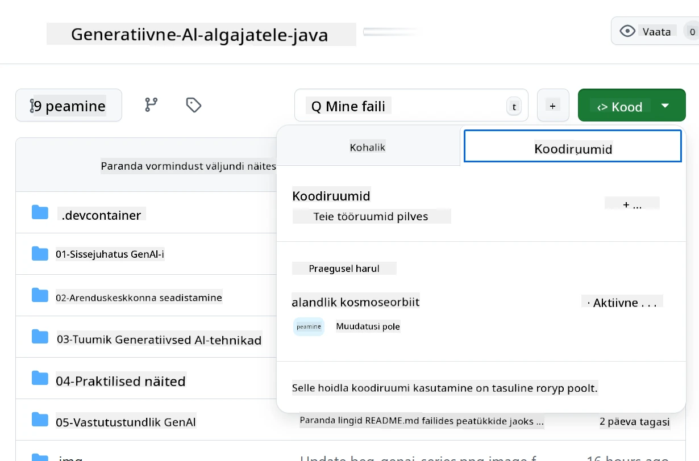
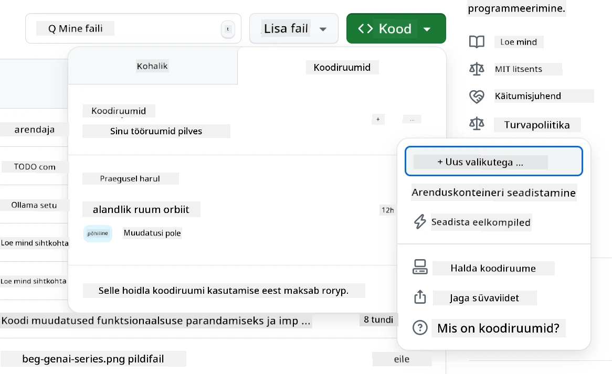
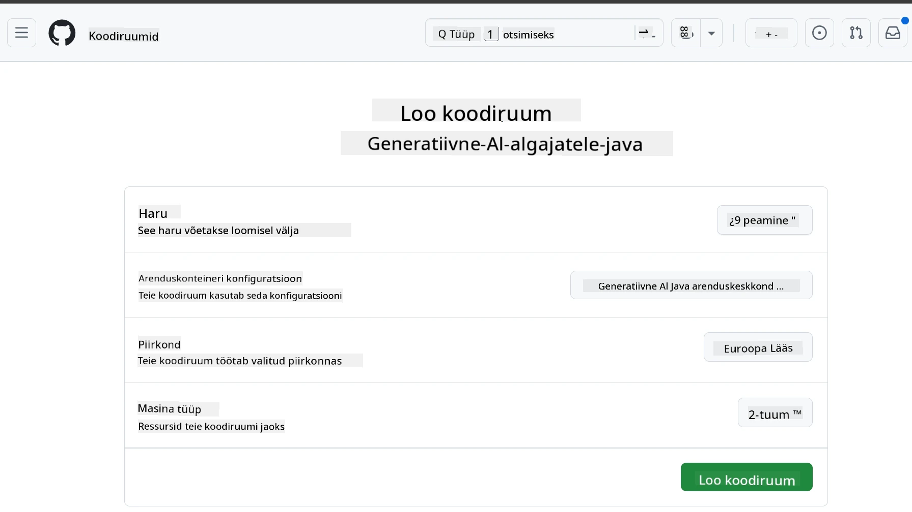
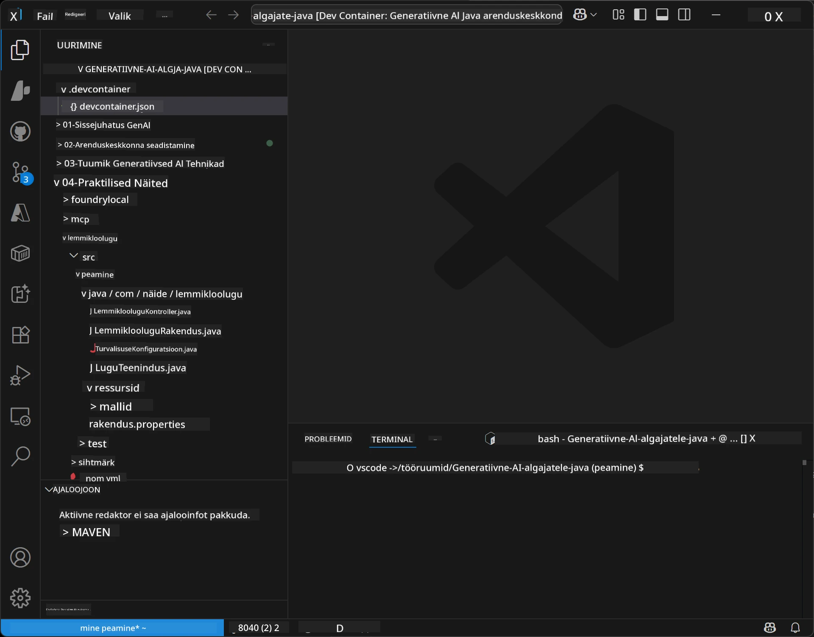
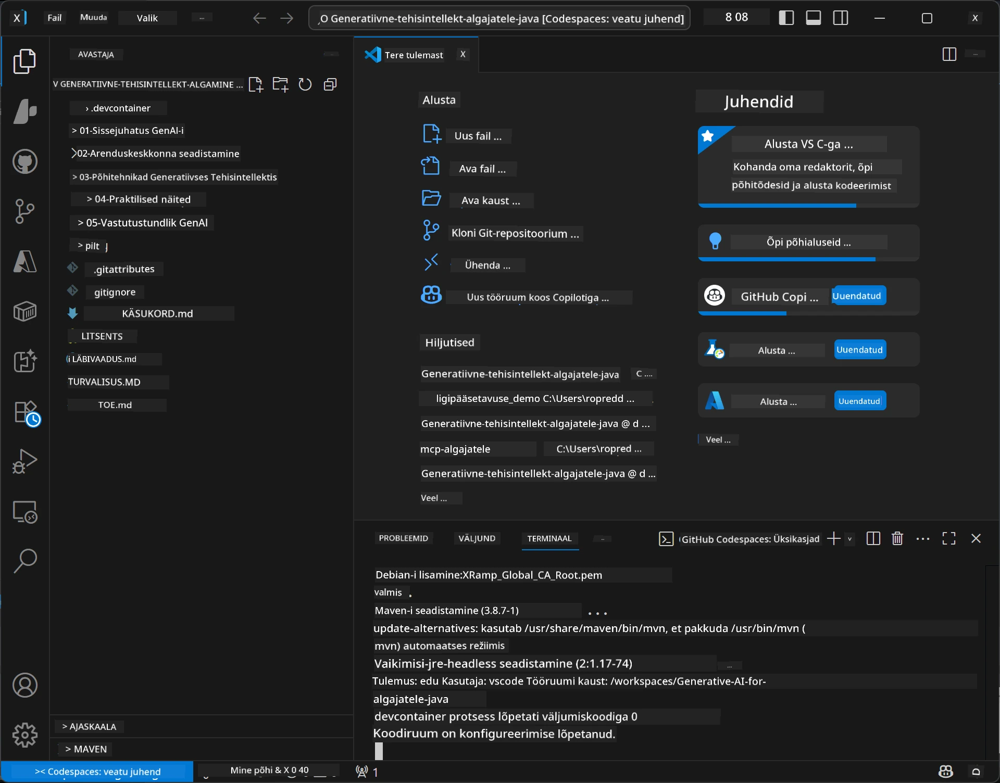

<!--
CO_OP_TRANSLATOR_METADATA:
{
  "original_hash": "96a30d42b9751a3d4e4b20e28d29d459",
  "translation_date": "2026-01-28T05:34:15+00:00",
  "source_file": "02-SetupDevEnvironment/README.md",
  "language_code": "et"
}
-->
# Arenduskeskkonna seadistamine Generatiivse tehisintellekti jaoks Java jaoks

> **Kiire algus**: Koodi kirjutamine pilves 2 minutiga - liigu otse [GitHub Codespacesi seadistusse](../../../02-SetupDevEnvironment) - kohaliku installatsiooni pole vaja ja kasutatakse githubi mudeleid!

> **Huvitatud Azure OpenAI-st?**, vaata meie [Azure OpenAI seadistusjuhendit](getting-started-azure-openai.md) koos sammudega uue Azure OpenAI ressursi loomiseks.

## Mida sa õpid

- Seadistada Java arenduskeskkond AI rakenduste jaoks
- Valida ja konfigureerida eelistatud arenduskeskkond (pilvepõhine Codespacesiga, kohalik arenduskonteiner või täismahus kohalik seadistus)
- Testida oma seadistust ühendudes GitHubi mudelitega

## Sisukord

- [Mida sa õpid](../../../02-SetupDevEnvironment)
- [Sissejuhatus](../../../02-SetupDevEnvironment)
- [1. samm: Arenduskeskkonna seadistamine](../../../02-SetupDevEnvironment)
  - [Valik A: GitHub Codespaces (Soovitatav)](../../../02-SetupDevEnvironment)
  - [Valik B: Kohalik arenduskonteiner](../../../02-SetupDevEnvironment)
  - [Valik C: Kasuta oma olemasolevat kohalikku installatsiooni](../../../02-SetupDevEnvironment)
- [2. samm: Loo GitHubi isiklik juurdepääsutunnus](../../../02-SetupDevEnvironment)
- [3. samm: Testi oma seadistust](../../../02-SetupDevEnvironment)
- [Tõrkeotsing](../../../02-SetupDevEnvironment)
- [Kokkuvõte](../../../02-SetupDevEnvironment)
- [Järgmised sammud](../../../02-SetupDevEnvironment)

## Sissejuhatus

See peatükk juhendab sind arenduskeskkonna seadistamisel. Kasutame peamise näitena **GitHubi mudeleid**, sest need on tasuta, lihtsasti seadistatavad ainult GitHubi kontoga, ei vaja krediitkaarti ja annavad ligipääsu mitmele mudelile katsetamiseks.

**Kohalikku seadistust pole vaja!** Saad kohe kodeerima hakata GitHub Codespaces'is, mis pakub brauseris täisväärtuslikku arenduskeskkonda.


Soovitame seda kursust läbides kasutada [**GitHub Models**](https://github.com/marketplace?type=models), sest see on:
- **Tasuta** alustamiseks
- **Lihtne** seadistada ainult GitHubi kontoga
- **Krediitkaarti pole vaja**
- **Mitmed mudelid** katsetamiseks saadaval

> **Märkus**: Selle koolituse GitHubi mudelitel on need tasuta piirangud:
> - 15 päringut minutis (150 päevas)
> - ~8 000 sõna sisendit, ~4 000 sõna väljundit päringu kohta
> - 5 samaaegset päringut
> 
> Tootmiskasutuseks uuenda Azure AI Foundry mudelitele oma Azure kontoga. Koodi pole vaja muuta. Vaata [Azure AI Foundry dokumentatsiooni](https://learn.microsoft.com/azure/ai-foundry/foundry-models/how-to/quickstart-github-models).


## 1. samm: Arenduskeskkonna seadistamine

<a name="quick-start-cloud"></a>

Oleme loonud eelkonfigureeritud arenduskonteineri, et vähendada seadistamise aega ja tagada kõik vajalikud tööriistad selle Generatiivse AI Java kursuse jaoks. Vali endale sobiv arendusviis:

### Keskkonna seadistamise valikud:

#### Valik A: GitHub Codespaces (Soovitatav)

**Alusta kodeerimist 2 minutiga - kohalikku seadistust pole vaja!**

1. Hargne see reposiit oma GitHubi kontole
   > **Märkus**: Kui soovid baas-konfiguratsiooni muuta, vaata [Dev Container Configuration](../../../.devcontainer/devcontainer.json)
2. Klõpsa **Code** → vahekaart **Codespaces** → **...** → **New with options...**
3. Kasuta vaikimisi seadeid – see valib **Dev container configuration**: **Generative AI Java Development Environment**, mis on selle kursuse kohandatud devcontainer
4. Klõpsa **Create codespace**
5. Oota umbes 2 minutit, kuni keskkond on valmis
6. Liigu edasi [2. sammu: Loo GitHubi token](../../../02-SetupDevEnvironment)








> **Codespacesi eelised**:
> - Ei vaja kohalikku installatsiooni
> - Toimib igas seadmes, kus on brauser
> - Eelkonfigureeritud kõikide tööriistade ja sõltuvustega
> - Tasuta 60 tundi kuus isiklikele kontodele
> - Ühtne keskkond kõigile õppijatele

#### Valik B: Kohalik arenduskonteiner

**Arendajatele, kes eelistavad kohalikku arendust Dockeriga**

1. Hargne ja klooni see reposiit oma kohalikule masinale
   > **Märkus**: Kui soovid baas-konfiguratsiooni muuta, vaata [Dev Container Configuration](../../../.devcontainer/devcontainer.json)
2. Paigalda [Docker Desktop](https://www.docker.com/products/docker-desktop/) ja [VS Code](https://code.visualstudio.com/)
3. Paigalda VS Code'i [Dev Containers plugin](https://marketplace.visualstudio.com/items?itemName=ms-vscode-remote.remote-containers)
4. Ava repokataloog VS Code'is
5. Kui küsitakse, klõpsa **Reopen in Container** (või kasuta `Ctrl+Shift+P` → "Dev Containers: Reopen in Container")
6. Oota, kuni konteiner koostatakse ja käivitatakse
7. Liigu edasi [2. sammu: Loo GitHubi token](../../../02-SetupDevEnvironment)




#### Valik C: Kasuta oma olemasolevat kohalikku installatsiooni

**Arendajatele, kellel on olemas Java arenduskeskkond**

Nõuded:
- [Java 21+](https://www.oracle.com/java/technologies/javase/jdk21-archive-downloads.html) 
- [Maven 3.9+](https://maven.apache.org/download.cgi)
- [VS Code](https://code.visualstudio.com) või eelistatud IDE

Sammud:
1. Klooni see reposiit oma kohalikule masinale
2. Ava projekt oma IDE-s
3. Liigu edasi [2. sammu: Loo GitHubi token](../../../02-SetupDevEnvironment)

> **Nõuanded**: Kui su arvuti on madala võimsusega, aga soovid VS Code'i kohapeal kasutada, kasuta GitHub Codespaces’i! Saad ühendada kohaliku VS Code'i pilves asuva Codespace’iga, mis annab kahe maailma parima koosluse.




## 2. samm: Loo GitHubi isiklik juurdepääsutunnus

1. Mine [GitHubi seadistustesse](https://github.com/settings/profile) ja vali oma profiilimenüüst **Settings**.
2. Vasakult menüüst klõpsa **Developer settings** (tavaliselt allosas).
3. **Personal access tokens** alt klõpsa **Fine-grained tokens** (või kasuta seda otselinki [link](https://github.com/settings/personal-access-tokens)).
4. Klõpsa **Generate new token**.
5. "Token name" lahtrisse pane kirjeldav nimi (näiteks `GenAI-Java-Course-Token`).
6. Sea aegumiskuupäev (soovituslik: 7 päeva turvalisuse tagamiseks).
7. "Resource owner" alt vali oma kasutajakonto.
8. "Repository access" alt vali repod, mida soovid GitHubi mudelitega kasutada (või "All repositories", kui vaja).
9. "Account permissions" alt leia **Models** ja seadista see **Read-only**-ks.
10. Klõpsa **Generate token**.
11. **Kopeeri ja salvesta oma token nüüd** – seda enam ei näe!

> **Turvalisuse näpunäide**: Kasuta minimaalset vajalikku ulatust ja lühimat praktilist aegumisaega oma juurdepääsutunnuste jaoks.

## 3. samm: Testi oma seadistust GitHub Models näitega

Kui su arenduskeskkond on valmis, testime GitHub Models integratsiooni meie näidisrakendusega kaustas [`02-SetupDevEnvironment/examples/github-models`](../../../02-SetupDevEnvironment/examples/github-models).

1. Ava terminal oma arenduskeskkonnas.
2. Liigu GitHub Models näidise kausta:
   ```bash
   cd 02-SetupDevEnvironment/examples/github-models
   ```
3. Sea oma GitHub token keskkonnamuutujana:
   ```bash
   # macOS/Linux
   export GITHUB_TOKEN=your_token_here
   
   # Windows (Käsuviip)
   set GITHUB_TOKEN=your_token_here
   
   # Windows (PowerShell)
   $env:GITHUB_TOKEN="your_token_here"
   ```

4. Käivita rakendus:
   ```bash
   mvn compile exec:java -Dexec.mainClass="com.example.githubmodels.App"
   ```

Näed väljundit, mis on sarnane:
```text
Using model: gpt-4.1-nano
Sending request to GitHub Models...
Response: Hello World!
```

### Näidiskoodi mõistmine

Kõigepealt vaatame, mida me jooksutasime. Näidis `examples/github-models` kasutab OpenAI Java SDK-d, et ühendada GitHub Modelsiga:

**Mida see kood teeb:**
- **Ühendub** GitHub Modelsiga, kasutades sinu isiklikku juurdepääsutunnust
- **Saadab** lihtsa sõnumi "Say Hello World!" AI mudelile
- **Vastab** ja kuvab AI vastuse
- **Kontrollib**, et sinu seadistus töötab korrektselt

**Peamine sõltuvus** (`pom.xml`-is):
```xml
<dependency>
    <groupId>com.openai</groupId>
    <artifactId>openai-java</artifactId>
    <version>2.12.0</version>
</dependency>
```

**Peamine kood** (`App.java`):
```java
// Ühenda GitHubi mudelitega, kasutades OpenAI Java SDK-d
OpenAIClient client = OpenAIOkHttpClient.builder()
    .apiKey(pat)
    .baseUrl("https://models.inference.ai.azure.com")
    .build();

// Loo vestluse lõpetamise päring
ChatCompletionCreateParams params = ChatCompletionCreateParams.builder()
    .model(modelId)
    .addSystemMessage("You are a concise assistant.")
    .addUserMessage("Say Hello World!")
    .build();

// Saa tehisintellekti vastus
ChatCompletion response = client.chat().completions().create(params);
System.out.println("Response: " + response.choices().get(0).message().content().orElse("No response content"));
```

## Kokkuvõte

Suurepärane! Sul on nüüd kõik valmis:

- Loodud GitHubi isiklik juurdepääsutunnus õigete AI mudelite juurdepääsu õigustega
- Käivitatud Java arenduskeskkond (olgu see Codespaces, dev konteiner või kohalik)
- Ühendatud GitHub Modelsiga OpenAI Java SDK abil tasuta AI arenduseks
- Testitud kõik toimib lihtsa näitega, mis suhtleb AI mudelitega

## Järgmised sammud

[3. peatükk: Tuum Generatiivse AI tehnikad](../03-CoreGenerativeAITechniques/README.md)

## Tõrkeotsing

Probleemide korral siin on levinumad vead ja lahendused:

- **Token ei tööta?** 
  - Veendu, et kopeerisid kogu tokeni ilma tühikuteta
  - Kontrolli, et token on õigesti keskkonnamuutujasse määratud
  - Veendu tokeni õigustes (Models: Read-only)

- **Mavenit ei leitud?** 
  - Dev konteinerite või Codespacesi puhul peaks Maven olema eelinstallitud
  - Kohaliku seadistuse puhul veendu, et Java 21+ ja Maven 3.9+ on paigaldatud
  - Proovi `mvn --version`, et kontrollida installatsiooni

- **Ühenduse probleemid?** 
  - Kontrolli oma internetiühendust
  - Veendu, et GitHub on võrgust ligipääsetav
  - Kontrolli, et ei ole tulemüüri, mis blokeerib GitHub Models lõpp-punkti

- **Dev konteiner ei käivitu?** 
  - Veendu, et Docker Desktop töötab (kohaliku arenduse jaoks)
  - Proovi konteinerit uuesti ehitada: `Ctrl+Shift+P` → "Dev Containers: Rebuild Container"

- **Rakenduse kompileerimisvead?**
  - Veendu, et oled õiges kataloogis: `02-SetupDevEnvironment/examples/github-models`
  - Proovi puhastada ja uuesti kompileerida: `mvn clean compile`

> **Vajad abi?**: Kui probleemid jätkuvad, ava probleem repos ja aitame sind.

---

<!-- CO-OP TRANSLATOR DISCLAIMER START -->
**Vastutusest loobumine**:  
See dokument on tõlgitud kasutades AI tõlketeenust [Co-op Translator](https://github.com/Azure/co-op-translator). Kuigi me püüame täpsust, palun pange tähele, et automatiseeritud tõlgetes võib esineda vigu või ebatäpsusi. Originaaldokument selle emakeeles tuleks lugeda usaldusväärseks allikaks. Olulise teabe puhul soovitame kasutada professionaalset inimtõlget. Me ei vastuta tõlgenduste ega arusaamatuste eest, mis võivad tuleneda selle tõlke kasutamisest.
<!-- CO-OP TRANSLATOR DISCLAIMER END -->