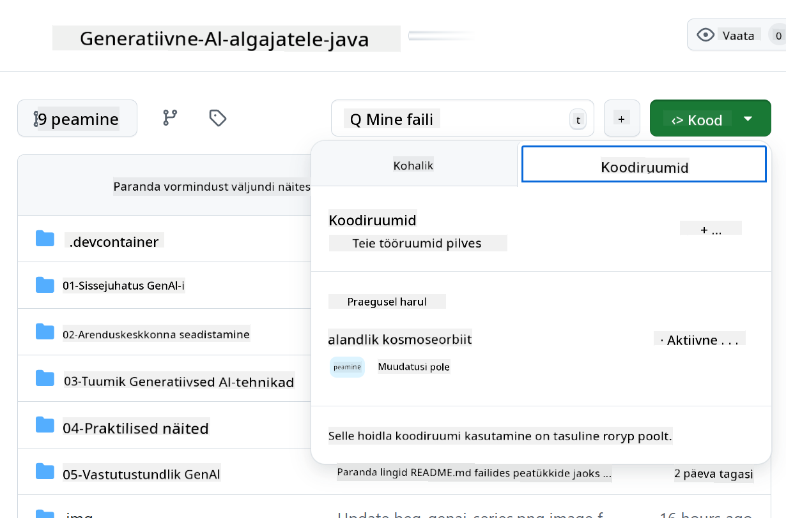

<!--
CO_OP_TRANSLATOR_METADATA:
{
  "original_hash": "bfdb4b4eadbee3a59ef742439f58326a",
  "translation_date": "2025-10-11T10:44:07+00:00",
  "source_file": "02-SetupDevEnvironment/getting-started-azure-openai.md",
  "language_code": "et"
}
-->
# Azure OpenAI arenduskeskkonna seadistamine

> **Kiire alustamine**: See juhend on mõeldud Azure OpenAI seadistamiseks. Tasuta mudelitega koheseks alustamiseks kasuta [GitHub Models with Codespaces](./README.md#quick-start-cloud).

See juhend aitab sul seadistada Azure AI Foundry mudeleid Java AI rakenduste jaoks selles kursuses.

## Sisukord

- [Kiire ülevaade seadistusest](../../../02-SetupDevEnvironment)
- [Samm 1: Loo Azure AI Foundry ressursid](../../../02-SetupDevEnvironment)
  - [Loo Hub ja Projekt](../../../02-SetupDevEnvironment)
  - [Paigalda GPT-4o-mini mudel](../../../02-SetupDevEnvironment)
- [Samm 2: Loo oma Codespace](../../../02-SetupDevEnvironment)
- [Samm 3: Konfigureeri oma keskkond](../../../02-SetupDevEnvironment)
- [Samm 4: Testi oma seadistust](../../../02-SetupDevEnvironment)
- [Mis edasi?](../../../02-SetupDevEnvironment)
- [Ressursid](../../../02-SetupDevEnvironment)
- [Täiendavad ressursid](../../../02-SetupDevEnvironment)

## Kiire ülevaade seadistusest

1. Loo Azure AI Foundry ressursid (Hub, Projekt, Mudel)
2. Loo Codespace Java arenduskonteineriga
3. Konfigureeri oma .env fail Azure OpenAI mandaatidega
4. Testi oma seadistust näidisprojektiga

## Samm 1: Loo Azure AI Foundry ressursid

### Loo Hub ja Projekt

1. Mine [Azure AI Foundry portaalile](https://ai.azure.com/) ja logi sisse
2. Klõpsa **+ Create** → **New hub** (või navigeeri **Management** → **All hubs** → **+ New hub**)
3. Konfigureeri oma hub:
   - **Hubi nimi**: nt "MyAIHub"
   - **Tellimus**: Vali oma Azure tellimus
   - **Ressursigrupp**: Loo uus või vali olemasolev
   - **Asukoht**: Vali endale lähim
   - **Salvestuskonto**: Kasuta vaikimisi või konfigureeri kohandatud
   - **Key vault**: Kasuta vaikimisi või konfigureeri kohandatud
   - Klõpsa **Next** → **Review + create** → **Create**
4. Kui hub on loodud, klõpsa **+ New project** (või **Create project** hubi ülevaates)
   - **Projekti nimi**: nt "GenAIJava"
   - Klõpsa **Create**

### Paigalda GPT-4o-mini mudel

1. Oma projektis mine **Model catalog** ja otsi **gpt-4o-mini**
   - *Alternatiiv: Mine **Deployments** → **+ Create deployment***
2. Klõpsa **Deploy** gpt-4o-mini mudeli kaardil
3. Konfigureeri paigaldus:
   - **Paigalduse nimi**: "gpt-4o-mini"
   - **Mudeli versioon**: Kasuta uusimat
   - **Paigalduse tüüp**: Standard
4. Klõpsa **Deploy**
5. Kui paigaldus on tehtud, mine **Deployments** vahekaardile ja kopeeri järgmised väärtused:
   - **Paigalduse nimi** (nt "gpt-4o-mini")
   - **Siht URI** (nt `https://your-hub-name.openai.azure.com/`) 
      > **Oluline**: Kopeeri ainult baas-URL (nt `https://myhub.openai.azure.com/`) mitte täielikku lõpp-punkti rada.
   - **Võti** (Keys and Endpoint sektsioonist)

> **Kas ikka on probleeme?** Külastage ametlikku [Azure AI Foundry dokumentatsiooni](https://learn.microsoft.com/azure/ai-foundry/how-to/create-projects?tabs=ai-foundry&pivots=hub-project)

## Samm 2: Loo oma Codespace

1. Forki see repositoorium oma GitHubi kontole
   > **Märkus**: Kui soovid muuta põhikonfiguratsiooni, vaata [Dev Container Configuration](../../../.devcontainer/devcontainer.json)
2. Oma forkitud repositooriumis klõpsa **Code** → **Codespaces** vahekaart
3. Klõpsa **...** → **New with options...**

4. Vali **Dev container configuration**: 
   - **Generative AI Java Development Environment**
5. Klõpsa **Create codespace**

## Samm 3: Konfigureeri oma keskkond

Kui su Codespace on valmis, seadista oma Azure OpenAI mandaat:

1. **Navigeeri näidisprojekti juurde repositooriumi juurest:**
   ```bash
   cd 02-SetupDevEnvironment/examples/basic-chat-azure
   ```

2. **Loo oma .env fail:**
   ```bash
   cp .env.example .env
   ```

3. **Muuda .env faili oma Azure OpenAI mandaatidega:**
   ```bash
   # Your Azure OpenAI API key (from Azure AI Foundry portal)
   AZURE_AI_KEY=your-actual-api-key-here
   
   # Your Azure OpenAI endpoint URL (e.g., https://myhub.openai.azure.com/)
   AZURE_AI_ENDPOINT=https://your-hub-name.openai.azure.com/
   ```

   > **Turvanõuanne**: 
   > - Ära kunagi commit'i oma `.env` faili versioonihaldusesse
   > - `.env` fail on juba lisatud `.gitignore` faili
   > - Hoia oma API võtmed turvaliselt ja uuenda neid regulaarselt

## Samm 4: Testi oma seadistust

Käivita näidisrakendus, et testida oma Azure OpenAI ühendust:

```bash
mvn clean spring-boot:run
```

Sa peaksid nägema vastust GPT-4o-mini mudelilt!

> **VS Code kasutajad**: Sa võid ka vajutada `F5` VS Code'is, et rakendust käivitada. Käivitamise konfiguratsioon on juba seadistatud, et laadida automaatselt sinu `.env` fail.

> **Täielik näide**: Vaata [End-to-End Azure OpenAI Example](./examples/basic-chat-azure/README.md) üksikasjalike juhiste ja tõrkeotsingu jaoks.

## Mis edasi?

**Seadistus on valmis!** Sul on nüüd:
- Azure OpenAI koos gpt-4o-mini paigaldatud
- Kohalik .env faili konfiguratsioon
- Java arenduskeskkond valmis

**Jätka** [3. peatükk: Põhilised generatiivse AI tehnikad](../03-CoreGenerativeAITechniques/README.md), et alustada AI rakenduste loomist!

## Ressursid

- [Azure AI Foundry dokumentatsioon](https://learn.microsoft.com/azure/ai-services/)
- [Spring AI Azure OpenAI dokumentatsioon](https://docs.spring.io/spring-ai/reference/api/clients/azure-openai-chat.html)
- [Azure OpenAI Java SDK](https://learn.microsoft.com/java/api/overview/azure/ai-openai-readme)

## Täiendavad ressursid

- [Laadi alla VS Code](https://code.visualstudio.com/Download)
- [Hangi Docker Desktop](https://www.docker.com/products/docker-desktop)
- [Dev Container Configuration](../../../.devcontainer/devcontainer.json)

---

**Lahtiütlus**:  
See dokument on tõlgitud, kasutades AI tõlketeenust [Co-op Translator](https://github.com/Azure/co-op-translator). Kuigi püüame tagada täpsust, palun arvestage, et automaatsed tõlked võivad sisaldada vigu või ebatäpsusi. Algne dokument selle algses keeles tuleks lugeda autoriteetseks allikaks. Olulise teabe puhul on soovitatav kasutada professionaalset inimtõlget. Me ei vastuta selle tõlke kasutamisest tulenevate arusaamatuste või valede tõlgenduste eest.