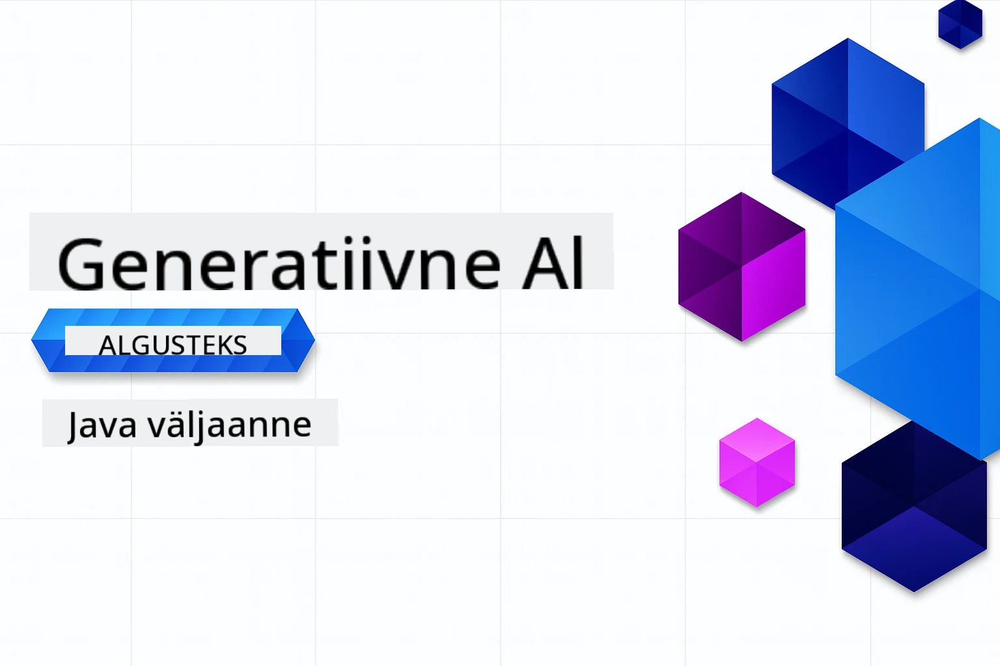

# Generatiivne tehisintellekt algajatele - Java väljaanne
[](https://discord.gg/nTYy5BXMWG)



**Aja nõudlus**: Terve töötoa saab lõpule viia veebis ilma kohalikku seadistust tegemata. Keskkonna seadistamine võtab 2 minutit, proovide uurimine nõuab 1-3 tundi, sõltuvalt uurimise sügavusest.

> **Kiire algus**

1. Forki see hoidlasse oma GitHubi kontole
2. Klõpsa **Code** → **Codespaces** sakk → **...** → **New with options...**
3. Kasuta vaikeseadeid – see valib selle kursuse jaoks loodud arendus konteineri
4. Klõpsa **Create codespace**
5. Oota ~2 minutit, kuni keskkond on valmis
6. Liigu otse [Esimese näite juurde](./02-SetupDevEnvironment/README.md#step-2-create-a-github-personal-access-token)

> **Eelistad kloonida lokaalset?**
>
> See hoidla sisaldab 50+ keeletõlget, mis suurendavad oluliselt allalaadimist mahtu. Tõlgeteta kloonimiseks kasuta sparse checkouti:
>
> **Linux / macOS (Bash)**
> ```bash
> git clone --filter=blob:none --sparse https://github.com/microsoft/Generative-AI-for-beginners-java.git
> cd Generative-AI-for-beginners-java
> git sparse-checkout set --no-cone '/*' '!translations' '!translated_images'
> ```
>
> **Windows (PowerShell)**
> ```powershell
> git clone --filter=blob:none --sparse https://github.com/microsoft/Generative-AI-for-beginners-java.git
> cd Generative-AI-for-beginners-java
> git sparse-checkout set --no-cone "/*" "!translations" "!translated_images"
> ```
> See annab sulle kõik vajaliku kursuse lõpetamiseks palju kiirema allalaadimisega.


## Mitmekeelne tugi

### Toetatud GitHub Actioni kaudu (Automaatne & alati ajakohane)

<!-- CO-OP TRANSLATOR LANGUAGES TABLE START -->
[Araabia](../ar/README.md) | [Bengali](../bn/README.md) | [Bulgaaria](../bg/README.md) | [Birma (Myanmar)](../my/README.md) | [Hiina (lihtsustatud)](../zh-CN/README.md) | [Hiina (traditsiooniline, Hongkong)](../zh-HK/README.md) | [Hiina (traditsiooniline, Macau)](../zh-MO/README.md) | [Hiina (traditsiooniline, Taiwan)](../zh-TW/README.md) | [Horvaadi](../hr/README.md) | [Tšehhi](../cs/README.md) | [Taani](../da/README.md) | [Hollandi](../nl/README.md) | [Eesti](./README.md) | [Soome](../fi/README.md) | [Prantsuse](../fr/README.md) | [Saksa](../de/README.md) | [Kreeka](../el/README.md) | [Heebrea](../he/README.md) | [Hindi](../hi/README.md) | [Ungari](../hu/README.md) | [Indoneesia](../id/README.md) | [Itaalia](../it/README.md) | [Jaapani](../ja/README.md) | [Kannada](../kn/README.md) | [Korea](../ko/README.md) | [Leedu](../lt/README.md) | [Malai](../ms/README.md) | [Malajalami](../ml/README.md) | [Marathi](../mr/README.md) | [Nepali](../ne/README.md) | [Nigeeria pidgin](../pcm/README.md) | [Norra](../no/README.md) | [Persia (farsi)](../fa/README.md) | [Poola](../pl/README.md) | [Portugali (Brasiilia)](../pt-BR/README.md) | [Portugali (Portugal)](../pt-PT/README.md) | [Pandžabi (Gurmukhi)](../pa/README.md) | [Rumeenia](../ro/README.md) | [Vene](../ru/README.md) | [Serbia (kirillitsa)](../sr/README.md) | [Slovaki](../sk/README.md) | [Sloveeni](../sl/README.md) | [Hispaania](../es/README.md) | [Suahiili](../sw/README.md) | [Rootsi](../sv/README.md) | [Tagalogi (filipino)](../tl/README.md) | [Tamili](../ta/README.md) | [Telugu](../te/README.md) | [Tai](../th/README.md) | [Türgi](../tr/README.md) | [Ukraina](../uk/README.md) | [Urdu](../ur/README.md) | [Vietnam](../vi/README.md)

## Kursuse ülesehitus ja õpitee

### **1. peatükk: Sissejuhatus generatiivsesse tehisintellekti**
- **Põhimõisted**: Suurte keelemudelite, tokenite, embeddingsi ja tehisintellekti võimaluste mõistmine
- **Java AI ökosüsteem**: Ülevaade Spring AI ja OpenAI SDK-dest
- **Mudeli konteksti protokoll**: Tutvustus MCP-st ja selle rollist AI agentide suhtluses
- **Praktilised rakendused**: Reaalmaailma stsenaariumid, sealhulgas chatbotid ja sisu loomine
- **[→ Alusta 1. peatükki](./01-IntroToGenAI/README.md)**

### **2. peatükk: Arenduskeskkonna seadistamine**
- **Mitme pakkuja konfiguratsioon**: GitHubi mudelite, Azure OpenAI ja OpenAI Java SDK integratsioonide seadistamine
- **Spring Boot + Spring AI**: Parimad tavad ettevõtte AI rakenduste arendamiseks
- **GitHubi mudelid**: Tasuta AI mudeli ligipääs prototüüpimiseks ja õppimiseks (krediitkaarti ei nõuta)
- **Arendustööriistad**: Docker konteinerid, VS Code ja GitHub Codespaces seadistus
- **[→ Alusta 2. peatükki](./02-SetupDevEnvironment/README.md)**

### **3. peatükk: Põhilised generatiivse tehisintellekti tehnikad**
- **Promptide inseneritöö**: Tehnikad AI mudeli parimate vastuste saamiseks
- **Embeddings ja vektoroperatsioonid**: Semantilise otsingu ja sarnasuse sobituse rakendamine
- **Taastamisest lähtuv generatsioon (RAG)**: AI ühendamine oma andmeallikatega
- **Funktsioonide kutsumine**: AI võimekuse laiendamine kohandatud tööriistade ja pistikprogrammidega
- **[→ Alusta 3. peatükki](./03-CoreGenerativeAITechniques/README.md)**

### **4. peatükk: Praktilised rakendused ja projektid**
- **Lemmiklooma loo generaator** (`petstory/`): Loov sisu loomine GitHubi mudelitega
- **Foundry lokaalne demo** (`foundrylocal/`): Kohalik AI mudeli integratsioon OpenAI Java SDK-ga
- **MCP kalkulaatori teenus** (`calculator/`): Põhjalik Mudeli konteksti protokolli rakendus Spring AIs
- **[→ Alusta 4. peatükki](./04-PracticalSamples/README.md)**

### **5. peatükk: Vastutustundlik AI arendus**
- **GitHubi mudelite ohutus**: Sisseehitatud sisufiltrite ja ohutusmehhanismide testimine (karmid plokid ja pehmed keeldumised)
- **Vastutustundliku AI demo**: Käed-küljes näide, kuidas kaasaegsed AI ohutussüsteemid töötavad praktikas
- **Parimad tavad**: Hädavajalikud juhised eetiliseks AI arenduseks ja juurutamiseks
- **[→ Alusta 5. peatükki](./05-ResponsibleGenAI/README.md)**

## Lisamaterjalid

<!-- CO-OP TRANSLATOR OTHER COURSES START -->
### LangChain
[](https://aka.ms/langchain4j-for-beginners)
[](https://aka.ms/langchainjs-for-beginners?WT.mc_id=m365-94501-dwahlin)
[](https://github.com/microsoft/langchain-for-beginners?WT.mc_id=m365-94501-dwahlin)
---

### Azure / Edge / MCP / Agendid
[](https://github.com/microsoft/AZD-for-beginners?WT.mc_id=academic-105485-koreyst)
[](https://github.com/microsoft/edgeai-for-beginners?WT.mc_id=academic-105485-koreyst)
[](https://github.com/microsoft/mcp-for-beginners?WT.mc_id=academic-105485-koreyst)
[](https://github.com/microsoft/ai-agents-for-beginners?WT.mc_id=academic-105485-koreyst)

---
 
### Generatiivne tehisintellekti sari
[](https://github.com/microsoft/generative-ai-for-beginners?WT.mc_id=academic-105485-koreyst)
[-9333EA?style=for-the-badge&labelColor=E5E7EB&color=9333EA)](https://github.com/microsoft/Generative-AI-for-beginners-dotnet?WT.mc_id=academic-105485-koreyst)
[-C084FC?style=for-the-badge&labelColor=E5E7EB&color=C084FC)](https://github.com/microsoft/generative-ai-for-beginners-java?WT.mc_id=academic-105485-koreyst)
[-E879F9?style=for-the-badge&labelColor=E5E7EB&color=E879F9)](https://github.com/microsoft/generative-ai-with-javascript?WT.mc_id=academic-105485-koreyst)

---
 
### Tuumikõpe
[](https://aka.ms/ml-beginners?WT.mc_id=academic-105485-koreyst)
[](https://aka.ms/datascience-beginners?WT.mc_id=academic-105485-koreyst)
[](https://aka.ms/ai-beginners?WT.mc_id=academic-105485-koreyst)
[](https://github.com/microsoft/Security-101?WT.mc_id=academic-96948-sayoung)
[](https://aka.ms/webdev-beginners?WT.mc_id=academic-105485-koreyst)
[](https://aka.ms/iot-beginners?WT.mc_id=academic-105485-koreyst)
[](https://github.com/microsoft/xr-development-for-beginners?WT.mc_id=academic-105485-koreyst)

---
 
### Copilot seeria
[](https://aka.ms/GitHubCopilotAI?WT.mc_id=academic-105485-koreyst)
[](https://github.com/microsoft/mastering-github-copilot-for-dotnet-csharp-developers?WT.mc_id=academic-105485-koreyst)
[](https://github.com/microsoft/CopilotAdventures?WT.mc_id=academic-105485-koreyst)
<!-- CO-OP TRANSLATOR OTHER COURSES END -->

## Abi saamine

Kui jääd hätta või sul on küsimusi AI-rakenduste loomise kohta, liitu õpilaste ja kogenud arendajatega MCP aruteludes. See on toetav kogukond, kus küsimused on teretulnud ja teadmisi jagatakse vabalt.

[](https://discord.gg/nTYy5BXMWG)

Kui sul on toodete kohta tagasisidet või tekib vigu arendusprotsessi käigus, külasta:

[](https://aka.ms/foundry/forum)

---

<!-- CO-OP TRANSLATOR DISCLAIMER START -->
**Eitus**:
See dokument on tõlgitud kasutades tehisintellektil põhinevat tõlketeenust [Co-op Translator](https://github.com/Azure/co-op-translator). Kuigi püüame tagada täpsust, tuleb arvestada, et automaatsed tõlked võivad sisaldada vigu või ebatäpsusi. Originaaldokument selle emakeeles on käsitletav kui usaldusväärne allikas. Olulise teabe puhul soovitatakse professionaalset inimtõlget. Me ei vastuta selle tõlke kasutamisest tekkida võivate arusaamatuste ega valesti mõistmiste eest.
<!-- CO-OP TRANSLATOR DISCLAIMER END -->